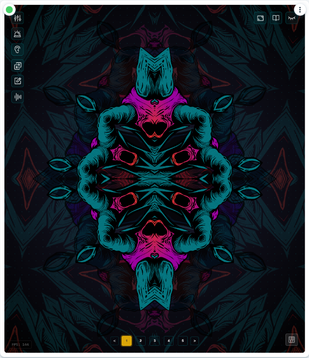

# RADAR - Reactive Asset Driven Audio Receiver

<p align="center">
  
</p>

**RADAR is determined to set the bar for NFT interaction on the LUKSO blockchain. It's a dynamic, multi-layer visual synthesizer that transforms your LSP8 NFTs into living art, reacting in real-time to audio, MIDI, and on-chain Universal Profile events. RADAR empowers you to move beyond passive collection and become an active creator and performer with your digital assets.**

---

<p align="center">
  <a href="https://youtu.be/qO70c37fP9s" target="_blank" rel="noopener noreferrer">
    
  </a>
  <br/>
  <em>Click the image above to watch the RADAR demo video!</em>
</p>

---

## The RADAR Vision: From Collector to Creator

RADAR challenges the notion of NFTs as static collectibles and believe that true digital ownership, powered by LUKSO's Universal Profiles, unleashes a new universe of dynamic use-cases and ignites the imagination for what NFT 2.0 can truly become.

*   **Your NFTs, Your Engine:** Don't let your assets gather virtual dust. RADAR treats your LSP8 NFTs as visual engines, ready to be manipulated and brought to life.
*   **Ownership is Control & Creation:** Go beyond just holding. Layer, glitch, blend, and animate your assets. Save an infinite number of unique visual setups directly onto your Universal Profile.
*   **Decentralized & Composable:** All your creations—visual presets, MIDI mappings, custom color-coded event reactions—are stored on your UP using ERC725Y keys. Your data, ready for a future of shared, community-driven visual experiences.

## The RADAR Genesis Collection & The Future of Asset Utility

Following this hackathon and team feedback, the official **RADAR 1.0 Beta** will launch, headlined by the **RADAR Genesis Collection**: a massive 8,000-piece LSP8 NFT collection designed by RADAR's founder/creator, VXCTXR, specifically to showcase what NFT 2.0 can offer.

*   **Benchmark for Asset Design:** The RADAR Genesis Collection will set the standard for how assets should be prepared for optimal use within the visualizer.
*   **The Value of Artistic Preparation:**
    *   **Isolation & Whitespace:** Assets must be properly isolated within their "NFT canvas," not touching borders, which prevents undesirable straight lines during rotation and scaling.
    *   **Intentional Gaps:** Optimal designs incorporate "gaps" or negative space, allowing underlying layers to show through, creating depth and intricate visual interplay.
    *   **Championing Thoughtful Design:** RADAR inherently values meticulous artistry. Simplistic, mass-generated, or AI-created assets (e.g., fully colored squares) will appear as just that – rotating squares – offering little dynamic value and obscuring interaction with underlying layers. This encourages more intricate and consciously prepared designs.
*   **Redefining Value Beyond Traits:** RADAR shifts the focus from randomly allocated traits dictating perceived value to intrinsic artistic merit. For the first time, collect an asset for its color palette, an admired detail, or its potential within the RADAR engine, not just its "rarity score." **Making ART about the ART again.**
*   **Artistic Effort Rewarded:** In a space often dominated by mass-generated collections, RADAR champions the time, skill, and artistic vision invested in creating assets truly suited for dynamic visual experiences.
*   **New Perspectives on Creation:** While the technology is cool, perception and creativity often hold us back. RADAR is one piece of the puzzle. A quick glance at the "layer preparation grid" tab reveals how I plan to overhaul conceptual blockers: by providing asset owners with tools to deconstruct and reconstruct, the collector immediately becomes a creator. This opens entirely new perspectives on asset interaction, potentially making RADAR the largest community-driven visualizer in existence. See a few transformations in the "Room725" tab.

---

> **Important Note on Embedding/Permissions:**
> If you plan to embed RADAR (e.g., within another site or application using an iframe), ensure you grant the necessary permissions for full functionality. You will need to allow the following attributes:
> ```html
> <iframe src="URL_TO_YOUR_RADAR_INSTANCE" allow="microphone; midi; fullscreen"></iframe>
> ```
> Failure to include these `allow` attributes will prevent microphone access (for audio reactivity) and MIDI access (for controller input).

---

## Core Features & Technologies

RADAR integrates deeply with LUKSO's philosophy and innovative architecture:

*   **Dynamic NFT Visualization (3-Layer Engine):**
    *   Assign LSP8 NFTs (initially from 40 pre-loaded demo tokens, later from the RADAR Genesis collection and other whitelisted collections) to three distinct visual layers.
    *   Manipulate each layer's `Speed`, `Size`, `Opacity`, `X/Y Position`, `Drift`, `Angle`, `Direction`, and `Blend Mode`.
    *   **Note (Hackathon Scope):** For this hackathon, the on-chain whitelist management panel for adding new LSP7/LSP8 collections is temporarily disabled. To facilitate immediate experimentation, RADAR includes 40 pre-loaded demo tokens. The underlying ERC725Y data storage (`RADAR.WhitelistedCollections`) and retrieval mechanisms for whitelists are implemented and await feedback.

*   **Audio Reactivity (Web Audio API):**
    *   Layers pulsate and resize in response to audio frequencies (Bass -> Bottom Layer, Mid -> Middle Layer, Treble -> Top Layer) and overall beat detection.
    *   A custom Sawtooth-Sinewave hybrid algorithm smoothly blends audio-driven layer interactions.

*   **Tactile MIDI Control (Web MIDI API):**
    *   Intuitive **MIDI Learn** for all visual parameters.
    *   **Global MIDI Map:** Your controller mapping is saved to `RADAR.MIDI.ParameterMap` on your Universal Profile, ensuring consistent control across all presets.

*   **On-Chain Event Reactions (LSP1 UniversalReceiver):**
    *   Visual effects triggered by on-chain events on your UP (e.g., receiving LYX, tokens).
    *   **Global Event Reactions:** Rulesets stored on *your* UP via `RADAR.EventReactions`.

*   **Decentralized Configuration Storage (ERC725Y):**
    RADAR leverages your Universal Profile for true data ownership:
    1.  **Visual Presets (Map: `RADAR.NamedConfiguration:<nameHash>`):** Store infinite unique visual setups.
    2.  **Preset Index (Array: `RADAR.SavedConfigurationList[]`):** Lists your saved presets.
    3.  **Default Preset (Singleton: `RADAR.DefaultConfigurationName`):** Designates your profile's default RADAR experience.

## The Universal Profile as a Creative Hub

RADAR transforms the Universal Profile from a mere wallet or identity layer into a dynamic canvas and creative launchpad.

*   **Collector Becomes Creator:** By loading an asset into RADAR and manipulating its parameters, you become the artist. The visual configurations you save to your UP are new, derived creations—your unique way of "minting" new visual experiences from the assets you hold.
*   **Cross-Profile VJing & Spectating:** This is where the power of decentralized, on-chain configurations truly shines:
    *   Visit another user's Universal Profile running RADAR.
    *   Load their saved visual presets and witness their unique artistic interpretations of their assets.
    *   If you have a MIDI controller, *your* global MIDI map (from your UP) can control the parameters of *their* presets, enabling unprecedented live, cross-profile VJing.
    *   See their on-chain events trigger their personally configured visual reactions.
*   **Future of Whitelist & Community Curation:** Post-hackathon, activating the whitelist panel within RADAR (as a MiniApp on a user's UP) could empower trusted community members or "Layer Creators" to curate and propose collections, further decentralizing the artistic ecosystem.

This interplay of personal creation, shared experiences, and on-chain identity only scratches the surface of the possibilities achievable with LUKSO's architecture.

---

## Roadmap Highlights

*   **Visual Effect Expansion:** More effects, parameter interpolation, "P-locking" concepts.
*   **Advanced MIDI:** Clock sync, value range mapping, toggle actions.
*   **LSP8 Collection Onboarding:** Streamlined community whitelisting, artist onboarding guidelines.
*   **Performance Optimization:** Custom 2D engine refinement.
*   **AR Integration:** QR / AR art marker overlay directly integrating the UP QR.
*   **Open Source Strategy:** Evaluate open-sourcing key components.
*   **Deeper LUKSO Integration:** Continuously explore and implement new LUKSO standards and features.
*   **The Vision:** RADAR is an extremely well-aimed and positioned first step with a clear artistic direction and an innovative mindset, poised to redefine interactive asset utility.

---

## Setup Guides

### MIDI Control Setup

RADAR offers intuitive MIDI control over its visual parameters, allowing for a tactile and expressive performance experience. Your MIDI mappings are saved globally to your Universal Profile.

**Steps to Map Your MIDI Controller:**

1.  **Connect Your MIDI Controller:**
    *   Plug your MIDI controller (keyboard, knob/fader controller, drum pads, etc.) into your computer, typically via USB.
    *   Most modern MIDI controllers are class-compliant and should be automatically detected by your operating system and browser.
2.  **Enable MIDI in RADAR:**
    *   Locate the **Global MIDI Status button** in the RADAR interface (usually in the bottom-right corner, often represented by a MIDI plug icon).
    *   Click this button. It should indicate a "Connected" state if your controller is detected.
    *   *If it says "Disconnected" or shows an error, ensure your controller is properly connected and recognized by your system. You may need to click it again to initiate the connection.*
3.  **Access Layer Controls:**
    *   Open the main **Controls Panel** (usually triggered by a sliders icon in the vertical toolbar).
    *   Select the visual layer (Top, Middle, or Bottom) you wish to map controls for.
4.  **Initiate MIDI Learn for a Parameter:**
    *   For each parameter you want to control (e.g., `Size`, `Speed`, `X Position`, `Opacity`), you'll see a small **'M' (MIDI Learn) button** next to its slider or value display.
    *   Click the 'M' button for the specific parameter you want to map. The button will typically change appearance (e.g., highlight, show "...") to indicate it's now "listening" for a MIDI message.
5.  **Assign Your MIDI Control:**
    *   On your connected MIDI controller, **move the physical knob, fader, or press the pad/key** you want to assign to the selected parameter.
    *   RADAR will detect the incoming MIDI message (e.g., a Control Change (CC) from a knob, or a Note On from a pad).
    *   The parameter will automatically be mapped to that MIDI control. The 'M' button should return to its normal state, and the UI might display the new mapping (e.g., "CC 21").
6.  **Repeat for All Desired Parameters & Layers:**
    *   Continue this process (Steps 3-5) for all other parameters you wish to control across all three visual layers.
7.  **Save Your Global MIDI Map:**
    *   Once you're satisfied with your mappings:
        *   Open the **Save Panel** (usually triggered by a write/disk icon).
        *   Look for an option like **"Save Global MIDI Map"** or an option to include MIDI settings when saving a visual preset.
        *   Click to save. This action writes your entire MIDI mapping configuration to the `RADAR.MIDI.ParameterMap` key on your Universal Profile.

**Key Benefits of RADAR's MIDI System:**

*   **Global & Persistent:** Your MIDI map is saved once to your UP and applies across *all* visual presets.
*   **Intuitive Learn Mode:** No manual entry of CC numbers or channels needed; just click and move.
*   **Cross-Profile Compatibility:** When viewing someone else's RADAR setup, *your* saved MIDI map controls *their* visual parameters.

Now your MIDI controller is your hands-on interface for sculpting visuals in RADAR!

### Audio Reactivity Setup (Using Virtual Audio Cable & Voicemeeter)

To make RADAR's visuals react to the audio playing on your computer (e.g., from your browser or music player), you can route your audio through Voicemeeter using a Virtual Audio Cable. This gives you fine-grained control.

**Prerequisites:**

*   **Voicemeeter** (Standard version or Banana/Potato) installed. Get it from [vb-audio.com/Voicemeeter/](https://vb-audio.com/Voicemeeter/).
*   **VB-CABLE Virtual Audio Cable** installed. Get it from [vb-audio.com/Cable/](https://vb-audio.com/Cable/).
*   **Restart your computer** after installing these.

**Steps:**

1.  **Route Desired Audio to Virtual Cable (Recommended for Browser/App Audio):**
    *   In Windows Sound settings ("Open Sound settings" -> "App volume and device preferences"):
        *   Find your web browser (or the specific application whose audio you want to capture).
        *   Change its **Output** device to **"CABLE Input (VB-Audio Virtual Cable)"**.
    *   *Alternatively, for simpler system-wide audio capture (less granular), set "CABLE Input" as your Default Playback Device in Windows Sound settings (Playback tab).*

2.  **Configure Voicemeeter:**
    *   Open Voicemeeter.
    *   **Hardware Input 1 (Stereo Input 1 or 2):** Click its name (e.g., "Hardware Input 1") and select **"CABLE Output (VB-Audio Virtual Cable)"**. This brings audio from the virtual cable *into* Voicemeeter.
        *   Ensure this channel strip is active (fader is up, not muted - check A/B buttons if using Banana/Potato). Enable its output route to **A1** (your main hardware out) if you want to monitor this source through Voicemeeter.
    *   **Hardware Out (A1):** Click "A1" (under Hardware Out section) and select your main speakers/headphones (e.g., "WDM: Speakers (Realtek Audio)").

3.  **Browser Permissions for RADAR:**
    *   When enabling Audio Reactivity in RADAR for the first time, your browser will ask for microphone permission.
    *   In the permission prompt, select **"Voicemeeter Output (VB-Audio Voicemeeter VAIO)"** (or similar, depending on Voicemeeter version) as the microphone source. **Do not select CABLE Output or your physical microphone here.**

**How it Works:** Your target application (e.g., browser) sends its sound output to the virtual "CABLE Input". The other end of this virtual cable, "CABLE Output", is selected as an *input* in Voicemeeter. Voicemeeter processes this audio and sends it to two places: your speakers/headphones (via Hardware Out A1) and its own internal virtual output, "Voicemeeter Output". RADAR then listens to this "Voicemeeter Output" as if it were a microphone, capturing the audio you routed into Voicemeeter.

This method allows selective audio routing for the visualizer without needing to capture *all* system sound or use a physical loopback.