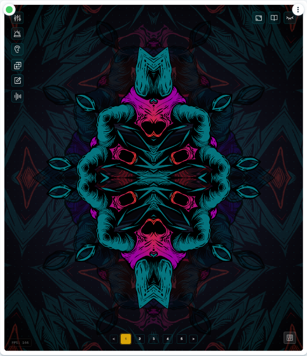

# 📦 Full Codebase Dump

---
### `eslint.config.js`
```js
import js from "@eslint/js";
import globals from "globals";
import reactHooks from "eslint-plugin-react-hooks";
import reactRefresh from "eslint-plugin-react-refresh";

export default [
  { ignores: ["dist"] },
  {
    files: ["**/*.{js,jsx}"],
    languageOptions: {
      ecmaVersion: 2020,
      globals: globals.browser,
      parserOptions: {
        ecmaVersion: "latest",
        ecmaFeatures: { jsx: true },
        sourceType: "module",
      },
    },
    plugins: {
      "react-hooks": reactHooks,
      "react-refresh": reactRefresh,
    },
    rules: {
      ...js.configs.recommended.rules,
      ...reactHooks.configs.recommended.rules,
      // --- UPDATED RULE ---
      // Ignore variables starting with an underscore OR an uppercase letter
      "no-unused-vars": ["error", { "varsIgnorePattern": "^[_A-Z]" }],
      // --------------------
      "react-refresh/only-export-components": [
        "warn",
        { allowConstantExport: true },
      ],
    },
  },
];
```

---
### `index.html`
```html
<!doctype html>
<html lang="en">
  <head>
    <meta charset="UTF-8" />
    <link rel="icon" type="image/svg+xml" href="/vite.svg" />
    <meta name="viewport" content="width=device-width, initial-scale=1.0" />
    <title>Vite + React</title>
    <style>
      /* Ensure html and body take full height of the iframe's allocated space */
      html, body {
        margin: 0;
        padding: 0;
        width: 100%;
        height: 100%;
        background: #000000; /* Base background */
        color: #00f3ff; /* Base text color */
        font-family: Arial, sans-serif;
        display: block; /* Explicitly block */
      }

      /* Ensure #root takes full height of the body */
      #root {
        width: 100%;
        height: 100%;
        margin: 0; /* Reset margin */
        padding: 0; /* Reset padding */
        overflow: hidden; /* Prevent scrollbars on root */
        display: block; /* Ensure it behaves as a block */
        position: relative; /* Needed if children use absolute positioning relative to root */
      }

      /* Style for the portal target - ensure it doesn't interfere */
      #portal-container {
        position: fixed; /* Or absolute, depending on need */
        top: 0;
        left: 0;
        width: 0; /* Takes no space */
        height: 0; /* Takes no space */
        z-index: 10000; /* High z-index for overlays */
        pointer-events: none; /* Allow clicks through container */
      }
      /* Allow pointer events on direct children */
      #portal-container > * {
         pointer-events: auto;
      }

    </style>
  </head>
  <body>
    <div id="root"></div>
    <!-- Add a dedicated container for portals outside the main app root -->
    <div id="portal-container"></div>
    <script type="module" src="/src/main.jsx"></script>
  </body>
</html>
```

---
### `package.json`
```json
{
  "name": "entity-portals",
  "private": true,
  "version": "0.0.0",
  "type": "module",
  "scripts": {
    "dev": "vite --open",
    "build": "vite build",
    "lint": "eslint . --ext .js,.jsx --report-unused-disable-directives --max-warnings 0",
    "lint:fix": "eslint . --ext .js,.jsx --fix",
    "format": "prettier --write \"src/**/*.{js,jsx,css,json,md}\" ./*.{js,json,md}",
    "preview": "vite preview",
    "audit": "npm audit --audit-level=high"
  },
  "dependencies": {
    "@erc725/erc725.js": "^0.27.2",
    "@heroicons/react": "^2.2.0",
    "@lukso/lsp-smart-contracts": "^0.16.3",
    "@lukso/up-provider": "^0.3.5",
    "@p5-wrapper/react": "^4.4.2",
    "buffer": "^6.0.3",
    "ethers": "^6.13.5",
    "pixi.js": "^8.8.1",
    "prop-types": "^15.8.1",
    "react": "^18.2.0",
    "react-dom": "^18.2.0",
    "viem": "^2.27.0",
    "web3": "^4.16.0"
  },
  "devDependencies": {
    "@eslint/js": "^9.21.0",
    "@types/react": "^18.2.0",
    "@types/react-dom": "^18.2.0",
    "@vitejs/plugin-react": "^4.3.4",
    "eslint": "^9.21.0",
    "eslint-config-prettier": "^9.1.0",
    "eslint-plugin-prettier": "^5.1.3",
    "eslint-plugin-react": "^7.34.2",
    "eslint-plugin-react-hooks": "^5.1.0",
    "eslint-plugin-react-refresh": "^0.4.19",
    "globals": "^15.15.0",
    "prettier": "^3.3.1",
    "vite": "^6.2.0"
  }
}

```

---
### `README.md`
```md
# RADAR - Reactive Asset Driven Audio Receiver

<p align="center">
  
</p>

**RADAR is determined to set the bar for NFT interaction on the LUKSO blockchain. It's a dynamic, multi-layer visual synthesizer that transforms your LSP8 NFTs into living art, reacting in real-time to audio, MIDI, and on-chain Universal Profile events. RADAR empowers you to move beyond passive collection and become an active creator and performer with your digital assets.**

---

<p align="center">
  <a href="https://www.youtube.com/watch?v=eFxECO9I888&t=327s" target="_blank" rel="noopener noreferrer">
    
  </a>
  <br/>
  <em>Click the image above to watch the RADAR demo video!</em>
</p>

---

## The RADAR Vision: From Collector to Creator

RADAR challenges the notion of NFTs as static collectibles and believe that true digital ownership, powered by LUKSO's Universal Profiles, unleashes a new universe of dynamic use-cases and ignites the imagination for what NFT 2.0 can truly become.

*   **Your NFTs, Your Engine:** Don't let your assets gather virtual dust. RADAR treats your LSP8 NFTs as visual engines, ready to be manipulated and brought to life.
*   **Ownership is Control & Creation:** Go beyond just holding. Layer, glitch, blend, and animate your assets. Save an infinite number of unique visual setups directly onto your Universal Profile.
*   **Decentralized & Composable:** All your creations—visual presets, MIDI mappings, custom color-coded event reactions—are stored on your UP using ERC725Y keys. Your data, ready for a future of shared, community-driven visual experiences.

## The RADAR Genesis Collection & The Future of Asset Utility

Following this hackathon and team feedback, the official **RADAR 1.0 Beta** will launch, headlined by the **RADAR Genesis Collection**: a massive 8,000-piece LSP8 NFT collection designed by RADAR's founder/creator, VXCTXR, specifically to showcase what NFT 2.0 can offer.

*   **Benchmark for Asset Design:** The RADAR Genesis Collection will set the standard for how assets should be prepared for optimal use within the visualizer.
*   **The Value of Artistic Preparation:**
    *   **Isolation & Whitespace:** Assets must be properly isolated within their "NFT canvas," not touching borders, which prevents undesirable straight lines during rotation and scaling.
    *   **Intentional Gaps:** Optimal designs incorporate "gaps" or negative space, allowing underlying layers to show through, creating depth and intricate visual interplay.
    *   **Championing Thoughtful Design:** RADAR inherently values meticulous artistry. Simplistic, mass-generated, or AI-created assets (e.g., fully colored squares) will appear as just that – rotating squares – offering little dynamic value and obscuring interaction with underlying layers. This encourages more intricate and consciously prepared designs.
*   **Redefining Value Beyond Traits:** RADAR shifts the focus from randomly allocated traits dictating perceived value to intrinsic artistic merit. For the first time, collect an asset for its color palette, an admired detail, or its potential within the RADAR engine, not just its "rarity score." **Making ART about the ART again.**
*   **Artistic Effort Rewarded:** In a space often dominated by mass-generated collections, RADAR champions the time, skill, and artistic vision invested in creating assets truly suited for dynamic visual experiences.
*   **New Perspectives on Creation:** While the technology is cool, perception and creativity often hold us back. RADAR is one piece of the puzzle. A quick glance at the "layer preparation grid" tab reveals how I plan to overhaul conceptual blockers: by providing asset owners with tools to deconstruct and reconstruct, the collector immediately becomes a creator. This opens entirely new perspectives on asset interaction, potentially making RADAR the largest community-driven visualizer in existence. See a few transformations in the "Room725" tab.

---

> **Important Note on Embedding/Permissions:**
> If you plan to embed RADAR (e.g., within another site or application using an iframe), ensure you grant the necessary permissions for full functionality. You will need to allow the following attributes:
> ```html
> <iframe src="https://radar725.netlify.app/" allow="microphone; midi; fullscreen"></iframe>
> ```
> Failure to include these `allow` attributes will prevent microphone access (for audio reactivity) and MIDI access (for controller input).

---

## Core Features & Technologies

RADAR integrates deeply with LUKSO's philosophy and innovative architecture:

*   **Dynamic NFT Visualization (3-Layer Engine):**
    *   Assign LSP8 NFTs (initially from 40 pre-loaded demo tokens, later from the RADAR Genesis collection and other whitelisted collections) to three distinct visual layers.
    *   Manipulate each layer's `Speed`, `Size`, `Opacity`, `X/Y Position`, `Drift`, `Angle`, `Direction`, and `Blend Mode`.
    *   **Note (Hackathon Scope):** For this hackathon, the on-chain whitelist management panel for adding new LSP7/LSP8 collections is temporarily disabled. To facilitate immediate experimentation, RADAR includes 40 pre-loaded demo tokens. The underlying ERC725Y data storage (`RADAR.WhitelistedCollections`) and retrieval mechanisms for whitelists are implemented and await feedback.

*   **Audio Reactivity (Web Audio API):**
    *   Layers pulsate and resize in response to audio frequencies (Bass -> Bottom Layer, Mid -> Middle Layer, Treble -> Top Layer) and overall beat detection.
    *   A custom Sawtooth-Sinewave hybrid algorithm smoothly blends audio-driven layer interactions.

*   **Tactile MIDI Control (Web MIDI API):**
    *   Intuitive **MIDI Learn** for all visual parameters.
    *   **Global MIDI Map:** Your controller mapping is saved to `RADAR.MIDI.ParameterMap` on your Universal Profile, ensuring consistent control across all presets.

*   **On-Chain Event Reactions (LSP1 UniversalReceiver):**
    *   Visual effects triggered by on-chain events on your UP (e.g., receiving LYX, tokens).
    *   **Global Event Reactions:** Rulesets stored on *your* UP via `RADAR.EventReactions`.

*   **Decentralized Configuration Storage (ERC725Y):**
    RADAR leverages your Universal Profile for true data ownership:
    1.  **Visual Presets (Map: `RADAR.NamedConfiguration:<nameHash>`):** Store infinite unique visual setups.
    2.  **Preset Index (Array: `RADAR.SavedConfigurationList[]`):** Lists your saved presets.
    3.  **Default Preset (Singleton: `RADAR.DefaultConfigurationName`):** Designates your profile's default RADAR experience.

## The Universal Profile as a Creative Hub

RADAR transforms the Universal Profile from a mere wallet or identity layer into a dynamic canvas and creative launchpad.

*   **Collector Becomes Creator:** By loading an asset into RADAR and manipulating its parameters, you become the artist. The visual configurations you save to your UP are new, derived creations—your unique way of "minting" new visual experiences from the assets you hold.
*   **Cross-Profile VJing & Spectating:** This is where the power of decentralized, on-chain configurations truly shines:
    *   Visit another user's Universal Profile running RADAR.
    *   Load their saved visual presets and witness their unique artistic interpretations of their assets.
    *   If you have a MIDI controller, *your* global MIDI map (from your UP) can control the parameters of *their* presets, enabling unprecedented live, cross-profile VJing.
    *   See their on-chain events trigger their personally configured visual reactions.
*   **Future of Whitelist & Community Curation:** Post-hackathon, activating the whitelist panel within RADAR (as a MiniApp on a user's UP) could empower trusted community members or "Layer Creators" to curate and propose collections, further decentralizing the artistic ecosystem.

This interplay of personal creation, shared experiences, and on-chain identity only scratches the surface of the possibilities achievable with LUKSO's architecture.

---

## Roadmap Highlights

*   **Visual Effect Expansion:** More effects, parameter interpolation, "P-locking" concepts.
*   **Advanced MIDI:** Clock sync, value range mapping, toggle actions.
*   **LSP8 Collection Onboarding:** Streamlined community whitelisting, artist onboarding guidelines.
*   **Performance Optimization:** Custom 2D engine refinement.
*   **AR Integration:** QR / AR art marker overlay directly integrating the UP QR.
*   **Open Source Strategy:** Evaluate open-sourcing key components.
*   **Deeper LUKSO Integration:** Continuously explore and implement new LUKSO standards and features.
*   **The Vision:** RADAR is an extremely well-aimed and positioned first step with a clear artistic direction and an innovative mindset, poised to redefine interactive asset utility.

---

## Setup Guides

### MIDI Control Setup

RADAR offers intuitive MIDI control over its visual parameters, allowing for a tactile and expressive performance experience. Your MIDI mappings are saved globally to your Universal Profile.

**Steps to Map Your MIDI Controller:**

1.  **Connect Your MIDI Controller:**
    *   Plug your MIDI controller (keyboard, knob/fader controller, drum pads, etc.) into your computer, typically via USB.
    *   Most modern MIDI controllers are class-compliant and should be automatically detected by your operating system and browser.
2.  **Enable MIDI in RADAR:**
    *   Locate the **Global MIDI Status button** in the RADAR interface (usually in the bottom-right corner, often represented by a MIDI plug icon).
    *   Click this button. It should indicate a "Connected" state if your controller is detected.
    *   *If it says "Disconnected" or shows an error, ensure your controller is properly connected and recognized by your system. You may need to click it again to initiate the connection.*
3.  **Access Layer Controls:**
    *   Open the main **Controls Panel** (usually triggered by a sliders icon in the vertical toolbar).
    *   Select the visual layer (Top, Middle, or Bottom) you wish to map controls for.
4.  **Initiate MIDI Learn for a Parameter:**
    *   For each parameter you want to control (e.g., `Size`, `Speed`, `X Position`, `Opacity`), you'll see a small **'M' (MIDI Learn) button** next to its slider or value display.
    *   Click the 'M' button for the specific parameter you want to map. The button will typically change appearance (e.g., highlight, show "...") to indicate it's now "listening" for a MIDI message.
5.  **Assign Your MIDI Control:**
    *   On your connected MIDI controller, **move the physical knob, fader, or press the pad/key** you want to assign to the selected parameter.
    *   RADAR will detect the incoming MIDI message (e.g., a Control Change (CC) from a knob, or a Note On from a pad).
    *   The parameter will automatically be mapped to that MIDI control. The 'M' button should return to its normal state, and the UI might display the new mapping (e.g., "CC 21").
6.  **Repeat for All Desired Parameters & Layers:**
    *   Continue this process (Steps 3-5) for all other parameters you wish to control across all three visual layers.
7.  **Save Your Global MIDI Map:**
    *   Once you're satisfied with your mappings:
        *   Open the **Save Panel** (usually triggered by a write/disk icon).
        *   Look for an option like **"Save Global MIDI Map"** or an option to include MIDI settings when saving a visual preset.
        *   Click to save. This action writes your entire MIDI mapping configuration to the `RADAR.MIDI.ParameterMap` key on your Universal Profile.

**Key Benefits of RADAR's MIDI System:**

*   **Global & Persistent:** Your MIDI map is saved once to your UP and applies across *all* visual presets.
*   **Intuitive Learn Mode:** No manual entry of CC numbers or channels needed; just click and move.
*   **Cross-Profile Compatibility:** When viewing someone else's RADAR setup, *your* saved MIDI map controls *their* visual parameters.

Now your MIDI controller is your hands-on interface for sculpting visuals in RADAR!

### Audio Reactivity Setup (Using Virtual Audio Cable & Voicemeeter)

To make RADAR's visuals react to the audio playing on your computer (e.g., from your browser or music player), you can route your audio through Voicemeeter using a Virtual Audio Cable. This gives you fine-grained control.

**Prerequisites:**

*   **Voicemeeter** (Standard version or Banana/Potato) installed. Get it from [vb-audio.com/Voicemeeter/](https://vb-audio.com/Voicemeeter/).
*   **VB-CABLE Virtual Audio Cable** installed. Get it from [vb-audio.com/Cable/](https://vb-audio.com/Cable/).
*   **Restart your computer** after installing these.

**Steps:**

1.  **Route Desired Audio to Virtual Cable (Recommended for Browser/App Audio):**
    *   In Windows Sound settings ("Open Sound settings" -> "App volume and device preferences"):
        *   Find your web browser (or the specific application whose audio you want to capture).
        *   Change its **Output** device to **"CABLE Input (VB-Audio Virtual Cable)"**.
    *   *Alternatively, for simpler system-wide audio capture (less granular), set "CABLE Input" as your Default Playback Device in Windows Sound settings (Playback tab).*

2.  **Configure Voicemeeter:**
    *   Open Voicemeeter.
    *   **Hardware Input 1 (Stereo Input 1 or 2):** Click its name (e.g., "Hardware Input 1") and select **"CABLE Output (VB-Audio Virtual Cable)"**. This brings audio from the virtual cable *into* Voicemeeter.
        *   Ensure this channel strip is active (fader is up, not muted - check A/B buttons if using Banana/Potato). Enable its output route to **A1** (your main hardware out) if you want to monitor this source through Voicemeeter.
    *   **Hardware Out (A1):** Click "A1" (under Hardware Out section) and select your main speakers/headphones (e.g., "WDM: Speakers (Realtek Audio)").

3.  **Browser Permissions for RADAR:**
    *   When enabling Audio Reactivity in RADAR for the first time, your browser will ask for microphone permission.
    *   In the permission prompt, select **"Voicemeeter Output (VB-Audio Voicemeeter VAIO)"** (or similar, depending on Voicemeeter version) as the microphone source. **Do not select CABLE Output or your physical microphone here.**

**How it Works:** Your target application (e.g., browser) sends its sound output to the virtual "CABLE Input". The other end of this virtual cable, "CABLE Output", is selected as an *input* in Voicemeeter. Voicemeeter processes this audio and sends it to two places: your speakers/headphones (via Hardware Out A1) and its own internal virtual output, "Voicemeeter Output". RADAR then listens to this "Voicemeeter Output" as if it were a microphone, capturing the audio you routed into Voicemeeter.

This method allows selective audio routing for the visualizer without needing to capture *all* system sound or use a physical loopback.
```

---
### `src\App.jsx`
```jsx
// src/App.jsx
import React, { useEffect } from "react";
import MainView from "./components/Main/Mainview";
import { useConfig } from "./context/ConfigContext";

// Component to handle URL parameters for pure visitor mode
const URLParameterHandler = () => {
  const { togglePureVisitorMode } = useConfig();

  useEffect(
    () => {
      const urlParams = new URLSearchParams(window.location.search);
      const isPureFromUrl = urlParams.get("pure") === "true";
      // Check if togglePureVisitorMode exists before calling
      if (isPureFromUrl && typeof togglePureVisitorMode === "function") {
        // NOTE: The actual call to togglePureVisitorMode() is currently disabled below.
        // If re-enabled, add togglePureVisitorMode to the dependency array.
        // togglePureVisitorMode();
      }
    },
    // eslint-disable-next-line react-hooks/exhaustive-deps
    [] // Empty deps because togglePureVisitorMode() call is commented out
  );

  return null; // This component doesn't render anything visible
};

function App() {
  return (
    <div className="app">
      <URLParameterHandler />
      <MainView />
    </div>
  );
}

export default App;
```

---
### `src\components\Audio\AudioAnalyzer.jsx`
```jsx
// src/components/Audio/AudioAnalyzer.jsx
import React, { useEffect, useRef, useCallback } from "react"; // Removed useState
import PropTypes from "prop-types";

// Default values for layer parameters
const DEFAULT_LAYER_VALUES = {
    size: 1.0,
};
const DEFAULT_SMOOTHING = 0.6; // Default if not provided

const AudioAnalyzer = ({
  onAudioData,
  isActive = false,
  layerConfigs: layerConfigsProp,
  audioSettings: audioSettingsProp, // Receive the full settings object
  configLoadNonce,
  managerInstancesRef,
}) => {
  // --- Core Refs ---
  const audioSettingsRef = useRef(audioSettingsProp); // Store the passed settings
  const baseLayerValuesRef = useRef({
      '1': { size: DEFAULT_LAYER_VALUES.size },
      '2': { size: DEFAULT_LAYER_VALUES.size },
      '3': { size: DEFAULT_LAYER_VALUES.size },
  });
  const capturedNonceRef = useRef(-1);
  const isTransitioningRef = useRef(false);
  const lastBandDataRef = useRef({ bass: 0, mid: 0, treble: 0 });
  const lastLevelRef = useRef(0);

  // --- Audio Processing Refs ---
  const audioContextRef = useRef(null);
  const analyserRef = useRef(null);
  const sourceRef = useRef(null);
  const animationFrameRef = useRef(null);
  const dataArrayRef = useRef(null);
  const streamRef = useRef(null);
  const beatPulseTimeoutRefs = useRef({});

  // --- Update Refs and Apply Smoothing ---
  useEffect(() => {
    audioSettingsRef.current = audioSettingsProp;
    if (analyserRef.current) {
        try {
            const smoothing = audioSettingsRef.current?.smoothingFactor ?? DEFAULT_SMOOTHING;
            analyserRef.current.smoothingTimeConstant = smoothing;
        }
        catch (e) { console.warn("Error setting smoothingTimeConstant:", e); }
    }
  }, [audioSettingsProp]);

  // --- Capture Base Values ---
  useEffect(() => {
    if (layerConfigsProp && configLoadNonce !== capturedNonceRef.current) {
        if (capturedNonceRef.current !== -1) {
            isTransitioningRef.current = true;
            setTimeout(() => { isTransitioningRef.current = false; }, 1000);
        }
        const newBaseValues = {};
        for (const layerIdStr of ['1', '2', '3']) {
            const config = layerConfigsProp[layerIdStr] || {};
            newBaseValues[layerIdStr] = { size: config.size ?? DEFAULT_LAYER_VALUES.size };
        }
        baseLayerValuesRef.current = newBaseValues;
        capturedNonceRef.current = configLoadNonce;
    }
  }, [configLoadNonce, layerConfigsProp]);

  // --- Apply Audio To Layers (Enhanced with transition handling) ---
  const applyAudioToLayers = useCallback((bands, level) => {
    const managers = managerInstancesRef?.current;
    const currentSettings = audioSettingsRef.current;
    const baseValues = baseLayerValuesRef.current;
    if (!managers) return;
    const transitionFactor = isTransitioningRef.current ? 0.2 : 1.0;
    const { bassIntensity = 1.0, midIntensity = 1.0, trebleIntensity = 1.0 } = currentSettings || {};

    const setManagerSize = (layerId, size) => {
        const manager = managers[layerId];
        if (manager && typeof manager.setReactiveSize === 'function') { manager.setReactiveSize(size); }
    };

    const baseSize1 = baseValues['1']?.size || DEFAULT_LAYER_VALUES.size;
    const targetSize1 = Math.max(0.1, baseSize1 * (1 + bands.bass * 0.8 * bassIntensity * transitionFactor));
    if (!beatPulseTimeoutRefs.current['1']) setManagerSize('1', targetSize1);

    const baseSize2 = baseValues['2']?.size || DEFAULT_LAYER_VALUES.size;
    const targetSize2 = Math.max(0.1, baseSize2 * (1 + bands.mid * 1.0 * midIntensity * transitionFactor));
    if (!beatPulseTimeoutRefs.current['2']) setManagerSize('2', targetSize2);

    const baseSize3 = baseValues['3']?.size || DEFAULT_LAYER_VALUES.size;
    const targetSize3 = Math.max(0.1, baseSize3 * (1 + bands.treble * 2.0 * trebleIntensity * transitionFactor));
    if (!beatPulseTimeoutRefs.current['3']) setManagerSize('3', targetSize3);

    if (level > 0.4 && bands.bass > 0.6 && !isTransitioningRef.current) {
      const pulseMultiplier = 1 + level * 0.8;
      Object.keys(baseValues).forEach(layerIdStr => {
        const layerBaseSize = baseValues[layerIdStr]?.size || DEFAULT_LAYER_VALUES.size;
        const pulsedSize = Math.max(0.1, layerBaseSize * pulseMultiplier);
        if (beatPulseTimeoutRefs.current[layerIdStr]) clearTimeout(beatPulseTimeoutRefs.current[layerIdStr]);
        setManagerSize(layerIdStr, pulsedSize);
        beatPulseTimeoutRefs.current[layerIdStr] = setTimeout(() => {
          const currentBase = baseLayerValuesRef.current[layerIdStr]?.size || DEFAULT_LAYER_VALUES.size;
          setManagerSize(layerIdStr, currentBase);
          delete beatPulseTimeoutRefs.current[layerIdStr];
        }, 80);
      });
    }
  }, [managerInstancesRef]);

  // --- Process Audio Data ---
  const processAudioData = useCallback((dataArray) => {
    if (!dataArray || !analyserRef.current) return;
    const bufferLength = analyserRef.current.frequencyBinCount;
    let sum = 0; for (let i = 0; i < bufferLength; i++) { sum += dataArray[i]; }
    const averageLevel = sum / bufferLength / 255;
    const bassEndIndex = Math.floor(bufferLength * 0.08);
    const midEndIndex = bassEndIndex + Math.floor(bufferLength * 0.35);
    let bassSum = 0, midSum = 0, trebleSum = 0;
    let bassCount = 0, midCount = 0, trebleCount = 0;
    for (let i = 0; i < bufferLength; i++) {
        if (i < bassEndIndex) { bassSum += dataArray[i]; bassCount++; }
        else if (i < midEndIndex) { midSum += dataArray[i]; midCount++; }
        else { trebleSum += dataArray[i]; trebleCount++; }
    }
    const bass = Math.min(1, bassCount > 0 ? (bassSum / bassCount / 255) : 0);
    const mid = Math.min(1, midCount > 0 ? (midSum / midCount / 255) : 0);
    const treble = Math.min(1, trebleCount > 0 ? (trebleSum / trebleCount / 255) : 0);
    let newBass = bass, newMid = mid, newTreble = treble, newLevel = averageLevel;
    if (isTransitioningRef.current) {
        const blendFactor = 0.8;
        newBass = lastBandDataRef.current.bass * blendFactor + bass * (1 - blendFactor);
        newMid = lastBandDataRef.current.mid * blendFactor + mid * (1 - blendFactor);
        newTreble = lastBandDataRef.current.treble * blendFactor + treble * (1 - blendFactor);
        newLevel = lastLevelRef.current * blendFactor + averageLevel * (1 - blendFactor);
    }
    lastBandDataRef.current = { bass: newBass, mid: newMid, treble: newTreble };
    lastLevelRef.current = newLevel;
    const newFrequencyBands = { bass: newBass, mid: newMid, treble: newTreble };
    applyAudioToLayers(newFrequencyBands, newLevel);
    if (typeof onAudioData === "function") {
      onAudioData({ level: newLevel, frequencyBands: newFrequencyBands, timestamp: Date.now() });
    }
  }, [onAudioData, applyAudioToLayers]);

  // --- Audio Analysis Loop ---
  const analyzeAudio = useCallback(() => {
    if (!analyserRef.current || !dataArrayRef.current || !isActive || !audioContextRef.current) {
      if (animationFrameRef.current) { cancelAnimationFrame(animationFrameRef.current); animationFrameRef.current = null; }
      return;
    }
    analyserRef.current.getByteFrequencyData(dataArrayRef.current);
    processAudioData(dataArrayRef.current);
    animationFrameRef.current = requestAnimationFrame(analyzeAudio);
  }, [isActive, processAudioData]);

  // --- Setup Audio Analyzer ---
  const setupAudioAnalyzer = useCallback((stream) => {
    try {
      if (!audioContextRef.current) { const AudioContext = window.AudioContext || window.webkitAudioContext; audioContextRef.current = new AudioContext(); }
      if (audioContextRef.current.state === "suspended") { audioContextRef.current.resume(); }
      if (!analyserRef.current) { analyserRef.current = audioContextRef.current.createAnalyser(); }
      const initialSmoothing = audioSettingsRef.current?.smoothingFactor ?? DEFAULT_SMOOTHING;
      analyserRef.current.fftSize = 2048;
      analyserRef.current.smoothingTimeConstant = initialSmoothing;
      analyserRef.current.minDecibels = -90;
      analyserRef.current.maxDecibels = -10;
      const bufferLength = analyserRef.current.frequencyBinCount;
      dataArrayRef.current = new Uint8Array(bufferLength);
      if (sourceRef.current) { sourceRef.current.disconnect(); }
      sourceRef.current = audioContextRef.current.createMediaStreamSource(stream);
      sourceRef.current.connect(analyserRef.current);
      if (!animationFrameRef.current) { animationFrameRef.current = requestAnimationFrame(analyzeAudio); }
    } catch (e) {
      console.error("Error setting up audio analyzer:", e);
      // Error state was removed, so no need to set it
    }
  }, [analyzeAudio]);

  // --- Request Mic Access ---
  const requestMicrophoneAccess = useCallback(() => {
    if (!navigator.mediaDevices || !navigator.mediaDevices.getUserMedia) {
      console.error("Microphone access not supported.");
      return;
    }
    navigator.mediaDevices.getUserMedia({ audio: { echoCancellation: false, noiseSuppression: false, autoGainControl: false }, video: false })
    .then((stream) => { streamRef.current = stream; setupAudioAnalyzer(stream); })
    .catch((err) => {
      console.error("Error accessing microphone:", err);
      // Error state was removed, so no need to set it
    });
  }, [setupAudioAnalyzer]);

  // --- Cleanup Audio ---
  const cleanupAudio = useCallback(() => {
    if (animationFrameRef.current) { cancelAnimationFrame(animationFrameRef.current); animationFrameRef.current = null; }
    Object.values(beatPulseTimeoutRefs.current).forEach(clearTimeout); beatPulseTimeoutRefs.current = {};
    if (sourceRef.current) {
      try { sourceRef.current.disconnect(); sourceRef.current = null; }
      // eslint-disable-next-line no-unused-vars
      catch (_) { /* Ignore disconnection errors */ }
    }
    if (streamRef.current) { streamRef.current.getTracks().forEach((track) => track.stop()); streamRef.current = null; }
    if (audioContextRef.current && audioContextRef.current.state === "running") {
      audioContextRef.current.suspend().catch((e) => console.error("Error suspending audio context:", e) );
    }
  }, []);

  // --- Effect for Audio Setup/Teardown ---
  useEffect(() => {
    if (isActive) { requestMicrophoneAccess(); }
    else { cleanupAudio(); }
    return cleanupAudio;
  }, [isActive, requestMicrophoneAccess, cleanupAudio]);

  // --- Unmount Cleanup ---
  useEffect(() => {
    return () => {
      cleanupAudio();
      if (audioContextRef.current) {
        audioContextRef.current.close().catch(e => console.error("Error closing AudioContext on unmount:", e) );
        audioContextRef.current = null;
      }
    };
  }, [cleanupAudio]);

  // --- Effect for Reset on Configuration Change ---
  useEffect(() => {
    if (configLoadNonce !== capturedNonceRef.current && capturedNonceRef.current !== -1) {
      console.log("[AudioAnalyzer] Configuration changed, enabling transition mode");
      isTransitioningRef.current = true;
      setTimeout(() => { isTransitioningRef.current = false; console.log("[AudioAnalyzer] Transition mode completed"); }, 1000);
    }
  }, [configLoadNonce]);

  return null; // This component doesn't render anything visible
};

// --- PropTypes ---
AudioAnalyzer.propTypes = {
  onAudioData: PropTypes.func,
  isActive: PropTypes.bool,
  layerConfigs: PropTypes.object,
  audioSettings: PropTypes.object,
  configLoadNonce: PropTypes.number,
  managerInstancesRef: PropTypes.object.isRequired,
};

export default AudioAnalyzer;
```

---
### `src\components\Audio\AudioControlPanel.jsx`
```jsx
// src/components/Audio/AudioControlPanel.jsx
import React, { useState, useEffect } from "react";
import PropTypes from "prop-types";
import Panel from "../Panels/Panel";
import "./AudioStyles/AudioControlPanel.css";

/**
 * AudioControlPanel: Provides UI controls for enabling/disabling audio visualization,
 * adjusting sensitivity (bass/mid/treble impact), and configuring the
 * smoothing algorithm for audio responsiveness. Displays real-time audio meters.
 */

const AudioControlPanel = ({
  onClose,
  isAudioActive,
  setIsAudioActive,
  audioSettings,
  setAudioSettings,
  analyzerData,
}) => {
  const [audioDevices, setAudioDevices] = useState([]);

  useEffect(() => {
    let isMounted = true;
    if (navigator.mediaDevices && navigator.mediaDevices.enumerateDevices) {
      navigator.mediaDevices.enumerateDevices()
        .then((devices) => {
          if (!isMounted) return;
          const audioInputs = devices.filter((d) => d.kind === "audioinput");
          setAudioDevices(audioInputs);
        })
        // eslint-disable-next-line no-unused-vars
        .catch((_) => {
            // Error fetching devices is not critical, UI will show none.
        });
    }
    return () => { isMounted = false; };
  }, []);

  const toggleAnalyzer = () => setIsAudioActive((prev) => !prev);

  const handleSettingChange = (setting, value) => {
    setAudioSettings((prev) => ({
      ...prev,
      [setting]: parseFloat(value), // Ensure value is float
    }));
  };

  const handleStopListening = () => setIsAudioActive(false);

  const { level = 0 } = analyzerData || {};
  const { bass = 0, mid = 0, treble = 0 } = analyzerData?.frequencyBands || {};
  const currentSmoothing = audioSettings?.smoothingFactor ?? 0.6; // Default if undefined

  return (
    <Panel
      title="AUDIO VISUALIZER"
      onClose={onClose}
      className="panel-from-toolbar"
    >
      <div className="audio-control-content">
        <div className="audio-toggle-section">
          <div className="toggle-description">
            <h3>Audio Responsive Layers</h3>
            <p>
              Make the visual layers respond to audio playing through your
              device.
            </p>
          </div>
          <div className="toggle-switch-wrapper">
            <label className="toggle-switch">
              <input type="checkbox" checked={isAudioActive} onChange={toggleAnalyzer} />
              <span className="toggle-slider"></span>
            </label>
            <span className="toggle-state">{isAudioActive ? "ON" : "OFF"}</span>
          </div>
        </div>

        {isAudioActive && (
          <>
            <div className="device-selector-info">
              <label htmlFor="audio-device-display">Detected Audio Inputs:</label>
              <select id="audio-device-display" disabled className="device-select">
                {/* Note: Selection here doesn't change the actual input */}
                <option value="">System Default / Granted Device</option>
                {audioDevices.map((device) => (
                  <option key={device.deviceId} value={device.deviceId}>
                    {device.label || `Input ${device.deviceId.substring(0, 8)}`}
                  </option>
                ))}
              </select>
              <p className="device-note">Note: Actual input depends on browser permissions & system settings.</p>
            </div>

            <div className="audio-meters-display">
              <div className="meters-header">
                <div className="listening-indicator">
                  <div className="signal-waves">
                    <span className="wave wave-1"></span>
                    <span className="wave wave-2"></span>
                    <span className="wave wave-3"></span>
                  </div>
                  <span>Listening to Audio</span>
                </div>
              </div>

              <div className="level-meter">
                <div className="meter-label">Level</div>
                <div className="meter-bar">
                  <div
                    className="meter-fill level"
                    style={{ width: `${Math.min(100, level * 100)}%` }}
                  ></div>
                </div>
              </div>

              <div className="frequency-meters">
                <div className="frequency-meter">
                  <div className="meter-label">Bass</div>
                  <div className="meter-bar">
                    <div
                      className="meter-fill bass"
                      style={{ width: `${Math.min(100, bass * 100)}%` }}
                    ></div>
                  </div>
                </div>
                <div className="frequency-meter">
                  <div className="meter-label">Mid</div>
                  <div className="meter-bar">
                    <div
                      className="meter-fill mid"
                      style={{ width: `${Math.min(100, mid * 100)}%` }}
                    ></div>
                  </div>
                </div>
                <div className="frequency-meter">
                  <div className="meter-label">Treble</div>
                  <div className="meter-bar">
                    <div
                      className="meter-fill treble"
                      style={{ width: `${Math.min(100, treble * 100)}%` }}
                    ></div>
                  </div>
                </div>
              </div>
               <button
                 className="stop-listening-button"
                 onClick={handleStopListening}
               >
                 Stop Listening
               </button>
            </div>

            <div className="audio-settings-section">
              <h3>Response Settings</h3>
              <div className="slider-group">
                <div className="slider-container">
                  <div className="slider-header">
                    <span className="slider-label">Smoothing Algorithm</span>
                    <span className="slider-value">{currentSmoothing.toFixed(2)}</span>
                  </div>
                  <input
                    type="range"
                    min="0.05" // Very sharp
                    max="0.95" // Very smooth
                    step="0.01"
                    value={currentSmoothing}
                    onChange={(e) => handleSettingChange("smoothingFactor", e.target.value)}
                    className="smoothness-slider intensity-slider"
                    title="Adjust response smoothness (Left=Sharp/Sawtooth, Right=Smooth/Sine)"
                  />
                   <div className="slider-labels">
                       <span>Sawtooth</span>
                       <span>Sinewave</span>
                   </div>
                </div>

                <div className="slider-container">
                  <div className="slider-header">
                    <span className="slider-label">Bass Impact (L1 Size)</span>
                    <span className="slider-value">{(audioSettings?.bassIntensity || 1.0).toFixed(1)}x</span>
                  </div>
                  <input type="range" min="0.1" max="3.0" step="0.1" value={audioSettings?.bassIntensity || 1.0} onChange={(e) => handleSettingChange("bassIntensity", e.target.value)} className="bass-slider intensity-slider" />
                </div>
                <div className="slider-container">
                  <div className="slider-header">
                    <span className="slider-label">Mid Impact (L2 Size)</span>
                    <span className="slider-value">{(audioSettings?.midIntensity || 1.0).toFixed(1)}x</span>
                  </div>
                  <input type="range" min="0.1" max="3.0" step="0.1" value={audioSettings?.midIntensity || 1.0} onChange={(e) => handleSettingChange("midIntensity", e.target.value)} className="mid-slider intensity-slider" />
                </div>
                <div className="slider-container">
                  <div className="slider-header">
                    <span className="slider-label">Treble Impact (L3 Size)</span>
                    <span className="slider-value">{(audioSettings?.trebleIntensity || 1.0).toFixed(1)}x</span>
                  </div>
                  <input type="range" min="0.1" max="3.0" step="0.1" value={audioSettings?.trebleIntensity || 1.0} onChange={(e) => handleSettingChange("trebleIntensity", e.target.value)} className="treble-slider intensity-slider" />
                </div>
              </div>
            </div>

            {/* Keep this user-facing explanation */}
            <div className="audio-mapping-info">
              <h3>How It Works</h3>
              <ul className="mapping-list">
                <li className="mapping-item"> <span className="mapping-badge bass">Bass</span> <span className="mapping-arrow">→</span> <span className="mapping-effect">Bottom Layer Size</span> </li>
                <li className="mapping-item"> <span className="mapping-badge mid">Mid</span> <span className="mapping-arrow">→</span> <span className="mapping-effect">Middle Layer Size</span> </li>
                <li className="mapping-item"> <span className="mapping-badge treble">Treble</span> <span className="mapping-arrow">→</span> <span className="mapping-effect">Top Layer Size</span> </li>
                <li className="mapping-item"> <span className="mapping-badge all">Beat</span> <span className="mapping-arrow">→</span> <span className="mapping-effect">All Layers Pulse</span> </li>
              </ul>
            </div>
          </>
        )}

        {!isAudioActive && (
          <div className="inactive-state">
            <div className="inactive-description">
              <div className="feature-description">
                <p>
                  Enable "Audio Responsive Layers" to make your visual configuration respond to music and onboard sound.
                </p>
                <ul>
                  <li>Bass influences the bottom layer </li>
                  <li>Mid-range frequencies control the middle layer</li>
                  <li>Treble affects the top layer</li>
                  <li>A custom Sawtooth-Sinewave hybrid algorithm stitches the layers together</li>
                </ul>
              </div>
              <div className="usage-note">
                <strong>Note:</strong> RADAR makes use of your microphone access
                to listen to the audio playing through your device. This is
                required for the visualizer to work. Please ensure you have
                granted microphone access to your browser.
              </div>
            </div>
          </div>
        )}
      </div>
    </Panel>
  );
};

AudioControlPanel.propTypes = {
  onClose: PropTypes.func.isRequired,
  isAudioActive: PropTypes.bool.isRequired,
  setIsAudioActive: PropTypes.func.isRequired,
  audioSettings: PropTypes.shape({
      bassIntensity: PropTypes.number,
      midIntensity: PropTypes.number,
      trebleIntensity: PropTypes.number,
      smoothingFactor: PropTypes.number,
  }),
  setAudioSettings: PropTypes.func,
  analyzerData: PropTypes.shape({
      level: PropTypes.number,
      frequencyBands: PropTypes.shape({
          bass: PropTypes.number,
          mid: PropTypes.number,
          treble: PropTypes.number,
      }),
  }),
};

AudioControlPanel.defaultProps = {
  audioSettings: {
    bassIntensity: 1.0,
    midIntensity: 1.0,
    trebleIntensity: 1.0,
    smoothingFactor: 0.6,
  },
  setAudioSettings: () => {},
  analyzerData: { level: 0, frequencyBands: { bass: 0, mid: 0, treble: 0 } },
};

export default AudioControlPanel;
```

---
### `src\components\Audio\AudioStatusIcon.jsx`
```jsx
// src/components/Audio/AudioStatusIcon.jsx
import React from "react";
import PropTypes from "prop-types";
import "./AudioStyles/AudioStatusIcon.css";

/**
 * Icon to indicate that audio visualization is active.
 * Appears when audio is active but the control panel is closed.
 */
const AudioStatusIcon = ({ isActive, onClick }) => {
  if (!isActive) {
    return null;
  }

  return (
    <button
      className={`audio-status-icon ${isActive ? "active" : ""}`}
      onClick={onClick}
      aria-label="Audio Status Active"
      title="Audio Visualizer Active - Click to open settings"
    >
      <div className="audio-icon">
        <div className="wave-container">
          <span className="audio-wave"></span>
          <span className="audio-wave"></span>
          <span className="audio-wave"></span>
        </div>
      </div>
    </button>
  );
};

AudioStatusIcon.propTypes = {
  isActive: PropTypes.bool,
  onClick: PropTypes.func,
};

AudioStatusIcon.defaultProps = {
  isActive: false,
  onClick: () => {},
};

export default AudioStatusIcon;
```

---
### `src\components\Audio\AudioStyles\AudioAnalyzer.css`
```css
/* Styles removed as AudioAnalyzer.jsx no longer renders UI elements. */
/* UI elements are now handled in AudioControlPanel.jsx and its corresponding CSS. */

.audio-analyzer {
  padding: 10px;
  border-radius: 6px;
  background-color: rgba(0, 0, 0, 0.05);
  margin-bottom: 10px;
}

.mic-permission-container {
  display: flex;
  flex-direction: column;
  align-items: center;
  justify-content: center;
  padding: 15px;
  border: 1px solid rgba(0, 200, 200, 0.3);
  border-radius: 6px;
  background-color: rgba(0, 0, 0, 0.2);
  margin: 10px 0;
}

.mic-permission-heading {
  font-size: 16px;
  font-weight: bold;
  color: #00ced1;
  margin-bottom: 10px;
}

.mic-permission-button {
  padding: 10px 20px;
  background-color: #00ced1;
  color: white;
  border: none;
  border-radius: 4px;
  cursor: pointer;
  font-size: 14px;
  font-weight: bold;
  margin: 10px 0;
  width: 100%;
  transition: background-color 0.2s;
}

.mic-permission-button:hover {
  background-color: #00b8bb;
}

.mic-permission-text {
  font-size: 14px;
  color: #ccc;
  text-align: center;
  margin-bottom: 10px;
}

.device-selector {
  width: 100%;
  margin: 10px 0;
  display: flex;
  flex-direction: column;
}

.device-selector label {
  color: #ccc;
  margin-bottom: 5px;
  font-size: 14px;
}

.device-select {
  background-color: rgba(0, 0, 0, 0.3);
  border: 1px solid rgba(0, 200, 200, 0.3);
  color: white;
  padding: 8px;
  border-radius: 4px;
  width: 100%;
  margin-bottom: 10px;
}

.audio-meters {
  width: 100%;
}

.meters-header {
  margin-bottom: 10px;
}

.listening-indicator {
  display: flex;
  align-items: center;
  color: #00ced1;
}

.signal-waves {
  display: flex;
  align-items: center;
  margin-right: 10px;
}

.wave {
  display: inline-block;
  width: 3px;
  background-color: #00ced1;
  margin-right: 2px;
  animation: wave 1s infinite ease-in-out;
}

.wave-1 {
  height: 10px;
  animation-delay: 0s;
}
.wave-2 {
  height: 16px;
  animation-delay: 0.2s;
}
.wave-3 {
  height: 12px;
  animation-delay: 0.4s;
}

@keyframes wave {
  0%,
  100% {
    transform: scaleY(1);
  }
  50% {
    transform: scaleY(0.5);
  }
}

.meter-bar {
  height: 15px;
  background-color: rgba(0, 0, 0, 0.2);
  border-radius: 3px;
  margin-bottom: 12px;
  overflow: hidden;
}

.meter-fill {
  height: 100%;
  background-color: #00ced1;
  transition: width 0.1s ease;
}

.meter-fill.bass {
  background-color: #e53935;
}
.meter-fill.mid {
  background-color: #ffa000;
}
.meter-fill.treble {
  background-color: #00ced1;
}

.meter-label {
  font-size: 12px;
  margin-bottom: 5px;
  color: #ccc;
}

.stop-listening-button {
  padding: 8px 16px;
  background-color: #f44336;
  color: white;
  border: none;
  border-radius: 4px;
  cursor: pointer;
  font-size: 14px;
  margin-top: 10px;
}

.stop-listening-button:hover {
  background-color: #d32f2f;
}

.analyzer-error {
  margin-top: 10px;
  padding: 10px;
  background-color: rgba(244, 67, 54, 0.1);
  border-left: 4px solid #f44336;
  color: #f44336;
  border-radius: 3px;
}

.retry-button {
  padding: 5px 10px;
  background-color: #f44336;
  color: white;
  border: none;
  border-radius: 4px;
  cursor: pointer;
  font-size: 12px;
  margin-top: 5px;
  margin-left: 10px;
}

.analyzer-inactive {
  color: #999;
  text-align: center;
  padding: 10px;
}

```

---
### `src\components\Audio\AudioStyles\AudioControlPanel.css`
```css
@import "../../../styles/variables.css";

.audio-control-panel .panel-content {
  /* Optional: Override default panel padding if needed */
}

.audio-control-content {
  padding: var(--space-sm);
  display: flex;
  flex-direction: column;
  gap: var(--space-lg);
}

.audio-toggle-section {
  display: flex;
  justify-content: space-between;
  align-items: center;
  background: var(--color-primary-a05);
  border-radius: var(--radius-md);
  padding: var(--space-md);
  border: 1px solid var(--color-primary-a15);
}

.toggle-description h3 {
  font-size: var(--font-size-md);
  margin-bottom: var(--space-xs);
  color: var(--color-primary);
}

.toggle-description p {
  font-size: var(--font-size-sm);
  color: var(--color-text-muted);
  margin: 0;
  max-width: 300px; /* Prevent text from pushing toggle too far */
}

.toggle-switch-wrapper {
  display: flex;
  flex-direction: column;
  align-items: center;
  gap: var(--space-xxs);
}

.toggle-switch {
  position: relative;
  display: inline-block;
  width: 48px;
  height: 24px;
}

.toggle-switch input {
  opacity: 0;
  width: 0;
  height: 0;
}

.toggle-slider {
  position: absolute;
  cursor: pointer;
  top: 0;
  left: 0;
  right: 0;
  bottom: 0;
  background-color: var(--color-bg-light);
  border: 1px solid var(--color-primary-a30);
  transition: var(--transition-normal);
  border-radius: 34px;
}

.toggle-slider:before {
  position: absolute;
  content: "";
  height: 18px;
  width: 18px;
  left: 2px;
  bottom: 2px;
  background-color: var(--color-text);
  transition: var(--transition-normal);
  border-radius: 50%;
  box-shadow: 0 1px 3px rgba(0,0,0,0.2);
}

input:checked + .toggle-slider {
  background-color: var(--color-primary-a30);
  border-color: var(--color-primary-a50);
}

input:checked + .toggle-slider:before {
  transform: translateX(24px);
  background-color: var(--color-primary);
}

.toggle-state {
  font-size: var(--font-size-xs);
  color: var(--color-primary);
  font-weight: 600;
  text-transform: uppercase;
  letter-spacing: 0.5px;
}

.device-selector-info {
  display: flex;
  flex-direction: column;
  gap: var(--space-xs);
  padding: var(--space-sm);
  background: var(--color-bg-inset);
  border-radius: var(--radius-sm);
  border: 1px solid var(--color-border-subtle);
}

.device-selector-info label {
  font-size: var(--font-size-xs);
  font-weight: 500;
  color: var(--color-text-muted);
}

.device-select {
  width: 100%;
  padding: var(--space-xs) var(--space-sm);
  border-radius: var(--radius-sm);
  border: 1px solid var(--color-border);
  background-color: var(--color-bg-light);
  color: var(--color-text-muted);
  font-size: var(--font-size-sm);
  cursor: not-allowed;
  opacity: 0.7;
}

.device-note {
  font-size: var(--font-size-xs);
  color: var(--color-text-muted);
  margin: 0;
  line-height: 1.4;
}

.audio-meters-display {
  display: flex;
  flex-direction: column;
  gap: var(--space-sm);
  padding: var(--space-sm);
  background: var(--color-bg-inset);
  border-radius: var(--radius-sm);
  border: 1px solid var(--color-border-subtle);
}

.meters-header {
  margin-bottom: var(--space-xs);
}

.listening-indicator {
  display: flex;
  align-items: center;
  color: var(--color-primary);
}

.signal-waves {
  display: flex;
  align-items: flex-end;
  margin-right: var(--space-sm);
  height: 16px;
}

.wave {
  display: inline-block;
  width: 3px;
  background-color: var(--color-primary);
  margin-right: 2px;
  animation: wave 1s infinite ease-in-out;
  border-radius: 1px;
}

.wave-1 { height: 60%; animation-delay: 0s; }
.wave-2 { height: 100%; animation-delay: 0.2s; }
.wave-3 { height: 80%; animation-delay: 0.4s; }

@keyframes wave {
  0%, 100% { transform: scaleY(0.5); opacity: 0.7; }
  50% { transform: scaleY(1); opacity: 1; }
}

.level-meter {
  display: flex;
  align-items: center;
  gap: var(--space-sm);
}

.frequency-meters {
  display: grid;
  grid-template-columns: repeat(3, 1fr);
  gap: var(--space-md);
}

.frequency-meter {
  display: flex;
  flex-direction: column;
  gap: var(--space-xxs);
}

.meter-label {
  font-size: var(--font-size-xs);
  font-weight: 500;
  color: var(--color-text-muted);
  text-align: left;
  text-transform: uppercase;
}

.meter-bar {
  width: 100%;
  height: 10px;
  background-color: var(--color-primary-a05);
  border-radius: var(--radius-xs);
  overflow: hidden;
  border: 1px solid var(--color-primary-a15);
  position: relative;
}

.meter-fill {
  height: 100%;
  background-color: var(--color-primary);
  border-radius: var(--radius-xs);
  transition: width 0.05s linear;
  will-change: width;
}

.meter-fill.level { background-color: var(--color-accent); }
.meter-fill.bass { background-color: var(--color-bass); }
.meter-fill.mid { background-color: var(--color-mid); }
.meter-fill.treble { background-color: var(--color-treble); }

.stop-listening-button {
  padding: var(--space-xs) var(--space-sm);
  background-color: var(--color-error-a30);
  color: var(--color-error-a90);
  border: 1px solid var(--color-error-a50);
  border-radius: var(--radius-sm);
  cursor: pointer;
  font-size: var(--font-size-sm);
  font-weight: bold;
  margin-top: var(--space-sm);
  transition: all var(--transition-fast);
  text-transform: uppercase;
}

.stop-listening-button:hover {
  background-color: var(--color-error-a50);
  color: var(--color-text);
}

.audio-settings-section h3 {
  font-size: var(--font-size-md);
  margin-bottom: var(--space-sm);
  color: var(--color-primary);
  border-bottom: 1px solid var(--color-primary-a15);
  padding-bottom: var(--space-xs);
}

.slider-group {
  display: flex;
  flex-direction: column;
  gap: var(--space-md);
}

.slider-header {
  display: flex;
  justify-content: space-between;
  align-items: center;
  margin-bottom: var(--space-xs);
}
.slider-label {
  font-size: var(--font-size-sm);
  color: var(--color-text);
  font-weight: 500;
}
.slider-value {
  font-size: var(--font-size-xs);
  color: var(--color-text-muted);
  background-color: var(--color-bg-inset);
  padding: 2px 6px;
  border-radius: var(--radius-sm);
  font-family: monospace;
}

.slider-labels {
    display: flex;
    justify-content: space-between;
    font-size: var(--font-size-xs);
    color: var(--color-text-muted);
    padding: 0 2px;
    margin-top: var(--space-xxs);
}

.intensity-slider {
  width: 100%;
  cursor: pointer;
  height: 6px;
  background: var(--color-primary-a15);
  border-radius: 3px;
  -webkit-appearance: none;
  appearance: none;
}
.intensity-slider::-webkit-slider-thumb {
  -webkit-appearance: none;
  appearance: none;
  width: 14px;
  height: 14px;
  background: var(--color-primary);
  border-radius: 50%;
  cursor: pointer;
  box-shadow: 0 0 4px rgba(var(--color-primary-rgb), 0.5);
}
.intensity-slider::-moz-range-thumb {
  width: 14px;
  height: 14px;
  background: var(--color-primary);
  border-radius: 50%;
  cursor: pointer;
  border: none;
  box-shadow: 0 0 4px rgba(var(--color-primary-rgb), 0.5);
}

.mapping-list {
  list-style: none;
  padding: 0;
  margin: 0;
  display: flex;
  flex-direction: column;
  gap: var(--space-xs);
}

.mapping-item {
  display: flex;
  align-items: center;
  padding: var(--space-xs);
  background: var(--color-primary-a05);
  border-radius: var(--radius-sm);
  border: 1px solid transparent;
}

.mapping-badge {
  padding: var(--space-xxs) var(--space-xs);
  border-radius: var(--radius-sm);
  font-size: var(--font-size-xs);
  font-weight: bold;
  min-width: 50px;
  text-align: center;
  margin-right: var(--space-sm);
}

.mapping-badge.bass { background: var(--color-bass-a20); color: var(--color-bass); }
.mapping-badge.mid { background: var(--color-mid-a20); color: var(--color-mid); }
.mapping-badge.treble { background: var(--color-treble-a20); color: var(--color-treble); }
.mapping-badge.all { background: var(--color-accent-a20); color: var(--color-accent); }

.mapping-arrow {
  margin: 0 var(--space-xs);
  color: var(--color-text-muted);
}

.mapping-effect {
  font-size: var(--font-size-sm);
  color: var(--color-text);
}
.mapping-detail {
    font-size: var(--font-size-xs);
    color: var(--color-text-muted);
    margin-left: var(--space-xs);
}

.inactive-state {
  background: var(--color-glass-bg);
  border-radius: var(--radius-md);
  padding: var(--space-lg);
  border: 1px solid var(--color-border-subtle);
}

.inactive-description {
  font-size: var(--font-size-sm);
  color: var(--color-text-muted);
  line-height: 1.6;
}

.inactive-description h4 {
    font-size: var(--font-size-md);
    color: var(--color-text);
    margin-bottom: var(--space-sm);
}

.feature-description {
  margin-top: var(--space-sm);
}

.feature-description p {
    margin-bottom: var(--space-md);
    color: var(--color-text);
}

.feature-description ul {
  list-style: disc;
  padding-left: var(--space-lg);
  margin-bottom: var(--space-md);
  display: flex;
  flex-direction: column;
  gap: var(--space-xs);
}

.feature-description li strong {
    color: var(--color-primary);
}

.usage-note {
  margin-top: var(--space-lg);
  background: var(--color-primary-a05);
  padding: var(--space-sm) var(--space-md);
  border-radius: var(--radius-sm);
  border-left: 3px solid var(--color-primary-a30);
  font-size: var(--font-size-xs);
}
.usage-note strong {
    color: var(--color-text);
}
```

---
### `src\components\Audio\AudioStyles\AudioStatusIcon.css`
```css
@import "../../../styles/variables.css";

.audio-status-icon {
  appearance: none; border: none; padding: 0; margin: 0; font-family: inherit;
  cursor: pointer; outline: none;
  width: var(--toolbar-button-size, 35px);
  height: var(--toolbar-button-size, 35px);
  display: flex; align-items: center; justify-content: center;
  background: var(--color-button-secondary-a80);
  backdrop-filter: blur(var(--blur-amount));
  -webkit-backdrop-filter: blur(var(--blur-amount));
  border: 1px solid var(--color-primary-a50);
  border-radius: var(--radius-sm);
  color: var(--color-primary);
  transition: all var(--transition-fast);
  overflow: hidden;
  flex-shrink: 0;
  position: relative;
}

.audio-status-icon:hover {
  background: var(--color-primary-a15);
  border-color: var(--color-primary);
  transform: translateY(-1px);
}
.audio-status-icon:active {
  background: var(--color-primary-a20);
  transform: translateY(0px);
}

@keyframes icon-active-pulse {
  0%, 100% { transform: scale(1); opacity: 0.8; filter: drop-shadow(0 0 4px var(--color-primary-a30)); }
  50% { transform: scale(1.08); opacity: 1; filter: drop-shadow(0 0 7px var(--color-primary-a70)); }
}

.audio-icon {
  width: 60%;
  height: 60%;
  display: flex;
  align-items: center;
  justify-content: center;
  filter: drop-shadow(0 0 2px var(--color-primary-a15));
  transition: transform 0.3s ease, opacity 0.3s ease, filter 0.3s ease;
}

.audio-status-icon.active .audio-icon {
  animation: icon-active-pulse 1.8s infinite ease-in-out;
}

.wave-container {
  display: flex;
  align-items: center;
  justify-content: center;
  height: 100%;
  width: 100%;
}

.audio-wave {
  display: inline-block;
  width: 5px;
  background-color: currentColor;
  margin: 0 1px;
  border-radius: 1px;
  animation: wave 1.5s infinite ease-in-out;
}
.audio-wave:first-child { margin-left: 0; }
.audio-wave:last-child { margin-right: 0; }

.audio-wave:nth-child(1) { height: 80%; animation-delay: 0s; }
.audio-wave:nth-child(2) { height: 95%; animation-delay: 0.2s; }
.audio-wave:nth-child(3) { height: 65%; animation-delay: 0.4s; }

@keyframes wave {
  0%, 100% {
    transform: scaleY(0.6);
  }
  50% {
    transform: scaleY(1.2);
  }
}
```

---
### `src\components\ErrorBoundary.jsx`
```jsx
// src/components/ErrorBoundary.jsx
import React from "react";
import PropTypes from "prop-types";

/**
 * ErrorBoundary: A React component that catches JavaScript errors anywhere
 * in its child component tree, logs those errors, and displays a fallback UI
 * instead of the crashed component tree.
 */
class ErrorBoundary extends React.Component {
  constructor(props) {
    super(props);
    this.state = { hasError: false, error: null, errorInfo: null };
  }

  static getDerivedStateFromError(error) {
    return { hasError: true, error: error };
  }

  componentDidCatch(error, errorInfo) {
    // Log the error to the console (or send to an error reporting service)
    console.error("ErrorBoundary caught an error:", error, errorInfo);
    this.setState({ errorInfo: errorInfo });
  }

  render() {
    if (this.state.hasError) {
      // Render a user-friendly fallback UI
      return (
        <div
          style={{
            display: "flex",
            flexDirection: "column",
            alignItems: "center",
            justifyContent: "center",
            height: "100vh",
            width: "100vw",
            padding: "20px",
            boxSizing: "border-box",
            backgroundColor: "#1a1a2e", // Match background
            color: "#ff5555", // Error color
            fontFamily: "Arial, sans-serif",
            textAlign: "center",
            border: "2px solid #ff5555",
          }}
        >
          <h1 style={{ color: "#ff5555", marginBottom: "15px" }}>
            Application Error
          </h1>
          <p style={{ color: "rgba(255,255,255,0.8)", marginBottom: "20px" }}>
            Sorry, something went wrong while rendering the application. Please
            try refreshing the page.
          </p>
          {/* Optionally show error details in development environments */}
          {import.meta.env.DEV && this.state.error && (
            <details
              style={{
                marginTop: "20px",
                padding: "15px",
                background: "rgba(0,0,0,0.2)",
                borderRadius: "5px",
                border: "1px solid #555",
                color: "rgba(255,255,255,0.7)",
                maxWidth: "80%",
                overflow: "auto",
              }}
            >
              <summary
                style={{
                  cursor: "pointer",
                  fontWeight: "bold",
                  color: "#ffa500",
                }}
              >
                Error Details (Development Mode)
              </summary>
              <pre
                style={{
                  whiteSpace: "pre-wrap",
                  marginTop: "10px",
                  textAlign: "left",
                  fontSize: "12px",
                  fontFamily: "monospace",
                  wordBreak: "break-all",
                }}
              >
                {this.state.error.toString()}
                {this.state.errorInfo &&
                  this.state.errorInfo.componentStack &&
                  `\n\nComponent Stack:\n${this.state.errorInfo.componentStack}`}
              </pre>
            </details>
          )}
        </div>
      );
    }

    return this.props.children;
  }
}

ErrorBoundary.propTypes = {
  children: PropTypes.node.isRequired,
};

export default ErrorBoundary;
```

---
### `src\components\LayerConfiguration\LayerConfiguration.jsx`
```jsx
import React, { useEffect, useRef } from "react"; // Removed useCallback import
import PropTypes from "prop-types";
import { useConfig } from "../../context/ConfigContext";
import { useMIDI } from "../../context/MIDIContext";
import { midiIcon, rotateIcon } from "../../assets";
import "./LayerConfigurationStyles/LayerConfiguration.css";

/**
 * LayerConfiguration: Renders controls for a single visual layer,
 * including sliders for parameters (speed, size, opacity, etc.),
 * blend mode selection, direction toggle, and MIDI mapping controls
 * for each parameter and layer selection. Also includes a MIDI monitor.
 */
const LayerConfiguration = ({
  layerConfigs,
  onLayerConfigChange,
  blendModes = [],
  activeLayer = 1,
  readOnly = false,
  // onTabChange prop is handled by the parent component (e.g., EnhancedControlPanel)
  showMidiConnect = true,
}) => {
  const { isVisitor, isParentProfile } = useConfig();
  const {
    isConnected: midiConnected,
    connectMIDI,
    midiMappings,
    layerMappings,
    midiLearning,
    learningLayer,
    selectedChannel,
    midiMonitorData,
    showMidiMonitor: displayMidiMonitor,
    setShowMidiMonitor,
    startMIDILearn,
    stopMIDILearn,
    startLayerMIDILearn,
    stopLayerMIDILearn,
    setChannelFilter,
    clearMIDIMonitor,
    clearAllMappings,
  } = useMIDI();

  const midiMonitorRef = useRef(null);

  // Override readOnly if we're a visitor on a profile other than the parent/showcase
  const effectiveReadOnly = isVisitor && !isParentProfile ? readOnly : false;

  const config = layerConfigs[activeLayer] || {};

  // Auto-scroll the MIDI monitor to the bottom
  useEffect(() => {
    if (midiMonitorRef.current) {
      midiMonitorRef.current.scrollTop = midiMonitorRef.current.scrollHeight;
    }
  }, [midiMonitorData]);

  const handleSliderChange = (e) => {
    if (effectiveReadOnly) return;
    const { name, value } = e.target;
    onLayerConfigChange(activeLayer, name, parseFloat(value));
  };

  const handleBlendModeChange = (e) => {
    if (effectiveReadOnly) return;
    const { value } = e.target;
    onLayerConfigChange(activeLayer, "blendMode", value);
  };

  const handleDirectionToggle = () => {
    if (effectiveReadOnly) return;
    const currentDirection = config.direction || 1;
    onLayerConfigChange(activeLayer, "direction", -currentDirection);
  };

  const enterMIDILearnMode = (paramName) => {
    if (effectiveReadOnly) return;
    if (!midiConnected) {
      alert(
        "Please connect your MIDI device first using the 'Connect MIDI' button.",
      );
      return;
    }
    startMIDILearn(paramName, activeLayer);
  };

  const enterLayerMIDILearnMode = (layer) => {
    if (effectiveReadOnly) return;
    if (!midiConnected) {
      alert(
        "Please connect your MIDI device first using the 'Connect MIDI' button.",
      );
      return;
    }
    startLayerMIDILearn(layer);
  };

  const connectMidi = () => {
    connectMIDI().catch((err) => {
      // console.error removed, alert provides feedback
      alert("Failed to access MIDI devices: " + err.message);
    });
  };

  const handleMidiChannelChange = (e) => {
    setChannelFilter(parseInt(e.target.value));
  };

  const clearMidiMonitorData = () => {
    clearMIDIMonitor();
  };

  const resetAllMappingsData = () => {
    clearAllMappings();
  };

  const formatMidiMapping = (mapping) => {
    if (!mapping) return "None";
    const channel =
      mapping.channel !== undefined ? ` (Ch ${mapping.channel + 1})` : "";
    if (mapping.type === "cc") return `CC ${mapping.number}${channel}`;
    if (mapping.type === "note") return `Note ${mapping.number}${channel}`;
    if (mapping.type === "pitchbend") return `Pitch${channel}`;
    return "Unknown";
  };

  return (
    <div className="layer-configuration">
      {showMidiConnect && (
        <div className="midi-status">
          <div className="midi-status-row">
            <span>MIDI: {midiConnected ? "Connected" : "Not Connected"}</span>
            {!midiConnected ? (
              <button className="midi-connect-btn" onClick={connectMidi}>
                
                Connect MIDI
              </button>
            ) : (
              <div className="midi-buttons">
                <button
                  className="midi-monitor-btn"
                  onClick={() => setShowMidiMonitor(!displayMidiMonitor)}
                >
                  {displayMidiMonitor ? "Hide Monitor" : "Show Monitor"}
                </button>
                <button
                  className="midi-reset-btn"
                  onClick={resetAllMappingsData}
                  title="Reset all MIDI mappings"
                >
                  Reset Mappings
                </button>
                <select
                  className="midi-channel-select"
                  value={selectedChannel}
                  onChange={handleMidiChannelChange}
                  title="Filter MIDI messages by channel"
                >
                  <option value="0">All Channels</option>
                  {[...Array(16)].map((_, i) => (
                    <option key={i + 1} value={i + 1}>
                      Channel {i + 1}
                    </option>
                  ))}
                </select>
              </div>
            )}
          </div>

          {midiLearning && midiLearning.layer === activeLayer && (
            <div className="midi-learning-container">
              <span className="midi-learning">
                Mapping: {midiLearning.param.toUpperCase()}
              </span>
              <div className="midi-learning-instructions">
                Move a knob or press a button/pad on your MIDI controller
                <button
                  className="midi-cancel-btn"
                  onClick={() => stopMIDILearn()}
                >
                  Cancel
                </button>
              </div>
            </div>
          )}

          {learningLayer !== null && (
            <div className="midi-learning-container layer-learning">
              <span className="midi-learning">
                Mapping: LAYER {learningLayer}
              </span>
              <div className="midi-learning-instructions">
                Press a key/pad on your MIDI controller
                <button
                  className="midi-cancel-btn"
                  onClick={() => stopLayerMIDILearn()}
                >
                  Cancel
                </button>
              </div>
            </div>
          )}
        </div>
      )}

      {displayMidiMonitor && (
        <div className="midi-monitor" ref={midiMonitorRef}>
          <div className="midi-monitor-header">
            <h4>MIDI Monitor</h4>
            <button className="midi-clear-btn" onClick={clearMidiMonitorData}>
              Clear
            </button>
          </div>
          <div className="midi-monitor-content">
            {midiMonitorData.length === 0 ? (
              <div className="midi-monitor-empty">
                No MIDI messages received yet. Try moving controls on your MIDI
                device.
              </div>
            ) : (
              midiMonitorData.map((msg, index) => (
                <div key={index} className="midi-monitor-msg">
                  <span className="midi-monitor-time">{msg.timestamp}</span>
                  <span className="midi-monitor-type">{msg.type}</span>
                  <span className="midi-monitor-channel">
                    Ch {msg.channel + 1}
                  </span>
                  <span className="midi-monitor-data">{msg.data1}</span>
                  <span className="midi-monitor-data">{msg.data2}</span>
                </div>
              ))
            )}
          </div>
        </div>
      )}

      <div className="layer-mappings">
        <h4 className="section-title">LAYER MAPPINGS</h4>
        <div className="layer-mapping-grid">
          {[1, 2, 3].map((layer) => (
            <div
              key={`layer_${layer}`}
              className={`layer-mapping-item ${activeLayer === layer ? "active" : ""}`}
            >
              <div className="layer-mapping-label">Layer {layer}</div>
              <div className="layer-mapping-controls">
                <span className="layer-mapping-text">
                  {layerMappings[layer]?.layerSelect
                    ? formatMidiMapping(layerMappings[layer].layerSelect)
                    : "Not mapped"}
                </span>
                <button
                  className="midi-learn-btn"
                  onClick={() => enterLayerMIDILearnMode(layer)}
                  disabled={effectiveReadOnly || !midiConnected}
                >
                  {learningLayer === layer ? "Cancel" : "Map"}
                </button>
              </div>
            </div>
          ))}
        </div>
      </div>

      <div className="slider-container">
        <div className="slider-header">
          <span className="slider-label">SPEED</span>
          <span className="slider-value">
            {Number(config.speed || 0).toFixed(3)}
          </span>
          <div className="midi-mapping-info">
            <span className="midi-mapping-text" title="Current MIDI mapping">
              {midiMappings[activeLayer]?.speed
                ? formatMidiMapping(midiMappings[activeLayer].speed)
                : "None"}
            </span>
            <button
              className="midi-learn-btn"
              onClick={() => enterMIDILearnMode("speed")}
              disabled={effectiveReadOnly || !midiConnected}
              title="Click to map a MIDI controller"
            >
              MIDI
            </button>
          </div>
        </div>
        <input
          type="range"
          name="speed"
          min="0.001"
          max="0.5"
          step="0.001"
          value={config.speed || 0}
          onChange={handleSliderChange}
          disabled={effectiveReadOnly}
        />
      </div>

      <div className="slider-container">
        <div className="slider-header">
          <span className="slider-label">SIZE</span>
          <span className="slider-value">
            {Number(config.size || 0).toFixed(1)}
          </span>
          <div className="midi-mapping-info">
            <span className="midi-mapping-text" title="Current MIDI mapping">
              {midiMappings[activeLayer]?.size
                ? formatMidiMapping(midiMappings[activeLayer].size)
                : "None"}
            </span>
            <button
              className="midi-learn-btn"
              onClick={() => enterMIDILearnMode("size")}
              disabled={effectiveReadOnly || !midiConnected}
              title="Click to map a MIDI controller"
            >
              MIDI
            </button>
          </div>
        </div>
        <input
          type="range"
          name="size"
          min="0.1"
          max="8.0"
          step="0.0001"
          value={config.size || 0}
          onChange={handleSliderChange}
          disabled={effectiveReadOnly}
        />
      </div>

      <div className="slider-container">
        <div className="slider-header">
          <span className="slider-label">OPACITY</span>
          <span className="slider-value">
            {Number(config.opacity !== undefined ? config.opacity : 1).toFixed(
              2,
            )}
          </span>
          <div className="midi-mapping-info">
            <span className="midi-mapping-text" title="Current MIDI mapping">
              {midiMappings[activeLayer]?.opacity
                ? formatMidiMapping(midiMappings[activeLayer].opacity)
                : "None"}
            </span>
            <button
              className="midi-learn-btn"
              onClick={() => enterMIDILearnMode("opacity")}
              disabled={effectiveReadOnly || !midiConnected}
              title="Click to map a MIDI controller"
            >
              MIDI
            </button>
          </div>
        </div>
        <input
          type="range"
          name="opacity"
          min="0"
          max="1"
          step="0.01"
          value={config.opacity !== undefined ? config.opacity : 1}
          onChange={handleSliderChange}
          disabled={effectiveReadOnly}
        />
      </div>

      <div className="slider-container">
        <div className="slider-header">
          <span className="slider-label">DRIFT</span>
          <span className="slider-value">
            {Number(config.drift || 0).toFixed(1)}
          </span>
          <div className="midi-mapping-info">
            <span className="midi-mapping-text" title="Current MIDI mapping">
              {midiMappings[activeLayer]?.drift
                ? formatMidiMapping(midiMappings[activeLayer].drift)
                : "None"}
            </span>
            <button
              className="midi-learn-btn"
              onClick={() => enterMIDILearnMode("drift")}
              disabled={effectiveReadOnly || !midiConnected}
              title="Click to map a MIDI controller"
            >
              MIDI
            </button>
          </div>
        </div>
        <input
          type="range"
          name="drift"
          min="0"
          max="100"
          step="0.0001"
          value={config.drift || 0}
          onChange={handleSliderChange}
          disabled={effectiveReadOnly}
        />
      </div>

      <div className="slider-container">
        <div className="slider-header">
          <span className="slider-label">DRIFT SPEED</span>
          <span className="slider-value">
            {Number(config.driftSpeed || 0).toFixed(1)}
          </span>
          <div className="midi-mapping-info">
            <span className="midi-mapping-text" title="Current MIDI mapping">
              {midiMappings[activeLayer]?.driftSpeed
                ? formatMidiMapping(midiMappings[activeLayer].driftSpeed)
                : "None"}
            </span>
            <button
              className="midi-learn-btn"
              onClick={() => enterMIDILearnMode("driftSpeed")}
              disabled={effectiveReadOnly || !midiConnected}
              title="Click to map a MIDI controller"
            >
              MIDI
            </button>
          </div>
        </div>
        <input
          type="range"
          name="driftSpeed"
          min="0"
          max="1"
          step="0.0001"
          value={config.driftSpeed || 0}
          onChange={handleSliderChange}
          disabled={effectiveReadOnly}
        />
      </div>

      <div className="slider-container">
        <div className="slider-header">
          <span className="slider-label">X POSITION</span>
          <span className="slider-value">{Math.round(config.xaxis || 0)}</span>
          <div className="midi-mapping-info">
            <span className="midi-mapping-text" title="Current MIDI mapping">
              {midiMappings[activeLayer]?.xaxis
                ? formatMidiMapping(midiMappings[activeLayer].xaxis)
                : "None"}
            </span>
            <button
              className="midi-learn-btn"
              onClick={() => enterMIDILearnMode("xaxis")}
              disabled={effectiveReadOnly || !midiConnected}
              title="Click to map a MIDI controller"
            >
              MIDI
            </button>
          </div>
        </div>
        <input
          type="range"
          name="xaxis"
          min="-10000"
          max="10000"
          step="0.001"
          value={config.xaxis || 0}
          onChange={handleSliderChange}
          disabled={effectiveReadOnly}
        />
      </div>

      <div className="slider-container">
        <div className="slider-header">
          <span className="slider-label">Y POSITION</span>
          <span className="slider-value">{Math.round(config.yaxis || 0)}</span>
          <div className="midi-mapping-info">
            <span className="midi-mapping-text" title="Current MIDI mapping">
              {midiMappings[activeLayer]?.yaxis
                ? formatMidiMapping(midiMappings[activeLayer].yaxis)
                : "None"}
            </span>
            <button
              className="midi-learn-btn"
              onClick={() => enterMIDILearnMode("yaxis")}
              disabled={effectiveReadOnly || !midiConnected}
              title="Click to map a MIDI controller"
            >
              MIDI
            </button>
          </div>
        </div>
        <input
          type="range"
          name="yaxis"
          min="-10000"
          max="10000"
          step="0.001"
          value={config.yaxis || 0}
          onChange={handleSliderChange}
          disabled={effectiveReadOnly}
        />
      </div>

      <div className="form-group">
        <label htmlFor="blendMode">BLEND MODE</label>
        <select
          id="blendMode"
          className="custom-select"
          name="blendMode"
          value={config.blendMode || "normal"}
          onChange={handleBlendModeChange}
          disabled={effectiveReadOnly}
        >
          {blendModes.map((mode) => (
            <option key={mode} value={mode}>
              {mode
                .split("-")
                .map((word) => word.charAt(0).toUpperCase() + word.slice(1))
                .join(" ")}
            </option>
          ))}
        </select>
      </div>

      <button
        className="btn btn-block direction-toggle-btn"
        onClick={handleDirectionToggle}
        disabled={effectiveReadOnly}
        title="Change Direction"
      >
        
      </button>

      {isVisitor && isParentProfile && (
        <div className="visitor-message">
          As a visitor, you can experiment with all controls on this demo page.
          Changes won't be saved permanently.
        </div>
      )}
    </div>
  );
};

LayerConfiguration.propTypes = {
  layerConfigs: PropTypes.object.isRequired,
  onLayerConfigChange: PropTypes.func.isRequired,
  blendModes: PropTypes.array,
  activeLayer: PropTypes.number,
  readOnly: PropTypes.bool,
  onTabChange: PropTypes.func,
  showMidiConnect: PropTypes.bool,
};

export default LayerConfiguration;
```

---
### `src\components\LayerConfiguration\LayerConfigurationStyles\LayerConfiguration.css`
```css
.slider-container {
  margin-bottom: var(--space-md);
}

.slider-header {
  display: flex;
  justify-content: space-between;
  align-items: center;
  margin-bottom: var(--space-xs);
}

.slider-label {
  font-weight: bold;
  color: var(--color-text);
}

.slider-value {
  font-family: monospace;
  color: var(--color-primary);
}

.midi-status {
  background: var(--color-bg-alt);
  padding: var(--space-sm);
  border-radius: var(--radius-md);
  margin-bottom: var(--space-md);
  display: flex;
  flex-direction: column;
}

.midi-status-row {
  display: flex;
  justify-content: space-between;
  align-items: center;
  gap: var(--space-sm);
}

.midi-buttons {
  display: flex;
  gap: var(--space-xs);
  align-items: center;
}

.midi-connect-btn,
.midi-monitor-btn,
.midi-clear-btn,
.midi-cancel-btn,
.midi-reset-btn {
  background: var(--color-primary-a15);
  color: var(--color-primary);
  border: 1px solid var(--color-primary-a30);
  border-radius: var(--radius-sm);
  padding: 4px 8px;
  font-size: var(--font-size-sm);
  cursor: pointer;
  transition: all var(--transition-fast);
}

.midi-connect-btn:hover,
.midi-monitor-btn:hover,
.midi-clear-btn:hover,
.midi-cancel-btn:hover,
.midi-reset-btn:hover {
  background: var(--color-primary-a25);
  transform: translateY(-1px);
}

.midi-reset-btn {
  background: var(--color-warning-a15);
  color: var(--color-warning);
  border-color: var(--color-warning-a30);
}

.midi-reset-btn:hover {
  background: var(--color-warning-a25);
}

.midi-cancel-btn {
  background: var(--color-error-a15);
  color: var(--color-error);
  border-color: var(--color-error-a30);
  margin-left: var(--space-sm);
}

.midi-cancel-btn:hover {
  background: var(--color-error-a25);
}

.midi-channel-select {
  padding: 4px;
  border-radius: var(--radius-sm);
  border: 1px solid var(--color-border);
  background: var(--color-bg);
  color: var(--color-text);
  font-size: var(--font-size-xs);
}

.midi-learning-container {
  display: flex;
  flex-direction: column;
  margin-top: var(--space-xs);
  padding: var(--space-sm);
  background: var(--color-accent-a05);
  border: 1px solid var(--color-accent-a15);
  border-radius: var(--radius-md);
}

.midi-learning-container.layer-learning {
  background: var(--color-warning-a05);
  border: 1px solid var(--color-warning-a15);
}

.midi-learning {
  color: var(--color-accent);
  font-weight: bold;
  animation: blink 1s infinite;
}

.layer-learning .midi-learning {
  color: var(--color-warning);
}

.midi-learning-instructions {
  margin-top: var(--space-xs);
  display: flex;
  justify-content: space-between;
  align-items: center;
  font-size: var(--font-size-sm);
  color: var(--color-text-dim);
}

.midi-mapping-info {
  display: flex;
  align-items: center;
  gap: var(--space-xs);
}

.midi-mapping-text {
  font-size: var(--font-size-xs);
  color: var(--color-text-dim);
  background: var(--color-bg-alt);
  padding: 2px 4px;
  border-radius: var(--radius-sm);
}

.midi-learn-btn {
  padding: 2px 6px;
  font-size: var(--font-size-xs);
  background: var(--color-primary-a10);
  border: 1px solid var(--color-primary-a20);
  border-radius: var(--radius-sm);
  color: var(--color-primary);
  cursor: pointer;
}

.midi-learn-btn:hover:not(:disabled) {
  background: var(--color-primary-a20);
}

.midi-learn-btn:disabled {
  opacity: 0.5;
  cursor: not-allowed;
}

.midi-monitor {
  margin-bottom: var(--space-md);
  border: 1px solid var(--color-border);
  border-radius: var(--radius-md);
  overflow: hidden;
  max-height: 150px;
  display: flex;
  flex-direction: column;
}

.midi-monitor-header {
  background: var(--color-bg-alt);
  padding: var(--space-xs) var(--space-sm);
  display: flex;
  justify-content: space-between;
  align-items: center;
  border-bottom: 1px solid var(--color-border);
}

.midi-monitor-header h4 {
  margin: 0;
  font-size: var(--font-size-sm);
  color: var(--color-text);
}

.midi-monitor-content {
  flex: 1;
  overflow-y: auto;
  padding: var(--space-xs);
  font-size: var(--font-size-xs);
  font-family: monospace;
  background: var(--color-bg);
}

.midi-monitor-empty {
  padding: var(--space-sm);
  text-align: center;
  color: var(--color-text-dim);
}

.midi-monitor-msg {
  padding: 2px 0;
  display: flex;
  border-bottom: 1px solid var(--color-border-light);
}

.midi-monitor-time {
  width: 70px;
  color: var(--color-text-dim);
}

.midi-monitor-type {
  width: 100px;
  color: var(--color-primary);
}

.midi-monitor-channel {
  width: 60px;
  color: var(--color-accent);
}

.midi-monitor-data {
  width: 40px;
  text-align: right;
  color: var(--color-text);
  margin-right: var(--space-sm);
}

.layer-mappings {
  margin-bottom: var(--space-md);
  background: var(--color-bg-alt);
  padding: var(--space-sm);
  border-radius: var(--radius-md);
}

.section-title {
  margin: 0 0 var(--space-sm) 0;
  font-size: var(--font-size-md);
  color: var(--color-primary);
  border-bottom: 1px solid var(--color-border);
  padding-bottom: var(--space-xs);
}

.layer-mapping-grid {
  display: grid;
  grid-template-columns: repeat(3, 1fr);
  gap: var(--space-sm);
}

.layer-mapping-item {
  background: var(--color-bg);
  border: 1px solid var(--color-border);
  border-radius: var(--radius-sm);
  padding: var(--space-xs);
}

.layer-mapping-item.active {
  border-color: var(--color-primary-a50);
  background: var(--color-primary-a10);
}

.layer-mapping-label {
  font-weight: bold;
  margin-bottom: var(--space-xs);
  font-size: var(--font-size-sm);
}

.layer-mapping-controls {
  display: flex;
  justify-content: space-between;
  align-items: center;
}

.layer-mapping-text {
  font-size: var(--font-size-xs);
  color: var(--color-text-dim);
}

.visitor-message {
  margin-top: var(--space-md);
  padding: var(--space-sm);
  background: var(--color-primary-a05);
  border: 1px solid var(--color-primary-a15);
  border-radius: var(--radius-md);
  font-size: var(--font-size-sm);
  color: var(--color-primary-a90);
  text-align: center;
}

@keyframes blink {
  0% {
    opacity: 1;
  }
  50% {
    opacity: 0.5;
  }
  100% {
    opacity: 1;
  }
}

```

---
### `src\components\Main\Mainview.jsx`
```jsx
import React, { useRef, useEffect, useCallback, useState, useMemo } from "react";
import ReactDOM from "react-dom";
import PropTypes from "prop-types"; // Import PropTypes

// Custom Hooks
import { useCanvasOrchestrator } from "../../hooks/useCanvasOrchestrator";
import { useNotifications } from "../../hooks/useNotifications";
import { useVisualEffects } from "../../hooks/useVisualEffects";
import { useUpProvider } from "../../context/UpProvider";
import { useConfig } from "../../context/ConfigContext";
import { useMIDI } from "../../context/MIDIContext";
import { useRenderLifecycle } from '../../hooks/useRenderLifecycle';
import { useCanvasContainer } from '../../hooks/useCanvasContainer';
import { useAudioVisualizer } from '../../hooks/useAudioVisualizer';
import { useUIState } from '../../hooks/useUIState';
import { useLsp1Events } from '../../hooks/useLsp1Events';
import { useAnimationLifecycleManager } from '../../hooks/useAnimationLifecycleManager';

// Components
import AudioAnalyzer from "../Audio/AudioAnalyzer";
import ToastContainer from "../Notifications/ToastContainer";
import UIOverlay from '../UI/UIOverlay';
import { sliderParams } from '../Panels/EnhancedControlPanel'; // Keep if needed for MIDI scaling

// Config & Assets
import { BLEND_MODES } from "../../config/global-config";
import { demoAssetMap } from '../../assets/DemoLayers/initLayers';
import { PING_COLOR, PING_STROKE_WIDTH, NO_PING_SELECTORS } from "../../config/uiConstants";
import { INTERPOLATED_MIDI_PARAMS } from "../../config/midiConstants";

// Utils
import { scaleNormalizedValue } from "../../utils/helpers";

// Styles
import "./MainviewStyles/Mainview.css";
import "./MainviewStyles/FpsCounter.css";

const portalContainer = document.getElementById('portal-container');

/**
 * MainView component: The central orchestrator for the RADAR application.
 * It integrates context providers, manages UI state, handles user interactions,
 * orchestrates the canvas rendering lifecycle via custom hooks, and connects
 * services like LSP1 blockchain events.
 *
 * @param {object} props - Component props.
 * @param {string[]} [props.blendModes=BLEND_MODES] - Available blend modes for layers.
 */
const MainView = ({ blendModes = BLEND_MODES }) => {
  useUpProvider(); // Initialize UP Provider context usage
  const configContextData = useConfig(); // Get the whole context object

  // Destructure ONLY values directly used in MainView logic flow
  const {
    layerConfigs,
    tokenAssignments,
    savedReactions,
    configLoadNonce,
    isInitiallyResolved,
    loadError,
    currentProfileAddress,
    currentConfigName,
    updateLayerConfig: updateCentralConfig,
    updateTokenAssignment,
    updateSavedReaction,
    deleteSavedReaction,
    upInitializationError,
    upFetchStateError,
    loadNamedConfig,
    configServiceRef,
    // Variables like canSave, isVisitor etc. are accessed via configContextData in uiOverlayProps construction
  } = configContextData;

  const { pendingLayerSelect, pendingParamUpdate, clearPendingActions } = useMIDI();
  const notificationData = useNotifications();
  const { addNotification } = notificationData;
  const { processEffect, createDefaultEffect } = useVisualEffects(updateCentralConfig);
  const audioState = useAudioVisualizer();
  const { isAudioActive, audioSettings, handleAudioDataUpdate } = audioState;
  const uiState = useUIState('tab1'); // Initialize UI state hook
  const { setActiveLayerTab } = uiState; // Get UI state setters/getters as needed

  const [currentFps, setCurrentFps] = useState(0);

  // Refs
  const rootRef = useRef(null);
  const isMountedRef = useRef(false);
  const fpsFrameCountRef = useRef(0);
  const fpsLastTimeRef = useRef(performance.now());
  const fpsRafId = useRef(null);
  const transitionInProgressRef = useRef(false);
  const resetLifecycleRef = useRef(null);
  const canvasRef1 = useRef(null);
  const canvasRef2 = useRef(null);
  const canvasRef3 = useRef(null);
  const canvasRefs = useMemo(() => ({ 1: canvasRef1, 2: canvasRef2, 3: canvasRef3 }), []);

  // Canvas Orchestration Hook
  const {
    managersReady, defaultImagesLoaded, managerInstancesRef,
    applyConfigurationsToManagers, applyTokenAssignmentsToManagers,
    updateLayerConfigProperty, stopCanvasAnimations, restartCanvasAnimations,
    redrawAllCanvases, handleCanvasResize, setCanvasLayerImage,
  } = useCanvasOrchestrator({ configServiceRef, canvasRefs });

  // Stable callback for zero dimensions using the ref
  const handleZeroDimensions = useCallback(() => {
    console.warn("[MainView onZeroDimensions Callback] Triggered.");
    if (resetLifecycleRef.current && typeof resetLifecycleRef.current === 'function') {
      resetLifecycleRef.current();
    } else {
      console.error("[MainView onZeroDimensions Callback] Critical: resetLifecycleRef.current is not a function!");
    }
  }, []);

  // Canvas Container Hook
  const {
      containerRef, hasValidDimensions, isContainerObservedVisible,
      isFullscreenActive, enterFullscreen
  } = useCanvasContainer({
      onResize: useCallback(() => {
          if (isMountedRef.current) { handleCanvasResize(); }
      }, [handleCanvasResize]),
      onVisibilityChange: useCallback((isVisible) => {
         if (!isMountedRef.current) return;
         const currentlyFullscreen = !!document.fullscreenElement;
         if (!isVisible) {
             if (!currentlyFullscreen && !transitionInProgressRef.current) {
                 if (stopCanvasAnimations) stopCanvasAnimations();
             }
         } else {
             if (restartCanvasAnimations) restartCanvasAnimations();
         }
      }, [ stopCanvasAnimations, restartCanvasAnimations ]),
      onZeroDimensions: handleZeroDimensions,
  });

  // Render Lifecycle Hook
  const renderLifecycleData = useRenderLifecycle({
      managersReady, defaultImagesLoaded, isInitiallyResolved, hasValidDimensions,
      isContainerObservedVisible, configLoadNonce, currentConfigName, currentProfileAddress,
      layerConfigs, tokenAssignments, loadError, upInitializationError, upFetchStateError,
      stopAllAnimations: stopCanvasAnimations, applyConfigurationsToManagers: applyConfigurationsToManagers,
      applyTokenAssignments: applyTokenAssignmentsToManagers, redrawAllCanvases: redrawAllCanvases,
      restartCanvasAnimations: restartCanvasAnimations,
  });
  const {
      renderState, loadingStatusMessage, isStatusFadingOut, showStatusDisplay,
      showRetryButton, isTransitioning, isCanvasVisible, isAnimating, handleManualRetry,
      resetLifecycle
  } = renderLifecycleData;

  // Update the ref whenever resetLifecycle changes
  useEffect(() => {
    resetLifecycleRef.current = resetLifecycle;
  }, [resetLifecycle]);

  // Mount status tracking
  useEffect(() => { isMountedRef.current = true; return () => { isMountedRef.current = false; }; }, []);

  // Animation Lifecycle Hook
  useAnimationLifecycleManager({
      isMounted: isMountedRef.current, renderState, isContainerObservedVisible,
      isAnimating, isTransitioning, restartCanvasAnimations, stopCanvasAnimations,
  });

  // Sync isTransitioning state
  useEffect(() => { transitionInProgressRef.current = isTransitioning; }, [isTransitioning]);

  // Derived states for UI rendering
  const isBaseReady = useMemo(() => managersReady && defaultImagesLoaded && isInitiallyResolved && hasValidDimensions && isContainerObservedVisible, [managersReady, defaultImagesLoaded, isInitiallyResolved, hasValidDimensions, isContainerObservedVisible]);
  const shouldShowUI = useMemo(() => isBaseReady || renderState === 'prompt_connect', [isBaseReady, renderState]);
  const showFpsCounter = useMemo(() => renderState === 'rendered' && isContainerObservedVisible, [renderState, isContainerObservedVisible]);

  // Callback to propagate layer config changes upwards and to managers
  const handleLayerPropChange = useCallback((layerId, key, value) => {
    if (updateCentralConfig) { updateCentralConfig(layerId, key, value); }
    if (updateLayerConfigProperty) { updateLayerConfigProperty(layerId, key, value); }
  }, [updateCentralConfig, updateLayerConfigProperty]);

  // Effect to handle pending MIDI actions (parameter updates, layer selects)
  useEffect(() => {
    let processed = false;
    const currentManagers = managerInstancesRef.current;
    if (pendingParamUpdate && currentManagers) {
      const { layer, param, value } = pendingParamUpdate;
      const sliderConfig = sliderParams.find(p => p.prop === param);
      if (sliderConfig) {
        const scaledValue = scaleNormalizedValue(value, sliderConfig.min, sliderConfig.max);
        const manager = currentManagers[layer];
        if (manager && INTERPOLATED_MIDI_PARAMS.includes(param)) {
            if (typeof manager.setTargetValue === 'function') {
                manager.setTargetValue(param, scaledValue);
                if (updateCentralConfig) { updateCentralConfig(layer, param, scaledValue); }
                processed = true;
            } else {
                handleLayerPropChange(layer, param, scaledValue); // Fallback
                processed = true;
            }
        } else {
             handleLayerPropChange(layer, param, scaledValue); // Direct update
             processed = true;
        }
      }
    }
    if (pendingLayerSelect) {
      const { layer } = pendingLayerSelect;
      const layerToTabMap = { 1: 'tab3', 2: 'tab2', 3: 'tab1' };
      const targetTab = layerToTabMap[layer];
      if (targetTab && typeof setActiveLayerTab === 'function') {
          setActiveLayerTab(targetTab);
          processed = true;
      }
    }
    if (processed && clearPendingActions) { clearPendingActions(); }
  }, [pendingParamUpdate, pendingLayerSelect, handleLayerPropChange, setActiveLayerTab, clearPendingActions, managerInstancesRef, updateCentralConfig]);

  // Callback to handle token selection/application from UI
  const handleTokenApplied = useCallback((data, layerId) => {
    if (!isMountedRef.current || !setCanvasLayerImage) {
        console.warn(`[MainView] handleTokenApplied aborted: Not mounted or setCanvasLayerImage missing.`);
        return;
    }

    let idToSave = null;
    let srcToApply = null;

    if (data?.type === 'owned' && data.address && data.iconUrl) {
        idToSave = data.address;
        srcToApply = data.iconUrl;
    } else if (typeof data === 'string') {
        if (Object.hasOwnProperty.call(demoAssetMap, data)) { // Demo Key
            idToSave = data;
            srcToApply = demoAssetMap[data];
        } else if (Object.values(demoAssetMap).includes(data)) { // Demo Path
            const demoKey = Object.keys(demoAssetMap).find(key => demoAssetMap[key] === data);
            idToSave = demoKey || data;
            srcToApply = data;
        } else if (data.startsWith('http')) { // URL
            idToSave = data;
            srcToApply = data;
        } else if (data.startsWith('data:')) { // Data URI
            idToSave = data.substring(0, 50) + '...';
            srcToApply = data;
        } else { // Fallback/Unknown
            console.warn(`[MV handleTokenApplied L${layerId}] Unhandled string data type: ${data}`);
            idToSave = data;
            srcToApply = data;
        }
    } else {
        console.warn(`[MV handleTokenApplied L${layerId}] Invalid or undefined data type received:`, data);
    }

    if (srcToApply) {
      // console.log(`[MV handleTokenApplied L${layerId}] Calling setCanvasLayerImage with src: ${srcToApply.substring(0,60)}...`); // Removed non-critical log
      setCanvasLayerImage(layerId, srcToApply)
        .catch(e => console.error(`[MV handleTokenApplied L${layerId}] setCanvasLayerImage failed for ${srcToApply.substring(0,60)}...:`, e));
    } else {
      console.warn(`[MV handleTokenApplied L${layerId}] No image source determined (srcToApply is null). ID to save was: ${idToSave}`);
    }

    if (updateTokenAssignment && idToSave !== null) {
      updateTokenAssignment(layerId, idToSave);
    } else if (idToSave === null) {
      console.warn(`[MV handleTokenApplied L${layerId}] No ID determined, cannot save assignment.`);
    }
  }, [updateTokenAssignment, setCanvasLayerImage]); // Removed demoAssetMap dependency

  // Callback to handle LSP1 events
  const handleEventReceived = useCallback((event) => {
    if (!isMountedRef.current || !event?.type) return;
    if (addNotification) addNotification(event);
    const reactions = savedReactions || {};
    const eventTypeLower = event.type.toLowerCase();
    const matchingReactions = Object.values(reactions).filter(r => r?.event?.toLowerCase() === eventTypeLower);
    if (matchingReactions.length > 0) {
      matchingReactions.forEach(reactionConfig => {
        if (processEffect) {
          processEffect({ ...reactionConfig, originEvent: event })
            .catch(e => console.error("Error processing configured reaction:", e));
        }
      });
    }
    else if (createDefaultEffect) {
      createDefaultEffect(event.type)
        .catch(e => console.error("Error creating default effect:", e));
    }
  }, [addNotification, savedReactions, processEffect, createDefaultEffect]);

  // LSP1 Event Listener Hook
  useLsp1Events(currentProfileAddress, handleEventReceived);

  // Direct pass-through callbacks for UI actions
  const handleSaveReactionConfig = updateSavedReaction;
  const handleRemoveReactionConfig = deleteSavedReaction;

  // Callback for canvas click effect
  const handleCanvasClick = useCallback((event) => {
    if (event.target.closest(NO_PING_SELECTORS)) return;
    const containerElement = containerRef.current;
    if (!containerElement) return;
    const x = event.clientX; const y = event.clientY;
    const pingContainer = document.createElement('div');
    pingContainer.className = 'click-ping-svg-container';
    pingContainer.style.left = `${x}px`; pingContainer.style.top = `${y}px`;
    const svgNS = "http://www.w3.org/2000/svg";
    const svg = document.createElementNS(svgNS, "svg");
    svg.setAttribute("class", "click-ping-svg");
    svg.setAttribute("viewBox", "0 0 20 20");
    svg.style.overflow = "visible";
    const circle = document.createElementNS(svgNS, "circle");
    circle.setAttribute("cx", "10"); circle.setAttribute("cy", "10");
    circle.setAttribute("r", "5"); circle.setAttribute("stroke", PING_COLOR);
    circle.setAttribute("stroke-width", PING_STROKE_WIDTH.toString());
    circle.setAttribute("fill", "none");
    svg.appendChild(circle);
    pingContainer.appendChild(svg);
    try {
      containerElement.appendChild(pingContainer);
      requestAnimationFrame(() => pingContainer.classList.add('ping-svg-animation'));
      pingContainer.addEventListener('animationend', () => pingContainer.remove(), { once: true });
    } catch (e) { console.error("[CanvasClick Ping Error]:", e); }
  }, [containerRef]); // Depends only on the ref

  // FPS Counter Effect
  useEffect(() => {
    const updateFps = () => {
      const now = performance.now(); const delta = now - fpsLastTimeRef.current;
      fpsFrameCountRef.current++;
      if (delta >= 1000) {
        const fps = Math.round((fpsFrameCountRef.current * 1000) / delta);
        setCurrentFps(fps); fpsFrameCountRef.current = 0; fpsLastTimeRef.current = now;
      }
      fpsRafId.current = requestAnimationFrame(updateFps);
    };
    if (showFpsCounter) {
      if (!fpsRafId.current) { fpsLastTimeRef.current = performance.now(); fpsFrameCountRef.current = 0; fpsRafId.current = requestAnimationFrame(updateFps); }
    } else {
      if (fpsRafId.current) { cancelAnimationFrame(fpsRafId.current); fpsRafId.current = null; setCurrentFps(0); }
    }
    return () => { if (fpsRafId.current) cancelAnimationFrame(fpsRafId.current); };
  }, [showFpsCounter]);

  // Helper render functions
  const renderFpsCounter = () => {
    if (!showFpsCounter) return null;
    return (<div className="fps-counter">FPS: {currentFps}</div>);
  };
  const renderStatusContent = () => {
    if (showRetryButton) { return ( <> {loadingStatusMessage} <button onClick={handleManualRetry} className="retry-render-button"> Retry Render </button> </> ); }
    return loadingStatusMessage;
  };
  const getStatusDisplayClass = () => {
      if (renderState === 'error') return 'error-state';
      if (renderState === 'prompt_connect') return 'prompt-connect-state';
      return 'info-state';
  };

  // Memoized props for UIOverlay to prevent unnecessary re-renders
  const uiOverlayProps = useMemo(() => ({
    uiState: uiState,
    audioState: audioState,
    configData: { // Pass the whole context data object
      ...configContextData,
      blendModes: blendModes, // Add blendModes if not in context
      notifications: notificationData.notifications, // Add notifications
      unreadCount: notificationData.unreadCount, // Add unread count
      isTransitioning: isTransitioning, // Pass derived state
    },
    actions: {
      onEnhancedView: enterFullscreen,
      onLayerConfigChange: handleLayerPropChange,
      onMarkNotificationRead: notificationData.markAsRead,
      onClearAllNotifications: notificationData.clearAll,
      onSaveReaction: handleSaveReactionConfig,
      onRemoveReaction: handleRemoveReactionConfig,
      onPreviewEffect: processEffect,
      onTokenApplied: handleTokenApplied,
      onPresetSelect: loadNamedConfig,
    },
    shouldShowUI,
  }), [
    uiState, audioState, configContextData, // Re-evaluate if these change
    blendModes, notificationData, isTransitioning, enterFullscreen,
    handleLayerPropChange, handleSaveReactionConfig, handleRemoveReactionConfig,
    processEffect, handleTokenApplied, loadNamedConfig, shouldShowUI
  ]);

  // Handle critical UP Provider errors
  if (upInitializationError || upFetchStateError) {
    const msg = upInitializationError?.message || upFetchStateError?.message || "Unknown critical error initialising Universal Profile connection.";
    console.error("[MV Render] Halting due to UP error:", { upInitializationError, upFetchStateError });
    return (
        <div id="fullscreen-root" className="main-view">
            <div style={{ padding: "20px", color: "red", position: 'absolute', top: '50%', left: '50%', transform: 'translate(-50%, -50%)', background: 'rgba(0,0,0,0.7)', borderRadius: '8px', textAlign: 'center' }}>
                <p>Critical Error:</p>
                <p style={{ wordBreak: 'break-word', maxWidth: '400px' }}>{msg}</p>
                <p>Please try refreshing the page.</p>
            </div>
        </div>
    );
  }

  // Determine dynamic CSS classes
  const canvas1Class = `canvas layer-1 ${isCanvasVisible ? 'visible' : ''}`;
  const canvas2Class = `canvas layer-2 ${isCanvasVisible ? 'visible' : ''}`;
  const canvas3Class = `canvas layer-3 ${isCanvasVisible ? 'visible' : ''}`;
  const containerClass = `canvas-container ${isTransitioning ? 'transitioning' : ''}`;

  // Render the main component structure
  return (
    <>
      <div id="fullscreen-root" ref={rootRef} className="main-view radar-cursor">
        {/* Canvas container */}
        <div ref={containerRef} className={containerClass} onClick={handleCanvasClick}>
          <div className="grid-overlay"></div>
          <canvas ref={canvasRef1} className={canvas1Class} />
          <canvas ref={canvasRef2} className={canvas2Class} />
          <canvas ref={canvasRef3} className={canvas3Class} />
        </div>

        {/* Portaled FPS Counter for fullscreen */}
        {portalContainer && isFullscreenActive ? ReactDOM.createPortal(renderFpsCounter(), portalContainer) : renderFpsCounter()}

        {/* Toast Notifications */}
        <ToastContainer />

        {/* Main UI Overlay */}
        <UIOverlay {...uiOverlayProps} />

        {/* Status Display */}
        {showStatusDisplay && ( <div className={`status-display ${getStatusDisplayClass()} ${isStatusFadingOut ? 'fade-out' : ''}`}> {renderStatusContent()} </div> )}

        {/* Hidden Audio Analyzer */}
        {isAudioActive && managersReady && (
          <div className="hidden-audio-analyzer">
            <AudioAnalyzer
              isActive={isAudioActive}
              onAudioData={handleAudioDataUpdate}
              layerConfigs={layerConfigs}
              audioSettings={audioSettings}
              configLoadNonce={configLoadNonce}
              managerInstancesRef={managerInstancesRef}
            />
          </div>
        )}
      </div>
    </>
  );
};

// Define PropTypes
MainView.propTypes = {
  blendModes: PropTypes.arrayOf(PropTypes.string),
};

export default MainView;
```

---
### `src\components\Main\MainviewStyles\FpsCounter.css`
```css
.fps-counter {
  position: fixed;
  bottom: var(--space-md, 16px);
  left: var(--space-md, 16px);
  background-color: rgba(0, 0, 0, 0.7);
  color: #00f3ff;
  padding: var(--space-xs, 8px) var(--space-sm, 12px);
  border-radius: var(--radius-sm, 4px);
  font-size: var(--font-size-lg, 16px);
  font-family: monospace;
  z-index: 10001;
  pointer-events: none;
  opacity: 0.9;
  border: 1px solid var(--color-primary-a30, rgba(0, 243, 255, 0.3));
}
```

---
### `src\components\Main\MainviewStyles\Mainview.css`
```css
@import "../../../styles/variables.css";

.main-view {
  position: relative;
  width: 100vw;
  height: 100vh;
  overflow: hidden;
  background-color: #000000;
}

.canvas-container {
  position: relative;
  top: 0;
  left: 0;
  width: 100%;
  height: 100%;
  overflow: hidden;
  display: block;
  transform: translateZ(0);
  will-change: transform;
  opacity: 1;
  visibility: visible;
  background: radial-gradient( circle at center, var(--color-bg-light) 0%, #000000 100% );
  z-index: 1;
}

.grid-overlay {
  position: absolute;
  top: 0; left: 0; width: 100%; height: 100%;
  background-image:
    linear-gradient(rgba(255, 255, 255, 0.05) 1px, transparent 1px),
    linear-gradient(90deg, rgba(255, 255, 255, 0.05) 1px, transparent 1px);
  background-size: 20px 20px;
  z-index: 2;
  pointer-events: none;
}

.canvas {
  position: absolute;
  top: 0; left: 0;
  width: 100% !important; /* Override potential inline styles */
  height: 100% !important; /* Override potential inline styles */
  display: block;
  transform: translateY(25px) scale(0.95);
  backface-visibility: hidden;
  will-change: transform, opacity;
  opacity: 0;
  visibility: hidden;
  transition:
    opacity 1000ms cubic-bezier(0.2, 0.8, 0.2, 1),
    transform 1000ms cubic-bezier(0.2, 0.8, 0.2, 1),
    visibility 0s linear 1000ms;
}

.canvas.visible {
  opacity: 1;
  visibility: visible;
  transform: translateY(0) scale(1);
  transition:
    opacity 1000ms cubic-bezier(0.2, 0.8, 0.2, 1),
    transform 1000ms cubic-bezier(0.2, 0.8, 0.2, 1),
    visibility 0s;
}

.canvas.layer-1 { z-index: 3; }
.canvas.layer-2 { z-index: 4; }
.canvas.layer-3 { z-index: 5; }

.entity-logo {
  position: absolute; bottom: 20px; left: 50%; transform: translateX(-50%);
  height: 40px; z-index: 6;
  opacity: 1; visibility: visible;
}

.preview-mode-indicator {
  position: fixed; top: 70px; right: 20px; background: rgba(0, 0, 0, 0.7);
  color: white; padding: 8px 12px; border-radius: 20px; display: flex;
  align-items: center; font-size: 12px; z-index: 1000;
}
.exit-preview-button {
  background: rgba(255, 255, 255, 0.2); border: none; color: white; padding: 4px 8px;
  border-radius: 12px; font-size: 11px; cursor: pointer; margin-left: 8px;
}
.exit-preview-button:hover { background: rgba(255, 255, 255, 0.3); }

.ui-container {
  position: absolute; top: 0; left: 0; width: 100%; height: 100%;
  pointer-events: none; z-index: 100;
  opacity: 0; visibility: hidden;
  transition: opacity 0.5s ease-in-out, visibility 0.5s linear 0.5s;
}
.ui-container.visible { opacity: 1; visibility: visible; transition-delay: 0s; }
.ui-container.visible > * { pointer-events: auto; }
.ui-container.visible .panel-wrapper,
.ui-container.visible .vertical-toolbar,
.ui-container.visible .top-right-controls,
.ui-container.visible .global-midi-status,
.ui-container.visible .preview-mode-indicator,
.ui-container.visible .force-ui-warning { pointer-events: auto; }
.ui-container.visible .maximize-button {
  pointer-events: auto;
}

.status-display {
  position: fixed;
  top: 20%;
  left: 50%;
  transform: translateX(-50%);
  z-index: var(--z-top);
  backdrop-filter: blur(var(--blur-amount, 3px));
  -webkit-backdrop-filter: blur(var(--blur-amount, 3px));
  box-shadow: var(--shadow-md);
  padding: var(--space-sm) var(--space-md);
  border-radius: var(--radius-md);
  font-size: var(--font-size-md);
  font-weight: 500;
  text-align: center;
  min-width: 250px;
  transition: opacity 1000ms cubic-bezier(0.2, 0.8, 0.2, 1);
  opacity: 1;
  pointer-events: none;
}

.status-display.info-state {
  background: rgba(var(--color-warning-rgb), 0.25);
  border: 1px solid var(--color-warning-a50, rgba(255, 165, 0, 0.5));
  color: var(--color-warning, #ffa500);
  box-shadow: 0 0 12px rgba(var(--color-warning-rgb), 0.4);
}

.status-display.error-state {
  background: rgba(var(--color-error-rgb), 0.25);
  border: 1px solid var(--color-error-a50, rgba(255, 85, 85, 0.5));
  color: var(--color-error, #ff5555);
  box-shadow: 0 0 12px rgba(var(--color-error-rgb), 0.4);
}

.status-display.fade-out {
  opacity: 0;
}

.status-display .retry-render-button {
  display: block;
  margin: var(--space-sm) auto 0;
  padding: var(--space-xs) var(--space-md);
  background: var(--color-error-a30);
  color: var(--color-text);
  border: 1px solid var(--color-error-a50, rgba(255, 85, 85, 0.5));
  border-radius: var(--radius-sm);
  cursor: pointer;
  transition: background var(--transition-fast);
  pointer-events: auto;
  font-size: var(--font-size-sm);
  font-family: var(--font-family);
  font-weight: bold;
  text-transform: uppercase;
}
.status-display .retry-render-button:hover:not(:disabled) {
  background: var(--color-error-a50, rgba(255, 165, 0, 0.5));
}
.status-display .retry-render-button:disabled {
  opacity: 0.6;
  cursor: not-allowed;
}

.hidden-audio-analyzer {
  position: absolute; left: -9999px; top: -9999px;
  opacity: 0; width: 0; height: 0; overflow: hidden; pointer-events: none;
}

.fps-counter {
  position: fixed;
  bottom: 10px;
  left: 10px;
  background: rgba(0, 0, 0, 0.5);
  color: #00ff99;
  padding: 5px 10px;
  font-size: 12px;
  font-family: monospace;
  border-radius: 4px;
  z-index: 1000;
  pointer-events: none;
}

.maximize-button {
  position: fixed;
  bottom: 20px;
  left: 20px;
  z-index: 10000;
  background: rgba(255, 255, 255, 0.1);
  color: white;
  border: 1px solid rgba(255, 255, 255, 0.2);
  border-radius: 8px;
  padding: 8px 12px;
  cursor: pointer;
  font-size: 14px;
  backdrop-filter: blur(4px);
  transition: all 0.3s ease;
}
.maximize-button:hover {
  background: rgba(255, 255, 255, 0.2);
}

#fullscreen-root.radar-cursor {
  cursor: url('/assets/cursors/radar-dot.svg') 8 8, auto;
}

.click-ping-svg-container {
  position: absolute;
  width: 20px;
  height: 20px;
  transform: translate(-50%, -50%);
  transform-origin: center center;
  opacity: 1;
  pointer-events: none;
  z-index: var(--z-effects, 10);
  transform: translate(-50%, -50%) scale(0.1);
}

.click-ping-svg {
  display: block;
  width: 100%;
  height: 100%;
  overflow: visible;
}

.click-ping-svg circle {
   stroke-opacity: 1;
   fill: none;
}

.ping-svg-animation {
  animation: pingSVGEffect 0.6s cubic-bezier(0.2, 0.8, 0.2, 1) forwards;
}

@keyframes pingSVGEffect {
  0% {
    transform: translate(-50%, -50%) scale(0.1);
    opacity: 1;
  }
  100% {
    transform: translate(-50%, -50%) scale(6);
    opacity: 0;
  }
}
```

---
### `src\components\MIDI\GlobalMIDIStatus.jsx`
```jsx
// src/components/MIDI/GlobalMIDIStatus.jsx
import React from 'react'; // Removed unused useState, useEffect
import { useMIDI } from '../../context/MIDIContext';
import './MIDIStyles/GlobalMIDIStatus.css';
import { midiIcon } from '../../assets';

/**
 * GlobalMIDIStatus: Displays the current MIDI connection status (Disconnected, Connecting, Connected, Error)
 * as an icon in the toolbar. Allows initiating connection, retrying on error, or toggling
 * the mini MIDI monitor when connected. Also shows a small indicator when MIDI learn mode is active.
 */
const GlobalMIDIStatus = () => {
  const {
    isConnected,
    isConnecting,
    connectMIDI,
    error: midiError,
    midiMonitorData,
    midiLearning,
    learningLayer,
    setShowMidiMonitor,
    showMidiMonitor
  } = useMIDI();

  const hasCriticalError = !!midiError;

  const handleConnectionClick = () => {
    if (isConnected) {
      setShowMidiMonitor(!showMidiMonitor);
      return;
    }
    if (isConnecting) {
      // Connection already in progress via context
      return;
    }

    connectMIDI()
      .then((access) => {
        if (!access) {
           // Log removed - context state reflects connection success/failure
        }
      })
      .catch(err => {
        // Keep error log for critical API failure
        console.error("[GlobalMIDIStatus] connectMIDI promise rejected:", err);
      });
  };

  const buttonTitle = hasCriticalError ? `MIDI Error: ${midiError?.message || 'Click to retry'}`
                     : isConnecting ? "Connecting MIDI..."
                     : isConnected ? "MIDI Connected - Click to toggle monitor"
                     : "MIDI Disconnected - Click to connect";

  const buttonClass = `toolbar-icon ${hasCriticalError ? 'error' : isConnected ? 'connected' : 'disconnected'} ${isConnecting ? 'connecting' : ''}`;

  const recentMessages = midiMonitorData.slice(-5);

  return (
    <div className="global-midi-status">
      <button
        className={buttonClass}
        onClick={handleConnectionClick}
        disabled={isConnecting}
        title={buttonTitle}
      >
        {hasCriticalError ? (
           <span style={{color: 'var(--color-error, red)', fontSize: '1.2em', fontWeight: 'bold'}}>!</span>
        ) : isConnecting ? (
           <div className="connecting-spinner"></div>
        ) : (
          
        )}
      </button>

      {(midiLearning || learningLayer !== null) && (
        <div className="midi-learning-indicator">
          {midiLearning ? (
            <span>Mapping: {midiLearning.param}</span>
          ) : (
            <span>Mapping: Layer {learningLayer}</span>
          )}
        </div>
      )}

      {isConnected && showMidiMonitor && (
        <div className="mini-midi-monitor">
          <div className="monitor-header">
            <h4>Recent MIDI Activity</h4>
            <button
              className="close-monitor"
              onClick={() => setShowMidiMonitor(false)}
            >×</button>
          </div>
          <div className="monitor-content">
            {recentMessages.length === 0 ? (
              <div className="no-activity">No recent MIDI activity</div>
            ) : (
              recentMessages.map((msg, index) => (
                <div key={index} className="midi-message">
                  <span className="msg-type">{msg.type}</span>
                  <span className="msg-channel">Ch {msg.channel + 1}</span>
                  <span className="msg-data">{msg.data1}:{msg.data2}</span>
                </div>
              ))
            )}
          </div>
        </div>
      )}
    </div>
  );
};

export default GlobalMIDIStatus;
```

---
### `src\components\MIDI\MIDIStyles\GlobalMIDIStatus.css`
```css
.global-midi-status {
  pointer-events: auto;
  display: flex;
  flex-direction: column;
  align-items: flex-end;
  position: relative;
}

.global-midi-status .toolbar-icon {
  width: 35px;
  height: 35px;
  padding: 0;
  display: flex;
  justify-content: center;
  align-items: center;
  background: var(--color-primary-a15);
  border: 1px solid var(--color-primary-a30);
  border-radius: var(--radius-sm);
  cursor: pointer;
  transition: all var(--transition-normal);
  box-shadow: var(--shadow-sm);
  flex-shrink: 0;
}

.global-midi-status .toolbar-icon:hover {
  background: var(--color-primary-a25);
  transform: translateY(-1px);
  box-shadow: var(--shadow-primary-md);
}

.global-midi-status .toolbar-icon.disconnected {
  background: rgba(255, 255, 255, 0.1);
  border-color: rgba(255, 255, 255, 0.2);
}
.global-midi-status .toolbar-icon.disconnected .midi-icon {
   opacity: 0.6;
   filter: grayscale(80%);
   animation: none;
}

.global-midi-status .toolbar-icon.connected {
  background: var(--color-primary-a15);
  border-color: var(--color-primary-a30);
}

.global-midi-status .toolbar-icon.connecting .connecting-spinner {
  display: block;
}
.global-midi-status .toolbar-icon.connecting .midi-icon {
    display: none;
}

.global-midi-status .toolbar-icon.error {
  background: var(--color-error-a10);
  border-color: var(--color-error-a30);
  color: var(--color-error);
  animation: error-pulse 1.5s infinite ease-in-out;
}
.global-midi-status .toolbar-icon.error .midi-icon {
    display: none;
}

.connecting-spinner {
  display: none;
  width: 20px;
  height: 20px;
  border: 3px solid var(--color-primary-a30);
  border-top-color: var(--color-primary);
  border-radius: 50%;
  animation: spin 1s linear infinite;
}
@keyframes spin { to { transform: rotate(360deg); } }

@keyframes midi-active-pulse {
  0%, 100% { transform: scale(1); opacity: 0.8; filter: drop-shadow(0 0 4px var(--color-primary-a30)); }
  50% { transform: scale(1.08); opacity: 1; filter: drop-shadow(0 0 7px var(--color-primary-a70)); }
}

.global-midi-status .toolbar-icon.connected .midi-icon {
  animation: midi-active-pulse 1.8s infinite ease-in-out;
}

.midi-learning-indicator {
  position: absolute;
  bottom: calc(100% + 4px);
  right: 0;
  background: var(--color-accent-a20);
  color: var(--color-accent);
  border: 1px solid var(--color-accent-a30);
  border-radius: var(--radius-sm);
  padding: 3px 8px;
  font-size: var(--font-size-xs);
  white-space: nowrap;
  animation: blink 1s infinite;
  box-shadow: var(--shadow-sm);
  z-index: 1;
}

.mini-midi-monitor {
  position: absolute;
  bottom: calc(100% + 4px);
  right: 0;
  width: 220px;
  background: var(--color-glass-bg-dark);
  border: 1px solid var(--color-border);
  border-radius: var(--radius-md);
  overflow: hidden;
  box-shadow: var(--shadow-lg);
  z-index: 0;
}

.monitor-header {
  display: flex;
  justify-content: space-between;
  align-items: center;
  padding: 5px 10px;
  background: var(--color-primary-a05);
  border-bottom: 1px solid var(--color-border);
}

.monitor-header h4 {
  margin: 0;
  font-size: var(--font-size-sm);
  color: var(--color-primary);
}

.close-monitor {
  background: none; border: none;
  color: var(--color-primary-a70);
  font-size: 16px; cursor: pointer; padding: 0; line-height: 1;
  transition: color var(--transition-fast);
}
.close-monitor:hover { color: var(--color-primary); }

.monitor-content {
  max-height: 150px; overflow-y: auto; padding: 5px;
  scrollbar-width: thin;
  scrollbar-color: var(--color-primary-a30) rgba(0, 0, 0, 0.1);
}
.monitor-content::-webkit-scrollbar { width: 6px; height: 6px; }
.monitor-content::-webkit-scrollbar-track { background: rgba(0, 0, 0, 0.1); border-radius: 3px; }
.monitor-content::-webkit-scrollbar-thumb { background: var(--color-primary-a30); border-radius: 3px; }
.monitor-content::-webkit-scrollbar-thumb:hover { background: var(--color-primary-a50); }

.no-activity {
  padding: 5px; color: var(--color-text-muted);
  text-align: center; font-size: var(--font-size-xs);
  font-style: italic;
}

.midi-message {
  display: flex; justify-content: space-between; font-family: monospace;
  font-size: 10px; padding: 2px 5px;
  border-bottom: 1px solid var(--color-border-light);
  white-space: nowrap;
}

.msg-type { color: var(--color-primary-a90); width: 70px; overflow: hidden; text-overflow: ellipsis; }
.msg-channel { color: var(--color-accent); width: 35px; }
.msg-data { color: var(--color-text); flex-grow: 1; text-align: right; }

@keyframes blink { 0% { opacity: 1; } 50% { opacity: 0.5; } 100% { opacity: 1; } }
@keyframes error-pulse { 0%, 100% { box-shadow: 0 0 3px var(--color-error-a30); } 50% { box-shadow: 0 0 8px var(--color-error-a70); } }

.midi-icon {
  width: 20px;
  height: 20px;
  object-fit: contain;
  pointer-events: none;
  transition: opacity 0.3s ease, filter 0.3s ease;
}
```

---
### `src\components\Notifications\Toast.jsx`
```jsx
import React, { useEffect, useState } from 'react';
import PropTypes from 'prop-types';
import './ToastStyles.css';

/**
 * Toast: Displays a single notification message that can be dismissed
 * manually or automatically after a specified duration.
 */
const Toast = ({ id, content, type = 'info', duration, onDismiss }) => {
  const [isVisible, setIsVisible] = useState(false);

  useEffect(() => {
    // Fade in immediately
    setIsVisible(true);
    let fadeOutTimer = null;

    // Set timer to start fade out before full duration
    if (duration) {
      fadeOutTimer = setTimeout(() => {
        setIsVisible(false);
      }, duration - 300); // Start fade 300ms before removal
    }

    // Cleanup timer on unmount or if duration/id changes
    return () => {
      clearTimeout(fadeOutTimer);
    };
  }, [id, duration]); // Effect runs when the toast instance changes

  // Handle manual dismissal via button click
  const handleDismiss = () => {
    setIsVisible(false); // Start fade out animation
    // Call the actual removal function after the fade animation completes
    setTimeout(() => onDismiss(id), 300);
  };

  return (
    <div className={`toast toast-${type} ${isVisible ? 'visible' : ''}`}>
      <div className="toast-content">{content}</div>
      <button onClick={handleDismiss} className="toast-dismiss-button">
        ×
      </button>
    </div>
  );
};

Toast.propTypes = {
  id: PropTypes.oneOfType([PropTypes.string, PropTypes.number]).isRequired, // Allow string or number IDs
  content: PropTypes.node.isRequired,
  type: PropTypes.oneOf(['info', 'success', 'warning', 'error']),
  duration: PropTypes.number,
  onDismiss: PropTypes.func.isRequired,
};

export default Toast;
```

---
### `src\components\Notifications\ToastContainer.jsx`
```jsx
import React from 'react';
import { useToast } from '../../context/ToastContext';
import Toast from './Toast';
import './ToastStyles.css';

/**
 * ToastContainer: Renders a list of active toasts using the Toast component.
 * It retrieves the list of toasts and the removal function from the ToastContext.
 */
const ToastContainer = () => {
  const { toasts, removeToast } = useToast();

  // Don't render the container if there are no toasts
  if (!toasts || toasts.length === 0) {
    return null;
  }

  return (
    <div className="toast-container">
      {toasts.map((toast) => (
        <Toast
          key={toast.id}
          id={toast.id}
          content={toast.content}
          type={toast.type}
          duration={toast.duration}
          onDismiss={removeToast} // Pass the remove function from context
        />
      ))}
    </div>
  );
};

export default ToastContainer;
```

---
### `src\components\Notifications\ToastStyles.css`
```css
@import "../../styles/variables.css";

.toast-container {
  position: fixed;
  bottom: var(--space-lg, 20px);
  right: var(--space-lg, 20px);
  z-index: var(--z-top, 2000);
  display: flex;
  flex-direction: column;
  align-items: flex-end;
  gap: var(--space-sm, 12px);
  pointer-events: none; /* Container doesn't block */
}

.toast {
  display: flex;
  align-items: center;
  justify-content: space-between;
  padding: var(--space-sm, 12px) var(--space-md, 16px);
  border-radius: var(--radius-md, 6px);
  box-shadow: var(--shadow-md, 0 4px 10px rgba(0, 0, 0, 0.3));
  color: var(--color-text, #eee);
  font-size: var(--font-size-md, 14px);
  min-width: 250px;
  max-width: 400px;
  pointer-events: auto; /* Toasts are interactive */
  opacity: 0;
  transform: translateX(100%);
  transition: opacity 0.3s ease-in-out, transform 0.3s ease-in-out;
  border: 1px solid transparent;
}

.toast.visible {
  opacity: 1;
  transform: translateX(0);
}

.toast-info {
  background-color: var(--color-primary-a15, rgba(0, 243, 255, 0.15));
  border-color: var(--color-primary-a30, rgba(0, 243, 255, 0.3));
  color: var(--color-primary, #00f3ff);
}

.toast-success {
  background-color: var(--color-success-a10, rgba(0, 255, 0, 0.1));
  border-color: var(--color-success-a30, rgba(0, 255, 0, 0.3));
  color: var(--color-success, #00ff00);
}

.toast-warning {
  background-color: var(--color-warning-a10, rgba(255, 165, 0, 0.1));
  border-color: var(--color-warning-a30, rgba(255, 165, 0, 0.3));
  color: var(--color-warning, #ffa500);
}

.toast-error {
  background-color: var(--color-error-a10, rgba(255, 85, 85, 0.1));
  border-color: var(--color-error-a30, rgba(255, 85, 85, 0.3));
  color: var(--color-error, #ff5555);
}

.toast-content {
  margin-right: var(--space-md, 16px);
  flex-grow: 1;
}

.toast-dismiss-button {
  background: none;
  border: none;
  color: inherit;
  opacity: 0.7;
  font-size: 20px;
  line-height: 1;
  cursor: pointer;
  padding: 0 0 0 var(--space-xs);
  margin-left: var(--space-sm);
}

.toast-dismiss-button:hover {
  opacity: 1;
}
```

---
### `src\components\Panels\EnhancedControlPanel.jsx`
```jsx
import React, { useCallback } from "react";
import PropTypes from "prop-types";
import Panel from "./Panel";
import { useConfig } from "../../context/ConfigContext";
import { useMIDI } from "../../context/MIDIContext";
import {
  slidersIcon,
  toplayerIcon,
  middlelayerIcon,
  bottomlayerIcon,
  rotateIcon,
  enlargeIcon,
  eyeIcon,
  wavesIcon,
  wavezIcon,
  verticalviewIcon,
  horizontalviewIcon,
} from "../../assets";
import "./PanelStyles/EnhancedControlPanel.css";

// Helper function to format numeric values for display
const formatValue = (value, decimals = 1) => {
  if (value === undefined || value === null || isNaN(Number(value)))
    return "0".padEnd(decimals > 0 ? decimals + 1 : 1, "0");
  return Number(value).toFixed(decimals);
};

// Configuration for parameters, exported for use in other components (e.g., MainView MIDI handling)
export const sliderParams = [
  { prop: "speed", label: "SPEED", icon: slidersIcon, min: 0.001, max: 0.1, step: 0.001, formatDecimals: 3 },
  { prop: "size", label: "SIZE", icon: enlargeIcon, min: 0.1, max: 8.0, step: 0.01, formatDecimals: 1 },
  { prop: "opacity", label: "OPACITY", icon: eyeIcon, min: 0, max: 1, step: 0.001, formatDecimals: 2, defaultValue: 1 },
  { prop: "drift", label: "DRIFT", icon: wavesIcon, min: 0, max: 100, step: 0.001, formatDecimals: 1 },
  { prop: "driftSpeed", label: "DRIFT SPEED", icon: wavezIcon, min: 0, max: 1, step: 0.001, formatDecimals: 1 },
  { prop: "xaxis", label: "X POS", icon: horizontalviewIcon, min: -10000, max: 10000, step: 0.001, formatDecimals: 0 },
  { prop: "yaxis", label: "Y POS", icon: verticalviewIcon, min: -10000, max: 10000, step: 0.001, formatDecimals: 0 },
  { prop: "angle", label: "ANGLE", icon: rotateIcon, min: -360, max: 360, step: 0.001, formatDecimals: 1 },
];

// Map tab identifiers to layer IDs (Layer 3 is top, Layer 1 is bottom)
const tabToLayerIdMap = { tab1: 3, tab2: 2, tab3: 1 };

/**
 * EnhancedControlPanel: Provides a compact UI for controlling visual layer parameters
 * (speed, size, opacity, position, etc.) via sliders. Includes layer selection tabs
 * and integrates MIDI learn functionality for mapping controls. Displays MIDI monitor
 * and allows MIDI mapping management.
 */
const EnhancedControlPanel = ({
  layerConfigs,
  onLayerConfigChange,
  blendModes,
  onToggleMinimize, // Function to close/minimize the panel
  activeTab = "tab1",
  onTabChange, // Function to change the active layer tab
  readOnly = false,
}) => {

  const { isVisitor, isParentProfile } = useConfig();
  const {
    isConnected: midiConnected,
    midiLearning,
    learningLayer,
    selectedChannel,
    showMidiMonitor,
    midiMonitorData,
    setShowMidiMonitor,
    startMIDILearn,
    stopMIDILearn,
    startLayerMIDILearn,
    stopLayerMIDILearn,
    clearAllMappings,
    setChannelFilter,
    clearMIDIMonitor,
    midiMap, // Use the centrally managed midiMap from MIDIContext/ConfigContext
    layerMappings,
  } = useMIDI();

  const activeLayer = tabToLayerIdMap[activeTab] || 1; // Default to layer 1 if tab is invalid
  const config = layerConfigs?.[activeLayer] || {};

  const handleEnterMIDILearnMode = useCallback(
    (paramName) => {
      if (readOnly && !isParentProfile) return;
      if (!midiConnected) { alert("Please connect a MIDI device first."); return; }
      const isValidParam = sliderParams.some((p) => p.prop === paramName);
      if (!isValidParam) {
          // console.error removed - check prevents invalid calls
          return;
      }
      startMIDILearn(paramName, activeLayer);
    },
    [midiConnected, startMIDILearn, activeLayer, readOnly, isParentProfile],
  );

  const handleEnterLayerMIDILearnMode = useCallback(
    (layer) => {
      if (readOnly && !isParentProfile) return;
      if (!midiConnected) { alert("Please connect a MIDI device first."); return; }
      startLayerMIDILearn(layer);
    },
    [midiConnected, startLayerMIDILearn, readOnly, isParentProfile],
  );

  const handleMidiChannelChange = (e) => { setChannelFilter(parseInt(e.target.value, 10)); };
  const handleClearMidiMonitor = () => { clearMIDIMonitor(); };
  const handleResetAllMappings = () => { clearAllMappings(); };
  const handleToggleMonitor = () => { setShowMidiMonitor(!showMidiMonitor); };
  const handleCancelMIDILearn = () => { stopMIDILearn?.(); };
  const handleCancelLayerMIDILearn = () => { stopLayerMIDILearn?.(); };

  const displayMidiMapping = useCallback(
    (layer, param) => {
      const mapping = midiMap?.[layer]?.[param]; // Use midiMap from context
      if (!mapping) return "None";
      const channel = mapping.channel !== undefined ? ` (Ch ${mapping.channel + 1})` : "";
      if (mapping.type === "cc") return `CC ${mapping.number}${channel}`;
      if (mapping.type === "note") return `Note ${mapping.number}${channel}`;
      if (mapping.type === "pitchbend") return `Pitch${channel}`;
      return "Unknown";
    },
    [midiMap], // Depend on midiMap from context
  );

  const displayLayerMidiMapping = useCallback(
    (layer) => {
      const mapping = layerMappings[layer]?.layerSelect;
      if (!mapping) return "-";
      const channel = mapping.channel !== undefined ? ` (Ch ${mapping.channel + 1})` : "";
      if (mapping.type === "note") return `Note ${mapping.number}${channel}`;
      return "Unknown";
    },
    [layerMappings],
  );

  const handleSliderChange = (e) => {
    if (readOnly && !isParentProfile) return;
    const { name, value } = e.target;
    onLayerConfigChange(activeLayer, name, parseFloat(value));
  };

  const handleBlendModeChange = (e) => {
    if (readOnly && !isParentProfile) return;
    const { value } = e.target;
    onLayerConfigChange(activeLayer, "blendMode", value);
  };

  const handleDirectionToggle = () => {
    if (readOnly && !isParentProfile) return;
    const currentDirection = config.direction || 1;
    onLayerConfigChange(activeLayer, "direction", -currentDirection);
  };

  const handleEnabledToggle = (e) => {
    if (readOnly && !isParentProfile) return;
    onLayerConfigChange(activeLayer, "enabled", e.target.checked);
  };

  return (
    <Panel
      title={`Layer ${activeLayer} Controls`}
      onClose={onToggleMinimize}
      className="panel-from-toolbar"
    >
      <div className="compact-panel-header">
        <div className="tab-navigation">
          <button key="tab1" className={`tab-button ${activeTab === "tab1" ? "active" : ""}`} onClick={() => onTabChange("tab1")} title={`Layer 3 (Top)`} >  </button>
          <button key="tab2" className={`tab-button ${activeTab === "tab2" ? "active" : ""}`} onClick={() => onTabChange("tab2")} title={`Layer 2 (Middle)`} >  </button>
          <button key="tab3" className={`tab-button ${activeTab === "tab3" ? "active" : ""}`} onClick={() => onTabChange("tab3")} title={`Layer 1 (Bottom)`} >  </button>
        </div>
      </div>

      {(midiLearning || learningLayer !== null) && (
        <div className={`midi-learning-container ${learningLayer !== null ? "layer-learning" : ""}`} >
          <span className="midi-learning">
            {learningLayer !== null ? `Mapping: LAYER ${learningLayer} SELECTION` : `Mapping: ${midiLearning.param.toUpperCase()} for Layer ${midiLearning.layer}`}
          </span>
          <button className="midi-cancel-btn" onClick={ learningLayer !== null ? handleCancelLayerMIDILearn : handleCancelMIDILearn } >
            Cancel
          </button>
        </div>
      )}

      <div className="vertical-layout">
        {midiConnected && (
          <div className="layer-mappings">
            <div className="layer-mapping-grid">
              {[3, 2, 1].map((layer) => ( // Iterate 3, 2, 1 to match visual order (Top, Middle, Bottom)
                <div key={`layer_${layer}`} className={`layer-mapping-item ${activeLayer === layer ? "active" : ""}`} >
                  <div className="layer-mapping-label">Layer {layer}</div>
                  <div className="layer-mapping-controls">
                    <span className="layer-mapping-text" title={displayLayerMidiMapping(layer)} >
                      {displayLayerMidiMapping(layer)}
                    </span>
                    <button className={`midi-learn-btn ${learningLayer === layer ? "learning" : ""}`} onClick={() => handleEnterLayerMIDILearnMode(layer)} disabled={ !midiConnected || (readOnly && !isParentProfile) || learningLayer !== null } >
                      {learningLayer === layer ? "..." : "Map"}
                    </button>
                  </div>
                </div>
              ))}
            </div>
          </div>
        )}

        {sliderParams.map(
          ({ prop, label, min, max, step, formatDecimals, defaultValue = 0, }) => {
            const isLearningThis = midiLearning?.param === prop && midiLearning?.layer === activeLayer;
            const displayValue = prop === "opacity" ? config[prop] !== undefined ? config[prop] : 1 : config[prop] || defaultValue;
            return (
              <div key={prop} className="slider-container">
                <div className="slider-header">
                  <span className="slider-label">{label}</span>
                  <div className="slider-controls">
                    <span className="slider-value"> {formatValue(displayValue, formatDecimals)} </span>
                    {midiConnected && (
                      <button className={`midi-btn ${isLearningThis ? "learning" : ""}`} onClick={() => handleEnterMIDILearnMode(prop)} disabled={ !midiConnected || (readOnly && !isParentProfile) || !!midiLearning } title={`MIDI: ${displayMidiMapping(activeLayer, prop)}`} >
                        {isLearningThis ? "..." : "M"}
                      </button>
                    )}
                  </div>
                </div>
                <input type="range" name={prop} min={min} max={max} step={step} value={displayValue} onChange={handleSliderChange} disabled={(readOnly && !isParentProfile) || isLearningThis} className="horizontal-slider" />
              </div>
            );
          },
        )}

        <div className="controls-footer">
          <div className="blendmode-container">
            <label htmlFor="blendModeVertical">BLEND MODE</label>
            <select id="blendModeVertical" className="custom-select blend-mode-select" name="blendMode" value={config.blendMode || "normal"} onChange={handleBlendModeChange} disabled={readOnly && !isParentProfile} >
              {blendModes.map((mode) => ( <option key={mode} value={mode}> {mode.charAt(0).toUpperCase() + mode.slice(1).replace("-", " ")} </option> ))}
            </select>
          </div>
          <button className="changerotation-btn" onClick={handleDirectionToggle} title="Change Direction" disabled={readOnly && !isParentProfile} >
            
          </button>
          <div className="enabled-control-vertical">
            <label htmlFor={`enabled-v-${activeLayer}`}>Enabled</label>
            <input type="checkbox" id={`enabled-v-${activeLayer}`} name="enabled" checked={config.enabled ?? true} onChange={handleEnabledToggle} disabled={readOnly && !isParentProfile} />
          </div>
        </div>

        {midiConnected && (
          <div className="midi-tools">
            <button className="midi-monitor-btn" onClick={handleToggleMonitor}> {showMidiMonitor ? "Hide Monitor" : "Show Monitor"} </button>
            <button className="midi-reset-btn" onClick={handleResetAllMappings} title="Reset all MIDI mappings" > Reset Mappings </button>
            <select className="midi-channel-select" value={selectedChannel} onChange={handleMidiChannelChange} title="Filter MIDI messages by channel" >
              <option value="0">All Channels</option>
              {[...Array(16)].map((_, i) => ( <option key={i + 1} value={i + 1}> Channel {i + 1} </option> ))}
            </select>
          </div>
        )}
      </div>

      {midiConnected && showMidiMonitor && (
        <div className="midi-monitor">
          <div className="midi-monitor-header">
            <h4>MIDI Monitor</h4>
            <button className="midi-clear-btn" onClick={handleClearMidiMonitor}> Clear </button>
          </div>
          <div className="midi-monitor-content">
            {midiMonitorData.length === 0 ? ( <div className="midi-monitor-empty"> No MIDI messages received yet. </div> ) : (
              midiMonitorData.map((msg, index) => (
                <div key={index} className="midi-monitor-msg">
                  <span className="midi-monitor-time">{msg.timestamp}</span>
                  <span className="midi-monitor-type">{msg.type}</span>
                  <span className="midi-monitor-channel"> Ch {msg.channel + 1} </span>
                  <span className="midi-monitor-data">{msg.data1}</span>
                  <span className="midi-monitor-data">{msg.data2}</span>
                </div>
              ))
            )}
          </div>
        </div>
      )}

      {isVisitor && isParentProfile && ( <div className="visitor-message"> As a visitor, you can experiment. Changes won't be saved. </div> )}
      {isVisitor && !isParentProfile && ( <div className="visitor-message warning"> Viewing another profile. Controls are disabled. </div> )}
    </Panel>
  );
};

EnhancedControlPanel.propTypes = {
  layerConfigs: PropTypes.object.isRequired,
  onLayerConfigChange: PropTypes.func.isRequired,
  blendModes: PropTypes.arrayOf(PropTypes.string).isRequired,
  onToggleMinimize: PropTypes.func.isRequired,
  activeTab: PropTypes.string,
  onTabChange: PropTypes.func,
  readOnly: PropTypes.bool,
};
EnhancedControlPanel.defaultProps = { activeTab: "tab1", readOnly: false };

export default EnhancedControlPanel;
```

---
### `src\components\Panels\EnhancedSavePanel.jsx`
```jsx
import React, { useState, useEffect, useCallback, useRef } from "react";
import PropTypes from "prop-types";
import Panel from "./Panel";
import { useConfig } from "../../context/ConfigContext";
import "./PanelStyles/EnhancedSavePanel.css";

// Helper to format address (optional)
const formatAddress = (address, length = 6) => {
  if (!address || typeof address !== "string" || !address.startsWith("0x"))
    return "N/A";
  if (address.length <= length * 2 + 2) return address;
  return `${address.substring(0, length + 2)}...${address.substring(address.length - length)}`;
};

/**
 * EnhancedSavePanel: Provides UI for saving the current visual configuration as a named preset,
 * updating global Reaction/MIDI settings, loading existing presets, setting a default preset,
 * and deleting presets. Manages interaction with the ConfigurationService via useConfig context.
 */
const EnhancedSavePanel = ({ onClose }) => {
  const {
    // Destructure the individual flags needed for direct checks
    currentProfileAddress, isParentProfile, isPreviewMode, isProfileOwner, isPureVisitorMode,
    currentConfigName, savedConfigList, isLoading: hookIsLoading,
    configServiceInstanceReady, // Use the correct flag name from context
    hasPendingChanges,
    saveVisualPreset, saveGlobalReactions, saveGlobalMidiMap,
    loadNamedConfig, loadDefaultConfig, loadSavedConfigList, deleteNamedConfig,
  } = useConfig();

  const [isProcessing, setIsProcessing] = useState(false);
  const [isSavingPreset, setIsSavingPreset] = useState(false);
  const [isSavingReactions, setIsSavingReactions] = useState(false);
  const [isSavingMidi, setIsSavingMidi] = useState(false);
  const [isDeleting, setIsDeleting] = useState(false);
  const [isLoadingList, setIsLoadingList] = useState(false);

  const [statusMessage, setStatusMessage] = useState("");
  const [statusType, setStatusType] = useState("info");
  const [saveStatus, setSaveStatus] = useState("idle");
  const statusTimerRef = useRef(null);
  const saveStatusTimerRef = useRef(null);

  const [newConfigName, setNewConfigName] = useState("");
  const [setAsDefault, setSetAsDefault] = useState(false);
  const [updateGlobalReactionsOnPresetSave, setUpdateGlobalReactionsOnPresetSave] = useState(false);
  const [updateGlobalMidiOnPresetSave, setUpdateGlobalMidiOnPresetSave] = useState(false);

  // --- UPDATED: Determine if editing is allowed based on direct flags ---
  const canEdit = isProfileOwner && !isPreviewMode && !isPureVisitorMode;
  // ---------------------------------------------------------------------

  // Initialize newConfigName based on currentConfigName or list length
  useEffect(() => {
    const listLength = savedConfigList?.length ?? 0;
    const isValidCurrentName = currentConfigName && currentConfigName !== "Default" && currentConfigName !== "None Loaded";
    const baseName = isValidCurrentName
      ? currentConfigName
      : `RADAR.${String(listLength + 1).padStart(3, '0')}`;
    setNewConfigName(baseName);
    setSetAsDefault(false);
    setUpdateGlobalReactionsOnPresetSave(false);
    setUpdateGlobalMidiOnPresetSave(false);
  }, [currentConfigName, savedConfigList]);

  // Display temporary status messages
  const displayStatus = useCallback((message, type = "success", duration = 4000) => {
    setStatusMessage(message);
    setStatusType(type);
    if (statusTimerRef.current) clearTimeout(statusTimerRef.current);
    if (duration > 0) {
      statusTimerRef.current = setTimeout(() => {
        setStatusMessage((prev) => (prev === message ? "" : prev));
        statusTimerRef.current = null;
      }, duration);
    }
  }, []); // displayStatus is stable if it only uses setters

  // Load saved config list on mount/context change
  useEffect(() => {
    let isMounted = true;
    const logPrefix = `[EnhancedSavePanel ListLoad Addr:${currentProfileAddress?.slice(0, 6)}]`;
    // Use the direct flags for the check
    if (currentProfileAddress && configServiceInstanceReady && isProfileOwner && typeof loadSavedConfigList === "function") {
      setIsLoadingList(true);
      loadSavedConfigList()
        .catch((err) => { if (isMounted) { console.error(`${logPrefix} Error loading configurations list:`, err); displayStatus("Failed to load configurations list", "error"); } })
        .finally(() => { if (isMounted) setIsLoadingList(false); });
    } else {
      if (isMounted) setIsLoadingList(false);
    }
    return () => { isMounted = false; };
  // Include the direct flags in dependency array
  }, [currentProfileAddress, configServiceInstanceReady, isProfileOwner, loadSavedConfigList, displayStatus]);

  // Cleanup timers on unmount
  useEffect(() => {
    return () => {
      if (statusTimerRef.current) clearTimeout(statusTimerRef.current);
      if (saveStatusTimerRef.current) clearTimeout(saveStatusTimerRef.current);
    };
  }, []);

  // Display save status indicator messages
  const displaySaveStatus = useCallback((status, message = null, duration = 3000) => {
    setSaveStatus(status);
    if (message) displayStatus(message, status === 'success' ? 'success' : 'error', duration);

    if (saveStatusTimerRef.current) clearTimeout(saveStatusTimerRef.current);
    if (status === 'success' || status === 'error') {
      saveStatusTimerRef.current = setTimeout(() => {
        setSaveStatus('idle');
        saveStatusTimerRef.current = null;
      }, duration);
    }
  }, [displayStatus]);

  const handleSavePreset = useCallback(async () => {
    const nameToSave = newConfigName.trim();
    const logPrefix = `[EnhancedSavePanel handleSavePreset Name:${nameToSave}]`;
    // Use the derived canEdit flag here
    if (!canEdit) { displayStatus("Cannot save: Permissions missing.", "error"); return; }
    if (typeof saveVisualPreset !== "function") { displayStatus("Save Preset function not available.", "error"); return; }
    if (!nameToSave) { displayStatus("Preset name cannot be empty.", "warning"); return; }
    if (nameToSave.length > 100) { displayStatus("Preset name is too long (max 100).", "warning"); return; }

    if (savedConfigList?.some(preset => preset.name === nameToSave)) {
      if (!window.confirm(`A preset named "${nameToSave}" already exists. Overwrite it?`)) {
         return;
      }
    }

    setIsProcessing(true); setIsSavingPreset(true); displaySaveStatus('saving');

    try {
      const result = await saveVisualPreset(nameToSave, setAsDefault, updateGlobalReactionsOnPresetSave, updateGlobalMidiOnPresetSave);
      if (result?.success) {
        let successMsg = `Preset "${nameToSave}" saved.`;
        if (updateGlobalReactionsOnPresetSave) successMsg += " Globals updated.";
        if (setAsDefault) successMsg += " Set as default.";
        displaySaveStatus('success', successMsg);
        setUpdateGlobalReactionsOnPresetSave(false); setUpdateGlobalMidiOnPresetSave(false);
      } else {
        displaySaveStatus('error', `Save Preset failed: ${result?.error || "Unknown error"}`);
        console.error(`${logPrefix} Save failed:`, result?.error);
      }
    } catch (e) {
      console.error(`${logPrefix} Unexpected error during save preset call:`, e);
      displaySaveStatus('error', `Save Preset error: ${e?.message || "Client error occurred"}`);
    } finally {
      setIsProcessing(false); setIsSavingPreset(false);
    }
  }, [canEdit, saveVisualPreset, newConfigName, savedConfigList, displayStatus, displaySaveStatus, setAsDefault, updateGlobalReactionsOnPresetSave, updateGlobalMidiOnPresetSave]); // Added dependencies

  const handleSaveGlobalReactions = useCallback(async () => {
    const logPrefix = `[EnhancedSavePanel handleSaveGlobalReactions]`;
     // Use the derived canEdit flag here
    if (!canEdit) { displayStatus("Cannot save: Permissions missing.", "error"); return; }
    if (typeof saveGlobalReactions !== "function") { displayStatus("Save Reactions function not available.", "error"); return; }
    if (!window.confirm("Save current Reaction settings globally? This overwrites previous global settings.")) {
       return;
    }

    setIsProcessing(true); setIsSavingReactions(true); displaySaveStatus('saving');

    try {
      const result = await saveGlobalReactions();
      if (result?.success) {
        displaySaveStatus('success', `Global Reactions saved successfully!`);
      } else {
        displaySaveStatus('error', `Save Reactions failed: ${result?.error || "Unknown error"}`);
        console.error(`${logPrefix} Save failed:`, result?.error);
      }
    } catch (e) {
      console.error(`${logPrefix} Unexpected error during save reactions call:`, e);
      displaySaveStatus('error', `Save Reactions error: ${e?.message || "Client error occurred"}`);
    } finally {
      setIsProcessing(false); setIsSavingReactions(false);
    }
  }, [canEdit, saveGlobalReactions, displayStatus, displaySaveStatus]); // Added dependencies

  const handleSaveGlobalMidiMap = useCallback(async () => {
    const logPrefix = `[EnhancedSavePanel handleSaveGlobalMidiMap]`;
     // Use the derived canEdit flag here
    if (!canEdit) { displayStatus("Cannot save: Permissions missing.", "error"); return; }
    if (typeof saveGlobalMidiMap !== "function") { displayStatus("Save MIDI Map function not available.", "error"); return; }
    if (!window.confirm("Save current MIDI Map settings globally? This overwrites previous global settings.")) {
       return;
    }

    setIsProcessing(true); setIsSavingMidi(true); displaySaveStatus('saving');

    try {
      const result = await saveGlobalMidiMap();
      if (result?.success) {
        displaySaveStatus('success', `Global MIDI Map saved successfully!`);
      } else {
        displaySaveStatus('error', `Save MIDI Map failed: ${result?.error || "Unknown error"}`);
        console.error(`${logPrefix} Save failed:`, result?.error);
      }
    } catch (e) {
      console.error(`${logPrefix} Unexpected error during save MIDI call:`, e);
      displaySaveStatus('error', `Save MIDI Map error: ${e?.message || "Client error occurred"}`);
    } finally {
      setIsProcessing(false); setIsSavingMidi(false);
    }
  }, [canEdit, saveGlobalMidiMap, displayStatus, displaySaveStatus]); // Added dependencies

  const handleLoadByName = useCallback(async (name) => {
    const logPrefix = `[EnhancedSavePanel handleLoadByName Name:${name}]`;
    if (!currentProfileAddress) { displayStatus("Cannot load: No profile.", "warning"); return; }
    if (!name) { displayStatus("Cannot load: Invalid name.", "warning"); return; }
    if (typeof loadNamedConfig !== "function") { displayStatus("Load function not available.", "error"); return; }
    if (hasPendingChanges && !window.confirm("You have unsaved changes that will be lost. Load preset anyway?")) {
       return;
    }

    setIsProcessing(true); displayStatus(`Loading preset "${name}"...`, "info", 0);

    try {
      const result = await loadNamedConfig(name);
      if (result?.success) {
        displayStatus(`Preset "${name}" loaded`, "success");
        onClose();
      } else {
        displayStatus(`Load failed: ${result?.error || "Configuration not found or invalid"}`, "error");
        console.error(`${logPrefix} Load failed:`, result?.error);
      }
    } catch (e) {
      console.error(`${logPrefix} Unexpected error during load call:`, e);
      displayStatus(`Load error: ${e?.message || "Client error occurred"}`, "error");
    } finally {
      setIsProcessing(false);
    }
  }, [currentProfileAddress, loadNamedConfig, hasPendingChanges, displayStatus, onClose]); // Added dependencies

  const handleLoadDefault = useCallback(async () => {
    const logPrefix = `[EnhancedSavePanel handleLoadDefault]`;
    if (!currentProfileAddress) { displayStatus("Cannot load default: No profile.", "warning"); return; }
    if (typeof loadDefaultConfig !== "function") { displayStatus("Load Default function not available.", "error"); return; }
    if (hasPendingChanges && !window.confirm("You have unsaved changes that will be lost. Load default anyway?")) {
       return;
    }

    setIsProcessing(true); displayStatus(`Loading default configuration...`, "info", 0);

    try {
      const result = await loadDefaultConfig();
      if (result?.success) {
        const loadedName = result.config?.name;
        displayStatus(loadedName ? `Default preset "${loadedName}" loaded` : "Default configuration loaded", "success");
        onClose();
      } else {
        if (result?.error?.includes("No default")) {
          displayStatus(`Load default failed: No default preset set for this profile.`, "warning");
          console.warn(`${logPrefix} Load failed: No default preset set.`);
        } else {
          displayStatus(`Load default failed: ${result?.error || "Could not load default"}`, "error");
          console.error(`${logPrefix} Load failed:`, result?.error);
        }
      }
    } catch (e) {
      console.error(`${logPrefix} Unexpected error during load default call:`, e);
      displayStatus(`Load default error: ${e?.message || "Client error occurred"}`, "error");
    } finally {
      setIsProcessing(false);
    }
  }, [currentProfileAddress, loadDefaultConfig, hasPendingChanges, displayStatus, onClose]); // Added dependencies

  const handleDelete = useCallback(async (name) => {
    const logPrefix = `[EnhancedSavePanel handleDelete Name:${name}]`;
    // Use the derived canEdit flag here
    if (!canEdit) { displayStatus("Cannot delete: Permissions missing.", "error"); return; }
    if (!name) { displayStatus("Cannot delete: Invalid name.", "warning"); return; }
    if (typeof deleteNamedConfig !== "function") { displayStatus("Delete function not available.", "error"); return; }
    if (!window.confirm(`DELETE preset "${name}" permanently? This action cannot be undone.`)) {
       return;
    }

    setIsProcessing(true); setIsDeleting(true); displayStatus(`Deleting preset "${name}"...`, "info", 0);

    try {
      const result = await deleteNamedConfig(name);
      if (result?.success) {
        displayStatus(`Preset "${name}" deleted successfully`, "success");
        // Refresh list after successful delete
        if (loadSavedConfigList) await loadSavedConfigList();
        // If the deleted preset was the currently active one, load default
        if (currentConfigName === name) {
            if (loadDefaultConfig) await loadDefaultConfig();
        }
      } else {
        displayStatus(`Delete failed: ${result?.error || "Unknown error"}`, "error");
        console.error(`${logPrefix} Delete failed:`, result?.error);
      }
    } catch (e) {
      console.error(`${logPrefix} Unexpected error during delete call:`, e);
      displayStatus(`Delete error: ${e?.message || "Client error occurred"}`, "error");
    } finally {
      setIsProcessing(false); setIsDeleting(false);
    }
  }, [canEdit, deleteNamedConfig, displayStatus, loadSavedConfigList, currentConfigName, loadDefaultConfig]); // Added dependencies

  const getPanelTitle = () => {
    if (isPreviewMode) return "VISITOR PREVIEW";
    if (!currentProfileAddress) return "CONNECT PROFILE";
    if (isParentProfile) return "SHOWCASE VIEW (PARENT)";
    // Use the derived canEdit flag here
    return canEdit ? "MY PROFILE - SAVE & MANAGE" : `VIEWING PROFILE (${formatAddress(currentProfileAddress)})`;
  };

  // --- UPDATED: Define base disabled conditions ---
  const isDisabledBase = isProcessing || hookIsLoading || !configServiceInstanceReady;
  const isDisabledWrite = isDisabledBase || !isProfileOwner || isPreviewMode || isPureVisitorMode; // More specific check for write actions
  // ------------------------------------------------

  const isSavePresetDisabled = isDisabledWrite || !newConfigName.trim();
  const isSaveReactionsDisabled = isDisabledWrite;
  const isSaveMidiDisabled = isDisabledWrite;
  const isLoadOrDeleteDisabled = isDisabledBase || isLoadingList; // Loading/Deleting doesn't require owner, but needs service ready

  const renderStatusIndicator = () => {
    if (saveStatus === 'success') return <div className="status-indicator success">Configuration Saved</div>;
    if (saveStatus === 'error') return <div className="status-indicator error">Save Failed</div>;
    if (saveStatus === 'saving') return <div className="status-indicator saving">Saving...</div>;
    if (hasPendingChanges) return <div className="status-indicator pending">Unsaved changes active</div>;
    return <div className="status-indicator idle">No changes detected</div>;
  };

  return (
    <Panel
      title={getPanelTitle()}
      onClose={onClose}
      className="panel-from-toolbar enhanced-save-panel"
    >
      {statusMessage && (
        <div className={`status-message ${statusType}`}>{statusMessage}</div>
      )}

      {renderStatusIndicator()}

      {/* --- UPDATED: Use direct flags for conditional rendering check --- */}
      {isProfileOwner && !isPreviewMode && !isPureVisitorMode && currentProfileAddress && (
        <div className="config-section save-preset-section">
          <h3>Save Visual Preset As</h3>
          <div className="form-group">
            <label htmlFor="preset-name" className="sr-only">Preset Name</label>
            <input
              id="preset-name"
              type="text"
              value={newConfigName}
              onChange={(e) => setNewConfigName(e.target.value)}
              className="form-control"
              placeholder="Visual Preset Name"
              disabled={isDisabledWrite} // Use specific write disabled state
              maxLength={100}
              aria-describedby="save-preset-help-text"
              required
            />
          </div>

          <div className="checkbox-options-group">
            <div className="checkbox-group">
              <input id="update-global-reactions" type="checkbox" checked={updateGlobalReactionsOnPresetSave} onChange={(e) => setUpdateGlobalReactionsOnPresetSave(e.target.checked)} disabled={isDisabledWrite} />
              <label htmlFor="update-global-reactions">Also update global Reactions?</label>
            </div>
            <div className="checkbox-group">
              <input id="update-global-midi" type="checkbox" checked={updateGlobalMidiOnPresetSave} onChange={(e) => setUpdateGlobalMidiOnPresetSave(e.target.checked)} disabled={isDisabledWrite} />
              <label htmlFor="update-global-midi">Also update global MIDI Map?</label>
            </div>
            <div className="checkbox-group">
              <input id="set-default-preset" type="checkbox" checked={setAsDefault} onChange={(e) => setSetAsDefault(e.target.checked)} disabled={isDisabledWrite} />
              <label htmlFor="set-default-preset">Set as Default preset for this profile</label>
            </div>
          </div>

          <p id="save-preset-help-text" className="form-help-text">
            Saves current visual layers & tokens. Optionally updates global Reactions/MIDI map too.
          </p>

          {typeof saveVisualPreset === "function" ? (
            <button className="btn btn-block btn-save btn-save-preset" onClick={handleSavePreset} disabled={isSavePresetDisabled} aria-live="polite">
              {isSavingPreset ? "SAVING PRESET..." : `SAVE PRESET "${newConfigName.trim() || "..."}"`}
            </button>
          ) : ( <p className="error">Save Preset action is unavailable.</p> )}
        </div>
      )}

      {/* --- UPDATED: Use direct flags for conditional rendering check --- */}
      {isProfileOwner && !isPreviewMode && !isPureVisitorMode && currentProfileAddress && (
        <div className="config-section save-global-section">
          <h3>Update Global Settings Only</h3>
          <p className="form-help-text">
            Saves only the current Reactions or MIDI map globally. Does not create a named visual preset.
          </p>
          <div className="global-save-buttons">
            {typeof saveGlobalReactions === "function" ? (
              <button className="btn btn-secondary btn-save-global" onClick={handleSaveGlobalReactions} disabled={isSaveReactionsDisabled} aria-live="polite">
                {isSavingReactions ? "SAVING..." : "Save Global Reactions"}
              </button>
            ) : ( <p className="error">Save Reactions action unavailable.</p> )}
            {typeof saveGlobalMidiMap === "function" ? (
              <button className="btn btn-secondary btn-save-global" onClick={handleSaveGlobalMidiMap} disabled={isSaveMidiDisabled} aria-live="polite">
                {isSavingMidi ? "SAVING..." : "Save Global MIDI Map"}
              </button>
            ) : ( <p className="error">Save MIDI Map action unavailable.</p> )}
          </div>
        </div>
      )}

      {currentProfileAddress && !isPreviewMode && (
        <div className="config-section load-section">
          <h3>Load / Delete Presets</h3>
          <div className="load-actions-group">
            {typeof loadDefaultConfig === "function" && (
              <button className="btn btn-secondary" onClick={handleLoadDefault} disabled={isLoadOrDeleteDisabled} title={isLoadOrDeleteDisabled ? "Wait for current operation..." : "Load the default preset for this profile"}>
                {hookIsLoading && !currentConfigName ? "LOADING..." : "Load Default"}
              </button>
            )}
            {typeof loadSavedConfigList === "function" && (
              <button className="btn btn-secondary btn-outline" onClick={() => { if (!isLoadOrDeleteDisabled) loadSavedConfigList(); }} disabled={isLoadOrDeleteDisabled} title={isLoadOrDeleteDisabled ? "Wait..." : "Refresh the list of saved presets"} aria-live="polite">
                {isLoadingList ? "REFRESHING..." : "Refresh List"}
              </button>
            )}
          </div>

          {isLoadingList ? (
            <p className="loading-list-message">Loading presets...</p>
          ) : savedConfigList?.length > 0 ? (
            <ul className="config-list">
              {Array.isArray(savedConfigList) && savedConfigList.map((preset) => (
                <li key={preset.name} className={preset.name === currentConfigName ? "active" : ""}>
                  {typeof loadNamedConfig === "function" ? (
                    <button className="btn-link config-name" onClick={() => { if (!isLoadOrDeleteDisabled) handleLoadByName(preset.name); }} disabled={isLoadOrDeleteDisabled} title={isLoadOrDeleteDisabled ? "Wait..." : `Load preset "${preset.name}"`}>
                      {preset.name}
                    </button>
                  ) : ( <span className="config-name-noload">{preset.name}</span> )}
                  {/* --- UPDATED: Check direct flags for delete button --- */}
                  {isProfileOwner && !isPreviewMode && !isPureVisitorMode && typeof deleteNamedConfig === "function" && (
                    <button className="btn-icon delete-config" onClick={() => { if (!isLoadOrDeleteDisabled) handleDelete(preset.name); }} disabled={isLoadOrDeleteDisabled || isDeleting} title={isLoadOrDeleteDisabled ? "Wait..." : `Delete preset "${preset.name}"`} aria-label={`Delete preset ${preset.name}`}>
                      ×
                    </button>
                  )}
                </li>
              ))}
            </ul>
          ) : ( <p className="no-configs-message">No saved visual presets found for this profile.</p> )}
        </div>
      )}

      {!currentProfileAddress && (
        <div className="save-info connection-warning">
          <p><strong>No Profile Connected</strong></p>
          <p>Connect your Universal Profile wallet to save or load configurations.</p>
        </div>
      )}
      {isPreviewMode && (
        <div className="save-info preview-banner">
          <span aria-hidden="true">👁️</span>
          <div>
            <div className="title">Preview Mode</div>
            <div className="desc">Saving configurations is disabled in this mode. Exit preview to manage your profile's settings.</div>
          </div>
        </div>
      )}
      {/* --- UPDATED: Check direct flags for visitor banner --- */}
      {!isProfileOwner && currentProfileAddress && !isPreviewMode && (
        <div className="save-info visitor-banner">
          <span aria-hidden="true">👤</span>
          <div>
            <div className="title">Viewing Mode</div>
            <div className="desc">Saving is disabled when viewing another profile or in visitor mode.</div>
          </div>
        </div>
      )}
    </Panel>
  );
};

EnhancedSavePanel.propTypes = {
  onClose: PropTypes.func.isRequired,
};

export default EnhancedSavePanel;
```

---
### `src\components\Panels\EventsPanel.jsx`
```jsx
import React, { useState, useCallback, useEffect, useMemo } from "react";
import PropTypes from "prop-types";
import Panel from "./Panel";
import "./PanelStyles/Eventspanel.css";
import { EVENT_TYPE_MAP } from "../../config/global-config";
import { useToast } from "../../context/ToastContext";

// Helper function moved outside component for stability
const generateEventOptions = () => {
    const optionsMap = new Map();
    Object.keys(EVENT_TYPE_MAP).forEach((key) => {
        if (!optionsMap.has(key)) {
            optionsMap.set(key, {
                value: key,
                label: key.replace(/_/g, " ").replace(/\b\w/g, (l) => l.toUpperCase()),
            });
        }
    });
    const manualTypes = [
        { value: "lyx_sent", label: "LYX Sent" },
        { value: "token_received", label: "Token Received" },
        { value: "token_sent", label: "Token Sent" },
        { value: "follower_gained", label: "Follower Gained" },
        { value: "follower_lost", label: "Follower Lost" },
        { value: "lsp7_received", label: "LSP7 Received" },
        { value: "lsp8_received", label: "LSP8 Received" },
    ];
    manualTypes.forEach(opt => {
        if (!optionsMap.has(opt.value)) {
            optionsMap.set(opt.value, opt);
        }
    });
    return Array.from(optionsMap.values()).sort((a, b) => a.label.localeCompare(b.label));
};

/**
 * EventsPanel: Allows users to configure visual reactions triggered by specific
 * blockchain events (received via LSP1). Users can select an event type,
 * choose a visual effect (currently Color Overlay Pulse), configure its parameters
 * (color, duration, pulse count), preview the effect, and stage the reaction locally.
 * Staged reactions are listed and must be saved globally via the Save Panel.
 */
const EventsPanel = ({
  onSaveReaction,
  // onRemoveReaction, // Removed as it's unused
  reactions = {},
  onClose,
  readOnly = false,
  onPreviewEffect,
}) => {
  const { addToast } = useToast();
  const allEventOptions = useMemo(() => generateEventOptions(), []);

  const [selectedEvent, setSelectedEvent] = useState(allEventOptions[0]?.value || "");
  const [selectedEffect, setSelectedEffect] = useState("color_overlay");
  const [effectConfig, setEffectConfig] = useState({
    color: "rgba(255, 165, 0, 0.4)", pulseCount: 2, duration: 2500,
    r: 255, g: 165, b: 0, a: 0.4,
  });
  const [previewStatus, setPreviewStatus] = useState("");

  // Effect to load existing config when event type changes
  useEffect(() => {
    const existingReaction = reactions[selectedEvent];
    if (existingReaction) {
      setSelectedEffect(existingReaction.effect || "color_overlay");
      if (existingReaction.effect === "color_overlay" && existingReaction.config) {
        const rgbaMatch = existingReaction.config.color?.match(/rgba?\((\d+),\s*(\d+),\s*(\d+)(?:,\s*([\d.]+))?\)/);
        const [r, g, b, a] = rgbaMatch ? [ parseInt(rgbaMatch[1]), parseInt(rgbaMatch[2]), parseInt(rgbaMatch[3]), parseFloat(rgbaMatch[4] ?? 1) ] : [255, 165, 0, 0.4];
        setEffectConfig({
          color: existingReaction.config.color || "rgba(255, 165, 0, 0.4)",
          pulseCount: existingReaction.config.pulseCount || 2,
          duration: existingReaction.config.duration || 2500,
          r, g, b, a,
        });
      } else {
        setEffectConfig({ color: "rgba(255, 165, 0, 0.4)", pulseCount: 2, duration: 2500, r: 255, g: 165, b: 0, a: 0.4 });
      }
    } else {
      setSelectedEffect("color_overlay");
      setEffectConfig({ color: "rgba(255, 165, 0, 0.4)", pulseCount: 2, duration: 2500, r: 255, g: 165, b: 0, a: 0.4 });
    }
  }, [selectedEvent, reactions]);

  const handleEventChange = (e) => setSelectedEvent(e.target.value);

  const handleEffectChange = (e) => {
    const newEffectType = e.target.value;
    setSelectedEffect(newEffectType);
    if (newEffectType === "color_overlay") {
      setEffectConfig({ color: "rgba(255, 165, 0, 0.4)", pulseCount: 2, duration: 2500, r: 255, g: 165, b: 0, a: 0.4 });
    } else {
      setEffectConfig({});
    }
  };

  const handleColorChange = useCallback((component, value) => {
    setEffectConfig((prevConfig) => {
      const updatedConfig = { ...prevConfig };
      updatedConfig[component] = value;
      const { r = 0, g = 0, b = 0, a = 1 } = updatedConfig;
      updatedConfig.color = `rgba(${Math.round(r)}, ${Math.round(g)}, ${Math.round(b)}, ${Number(a).toFixed(2)})`;
      return updatedConfig;
    });
  }, []);

  const handleConfigChange = useCallback((field, value) => {
    const numericValue = ["pulseCount", "duration"].includes(field) ? parseInt(value, 10) : value;
    setEffectConfig((prev) => ({ ...prev, [field]: numericValue }));
  }, []);

  // Handle saving/updating the reaction LOCALLY
  const handleSave = useCallback(() => {
    if (readOnly) { addToast("Read-only mode", "warning"); return; }
    if (!onSaveReaction) { addToast("Error: Save function unavailable", "error"); return; }
    if (!selectedEvent) { addToast("Please select an event type.", "warning"); return; }

    const reactionId = selectedEvent; // Use event type as the unique ID for staging
    const reactionConfig = {
      event: selectedEvent,
      layer: "global", // Effects currently apply globally
      effect: selectedEffect,
      config: selectedEffect === "color_overlay" ? {
          color: effectConfig.color,
          pulseCount: effectConfig.pulseCount,
          duration: effectConfig.duration,
        } : {},
    };

    try {
      onSaveReaction(reactionId, reactionConfig);
      addToast(`Reaction for '${selectedEvent}' staged locally. Save globally via Save Panel.`, "success");
    } catch (error) {
      console.error("Error during onSaveReaction call:", error); // Keep error log
      addToast(`Error staging reaction: ${error.message || "Unknown error"}`, "error");
    }
  }, [ readOnly, selectedEvent, selectedEffect, effectConfig, onSaveReaction, addToast ]);

  // Handle Preview Action
  const handlePreview = useCallback(() => {
    setPreviewStatus("");
    if (!onPreviewEffect) {
      setPreviewStatus("Preview unavailable.");
      setTimeout(() => setPreviewStatus(""), 3000);
      return;
    }
    const effectToPreview = {
      layer: "global", // Effects apply globally for preview
      type: selectedEffect,
      config: selectedEffect === "color_overlay" ? {
          color: effectConfig.color,
          pulseCount: effectConfig.pulseCount,
          duration: effectConfig.duration,
        } : {},
      previewId: `preview_${Date.now()}`,
    };
    onPreviewEffect(effectToPreview)
      .then((effectId) => {
        setPreviewStatus(effectId ? "Preview triggered!" : "Preview failed.");
        setTimeout(() => setPreviewStatus(""), 2000);
      })
      .catch((error) => {
        console.error("[EventsPanel] Error triggering preview effect:", error); // Keep error log
        setPreviewStatus("Preview error.");
        setTimeout(() => setPreviewStatus(""), 3000);
      });
  }, [onPreviewEffect, selectedEffect, effectConfig]);

  return (
    <Panel
      title="EVENT REACTIONS"
      onClose={onClose}
      className="panel-from-toolbar events-panel-custom-scroll"
    >
      <div className="reaction-form section-box">
        <h3 className="section-title">Configure New Reaction / Edit</h3>
        <p className="form-help-text">
          Select an event type to configure its reaction. Click "Stage Locally"
          then use the main Save Panel to persist all staged changes.
        </p>
        <div className="form-group">
          <label htmlFor="event-select">Event Type</label>
          <select id="event-select" value={selectedEvent} onChange={handleEventChange} className="custom-select" disabled={readOnly} >
            {allEventOptions.map((opt) => (
              <option key={opt.value} value={opt.value}> {opt.label} </option>
            ))}
          </select>
        </div>
        <div className="form-group">
          <label htmlFor="effect-select">Visual Effect</label>
          <select id="effect-select" value={selectedEffect} onChange={handleEffectChange} className="custom-select" disabled={readOnly} >
            <option value="color_overlay">Color Overlay Pulse</option>
            {/* Add other effect options here */}
          </select>
        </div>

        {selectedEffect === "color_overlay" && (
          <div className="color-config-section">
            <h4 className="config-section-title"> Effect Settings: Color Overlay </h4>
            <div className="color-preview-container">
              <span className="color-preview-label">Preview:</span>
              <div className="color-preview" style={{ backgroundColor: effectConfig.color }} title={`Current color: ${effectConfig.color}`} ></div>
            </div>
            <div className="slider-group">
              <div className="slider-container">
                <div className="slider-header"> <span className="slider-label">Red</span> <span className="slider-value">{effectConfig.r || 0}</span> </div>
                <input type="range" min="0" max="255" step="1" value={effectConfig.r || 0} onChange={(e) => handleColorChange("r", parseInt(e.target.value))} className="color-slider red-slider" disabled={readOnly} />
              </div>
              <div className="slider-container">
                <div className="slider-header"> <span className="slider-label">Green</span> <span className="slider-value">{effectConfig.g || 0}</span> </div>
                <input type="range" min="0" max="255" step="1" value={effectConfig.g || 0} onChange={(e) => handleColorChange("g", parseInt(e.target.value))} className="color-slider green-slider" disabled={readOnly} />
              </div>
              <div className="slider-container">
                <div className="slider-header"> <span className="slider-label">Blue</span> <span className="slider-value">{effectConfig.b || 0}</span> </div>
                <input type="range" min="0" max="255" step="1" value={effectConfig.b || 0} onChange={(e) => handleColorChange("b", parseInt(e.target.value))} className="color-slider blue-slider" disabled={readOnly} />
              </div>
              <div className="slider-container">
                <div className="slider-header"> <span className="slider-label">Opacity</span> <span className="slider-value">{(effectConfig.a || 0).toFixed(2)}</span> </div>
                <input type="range" min="0" max="1" step="0.01" value={effectConfig.a || 0} onChange={(e) => handleColorChange("a", parseFloat(e.target.value))} className="color-slider alpha-slider" disabled={readOnly} />
              </div>
            </div>
            <div className="slider-group">
              <div className="slider-container">
                <div className="slider-header"> <span className="slider-label">Pulse Count</span> <span className="slider-value">{effectConfig.pulseCount || 1}</span> </div>
                <input type="range" min="1" max="10" step="1" value={effectConfig.pulseCount || 1} onChange={(e) => handleConfigChange("pulseCount", e.target.value)} disabled={readOnly} />
              </div>
              <div className="slider-container">
                <div className="slider-header"> <span className="slider-label">Total Duration (ms)</span> <span className="slider-value">{effectConfig.duration || 500}</span> </div>
                <input type="range" min="500" max="10000" step="100" value={effectConfig.duration || 500} onChange={(e) => handleConfigChange("duration", e.target.value)} disabled={readOnly} />
              </div>
            </div>
          </div>
        )}

        <div className="form-actions">
          <button className="btn btn-secondary btn-preview" onClick={handlePreview} disabled={!onPreviewEffect} title="Trigger a preview of the current effect settings" > PREVIEW EFFECT </button>
          <button className="btn btn-primary btn-save-reaction" onClick={handleSave} disabled={readOnly || !onSaveReaction} title={ readOnly ? "Cannot save in read-only mode" : "Stage this reaction locally (must save globally via Save Panel)" } > STAGE LOCALLY </button>
        </div>

        {previewStatus && ( <div className="status-message preview-status">{previewStatus}</div> )}
      </div>

      <div className="active-reactions section-box">
        <h3 className="section-title">Locally Staged Reactions</h3>
        {Object.keys(reactions).length === 0 ? (
          <div className="no-reactions">No reactions staged yet.</div>
        ) : (
          <div className="reactions-list">
            {Object.entries(reactions).map(([eventType, reaction]) => (
              <div key={eventType} className="reaction-item" id={`reaction-${eventType}`} >
                <div className="reaction-details">
                  <span className="reaction-event">
                    {allEventOptions.find((opt) => opt.value === reaction.event)?.label || reaction.event.replace(/_/g, " ")}
                  </span>
                  <span className="reaction-effect-type"> ({reaction.effect === "color_overlay" ? "Color Pulse" : reaction.effect}) </span>
                  {reaction.effect === "color_overlay" && reaction.config?.color && (
                      <span className="color-pill" style={{ backgroundColor: reaction.config.color }} title={`Color: ${reaction.config.color}`} ></span>
                  )}
                </div>
              </div>
            ))}
          </div>
        )}
        {!readOnly && ( <p className="save-hint"> Use the main Save Panel to persist staged changes to your profile. </p> )}
        {readOnly && ( <p className="read-only-hint">Viewing in read-only mode.</p> )}
      </div>
    </Panel>
  );
};

EventsPanel.propTypes = {
  onSaveReaction: PropTypes.func,
  // onRemoveReaction: PropTypes.func, // Removed unused prop
  reactions: PropTypes.object,
  onClose: PropTypes.func.isRequired,
  readOnly: PropTypes.bool,
  onPreviewEffect: PropTypes.func,
};

export default EventsPanel;
```

---
### `src\components\Panels\InfoOverlay.jsx`
```jsx
// src/components/Panels/InfoOverlay.jsx
// FINAL VERSION v7: Using blue wordmark, adjusted structure slightly for consistency
// Extended with IP Rights Tab
// Refactored to remove list structures (ul, ol, li) and replace with paragraphs
// Added Audio Reactivity Tab

import React, { useState, useEffect } from "react";
import PropTypes from "prop-types";
import "./PanelStyles/InfoOverlay.css";

import radarWordmarkBlue from "../../assets/branding/radarwordmarkblue.svg"; 

const InfoOverlay = ({ isOpen, onClose }) => {
  const [transitionState, setTransitionState] = useState("initial");
  const [activeTab, setActiveTab] = useState("philosophy");

  useEffect(() => {
    if (isOpen) {
      setTransitionState("fadeToContent"); 
    } else {
      setTransitionState("exiting");
      setTimeout(() => setTransitionState("initial"), 300); 
    }
  }, [isOpen]);

  const handleClose = () => {
    setTransitionState("exiting");
    setTimeout(onClose, 300); 
  };

  const handleBackgroundClick = (e) => {
    if (e.target === e.currentTarget) handleClose();
  };

  const renderTabContent = () => {
    switch (activeTab) {
      case "philosophy":
        return (
          <div className="tab-pane">
            <h3>Stop collecting Virtual Dust</h3>
            <p>
              Most NFTs are digital posters in expensive frames. Static.
              Lifeless. Collecting virtual dust in a wallet that's little more
              than a glorified vault. Is that really the revolution? That
              thinking misses the entire point of true digital ownership, decentralization and the
              universe of possibility unlocked by LUKSO's Universal Profiles.
            </p>
            <h4>Centralization Chokes. Decentralization Creates.</h4>
            <p>
              Centralized platforms lure you in, then dictate exactly how you can
              interact with the stuff "you supposedly own". Their APIs, their
              features, their arbitrary limits. They build the playground, you
              just get to use the swings they allow. That's not ownership; it's
              glorified renting. It inherently suffocates what's possible.
            </p>
            <p>
              LUKSO flips the script. Your Universal Profile isn't just another
              account, it's your own sovereign space on the blockchain. Your
              assets, your data, your configurations. They live with you, under
              your control, accessible via open standards. No gatekeepers, no
              permission slips needed.
            </p>
            <div className="info-card">
              <h4>Your NFTs are an Engine</h4>
              <p>
                RADAR is the antidote to static and treats your NFTs as a living
                visual source. Assign NFTs to layers, make them breathe with
                audio, contort them with MIDI and make them react to on-chain
                events. Where most blockchain interactions remain abstract data,
                RADAR turns these into a visual experience.
              </p>
            </div>
            <div className="info-card">
              <h4>Ownership = Uncensored Freedom to Use (and Abuse)</h4>
              <p>
                Holding is basic. Using is power. RADAR gives you the freedom to
                push your owned assets. Layer 'em, glitch 'em, blend 'em into
                oblivion. Save infinite configurations on chain, discover visuals
                the original creator couldn't fathom. Break the mold. Go wild.
              </p>
            </div>
            <div className="info-card">
              <h4>From collector to creator</h4>
              <p>
                RADAR hands you the keys to the visual kingdom. That unique NFT
                becomes a Generative Art Motor. You're not just a collector;
                you're a VJ, a digital sculptor, unleashing the dormant power
                within your assets. Make something new. Make something yours.
              </p>
            </div>
            <div className="info-card">
              <h4>Composable & Open: Build Together</h4>
              <p>
                Visual presets, MIDI maps, event reactions, they are all stored
                on your profile, using ERC725Y keys. This isn't locked in a
                database; it's decentralized data YOU own. Imagine building a
                collaborative and collective visual database. RADAR makes it
                possible through the usage of a globally defined MIDI map key
                tied to your profile. This make cross profile VJ'ing possible,
                you can not only just check out another profile's presets, you
                can also play them while you are browsing them.
              </p>
            </div>
            <div className="info-card">
              <h4>Provenance + Use is the Future</h4>
              <p>
                Forget archaic IP restrictions. On LUKSO, LSP4 metadata provides
                immutable, on-chain proof of origin, linked to the creator's UP.
                That's provenance solved, right at the front door. RADAR focuses
                on the next step: empowering radical use and transformation of
                your owned assets. It's about creative liberation, not legal
                handcuffs.
              </p>
            </div>
            <p style={{ marginTop: "var(--space-lg)", fontWeight: "bold" }}>
              While others are still figuring out profile pictures, LUKSO built
              the operating system for the decentralized future. It's here so
              stop letting your assets gather virtual dust. Load 'em UP! Crank
              the knobs. RADAR is a statement against digital stagnation. It's
              proof that the future of digital art is dynamic, interactive,
              deeply personal and radically free.
            </p>
          </div>
        );
      case "general":
        return (
          <div className="tab-pane">
            <h3>What is RADAR?</h3>
            <p>
              RADAR is short for "Reactive Asset Driven Audio Receiver", it's way more than just an
              NFT viewer; it's a high-performance, multi-layer visual
              synthesizer built for the revolutionary architecture of the LUKSO
              ecosystem. It lives directly within your Universal Profile,
              transforming your static digital assets into dynamic, interactive
              art pieces you control.
            </p>
            <div className="info-card">
              <h4>Core Pillars:</h4>
              <p>
                <strong>Visual Synthesis Engine:</strong> Utilizes a 3-layer
                system where LSP8 NFTs become the raw visual material,
                manipulated in real-time.
              </p>
              <p>
                <strong>Multi-Modal Reactivity:</strong> Responds dynamically
                to external stimuli, the rhythm and frequencies of audio (Web
                Audio API) and the precise control of MIDI hardware (Web MIDI
                API).
              </p>
              <p>
                <strong>Blockchain Awareness (LSP1):</strong> Directly connects
                to your Universal Profile's event stream via the LSP1
                Universal Receiver standard, enabling visual reactions (for now custom color coded pulses) to
                on-chain activity like receiving LYX, receiving and sending LSP7/8 tokens, Follower lost, Follower Gained.
                You can fullsceen the RADAR application on a second screen, put on some good music, activate the responsive audio layers, pour in a coctail and get notified through these color coded pulses.
                At a glance you can see what events are incoming. 
                This makes blockchain events not only tied to just data driven notifications but actual visual experiences you have set up yourself, fully saved on chain.
              </p>
              <p>
                <strong>Decentralized State (ERC725Y):</strong> All your
                configurations, intricate visual presets, personalized MIDI
                mappings, custom event reactions are saved directly onto
                your Universal Profile using ERC725Y key-value
                storage. No servers, no databases, just your profile.
              </p>
              <p>
                <strong>Optimized Performance:</strong> Engineered for
                fluidity, targeting high FPS to ensure a seamless, immersive
                visual experience even with complex layer interactions.
              </p>
            </div>
            <p>
              RADAR is a demonstration of LUKSO's potential: creating
              applications that are deeply integrated with user identity, truly
              ownable, and capable of unlocking unprecedented creative utility
              for digital assets.
            </p>
          </div>
        );
      case "layers":
        return (
          <div className="tab-pane">
            <h3>Layer Controls & MIDI Mastery</h3>
            <p>
              RADAR's power lies in its three-layer system. Think of them as
              channels on a visual mixer, each driven by an NFT and fine-tuned
              with these controls:
            </p>
            <div className="info-card">
              <h4>Layer Parameters:</h4>
              <p>
                <strong>Layer Selection:</strong> Use the Top/Middle/Bottom
                tabs to target a specific layer.
              </p>
              <p>
                <strong>Core Visuals:</strong> Control `Speed`, `Size`,
                `Angle`, `Direction`, and `Opacity`.
              </p>
              <p>
                <strong>Positioning:</strong> Manually shift the layer's
                origin with `X/Y Position`.
              </p>
              <p>
                <strong>Organic Movement:</strong> Add subtle, flowing motion
                with `Drift` and `Drift Speed`.
              </p>
              <p>
                <strong>Visual Interaction:</strong> Define how layers blend
                using `Blend Mode`.
              </p>
              <p>
                <strong>Visibility:</strong> Toggle layers on/off with
                `Enabled`.
              </p>
            </div>
            <div className="info-card">
              <h4>MIDI Integration: Your Tactile Command Center</h4>
              <p>Why click when you can play? RADAR features robust MIDI Learn:</p>
              <p>Connect your MIDI controller.</p>
              <p>
                When connecting a class compliant USB MIDI contoller through the MIDI button in the bottom right a midi learn function becomes available in the controls panel.
                Click the small 'M' button next to any parameter (Speed, Size,
                X Pos, etc.). Move a physical knob, fader, or pad on your controller. Boom. Mapped. Instantly.
              </p>
              <p>
                The magic? Your entire mapping setup is saved as{" "}
                <strong>one single entry</strong> (
                <code>RADAR.MIDI.ParameterMap</code>) in your UP's ERC725Y
                storage. Load any visual preset and your knobs always control the
                same parameters. This persistent, global mapping is only possible
                thanks to LUKSO's on-chain profile storage.
              </p>
            </div>
          </div>
        );
      case "audioReactivity":
        return (
          <div className="tab-pane">
            <h3>Audio Reactivity Setup (Using Virtual Audio Cable & Voicemeeter)</h3>
            <p>
              To make RADAR's visuals react to the audio playing on your computer (e.g., from your browser or music player), you can route your audio through Voicemeeter using a Virtual Audio Cable. This gives you fine-grained control.
            </p>
            <div className="info-card">
              <h4>Prerequisites:</h4>
              <p>
                <strong>Voicemeeter (Standard version or Banana/Potato) installed.</strong> Get it from vb-audio.com/Voicemeeter/.
              </p>
              <p>
                <strong>Restart your computer after installing these.</strong>
              </p>
            </div>
            <div className="info-card">
              <h4>Steps:</h4>
              <p>
                <strong>1. Route Desired Audio to Virtual Cable (Recommended for Browser/App Audio):</strong>
              </p>
              <p style={{ paddingLeft: "var(--space-md)" }}>
                In Windows Sound settings ("Open Sound settings" -{">"} "App volume and device preferences"):
                Find your web browser.
                Change its Output device to "CABLE Input (VB-Audio Virtual Cable)".
              </p>
              <p style={{ paddingLeft: "var(--space-md)" }}>
                Alternatively, for simpler system-wide audio capture (less granular), set "CABLE Input" as your Default Playback Device in Windows Sound settings (Playback tab).
              </p>
              <p>
                <strong>2. Configure Voicemeeter:</strong>
              </p>
              <p style={{ paddingLeft: "var(--space-md)" }}>
                Open Voicemeeter.
                Hardware Input 1 (Stereo Input 1 or 2): Click its name and select "CABLE Output (VB-Audio Virtual Cable)". This brings audio from the virtual cable into Voicemeeter.
                Ensure this channel is active (fader up, not muted). Enable its output to A1 (or your main hardware out) if you want to monitor this source through Voicemeeter.
              </p>
              <p style={{ paddingLeft: "var(--space-md)" }}>
                Hardware Out (A1 is the MAIN OUT): Click "A1" (last channel strip) and select your main speakers/headphones. Done.
              </p>
              <p>
                <strong>3. Browser Permissions for RADAR:</strong>
              </p>
              <p style={{ paddingLeft: "var(--space-md)" }}>
                When enabling Audio Reactivity in RADAR, your browser will ask for microphone permission.
                Select "Voicemeeter Output" (from step 3) as the microphone source.
              </p>
            </div>
            <div className="info-card">
              <h4>How it Works:</h4>
              <p>
                Your application sends sound to "CABLE Input." "CABLE Output" feeds this into Voicemeeter. Voicemeeter processes it, sends it to your speakers (via A1) AND to its own virtual "Voicemeeter Output." RADAR listens to "Voicemeeter Output" as a microphone.
              </p>
            </div>
            <p>
              This method allows selective audio routing for the visualizer.
            </p>
            <div className="info-card">
                <h4>Embedding RADAR with Permissions:</h4>
                <p>
                If you are embedding RADAR (e.g., in an iframe), ensure you grant the necessary permissions for full functionality:
                </p>
                <p>
                <code>{`<iframe src="https://radar725.netlify.app/" allow="microphone, midi, fullscreen"></iframe>`}</code>
                </p>
                <p>
                This allows RADAR to access the microphone (for audio reactivity), MIDI devices, and enter fullscreen mode.
                </p>
            </div>
          </div>
        );
      case "events":
        return (
          <div className="tab-pane">
            <h3>LSP1 UniversalReceiver: Visualizing Your Blockchain Life</h3>
            <p>
              Your Universal Profile isn't just a container; it's an active
              participant on the blockchain. RADAR taps into this activity using
              the standardized <strong>LSP1 UniversalReceiver</strong>, turning
              on-chain events into visual feedback.
            </p>
            <div className="info-card">
              <h4>The LSP1 Advantage:</h4>
              <p>
                <strong>Standardized Notifications:</strong> LSP1 provides a
                single, reliable endpoint on your UP for receiving
                notifications about incoming value (LYX, LSP7 Tokens) and
                potentially other standardized actions across the ecosystem.
              </p>
              <p>
                <strong>Real-Time Connection:</strong> RADAR maintains a
                WebSocket connection to monitor these LSP1 events as they
                happen on your profile.
              </p>
              <p>
                <strong>Custom Reactions:</strong> The "Event Reactions" panel
                lets you define rules: "IF LYX Received THEN Trigger Orange
                Pulse on Layer 1". You choose the event, the target layer, and
                the visual effect.
              </p>
              <p>
                <strong>Persistent & Global (ERC725Y):</strong> Your entire
                ruleset is saved to the global{" "}
                <code>RADAR.EventReactions</code> key on your UP. Set it up
                once, and your profile will visually react according to your
                rules, no matter which visual preset is loaded.
              </p>
            </div>
            <p>
              This isn't polling a block explorer; it's leveraging the core
              architecture of LUKSO UPs to create a reactive, personalized
              experience directly linked to your on-chain interactions. See your
              digital life unfold visually.
            </p>
          </div>
        );
      case "tokens":
        return (
          <div className="tab-pane">
            <h3>NFTs Reimagined: LSP8 Assets as Visual Fuel</h3>
            <p>
              RADAR is built around LUKSO's next-generation NFT standard,{" "}
              <strong>LSP8 Identifiable Digital Asset</strong>. These aren't
              just static collectibles; they are the dynamic source material for
              the visualizer.
            </p>
            <div className="info-card">
              <h4>Why LSP8 Matters:</h4>
              <p>
                <strong>Rich Metadata (LSP4):</strong> RADAR utilizes the
                associated{" "}
                <strong>LSP4 Digital Asset Metadata</strong> standard to
                reliably fetch crucial information like token names and image
                locations (including IPFS resolution). This structured data
                avoids the inconsistencies plagueing older NFT standards.
              </p>
              <p>
                <strong>Designed for Interaction:</strong> While RADAR
                primarily uses the visual aspect, LSP8 allows for richer data
                and potential future interactions beyond what simple
                ERC721/1155 offer.
              </p>
            </div>
            <div className="info-card">
              <h4>Loading Assets:</h4>
              <p>
                <strong>Transparency is Power:</strong> Assets created with
                transparent backgrounds (like the RADAR Genesis collection)
                unlock the full potential of the layering system, allowing
                intricate visual blending.
              </p>
              <p>
                <strong>Demo & Owned:</strong> Experiment instantly with
                built-in Demo Tokens, or connect your UP via the extension to
                access LSP8 NFTs you own from RADAR-whitelisted collections.
              </p>
              <p>
                <strong>Simple Application:</strong> Use the Token Selector
                panel, choose your target layer (Top/Middle/Bottom), and click
                an asset to load it instantly.
              </p>
            </div>
            <p>
              By embracing LSP8 and LSP4, RADAR moves beyond basic NFT display
              towards true digital asset *utility* and *composability*.
            </p>
          </div>
        );
      case "configurations":
        return (
          <div className="tab-pane">
            <h3>
              On-Chain Configurations: Your State, Your Profile (ERC725Y)
            </h3>
            <p>
              Forget saving files locally or relying on centralized backends.
              RADAR leverages the <strong>ERC725Y</strong> standard to store all
              your personalized configurations directly and decentrally onto your
              Universal Profile's storage. This is a cornerstone of the LUKSO
              vision.
            </p>
            <div className="info-card">
              <h4>How RADAR Uses Your UP Storage:</h4>
              <p>
                <strong>
                  Visual Presets (Map:{" "}
                  <code>{`RADAR.NamedConfiguration:<nameHash>`}</code>):
                </strong>{" "}
                Every unique visual setup you create (layers, loaded tokens,
                all parameters) can be saved as a named preset. RADAR uses an
                ERC725Y Map, hashing the preset name to generate a unique
                storage key. This allows you to store a virtually unlimited
                number of distinct visual configurations directly on your
                profile.
              </p>
              <p>
                <strong>
                  Preset Index (Array:{" "}
                  <code>RADAR.SavedConfigurationList[]</code>):
                </strong>{" "}
                To keep track of your named presets, RADAR maintains an ERC725Y
                Array storing the names of all your saved configurations. This
                populates the Preset Selector Bar.
              </p>
              <p>
                <strong>
                  Default Preset (Singleton:{" "}
                  <code>RADAR.DefaultConfigurationName</code>):
                </strong>{" "}
                Designate your favorite preset! RADAR stores the *name* of your
                chosen default preset in this Singleton key. This is the
                configuration automatically loaded when anyone views RADAR on
                your profile.
              </p>
              <p>
                <strong>
                  Global MIDI Map (Singleton:{" "}
                  <code>RADAR.MIDI.ParameterMap</code>):
                </strong>{" "}
                Your entire MIDI controller mapping schema is saved to this
                single key. Consistent control across all presets.
              </p>
              <p>
                <strong>
                  Global Reactions (Singleton:{" "}
                  <code>RADAR.EventReactions</code>):
                </strong>{" "}
                All your custom LSP1 event-to-visual effect rules are stored
                together in this key. Persistent blockchain reactivity.
              </p>
            </div>
            <div className="info-card">
              <h4>Management:</h4>
              <p>Use the "Save" panel (write icon) to:</p>
              <p>Save new named Visual Presets.</p>
              <p>
                Optionally update the Global MIDI and Reaction keys when
                saving a preset.
              </p>
              <p>Explicitly save only the Global MIDI or Reaction keys.</p>
              <p>
                Load any saved preset by name or load your designated Default.
              </p>
              <p>
                Delete unwanted presets (which removes them from the Map and
                the Array).
              </p>
            </div>
            <p>
              This powerful combination of ERC725Y data types enables a truly
              decentralized, persistent, and user-owned application state,
              showcasing the advanced capabilities of Universal Profiles.
            </p>
          </div>
        );
      case "collections":
        return (
          <div className="tab-pane">
            <h3>
              Whitelisted Collections: Curated Compatibility (ERC725Y & LSP4)
            </h3>
            <p>
              To ensure assets load correctly and interact well with the visual
              engine, RADAR utilizes an on-chain whitelist managed by the
              project's admin profile.
            </p>
            <div className="info-card">
              <h4>The Whitelist System:</h4>
              <p>
                <strong>On-Chain List (ERC725Y):</strong> A list of approved
                LSP8 collection contract addresses is stored under the{" "}
                <code>RADAR.WhitelistedCollections</code> key on the admin UP.
              </p>
              <p>
                <strong>Loading Owned Assets:</strong> When you connect your
                UP, RADAR checks which LSP8 assets you hold (via LSP5 Received
                Assets) and cross-references them against this on-chain
                whitelist. Only assets from approved collections appear in the
                "My Owned Tokens" tab.
              </p>
              <p>
                <strong>Metadata (LSP4):</strong> For displaying collection
                information (and potentially in the future, token details),
                RADAR relies on the collection contracts supporting the LSP4
                metadata standard.
              </p>
            </div>
            <div className="info-card">
              <h4>RADAR Genesis:</h4>
              <p>
                The primary whitelisted collection is <strong>RADAR Genesis</strong>,
                featuring 8,000 unique LSP8 NFTs specifically designed by the
                creator of RADAR with transparency and visual complexity ideal
                for this layering system.
              </p>
            </div>
            <p>
              This system balances openness with quality control, ensuring a
              smooth user experience while leveraging on-chain data for
              configuration.
            </p>
          </div>
        );
      case "artists":
        return (
          <div className="tab-pane">
            <h3>Artist & Creation: The Vision Behind RADAR (LSP4)</h3>
            <p>
              RADAR wasn't built in a vacuum; it's the culmination of an
              artistic vision combined with deep exploration of LUKSO's
              technical capabilities. It's a tool built *by* an artist, *for*
              enhancing digital art.
            </p>
            <div className="info-card">
              <h4>The RADAR Genesis Collection:</h4>
              <p>
                At the heart of the demo and the initial offering is the{" "}
                <strong>RADAR Genesis</strong> collection. This isn't random
                art; it's 8,000 unique LSP8 NFTs derived from over 350
                meticulously hand-drawn characters, algorithmically processed
                into fractal forms. Crucially, they were designed from the
                ground up with <strong>transparent backgrounds</strong> and
                intricate detail specifically for RADAR's dynamic layering and
                manipulation engine.
              </p>
            </div>
            <div className="info-card">
              <h4>Empowering Owners & Redefining Utility:</h4>
              <p>
                <strong>From Static to Dynamic:</strong> RADAR empowers owners
                to transform the base artwork. Your NFT is the seed for
                countless unique visual experiences you create and control.
              </p>
              <p>
                <strong>Immutable Artist Link (LSP4):</strong> Thanks to LSP4
                metadata, the connection between the NFT, its collection, and
                the original creator's Universal Profile is permanently
                recorded on-chain. Provenance is inherent.
              </p>
              <p>
                <strong>A Solo Endeavor:</strong> This entire project – the
                concept, the 8k artwork collection, the complex
                React/Canvas/Blockchain application, the UI/UX design –
                represents thousands of hours of work by a single creator
                dedicated to realizing this vision on LUKSO.
              </p>
            </div>
            <p>
              The goal is to demonstrate that NFTs can be more than static
              collectibles – they can be living, breathing components of a
              larger creative ecosystem.
            </p>
          </div>
        );
      case "ipRights":
        return (
          <div className="tab-pane">
            <h3>IP is Old News: Embrace the New Protocol</h3>
            <p>
              As an artist, I’ve wrestled with the concept of intellectual
              property countless times. My conclusion? True artistic value isn't
              found in locking your work away; it's unleashed when you set it
              free.
            </p>

            <div className="info-card">
              <h4>Signature as the New IP</h4>
              <p>
                In this new era of digital creativity, your signature is the
                indelible mark of your authorship. This signature is
                intrinsically baked into the very fabric of your work,
                especially on platforms like LUKSO with standards like LSP4. Your
                originality becomes traceable, immutable, and profoundly
                composable. This isn't just desirable for a creator, it's
                fundamental.
              </p>
            </div>

            <div className="info-card">
              <h4>From Control to Ignition</h4>
              <p>
                Create art. Sell it. Let it evolve as it passes through hands.
                Encourage others to mutate it, remix it, and propel it to
                horizons you never imagined. This isn't theft, it's the
                cultivation of a living legacy.
              </p>
              <p>
                My vision towards this has shifted immensly through paying
                carefull attention what LUKSO is stating. I no longer seek
                control, I aim for ignition. I want my art to be the spark for
                someone else’s artistic journey. And through LUKSO's Universal
                Profiles and LSP4 metadata, your name, your provenance, remains
                eternally linked.
              </p>
            </div>

            <div className="info-card">
              <h4>Transparency for the AI Era</h4>
              <p>
                Imagine an AI trained on a dataset where every single piece
                includes embedded, verifiable metadata about the original
                artist, its title, its context. No more guesswork, no more
                unethical scraping, no more protracted lawsuits. Just pure,
                unadulterated transparency.
              </p>
              <p>
                This approach, built on foundational standards native to LUKSO,
                solves the attribution problem from the outset.
              </p>
            </div>

            <div className="info-card">
              <h4>Beyond Outdated Legal Frameworks</h4>
              <p>
                Attempting to combat the dynamic nature of AI and Web3 remix
                culture with archaic IP laws is like bringing a quill to a data
                stream. Traditional IP rights often serve middlemen who monetize
                your creativity, packaging you as a product while claiming to
                protect you.
              </p>
            </div>

            <p style={{ marginTop: "var(--space-lg)", fontWeight: "bold" }}>
              Don’t become a product. Become the protocol. Embrace the future
              where your art lives, breathes, and inspires, all while your
              authorship is clearly and immutably recognized on LUKSO.
            </p>
          </div>
        );
      case "roadmap":
        return (
          <div className="tab-pane">
            <h3>Roadmap: The Journey Ahead</h3>
            <p>
              RADAR is launched, but the vision extends further. This is a
              living project fueled by the potential of LUKSO and my personal to
              push self expression and creative boundaries.
            </p>
            <div className="info-card">
              <h4>Potential Future Directions:</h4>
              <p>
                <strong>Visual Effect Expansion:</strong> Adding more diverse
                and controllable visual effects triggered by LSP1 events or
                MIDI signals.
              </p>
              <p>
                <strong>Advanced MIDI Capabilities:</strong> Investigating
                features like MIDI clock synchronization for tempo-based
                effects, or more sophisticated mapping options (e.g., value
                ranges, toggles).
              </p>
              <p>
                <strong>Preset Sharing & Discovery:</strong> Building tools or
                standards to allow users to easily share their on-chain RADAR
                presets, fostering a community library of visual setups.
              </p>
              <p>
                <strong>Collection Onboarding:</strong> Streamlining the
                process for suggesting and potentially whitelisting new,
                compatible LSP8 collections from the community.
              </p>
              <p>
                <strong>Performance & Optimization:</strong> Continuously
                refining the rendering engine (CanvasManager) for maximum
                efficiency across devices.
              </p>
              <p>
                <strong>Open Source Strategy:</strong> Evaluating which parts
                of RADAR could be open-sourced to serve as examples and
                building blocks for other LUKSO developers.
              </p>
            </div>
            <p>
              The path forward will be shaped by user feedback and the evolving
              capabilities of the LUKSO network. Join the conversation and help
              define the future of dynamic digital art!
            </p>
          </div>
        );
      default:
        return (
          <div className="tab-pane">
            <p>Select a tab to view information.</p>
          </div>
        );
    }
  };

  // Main component render
  return (
    <div className={`overlay ${transitionState}`} onClick={handleBackgroundClick}>
      {/* Main Content Container */}
      <div className="overlay-content">
        <div className="overlay-header">
          <h2 className="overlay-title">
            {/* Use the imported SVG  */}
            
          </h2>
          <button className="close-button" onClick={handleClose}>✕</button>
        </div>
        <div className="overlay-body">
          {/* Tab Buttons - USE UNIQUE CLASS NAMES */}
          <div className="info-overlay-tab-navigation">
            <button className={`info-overlay-tab-button ${activeTab === "philosophy" ? "active" : ""}`} onClick={() => setActiveTab("philosophy")}>Philosophy</button>
            <button className={`info-overlay-tab-button ${activeTab === "general" ? "active" : ""}`} onClick={() => setActiveTab("general")}>About</button>
            <button className={`info-overlay-tab-button ${activeTab === "layers" ? "active" : ""}`} onClick={() => setActiveTab("layers")}>Controls</button>
            <button className={`info-overlay-tab-button ${activeTab === "audioReactivity" ? "active" : ""}`} onClick={() => setActiveTab("audioReactivity")}>Audio Reactivity</button>
            <button className={`info-overlay-tab-button ${activeTab === "events" ? "active" : ""}`} onClick={() => setActiveTab("events")}>Universal Receiver</button>
            <button className={`info-overlay-tab-button ${activeTab === "tokens" ? "active" : ""}`} onClick={() => setActiveTab("tokens")}>Tokens</button>
            <button className={`info-overlay-tab-button ${activeTab === "configurations" ? "active" : ""}`} onClick={() => setActiveTab("configurations")}>Configurations</button>
            <button className={`info-overlay-tab-button ${activeTab === "collections" ? "active" : ""}`} onClick={() => setActiveTab("collections")}>Collections</button>
            <button className={`info-overlay-tab-button ${activeTab === "artists" ? "active" : ""}`} onClick={() => setActiveTab("artists")}>Artists</button>
            <button className={`info-overlay-tab-button ${activeTab === "ipRights" ? "active" : ""}`} onClick={() => setActiveTab("ipRights")}>IP Rights</button>
            <button className={`info-overlay-tab-button ${activeTab === "roadmap" ? "active" : ""}`} onClick={() => setActiveTab("roadmap")}>Roadmap</button>
          </div>

          {/* Rendered Tab Content */}
          <div className="tab-content">
            {renderTabContent()}
          </div>
        </div>
      </div>
    </div>
  );
};

InfoOverlay.propTypes = {
  isOpen: PropTypes.bool.isRequired,
  onClose: PropTypes.func.isRequired,
};

export default InfoOverlay;
```

---
### `src\components\Panels\NotificationPanel.jsx`
```jsx
import React, { useState, useEffect } from "react";
import PropTypes from "prop-types";
import Panel from "./Panel";
import { useProfileCache } from "../../hooks/useProfileCache";
import { isAddress } from "viem";
import "./PanelStyles/NotificationPanel.css";

// Helper function to format addresses
const formatAddress = (address, length = 6) => {
  if (!address || typeof address !== "string" || !address.startsWith("0x")) {
    return "Unknown Address";
  }
  if (address.length <= length * 2 + 2) {
    return address;
  }
  return `${address.substring(0, length + 2)}...${address.substring(address.length - length)}`;
};

/**
 * NotificationItem: Displays a single notification, resolving sender/follower
 * addresses to profile names using the useProfileCache hook. Allows marking as read on click.
 */
const NotificationItem = ({ notification, onMarkAsRead }) => {
  const { getCachedProfile, getProfileData } = useProfileCache();
  const [senderName, setSenderName] = useState(() => formatAddress(notification.sender));
  const [followerName, setFollowerName] = useState(() => {
      const addr = notification.decodedPayload?.followerAddress;
      return addr ? formatAddress(addr) : null;
  });

  // Effect to fetch sender profile name
  useEffect(() => {
    if (notification.sender) {
      const cached = getCachedProfile(notification.sender);
      if (cached?.name && cached.name !== senderName) {
        setSenderName(cached.name);
      } else if (!cached?.name && !cached?.error) {
        getProfileData(notification.sender).then((data) => {
          if (data?.name) setSenderName(data.name);
        });
      } else if (cached?.error && senderName !== cached.name) {
        setSenderName(cached.name);
      }
    } else {
      setSenderName("Unknown Sender");
    }
  }, [notification.sender, getProfileData, getCachedProfile, senderName]);

  // Effect to fetch follower profile name
  useEffect(() => {
    const followerAddr = notification.decodedPayload?.followerAddress;
    const logPrefix = `[NotificationItem Follower Fetch ${notification.id?.slice(-5)}]`;

    if (
      (notification.type === "follower_gained" || notification.type === "follower_lost") &&
      followerAddr &&
      isAddress(followerAddr)
    ) {
      const cached = getCachedProfile(followerAddr);
      if (cached?.name) {
        if (cached.name !== followerName) setFollowerName(cached.name);
      } else if (cached?.error) {
        const errorName = `Error (${formatAddress(followerAddr, 4)})`;
        if (errorName !== followerName) setFollowerName(errorName);
      } else {
        getProfileData(followerAddr).then((data) => {
          if (data?.name) {
            setFollowerName(data.name);
          } else if (data?.error) {
             const errorName = `Error (${formatAddress(followerAddr, 4)})`;
             setFollowerName(errorName);
          } else {
             setFollowerName(formatAddress(followerAddr));
          }
        }).catch(err => {
            console.error(`${logPrefix} Error calling getProfileData for ${followerAddr}:`, err);
            setFollowerName(`Error (${formatAddress(followerAddr, 4)})`);
        });
      }
    } else {
      if (followerName !== null) setFollowerName(null);
    }
  }, [
    notification.id,
    notification.type,
    notification.decodedPayload?.followerAddress,
    getCachedProfile,
    getProfileData,
    followerName,
  ]);

  const getEventTypeClass = (eventType) => {
    if (typeof eventType !== "string") return "contract";
    const lower = eventType.toLowerCase();
    if (lower.includes("lyx")) return "lyx";
    if (lower.includes("token")) return "token";
    if (lower.includes("follower")) return "social";
    if (lower.includes("lsp8")) return "token";
    if (lower.includes("lsp7")) return "token";
    return "contract";
  };

  const displayMessage = () => {
    switch (notification.type) {
      case "lyx_received":
        return `Received LYX from ${senderName}`;
      case "follower_gained":
        return `${followerName || "Someone"} started following you`;
      case "follower_lost":
        return `${followerName || "Someone"} unfollowed you`;
      case "lsp7_received":
         return `Received LSP7 Token from ${senderName}`;
      case "lsp8_received":
         return `Received LSP8 NFT from ${senderName}`;
      default: { 
        const typeLabel = (notification.type || "Event")
          .replace(/_/g, " ")
          .replace(/\b\w/g, (l) => l.toUpperCase());
        return `${typeLabel} detected from ${senderName}`;
      } 
    }
  };

  return (
    <div
      className={`notification-item ${!notification.read ? "new" : ""} type-${getEventTypeClass(notification.type)}`}
      onClick={() => onMarkAsRead && onMarkAsRead(notification.id)}
    >
      <div className="notification-header">
        <span className="notification-timestamp">
          {notification.timestamp
            ? new Date(notification.timestamp).toLocaleTimeString([], {
                hour: "2-digit",
                minute: "2-digit",
                second: "2-digit",
              })
            : "Unknown time"}
        </span>
        <span
          className={`notification-type-tag type-${getEventTypeClass(notification.type)}`}
        >
          {(notification.type || "EVENT").replace(/_/g, " ").toUpperCase()}
        </span>
      </div>
      <div className="notification-content">
        <div className="notification-message">{displayMessage()}</div>
      </div>
    </div>
  );
};

NotificationItem.propTypes = {
  notification: PropTypes.object.isRequired,
  onMarkAsRead: PropTypes.func,
};

/**
 * NotificationPanel: Displays a list of notifications received via LSP1 events.
 * Allows marking individual notifications as read or clearing all notifications.
 */
const NotificationPanel = ({
  notifications = [],
  onClose,
  onMarkAsRead,
  onClearAll,
}) => {
  return (
    <Panel
      title="NOTIFICATIONS"
      onClose={onClose}
      className="panel-from-toolbar notification-panel"
    >
      <div className="panel-header-actions">
        <button
          className="btn btn-sm btn-clear-all"
          onClick={onClearAll}
          disabled={notifications.length === 0}
        >
          CLEAR ALL
        </button>
      </div>

      <div className="notification-list">
        {notifications.length === 0 ? (
          <div className="notification-empty">No notifications yet.</div>
        ) : (
          notifications.map((notification) => (
            <NotificationItem
              key={notification.id}
              notification={notification}
              onMarkAsRead={onMarkAsRead}
            />
          ))
        )}
      </div>
    </Panel>
  );
};

NotificationPanel.propTypes = {
  notifications: PropTypes.arrayOf(PropTypes.object),
  onClose: PropTypes.func.isRequired,
  onMarkAsRead: PropTypes.func,
  onClearAll: PropTypes.func,
};

export default NotificationPanel;
```

---
### `src\components\Panels\Panel.jsx`
```jsx
// src/components/Panel.jsx
import React from "react";
import PropTypes from "prop-types";
import "./PanelStyles/PanelStyles.css";

/**
 * Base Panel component used by all panel types in the application.
 * Provides a consistent header with title and close button, and a content area.
 */
const Panel = ({ title, onClose, children, className = "", width = null }) => {
  return (
    <div
      className={`panel ${className}`}
      style={{ width: width || "var(--panel-width)" }} // Allow overriding default width
    >
      <div className="panel-header">
        <h2 className="panel-title">{title}</h2>
        {onClose && ( // Conditionally render close button
          <button
            className="close-button"
            onClick={onClose}
            aria-label="Close panel"
          >
            ✕
          </button>
        )}
      </div>

      <div className="panel-content">{children}</div>
    </div>
  );
};

Panel.propTypes = {
  title: PropTypes.string.isRequired,
  onClose: PropTypes.func, // Optional close handler
  children: PropTypes.node.isRequired,
  className: PropTypes.string, // Optional additional CSS classes
  width: PropTypes.string, // Optional width override
};

export default Panel;
```

---
### `src\components\Panels\PanelStyles\EnhancedControlPanel.css`
```css
/* Styles for the tab container in THIS panel */
.compact-panel-header {
  display: flex;
  justify-content: space-between;
  align-items: center;
  margin-bottom: var(--space-sm);
}
.panel-actions {
  display: flex;
  gap: var(--space-xs);
}
.tab-navigation {
  display: flex;
  gap: var(--space-xs);
}
/* Styles for the tab buttons in THIS panel */
.tab-button {
  width: var(--icon-size-lg);
  height: var(--icon-size-lg);
  display: flex;
  align-items: center;
  justify-content: center;
  background: var(--color-primary-a05);
  border: 1px solid var(--color-border);
  border-radius: var(--radius-md);
  cursor: pointer;
  transition: all var(--transition-normal);
  padding: 0;
  outline: none;
  flex-shrink: 0;
}
.tab-button:focus {
  outline: none;
  box-shadow: none;
}
.tab-button:hover {
  background: var(--color-primary-a15);
  border-color: var(--color-primary-a30);
  transform: translateY(-2px);
  box-shadow: var(--shadow-primary-sm);
}
.tab-button.active {
  background: var(--color-primary-a15);
  border-color: var(--color-primary-a50);
  box-shadow: var(--shadow-primary-md);
}
.tab-icon {
  width: var(--icon-size-md);
  height: var(--icon-size-md);
  opacity: 0.8;
  transition: all var(--transition-fast);
}
.tab-button:hover .tab-icon,
.tab-button.active .tab-icon {
  opacity: 1;
  filter: drop-shadow(0 0 5px var(--color-primary-a30));
}

.vertical-layout {
  display: flex;
  flex-direction: column;
  gap: 4px;
}

.slider-container {
  margin-bottom: 3px;
}
.slider-header {
  display: flex;
  justify-content: space-between;
  align-items: center;
  margin-bottom: 1px;
}
.slider-controls {
  display: flex;
  align-items: center;
  gap: 3px;
}
.slider-label {
  font-weight: bold;
  color: var(--color-text);
  font-size: 9px;
  text-transform: uppercase;
  opacity: 0.9;
  flex-shrink: 0;
  margin-right: var(--space-xs);
}
.slider-value {
  font-size: 10px;
  color: var(--color-primary-a90);
  font-weight: bold;
  min-width: 30px;
  text-align: right;
  font-family: monospace;
}
.horizontal-slider {
  -webkit-appearance: none;
  appearance: none;
  width: 100%;
  height: 4px;
  background: var(--color-primary-a15);
  border-radius: 2px;
  outline: none;
  border: none;
  box-shadow: none;
  cursor: pointer;
  margin-top: 2px;
}
.horizontal-slider::-webkit-slider-thumb {
  -webkit-appearance: none;
  appearance: none;
  width: 12px;
  height: 12px;
  border-radius: 50%;
  background: var(--color-primary);
  cursor: pointer;
  border: none;
  box-shadow: 0 0 4px rgba(0, 243, 255, 0.4);
  margin-top: -4px;
}
.horizontal-slider::-moz-range-thumb {
  width: 12px;
  height: 12px;
  border-radius: 50%;
  background: var(--color-primary);
  cursor: pointer;
  border: none;
  box-shadow: 0 0 4px rgba(0, 243, 255, 0.4);
}

/* MIDI 'M' Button - Tiny orange button */
.midi-btn {
  padding: 0 2px;
  font-size: 8px;
  background: var(--color-warning-a15);
  border: 1px solid var(--color-warning-a30);
  border-radius: 3px;
  color: var(--color-warning);
  cursor: pointer;
  outline: none;
  line-height: 1;
  min-width: 12px;
  height: 12px;
  display: inline-flex;
  align-items: center;
  justify-content: center;
  transition: all var(--transition-fast);
  margin-left: 2px;
}
.midi-btn:focus {
  outline: none;
  box-shadow: none;
}
.midi-btn:hover:not(:disabled) {
  background: var(--color-warning-a25);
  border-color: var(--color-warning-a30);
  color: var(--color-warning);
}
.midi-btn.learning {
  background: var(--color-accent-a20);
  border-color: var(--color-accent);
  color: var(--color-accent);
  animation: blink 1s infinite;
}

.controls-footer {
  display: grid;
  grid-template-columns: 1fr auto auto;
  align-items: end;
  gap: var(--space-sm);
  margin-top: var(--space-sm);
  padding-top: var(--space-xs);
  border-top: 1px solid var(--color-border);
}
.blendmode-container {
  display: flex;
  flex-direction: column;
  gap: 2px;
  flex-grow: 1;
}
.blendmode-container label {
  font-size: var(--font-size-xs);
  color: var(--color-primary);
  text-transform: uppercase;
  font-weight: bold;
  margin: 0;
}
.enabled-control-vertical {
  display: flex;
  align-items: center;
  gap: var(--space-xs);
}
.enabled-control-vertical label {
  font-size: var(--font-size-xs);
  color: var(--color-primary-a90);
  text-transform: uppercase;
  font-weight: bold;
}
.enabled-control-vertical input[type="checkbox"] {
  width: 16px;
  height: 16px;
  accent-color: var(--color-primary);
}
.changerotation-btn {
  padding: 5px;
  height: auto;
  width: auto;
  min-width: 28px;
  min-height: 28px;
  background: var(--color-primary-a15);
  border: 1px solid var(--color-primary-a30);
  border-radius: var(--radius-sm);
  cursor: pointer;
  display: flex;
  align-items: center;
  justify-content: center;
}
.changerotation-btn:hover {
  background: var(--color-primary-a25);
  box-shadow: var(--shadow-primary-sm);
}
.changerotation-icon {
  width: 18px;
  height: 18px;
  filter: drop-shadow(0 0 4px var(--color-primary));
}

.blend-mode-select,
.midi-channel-select,
.custom-select {
  -webkit-appearance: none;
  appearance: none;
  width: 100%;
  font-size: var(--font-size-sm);
  padding: 5px var(--space-xs);
  background-color: var(--color-bg-alt);
  border: 1px solid var(--color-border);
  border-radius: var(--radius-sm);
  color: var(--color-text);
  outline: none;
  background-image: url("data:image/svg+xml,%3Csvg xmlns='http://www.w3.org/2000/svg' width='12' height='6' viewBox='0 0 12 6' fill='none'%3E%3Cpath d='M6 6L0 0H12L6 6Z' fill='%2300f3ff'/%3E%3C/svg%3E");
  background-repeat: no-repeat;
  background-position: right var(--space-xs) center;
  cursor: pointer;
}
.blend-mode-select:focus,
.midi-channel-select:focus,
.custom-select:focus {
  border-color: var(--color-primary-a30);
  box-shadow: none;
}

.blend-mode-select option,
.midi-channel-select option {
  background-color: var(--color-bg-dark, #050f19);
  color: var(--color-primary);
  padding: var(--space-xs) var(--space-sm);
}

.layer-mappings {
  background: var(--color-bg-alt);
  padding: 5px;
  border-radius: var(--radius-md);
  margin-bottom: var(--space-xs);
}
.layer-mapping-grid {
  display: grid;
  grid-template-columns: repeat(3, 1fr);
  gap: var(--space-xs);
}
.layer-mapping-item {
  background: var(--color-bg);
  border: 1px solid var(--color-border);
  border-radius: var(--radius-sm);
  padding: 4px;
}
.layer-mapping-item.active {
  border-color: var(--color-primary-a50);
  background: var(--color-primary-a10);
}
.layer-mapping-label {
  font-weight: bold;
  margin-bottom: 2px;
  font-size: 9px;
}
.layer-mapping-controls {
  display: flex;
  justify-content: space-between;
  align-items: center;
  gap: var(--space-xs);
}
.layer-mapping-text {
  font-size: 9px;
  color: var(--color-text-dim);
}
.midi-learn-btn {
  padding: 0 4px;
  font-size: 9px;
  background: var(--color-primary-a10);
  border: 1px solid var(--color-primary-a20);
  border-radius: var(--radius-sm);
  color: var(--color-primary);
  cursor: pointer;
  outline: none;
  line-height: 1.1;
  min-height: 16px;
}
.midi-learn-btn:focus {
  outline: none;
  box-shadow: none;
}
.midi-learn-btn:hover:not(:disabled) {
  background: var(--color-primary-a20);
}
.midi-learn-btn.learning {
  background: var(--color-accent-a20);
  border-color: var(--color-accent);
  color: var(--color-accent);
  animation: blink 1s infinite;
}
.midi-learning-container {
  display: flex;
  justify-content: space-between;
  align-items: center;
  margin: var(--space-xs) 0;
  padding: 5px var(--space-xs);
  background: var(--color-accent-a05);
  border: 1px solid var(--color-accent-a15);
  border-radius: var(--radius-md);
}
.midi-learning-container.layer-learning {
  background: var(--color-warning-a05);
  border: 1px solid var(--color-warning-a15);
}
.midi-learning {
  color: var(--color-accent);
  font-weight: bold;
  animation: blink 1s infinite;
  font-size: var(--font-size-sm);
}
.layer-learning .midi-learning {
  color: var(--color-warning);
}
.midi-cancel-btn {
  background: var(--color-error-a15);
  color: var(--color-error);
  border: 1px solid var(--color-error-a30);
  border-radius: var(--radius-sm);
  padding: 3px 8px;
  font-size: var(--font-size-sm);
  cursor: pointer;
  outline: none;
}
.midi-cancel-btn:focus {
  outline: none;
  box-shadow: none;
}
.midi-cancel-btn:hover {
  background: var(--color-error-a25);
}
.midi-tools {
  display: flex;
  gap: var(--space-xs);
  margin-top: var(--space-sm);
  justify-content: space-between;
  flex-wrap: wrap;
  padding-top: var(--space-xs);
  border-top: 1px solid var(--color-border);
}
.midi-monitor-btn,
.midi-clear-btn,
.midi-reset-btn {
  background: var(--color-primary-a15);
  color: var(--color-primary);
  border: 1px solid var(--color-primary-a30);
  border-radius: var(--radius-sm);
  padding: 3px 8px;
  font-size: var(--font-size-sm);
  cursor: pointer;
  outline: none;
  flex-shrink: 0;
  transition: background-color var(--transition-fast);
}
.midi-monitor-btn:focus,
.midi-clear-btn:focus,
.midi-reset-btn:focus {
  outline: none;
  box-shadow: none;
}
.midi-monitor-btn:hover,
.midi-clear-btn:hover,
.midi-reset-btn:hover {
  background: var(--color-primary-a25);
}
.midi-reset-btn {
  background: var(--color-warning-a15);
  color: var(--color-warning);
  border-color: var(--color-warning-a30);
}
.midi-reset-btn:hover {
  background: var(--color-warning-a25);
}
.midi-monitor {
  margin-top: var(--space-sm);
  border: 1px solid var(--color-border);
  border-radius: var(--radius-md);
  overflow: hidden;
  max-height: 100px;
  display: flex;
  flex-direction: column;
}
.midi-monitor-header {
  background: var(--color-bg-alt);
  padding: var(--space-xs);
  display: flex;
  justify-content: space-between;
  align-items: center;
  border-bottom: 1px solid var(--color-border);
}
.midi-monitor-header h4 {
  margin: 0;
  font-size: var(--font-size-sm);
  color: var(--color-text);
}
.midi-monitor-content {
  flex: 1;
  overflow-y: auto;
  padding: var(--space-xs);
  font-size: var(--font-size-xs);
  font-family: monospace;
  background: var(--color-bg);
}
.midi-monitor-empty {
  padding: var(--space-sm);
  text-align: center;
  color: var(--color-text-dim);
  font-size: var(--font-size-xs);
}
.midi-monitor-msg {
  padding: 1px 0;
  display: flex;
  border-bottom: 1px solid var(--color-border-light);
}
.midi-monitor-time {
  width: 55px;
  color: var(--color-text-dim);
}
.midi-monitor-type {
  width: 75px;
  color: var(--color-primary);
}
.midi-monitor-channel {
  width: 35px;
  color: var(--color-accent);
}
.midi-monitor-data {
  width: 25px;
  text-align: right;
  color: var(--color-text);
  margin-right: var(--space-xs);
}

/* Custom Scrollbar for MIDI Monitor */
.midi-monitor-content::-webkit-scrollbar {
  width: 6px;
  height: 6px;
}
.midi-monitor-content::-webkit-scrollbar-track {
  background: rgba(0, 0, 0, 0.1);
  border-radius: 3px;
}
.midi-monitor-content::-webkit-scrollbar-thumb {
  background: var(--color-primary-a30);
  border-radius: 3px;
}
.midi-monitor-content::-webkit-scrollbar-thumb:hover {
  background: var(--color-primary-a50);
}
.midi-monitor-content {
  scrollbar-width: thin;
  scrollbar-color: var(--color-primary-a30) rgba(0, 0, 0, 0.1);
}

.visitor-message {
  margin-top: var(--space-md);
  padding: var(--space-sm);
  background: var(--color-primary-a05);
  border: 1px solid var(--color-primary-a15);
  border-radius: var(--radius-md);
  font-size: var(--font-size-sm);
  color: var(--color-primary-a90);
  text-align: center;
}
.visitor-message.warning {
    background: var(--color-warning-a05);
    border-color: var(--color-warning-a15);
    color: var(--color-warning-a90);
}

@keyframes blink {
  0% { opacity: 1; }
  50% { opacity: 0.5; }
  100% { opacity: 1; }
}
```

---
### `src\components\Panels\PanelStyles\EnhancedSavePanel.css`
```css
@import "../../../styles/variables.css";

.enhanced-save-panel .config-section {
  margin-bottom: var(--space-lg);
  padding-bottom: var(--space-lg);
  border-bottom: 1px solid var(--color-border-dark);
}
.enhanced-save-panel .config-section:last-child {
  border-bottom: none;
  margin-bottom: var(--space-md);
}
.enhanced-save-panel h3 {
  margin-top: 0;
  margin-bottom: var(--space-md);
  color: var(--color-primary);
  font-size: var(--font-size-md);
  border-bottom: 1px solid var(--color-border);
  padding-bottom: var(--space-xs);
  font-weight: 600;
  text-transform: uppercase;
  letter-spacing: 0.5px;
}

.enhanced-save-panel .form-group {
  margin-bottom: var(--space-md);
}
.enhanced-save-panel .form-control {
  width: 100%;
  padding: var(--space-sm) var(--space-md);
  background-color: var(--color-bg-inset, #222);
  border: 1px solid var(--color-border, #555);
  color: var(--color-text, #eee);
  border-radius: var(--radius-sm);
  font-size: var(--font-size-md);
}
.enhanced-save-panel .form-control:disabled {
  background-color: var(--color-bg-disabled, #333);
  cursor: not-allowed;
  opacity: 0.7;
}

.enhanced-save-panel .checkbox-options-group {
  display: flex;
  flex-direction: column;
  gap: var(--space-sm);
  margin-bottom: var(--space-md);
  padding-left: var(--space-xs);
  border: none;
  padding: 0;
}
.enhanced-save-panel .checkbox-group {
  display: flex;
  align-items: center;
  gap: var(--space-sm);
  margin-bottom: 0;
}
.enhanced-save-panel .checkbox-group input[type="checkbox"] {
  margin: 0;
  width: 16px;
  height: 16px;
  flex-shrink: 0;
  accent-color: var(--color-primary);
  cursor: pointer;
}
.enhanced-save-panel .checkbox-group label {
  margin-bottom: 0;
  font-weight: normal;
  color: var(--color-text-muted);
  cursor: pointer;
  line-height: 1.4;
  font-size: var(--font-size-sm);
}
.enhanced-save-panel .checkbox-group input[type="checkbox"]:disabled + label {
  cursor: not-allowed;
  opacity: 0.7;
}

.enhanced-save-panel .form-help-text {
  font-size: var(--font-size-sm);
  color: var(--color-text-muted);
  line-height: 1.5;
  margin-top: var(--space-xs);
  margin-bottom: var(--space-md);
}

.save-global-section .global-save-buttons {
  display: flex;
  gap: var(--space-sm);
  flex-wrap: wrap;
  margin-top: var(--space-sm);
}
.save-global-section .btn-save-global {
  flex-grow: 1;
  flex-basis: 150px;
}

.load-section h3 {
  color: var(--color-primary);
}
.load-section .load-actions-group {
  display: flex;
  gap: var(--space-sm);
  margin-bottom: var(--space-md);
  flex-wrap: wrap;
}
.load-section .load-actions-group .btn {
  flex-grow: 1;
  flex-basis: 150px;
}

.load-section .config-list {
  list-style: none;
  padding: 0;
  margin: 0;
  max-height: 200px;
  overflow-y: auto;
  border: 1px solid var(--color-border);
  border-radius: var(--radius-md);
  background-color: var(--color-bg-inset, #1f1f1f);
  scrollbar-width: thin;
  scrollbar-color: var(--color-primary-a30) rgba(0, 0, 0, 0.1);
}
.load-section .config-list::-webkit-scrollbar { width: 6px; height: 6px; }
.load-section .config-list::-webkit-scrollbar-track { background: rgba(0, 0, 0, 0.1); border-radius: 3px; }
.load-section .config-list::-webkit-scrollbar-thumb { background-color: var(--color-primary-a30); border-radius: 3px; }
.load-section .config-list::-webkit-scrollbar-thumb:hover { background-color: var(--color-primary-a50); }

.load-section .config-list li {
  display: flex;
  justify-content: space-between;
  align-items: center;
  padding: var(--space-sm) var(--space-md);
  border-bottom: 1px solid var(--color-border-dark);
}
.load-section .config-list li:last-child { border-bottom: none; }
.load-section .config-list li.active { background-color: var(--color-primary-a15); }
.load-section .config-list li.active .config-name { font-weight: bold; color: var(--color-primary); }

.load-section .config-list .config-name {
  flex-grow: 1;
  text-align: left;
  background: none;
  border: none;
  color: var(--color-primary-a90);
  cursor: pointer;
  padding: 0;
  margin-right: var(--space-sm);
  font-size: var(--font-size-md);
  font-family: var(--font-family);
}
.load-section .config-list .config-name:hover:not(:disabled) { text-decoration: none; color: var(--color-primary); }
.load-section .config-list .config-name:disabled { color: var(--color-text-muted); cursor: not-allowed; font-weight: normal; }

.load-section .config-list .delete-config {
  background: none;
  border: none;
  color: var(--color-error-a70);
  cursor: pointer;
  font-size: 1.4em;
  font-weight: bold;
  padding: 0 5px;
  line-height: 1;
  flex-shrink: 0;
  transition: color var(--transition-fast);
}
.load-section .config-list .delete-config:hover:not(:disabled) { color: var(--color-error); }
.load-section .config-list .delete-config:disabled { color: var(--color-text-muted); cursor: not-allowed; opacity: 0.5; }

.load-section .no-configs-message,
.load-section .loading-list-message {
  font-style: italic;
  color: var(--color-text-muted);
  margin-top: var(--space-md);
  padding: var(--space-sm);
  text-align: center;
  background-color: var(--color-primary-a05);
  border-radius: var(--radius-sm);
}

.status-indicator { padding: var(--space-sm) var(--space-md); border-radius: var(--radius-md); font-size: var(--font-size-sm); text-align: center; margin-bottom: var(--space-md); font-weight: bold; border: 1px solid transparent; transition: background-color 0.3s ease, border-color 0.3s ease, color 0.3s ease; }
.status-indicator.pending { background-color: var(--color-warning-a10); border-color: var(--color-warning-a30); color: var(--color-warning-a90); }
.status-indicator.success { background-color: var(--color-success-a10); border-color: var(--color-success-a30); color: var(--color-success-a90); }
.status-indicator.error { background-color: var(--color-error-a10); border-color: var(--color-error-a30); color: var(--color-error-a90); }
.status-indicator.saving { background-color: var(--color-info-a10, #1a3a5a); border-color: var(--color-info-a30, #3a5a78); color: var(--color-info-a90, #b3e5fc); }
.status-indicator.idle { background-color: var(--color-primary-a05); border-color: var(--color-primary-a15); color: var(--color-primary-a70); font-weight: normal; }

.status-message { padding: var(--space-sm) var(--space-md); margin-bottom: var(--space-md); border-radius: var(--radius-md); text-align: center; font-size: var(--font-size-sm); border: 1px solid transparent; }
.status-message.success { background-color: var(--color-success-a10); border-color: var(--color-success-a30); color: var(--color-success-a90); }
.status-message.error { background-color: var(--color-error-a10); border-color: var(--color-error-a30); color: var(--color-error-a90); }
.status-message.info { background-color: var(--color-info-a10, #1a3a5a); border-color: var(--color-info-a30, #3a5a78); color: var(--color-info-a90, #b3e5fc); }
.status-message.warning { background-color: var(--color-warning-a10); border-color: var(--color-warning-a30); color: var(--color-warning-a90); }

.save-info { display: flex; align-items: flex-start; gap: var(--space-sm); padding: var(--space-md); border-radius: var(--radius-md); margin-top: var(--space-lg); margin-bottom: var(--space-md); border: 1px solid; }
.save-info span[aria-hidden="true"] { font-size: 20px; margin-top: 2px; flex-shrink: 0; }
.save-info > div { flex-grow: 1; }
.save-info .title { font-weight: bold; margin-bottom: 4px; font-size: var(--font-size-md); }
.save-info .desc { font-size: var(--font-size-sm); color: var(--color-text-muted); line-height: 1.4; }
.connection-warning.save-info { background: var(--color-error-a10); border-color: var(--color-error-a30); color: var(--color-error-a90); }
.connection-warning.save-info strong { color: var(--color-error-a90); }
.preview-banner.save-info { background: var(--color-warning-a10); border-color: var(--color-warning-a30); }
.preview-banner.save-info .title { color: var(--color-warning-a90); }
.preview-banner.save-info span[aria-hidden="true"] { color: var(--color-warning-a90); }
.visitor-banner.save-info { background: var(--color-primary-a05); border-color: var(--color-primary-a30); }
.visitor-banner.save-info .title { color: var(--color-primary); }
.visitor-banner.save-info span[aria-hidden="true"] { color: var(--color-primary); }

.btn { display: inline-block; padding: var(--space-sm) var(--space-md); border: 1px solid transparent; border-radius: var(--radius-sm); font-weight: bold; text-align: center; cursor: pointer; transition: background-color 0.2s ease, border-color 0.2s ease, color 0.2s ease; }
.btn:disabled { cursor: not-allowed; opacity: 0.6; }
.btn-block { display: block; width: 100%; }
.btn-save { background-color: var(--color-primary); border-color: var(--color-primary); color: var(--color-bg-dark); }
.btn-save:not(:disabled):hover { background-color: var(--color-primary-a70); border-color: var(--color-primary-a70); }
.btn-secondary { background-color: var(--color-bg-light); border-color: var(--color-border); color: var(--color-text); }
.btn-secondary:not(:disabled):hover { background-color: var(--color-primary-a05); border-color: var(--color-primary-a30); }
.btn-outline { background-color: transparent; border: 1px solid var(--color-primary-a30); color: var(--color-primary-a70); }
.btn-outline:not(:disabled):hover { background-color: var(--color-primary-a05); border-color: var(--color-primary-a70); }
.btn-link { background: none; border: none; padding: 0; color: var(--color-primary); cursor: pointer; text-decoration: none; }
.btn-link:hover:not(:disabled) { text-decoration: underline; }
.btn-link:disabled { color: var(--color-text-muted); cursor: not-allowed; text-decoration: none; }
.btn-icon { background: none; border: none; padding: 2px 5px; cursor: pointer; line-height: 1; }
.btn-icon:disabled { cursor: not-allowed; opacity: 0.5; }

.sr-only { position: absolute; width: 1px; height: 1px; padding: 0; margin: -1px; overflow: hidden; clip: rect(0, 0, 0, 0); white-space: nowrap; border-width: 0; }
```

---
### `src\components\Panels\PanelStyles\Eventspanel.css`
```css
@import "../../../styles/variables.css";

.events-panel-custom-scroll .section-title {
  font-size: var(--font-size-sm);
  color: var(--color-primary);
  margin-bottom: var(--space-sm);
  text-transform: uppercase;
  opacity: 0.9;
  font-weight: 600;
  letter-spacing: 0.5px;
  border-bottom: 1px solid var(--color-border);
  padding-bottom: var(--space-xs);
}

.events-panel-custom-scroll .form-help-text {
  font-size: var(--font-size-xs);
  color: var(--color-text-muted);
  line-height: 1.4;
  margin-bottom: var(--space-md);
}

/* Target options specifically within this panel's selects */
.events-panel-custom-scroll .custom-select option {
  background-color: var(--color-bg-dark, #050f19);
  color: var(--color-primary);
  padding: var(--space-xs) var(--space-sm);
}
/* Style for the select element itself when opened (browser dependent) */
.events-panel-custom-scroll .custom-select {
    background-color: var(--color-bg-alt);
}
.events-panel-custom-scroll .custom-select:focus {
   background-color: var(--color-bg-dark);
   border-color: var(--color-primary-a50);
}

.reaction-form.section-box {
  margin-bottom: var(--space-lg);
}

.color-config-section {
  background: var(--color-primary-a05);
  border: 1px solid var(--color-border);
  border-radius: var(--radius-md);
  padding: var(--space-md);
  margin-top: var(--space-md);
  margin-bottom: var(--space-md);
}

.config-section-title {
  font-size: var(--font-size-xs);
  color: var(--color-primary);
  margin-bottom: var(--space-sm);
  text-transform: uppercase;
  opacity: 0.8;
  font-weight: 500;
}

.color-preview-container {
  display: flex;
  align-items: center;
  gap: var(--space-xs);
  margin-bottom: var(--space-md);
}

.color-preview-label {
  font-size: var(--font-size-sm);
  color: var(--color-text-muted);
}

.color-preview {
  height: 25px;
  flex-grow: 1;
  border-radius: var(--radius-sm);
  border: 1px solid var(--color-border);
  box-shadow: inset 0 0 5px rgba(0, 0, 0, 0.2);
}

.slider-group {
  display: flex;
  flex-direction: column;
  gap: var(--space-xs);
}
.slider-container {
  margin-bottom: var(--space-xxs);
}

input[type="range"].color-slider {
  -webkit-appearance: none;
  appearance: none;
  width: 100%;
  height: 6px;
  border-radius: 3px;
  cursor: pointer;
  outline: none;
  margin-top: var(--space-xxs);
}
input[type="range"].color-slider::-webkit-slider-thumb {
  -webkit-appearance: none;
  appearance: none;
  width: 14px;
  height: 14px;
  background: var(--color-primary);
  border-radius: 50%;
  cursor: pointer;
  box-shadow: 0 0 4px rgba(var(--color-primary-rgb), 0.5);
  margin-top: -4px;
}
input[type="range"].color-slider::-moz-range-thumb {
  width: 14px;
  height: 14px;
  background: var(--color-primary);
  border-radius: 50%;
  cursor: pointer;
  border: none;
  box-shadow: 0 0 4px rgba(var(--color-primary-rgb), 0.5);
}

input[type="range"].red-slider { background: linear-gradient(to right, #000000, #ff0000); }
input[type="range"].green-slider { background: linear-gradient(to right, #000000, #00ff00); }
input[type="range"].blue-slider { background: linear-gradient(to right, #000000, #0000ff); }
input[type="range"].alpha-slider { background: linear-gradient( to right, rgba(var(--color-primary-rgb), 0), var(--color-primary) ); }

.active-reactions.section-box {
  margin-top: var(--space-lg);
  border-top: 1px solid var(--color-border);
  padding-top: var(--space-md);
}

.no-reactions {
  color: var(--color-primary-a50);
  font-style: italic;
  font-size: var(--font-size-sm);
  text-align: center;
  padding: var(--space-sm);
}

.reactions-list {
  display: flex;
  flex-direction: column;
  gap: var(--space-xs);
  max-height: 200px;
  overflow-y: auto;
  /* Custom Scrollbar */
  scrollbar-width: thin;
  scrollbar-color: var(--color-primary-a30) rgba(0, 0, 0, 0.1);
}
.reactions-list::-webkit-scrollbar {
  width: 6px;
  height: 6px;
}
.reactions-list::-webkit-scrollbar-track {
  background: rgba(0, 0, 0, 0.1);
  border-radius: 3px;
}
.reactions-list::-webkit-scrollbar-thumb {
  background-color: var(--color-primary-a30);
  border-radius: 3px;
  border: 1px solid rgba(0, 0, 0, 0.1);
}
.reactions-list::-webkit-scrollbar-thumb:hover {
  background-color: var(--color-primary-a50);
}

.reaction-item {
  display: flex;
  justify-content: space-between;
  align-items: center;
  background: var(--color-primary-a05);
  border: 1px solid var(--color-border);
  border-radius: var(--radius-sm);
  padding: var(--space-sm);
  transition: all var(--transition-fast);
}

.reaction-item:hover {
  background: var(--color-primary-a15);
}

.reaction-details {
  display: flex;
  align-items: center;
  gap: var(--space-sm);
  flex-grow: 1;
  overflow: hidden;
}

.reaction-event {
  color: var(--color-primary);
  font-size: var(--font-size-sm);
  font-weight: bold;
  white-space: nowrap;
}

.reaction-effect-type {
  color: var(--color-primary-a70);
  font-size: var(--font-size-xs);
  white-space: nowrap;
}

.color-pill {
  display: inline-block;
  min-width: 12px;
  width: 12px;
  height: 12px;
  border-radius: 50%;
  vertical-align: middle;
  border: 1px solid rgba(255, 255, 255, 0.3);
  box-shadow: 0 0 4px rgba(0, 0, 0, 0.3);
  flex-shrink: 0;
}

.form-actions {
  display: flex;
  justify-content: space-between;
  gap: var(--space-md);
  margin-top: var(--space-lg);
}

.btn-preview,
.btn-save-reaction {
  flex-grow: 1;
  font-size: var(--font-size-sm);
}

.save-hint,
.read-only-hint {
  font-size: var(--font-size-sm);
  color: var(--color-text-muted);
  text-align: center;
  margin-top: var(--space-md);
  padding: var(--space-xs);
  background-color: var(--color-primary-a05);
  border-radius: var(--radius-sm);
}

.status-message {
  padding: var(--space-xs);
  margin-top: var(--space-sm);
  border-radius: var(--radius-sm);
  text-align: center;
  font-size: var(--font-size-xs);
}

.preview-status {
  color: var(--color-info-a90, lightblue);
}

.save-status.error {
  color: var(--color-error-a90);
  background-color: var(--color-error-a10);
}

.save-status.success {
  color: var(--color-success-a90);
  background-color: var(--color-success-a10);
}
```

---
### `src\components\Panels\PanelStyles\InfoOverlay.css`
```css
@import "../../../styles/variables.css";

.overlay {
  position: fixed; top: 0; left: 0; width: 100%; height: 100%; z-index: var(--z-overlay); background-color: rgba(0, 0, 0, 0.8); backdrop-filter: blur(var(--blur-amount)); -webkit-backdrop-filter: blur(var(--blur-amount)); display: flex; justify-content: center; align-items: center; transition: background-color var(--transition-slow), backdrop-filter var(--transition-slow);
}

.overlay-content {
  width: 90%; max-width: 900px; height: 85vh; background: var(--color-glass-bg-dark); border: 1px solid var(--color-border); border-radius: var(--radius-xl); overflow: hidden; position: relative; box-shadow: var(--shadow-primary-lg); transition: transform var(--transition-slow), opacity var(--transition-slow); display: flex; flex-direction: column;
}

.overlay-header {
  display: flex;
  justify-content: space-between;
  align-items: center;
  padding: var(--space-md) var(--space-lg);
  border-bottom: 1px solid var(--color-border);
  z-index: 10;
  flex-shrink: 0;
}

.overlay-title {
  margin: 0;
  line-height: 1;
  display: flex;
  align-items: center;
}

.radar-logo-image {
  display: block;
  height: 60px;
  width: auto;
  position: relative;
  left: 10px;
  opacity: 0.55;
}

.close-button {
  background: none; border: none; color: var(--color-primary); font-size: var(--font-size-xl); cursor: pointer; width: 24px; height: 24px; display: flex; align-items: center; justify-content: center; transition: all var(--transition-fast); padding: 0; margin: 0; flex-shrink: 0;
}
.close-button:hover { opacity: 0.8; transform: scale(1.1); }

.overlay-body {
  flex: 1; display: flex; flex-direction: column; overflow: hidden; padding: 0; align-items: stretch; min-height: 0; width: 100%;
}

/* Tab Navigation specific to Info Overlay */
.info-overlay-tab-navigation {
  display: flex;
  flex-wrap: nowrap;
  justify-content: flex-start;
  padding: var(--space-md) 0;
  border-top: 1px solid var(--color-border);
  border-bottom: 1px solid var(--color-border);
  overflow-x: auto;
  overflow-y: hidden;
  flex-shrink: 0;
  align-items: center;
  min-width: 0;
  box-sizing: border-box;
  scrollbar-width: none; /* Firefox */
  -ms-overflow-style: none;  /* IE and Edge */
}
.info-overlay-tab-navigation::-webkit-scrollbar {
  display: none; /* Safari and Chrome */
  height: 0;
  width: 0;
}
.info-overlay-tab-navigation {
  mask-image: linear-gradient(to right, transparent 0%, black var(--space-lg), black calc(100% - var(--space-lg)), transparent 100%);
  -webkit-mask-image: linear-gradient(to right, transparent 0%, black var(--space-lg), black calc(100% - var(--space-lg)), transparent 100%);
}

/* Tab Button specific to Info Overlay */
.info-overlay-tab-button {
  background: transparent;
  border: 1px solid transparent;
  color: var(--color-text-muted);
  border-radius: var(--radius-sm);
  padding: 6px 8px;
  margin: 0 2px;
  font-size: var(--font-size-sm);
  cursor: pointer;
  transition: all var(--transition-fast);
  white-space: nowrap;
  font-weight: 500;
  flex-shrink: 0;
  line-height: 1.2;
}
.info-overlay-tab-button:first-child {
    margin-left: var(--space-lg);
}
.info-overlay-tab-button:last-child {
    margin-right: var(--space-lg);
}
.info-overlay-tab-button:hover {
  background: var(--color-primary-a05);
  color: var(--color-primary-a90);
  border-color: var(--color-primary-a15);
}
.info-overlay-tab-button.active {
  background: var(--color-primary-a15);
  color: var(--color-primary);
  border-color: var(--color-primary-a30);
  box-shadow: var(--shadow-primary-sm);
}

.tab-content {
  flex: 1;
  overflow-y: auto;
  padding: var(--space-lg) var(--space-lg);
  padding-right: calc(var(--space-lg) - 8px); /* Adjust for scrollbar */
  min-height: 0;
  scrollbar-width: thin;
  scrollbar-color: var(--color-primary-a30) rgba(0, 0, 0, 0.1);
}
.tab-content::-webkit-scrollbar { width: 8px; height: 8px; }
.tab-content::-webkit-scrollbar-track { background: rgba(0,0,0,0.1); border-radius: 4px; }
.tab-content::-webkit-scrollbar-thumb { background: var(--color-primary-a30); border-radius: 4px; }
.tab-content::-webkit-scrollbar-thumb:hover { background: var(--color-primary-a50); }

.tab-pane { padding-bottom: var(--space-lg); }
.tab-pane h3 { color: var(--color-primary); font-size: var(--font-size-lg); margin-top: 0; border-bottom: 1px solid var(--color-border); padding-bottom: var(--space-sm); margin-bottom: var(--space-lg); font-weight: 600; }
.tab-pane h4 { color: var(--color-primary-a90); font-size: 1.1em; margin-top: var(--space-lg); border-bottom: 1px solid var(--color-border); padding-bottom: var(--space-xs); margin-bottom: var(--space-md); font-weight: 600; }
.tab-pane p { color: var(--color-text); line-height: 1.7; margin-bottom: var(--space-md); font-size: 12px; }
.tab-pane ul { list-style: none; padding-left: 0; margin-bottom: var(--space-md); }
.tab-pane li { margin-bottom: var(--space-sm); line-height: 1.6; color: var(--color-text); position: relative; padding-left: var(--space-md); font-size: 12px; }
.tab-pane li::before { content: '◆'; position: absolute; left: 0; top: 1px; color: var(--color-primary-a50); font-size: 0.8em; }
.tab-pane strong { color: var(--color-primary-a90); font-weight: 600; }
.tab-pane code { background-color: var(--color-primary-a05); color: var(--color-primary-a90); padding: 2px 4px; border-radius: var(--radius-sm); font-family: monospace; font-size: 0.9em; }
.info-card { background: var(--color-primary-a05); border: 1px solid var(--color-primary-a15); border-radius: var(--radius-md); padding: var(--space-md); margin-top: var(--space-lg); margin-bottom: var(--space-lg); }
.info-card h4 { color: var(--color-primary); margin-top: 0; margin-bottom: var(--space-sm); font-size: var(--font-size-md); border-bottom: none; padding-bottom: 0; font-weight: 600; }
.info-card p, .info-card li { font-size: 12px; color: var(--color-text); margin-bottom: var(--space-sm); }
.info-card p:last-child, .info-card ul:last-child { margin-bottom: 0; }
.info-card ul { margin-top: var(--space-sm); }
.info-card li::before { content: '—'; left: 2px; color: var(--color-primary-a70); }

.overlay {
  opacity: 0;
  visibility: hidden;
  transition: opacity 0.3s ease-out, visibility 0s linear 0.3s;
}

.overlay.fadeToContent {
  opacity: 1;
  visibility: visible;
  transition: opacity 0.3s ease-in, visibility 0s linear 0s;
}

.overlay.exiting {
  opacity: 0;
  visibility: hidden;
  transition: opacity 0.3s ease-out, visibility 0s linear 0.3s;
}

.overlay-content {
  transition: transform 0.3s ease-out, opacity 0.3s ease-out;
}

.overlay.exiting .overlay-content {
  transform: scale(0.98);
  opacity: 0;
  transition: transform 0.3s ease-out, opacity 0.3s ease-out;
}
```

---
### `src\components\Panels\PanelStyles\NotificationPanel.css`
```css
.notification-empty {
  text-align: center;
  padding: 15px 0;
  color: var(--color-primary-a50);
  font-style: italic;
  font-size: var(--font-size-sm);
}

.panel-header-actions {
  margin-bottom: var(--space-md);
  display: flex;
  justify-content: flex-end;
}

.btn-clear-all {
  background: var(--color-error-a10);
  color: var(--color-error-a90);
  border-color: var(--color-error-a30);
}
.btn-clear-all:hover:not(:disabled) {
  background: var(--color-error-a30);
  color: var(--color-text);
}

.notification-list {
  display: flex;
  flex-direction: column;
  gap: var(--space-xs);
}

.notification-item {
  padding: var(--space-sm);
  background: var(--color-primary-a05);
  border-radius: var(--radius-md);
  border-left: 3px solid var(--color-primary-a30);
  transition: all var(--transition-fast);
  cursor: pointer;
}

.notification-item:hover {
  background: var(--color-primary-a15);
  transform: translateY(-2px);
}

.notification-item.new {
  border-left-color: var(--color-error, #ff5555);
  background: var(--color-error-a05, rgba(255, 85, 85, 0.05));
  animation: highlight-new 2s ease-out;
}

.notification-header {
  display: flex;
  justify-content: space-between;
  align-items: center;
  margin-bottom: var(--space-xs);
}

.notification-timestamp {
  font-size: var(--font-size-xs);
  color: var(--color-text-muted);
}

.notification-type-tag {
  font-size: var(--font-size-xs);
  padding: 2px 6px;
  border-radius: var(--radius-sm);
  text-transform: uppercase;
  font-weight: bold;
}

.notification-type-tag.lyx {
  background: var(--color-lyx-a20);
  color: var(--color-lyx);
}

.notification-type-tag.token {
  background: var(--color-token-a20);
  color: var(--color-token);
}

.notification-type-tag.contract {
  background: var(--color-contract-a20);
  color: var(--color-contract);
}

.notification-type-tag.social {
  background: rgba(138, 43, 226, 0.2); /* Example: Purple */
  color: #9370db; /* Example: Medium Purple */
}

.notification-content {
  display: flex;
  justify-content: space-between;
  align-items: flex-start;
}

.notification-message {
  font-size: var(--font-size-sm);
  flex: 1;
  color: var(--color-text);
  line-height: 1.4;
}
```

---
### `src\components\Panels\PanelStyles\PanelStyles.css`
```css
@import "../../../styles/variables.css";

.panel {
  border: 1px solid rgba(0, 243, 255, 0.25);
  border-radius: var(--radius-md);
  color: var(--color-text);
  backdrop-filter: blur(8px);
  -webkit-backdrop-filter: blur(8px);
  overflow: hidden;
  box-shadow: 0 0 20px rgba(0, 0, 0, 0.4);
  max-height: 80vh;
  display: flex;
  flex-direction: column;
  background: rgba(0, 10, 20, 0.8);
  border-top: 1px solid rgba(0, 243, 255, 0.25) !important;
  transition: none !important;
}

.panel-header {
  display: flex;
  justify-content: space-between;
  align-items: center;
  padding: 10px 15px;
  background: rgba(0, 243, 255, 0.05);
  border-bottom: 1px solid rgba(0, 243, 255, 0.15);
  border-top: none !important;
  box-shadow: none !important;
  position: relative;
}

.panel-header:before,
.panel-header:after {
  display: none !important;
}

.panel-title {
  margin: 0;
  font-size: var(--font-size-md);
  font-weight: 600;
  color: var(--color-primary);
  letter-spacing: 0.8px;
  text-transform: uppercase;
}

.close-button {
  width: 24px;
  height: 24px;
  display: flex;
  align-items: center;
  justify-content: center;
  border: none;
  background: transparent;
  color: var(--color-primary);
  cursor: pointer;
  font-size: 16px;
  border-radius: var(--radius-sm);
  transition: all var(--transition-fast);
  padding: 0;
}

.close-button:hover {
  background: rgba(0, 243, 255, 0.1);
}

.panel-content {
  padding: 15px;
  overflow-y: auto;
  flex: 1;
}
```

---
### `src\components\Panels\PanelStyles\TokenSelectorOverlay.css`
```css
@import "../../../styles/variables.css";

.logo-transition-container {
  position: fixed;
  top: 0;
  left: 0;
  width: 100%;
  height: 100%;
  z-index: calc(var(--z-overlay) + 5); /* Above main overlay backdrop */
  display: flex;
  justify-content: center;
  align-items: center;
  opacity: 0;
  visibility: hidden;
  pointer-events: none;
}

.logo-transition-container.visible {
  opacity: 1;
  visibility: visible;
  transition:
    opacity 400ms ease-in-out,
    visibility 0s linear 0s;
}

.logo-transition-container .logo-animation {
  max-width: 150px;
  opacity: 0.8;
  animation: pulse 2s infinite ease-in-out;
}

.overlay.token-selector-overlay {
  position: fixed;
  top: 0;
  left: 0;
  width: 100%;
  height: 100%;
  z-index: var(--z-overlay); /* Below logo container */
  background-color: rgba(0, 0, 0, 0);
  opacity: 0;
  visibility: hidden;
  pointer-events: none;
  transform: translateZ(0);
  transition:
    opacity 300ms ease-out,
    background-color 300ms ease-out,
    visibility 0s linear 300ms;
}

.overlay.token-selector-overlay.visible {
  opacity: 1;
  visibility: visible;
  transition:
    opacity 300ms ease-out,
    background-color 300ms ease-out,
    visibility 0s linear 0s; /* Show immediately */
}

.overlay.token-selector-overlay.state-logo {
  background-color: rgba(0, 0, 0, 0);
  backdrop-filter: blur(0px);
  -webkit-backdrop-filter: blur(0px);
  pointer-events: none;
}

.overlay.token-selector-overlay.state-content {
  background-color: rgba(0, 0, 0, 0.8);
  will-change: opacity, background-color;
  pointer-events: auto;
  transition:
    opacity 300ms ease-out,
    background-color 300ms ease-out,
    visibility 0s linear 0s;
}

.overlay.token-selector-overlay.state-exiting {
  opacity: 0;
  visibility: hidden;
  pointer-events: none;
  background-color: rgba(0, 0, 0, 0);
  backdrop-filter: blur(0px);
  -webkit-backdrop-filter: blur(0px);
  transition:
    opacity 300ms ease-out,
    background-color 300ms ease-out,
    backdrop-filter 300ms ease-out,
    -webkit-backdrop-filter 300ms ease-out,
    visibility 0s linear 300ms;
}

.overlay.token-selector-overlay .overlay-content {
  width: 90%;
  max-width: 900px;
  height: 80vh;
  background: var(--color-glass-bg-dark);
  border: 1px solid var(--color-border);
  border-radius: var(--radius-xl);
  overflow: hidden;
  position: relative;
  box-shadow: var(--shadow-primary-lg);
  display: flex;
  flex-direction: column;
  opacity: 0;
  transform: scale(0.95);
  transform-origin: center center;
  will-change: transform, opacity;
  transition:
    opacity 300ms ease-out,
    transform 300ms ease-out;
}

.overlay.token-selector-overlay.state-logo .overlay-content {
  opacity: 0;
  transform: scale(0.95);
  transition: none;
}

.overlay.token-selector-overlay.state-content .overlay-content {
  opacity: 1;
  transform: scale(1);
  transition-delay: 100ms; /* Delay content appearance slightly after background */
  transition:
    opacity 300ms ease-out 100ms,
    transform 300ms ease-out 100ms;
}

.overlay.token-selector-overlay.state-exiting .overlay-content {
  opacity: 0;
  transform: scale(0.95);
  transition:
    opacity 300ms ease-out,
    transform 300ms ease-out;
}

.overlay.token-selector-overlay.preview-mode {
  background-color: transparent !important;
  backdrop-filter: none !important;
  -webkit-backdrop-filter: none !important;
  pointer-events: none !important;
  opacity: 0 !important;
  transition: opacity 300ms ease !important;
}

.overlay.token-selector-overlay.preview-mode .overlay-content {
  opacity: 0 !important;
  pointer-events: none !important;
  transition: opacity 300ms ease !important;
  background: transparent !important;
}

.token-selector-overlay .overlay-body {
  padding: 0;
  display: flex;
  flex-direction: column;
  height: calc(100% - 50px);
  overflow: hidden;
  position: relative;
}

.token-selector-header {
  display: flex;
  justify-content: space-between;
  align-items: center;
  padding: 0 var(--space-md);
  border-bottom: 1px solid var(--color-border);
  flex-shrink: 0;
  background: rgba(var(--color-bg-rgb, 16, 16, 24), 0.7);
  backdrop-filter: blur(var(--blur-amount, 10px));
  -webkit-backdrop-filter: blur(var(--blur-amount, 10px));
  height: 50px;
  position: relative;
  z-index: 20;
  overflow: hidden;
}

.header-center-content {
  display: flex;
  flex-direction: column;
  align-items: center;
  flex-grow: 1;
  padding: 0 var(--space-lg);
}

.token-selector-header .layer-buttons {
  display: flex;
  gap: var(--space-xs);
  margin: 0;
  margin-bottom: 3px;
}

.token-selector-header .layer-button {
  width: 34px;
  height: 34px;
  background: var(--color-primary-a05);
  border: 1px solid var(--color-border);
  border-radius: var(--radius-sm);
  cursor: pointer;
  transition: all var(--transition-fast);
  padding: 0;
  display: flex;
  align-items: center;
  justify-content: center;
}

.token-selector-header .layer-button:hover {
  background: var(--color-primary-a15);
  border-color: var(--color-primary-a30);
}

.token-selector-header .layer-button.active {
  background: var(--color-primary-a15);
  border-color: var(--color-primary-a50);
  box-shadow: var(--shadow-primary-sm);
}

.token-selector-header .layer-button-icon {
  width: 20px;
  height: 20px;
  opacity: 0.8;
}

.token-selector-header .layer-button:hover .layer-button-icon,
.token-selector-header .layer-button.active .layer-button-icon {
  opacity: 1;
  filter: drop-shadow(0 0 3px var(--color-primary-a30));
}

.token-selector-header .close-button {
  flex-shrink: 0;
  width: 30px;
  height: 30px;
  font-size: 18px;
  color: var(--color-primary-a70);
  border-radius: var(--radius-sm);
  background: none;
  border: none;
  cursor: pointer;
  transition: all var(--transition-fast);
}

.token-selector-header .close-button:hover {
  background: var(--color-primary-a15);
  color: var(--color-primary);
  transform: none;
}

.status-message {
  position: absolute;
  bottom: calc(100% + 8px);
  left: 50%;
  transform: translateX(-50%);
  z-index: calc(var(--z-overlay) + 1);
  width: auto;
  max-width: 60%;
  padding: 6px 12px;
  border-radius: var(--radius-lg);
  text-align: center;
  font-size: var(--font-size-xs);
  font-weight: 500;
  background-color: var(--color-info-a10, rgba(0, 180, 255, 0.1));
  border: 1px solid var(--color-info-a30, rgba(0, 180, 255, 0.3));
  color: var(--color-info-a90, #a0e0ff);
  transition: opacity 300ms ease, visibility 300ms ease;
  opacity: 1;
  visibility: visible;
  pointer-events: none;
  backdrop-filter: blur(2px);
  -webkit-backdrop-filter: blur(2px);
}

.status-message.success {
  background-color: var(--color-success-a10);
  border-color: var(--color-success-a30);
  color: var(--color-success-a90);
}

.status-message.error {
  background-color: var(--color-error-a10);
  border-color: var(--color-error-a30);
  color: var(--color-error-a90);
}

.status-message.warning {
  background-color: var(--color-warning-a10);
  border-color: var(--color-warning-a30);
  color: var(--color-warning-a90);
}

.status-message.hidden {
  opacity: 0;
  visibility: hidden;
}

.token-display-area {
  flex-grow: 1;
  overflow-y: auto;
  padding: var(--space-md);
  scrollbar-width: thin;
  scrollbar-color: var(--color-primary-a30) rgba(0, 0, 0, 0.1);
}

.token-display-area::-webkit-scrollbar {
  width: 6px;
  height: 6px;
}

.token-display-area::-webkit-scrollbar-track {
  background: rgba(0, 0, 0, 0.1);
  border-radius: 3px;
}

.token-display-area::-webkit-scrollbar-thumb {
  background: var(--color-primary-a30);
  border-radius: 3px;
}

.token-display-area::-webkit-scrollbar-thumb:hover {
  background: var(--color-primary-a50);
}

.tokens-grid {
  display: flex;
  flex-wrap: wrap;
  gap: var(--space-sm);
  justify-content: center;
}

.token-item {
  background: var(--color-primary-a05);
  border: 1px solid var(--color-border);
  border-radius: var(--radius-md);
  padding: var(--space-xs);
  cursor: pointer;
  transition: all var(--transition-normal);
  text-align: center;
  width: 90px;
  flex-shrink: 0;
  display: flex;
  flex-direction: column;
  user-select: none;
  -webkit-user-select: none;
}

.token-item:hover {
  border-color: var(--color-primary-a50);
  background: var(--color-primary-a15);
  transform: translateY(-2px);
  box-shadow: var(--shadow-sm);
}

.token-item.selected {
  border-color: var(--color-primary);
  background: var(--color-primary-a30);
  box-shadow: var(--shadow-primary-md);
}

/* --- ADDED: Styles for read-only tokens --- */
.token-item.read-only {
  cursor: not-allowed;
  opacity: 0.6;
}
.token-item.read-only:hover {
  border-color: var(--color-border); /* Prevent hover border change */
  background: var(--color-primary-a05); /* Prevent hover background change */
  transform: none; /* Prevent hover transform */
  box-shadow: none; /* Prevent hover shadow */
}
/* --- END ADDED --- */

.token-image-container {
  width: 100%;
  height: 0;
  padding-bottom: 100%;
  position: relative;
  margin-bottom: var(--space-xs);
  overflow: hidden;
  border-radius: var(--radius-sm);
  background-color: rgba(0, 0, 0, 0.3);
}

.token-image {
  position: absolute;
  top: 0;
  left: 0;
  width: 100%;
  height: 100%;
  object-fit: cover;
  transition: transform var(--transition-normal);
  pointer-events: none;
}

.token-item:hover .token-image {
  transform: scale(1.05);
}
.token-item.read-only:hover .token-image {
  transform: none; /* Prevent image scale on hover if read-only */
}

/* Token name is hidden in the UI by design */
.token-name {
  display: none;
}

.loading-message {
  text-align: center;
  padding: var(--space-lg);
  color: var(--color-text-muted);
  font-style: italic;
}

/* --- UPDATED: Visitor Banner Styling (Removed icon styles) --- */
.visitor-banner {
  /* Removed display: flex, align-items, gap */
  text-align: center; /* Center the text */
  padding: var(--space-sm) var(--space-md); /* Keep padding */
  margin: var(--space-md); /* Apply margin all around */
  border-radius: var(--radius-md); /* Keep border-radius */
  background: var(--color-warning-a10); /* Keep warning colors */
  border: 1px solid var(--color-warning-a30);
  color: var(--color-warning-a90);
  font-size: var(--font-size-sm); /* Keep font size */
  font-weight: 500; /* Keep font weight */
  flex-shrink: 0; /* Keep shrinking behavior */
  box-shadow: var(--shadow-sm); /* Add a subtle shadow */
}
/* Removed .visitor-banner span[aria-hidden="true"] rule */
/* --- END UPDATED --- */

@keyframes pulse {
  0% { opacity: 0.7; }
  50% { opacity: 1; }
  100% { opacity: 0.7; }
}
```

---
### `src\components\Panels\PanelStyles\WhitelistCollectionsPanel.css`
```css
.whitelist-panel-content {
  display: flex;
  flex-direction: column;
  gap: var(--space-lg);
}

.admin-header {
  background: var(--color-success-a10);
  border: 1px solid var(--color-success-a30);
  border-radius: var(--radius-md);
  padding: var(--space-md);
  margin-bottom: var(--space-md);
}

.admin-badge {
  display: inline-block;
  background: var(--color-success-a30);
  color: var(--color-success-a90);
  font-size: var(--font-size-xs);
  font-weight: bold;
  padding: 2px 6px;
  border-radius: var(--radius-sm);
  margin-bottom: var(--space-xs);
}

.admin-description {
  font-size: var(--font-size-sm);
  color: var(--color-text);
  margin: 0;
}

.section-title {
  color: var(--color-primary);
  font-size: var(--font-size-lg);
  margin-bottom: var(--space-md);
  border-bottom: 1px solid var(--color-border);
  padding-bottom: var(--space-xs);
}

.loading-message {
  text-align: center;
  padding: var(--space-md);
  color: var(--color-text-muted);
}

.empty-message {
  text-align: center;
  padding: var(--space-md);
  color: var(--color-text-muted);
  font-style: italic;
}

.error-message {
  background: var(--color-error-a10);
  border: 1px solid var(--color-error-a30);
  color: var(--color-error-a90);
  padding: var(--space-sm);
  border-radius: var(--radius-sm);
  margin-bottom: var(--space-md);
}

.success-message {
  background: var(--color-success-a10);
  border: 1px solid var(--color-success-a30);
  color: var(--color-success-a90);
  padding: var(--space-sm);
  border-radius: var(--radius-sm);
  margin-bottom: var(--space-md);
}

.collections-grid {
  display: grid;
  grid-template-columns: repeat(auto-fill, minmax(180px, 1fr));
  gap: var(--space-md);
  margin-bottom: var(--space-lg);
}

.collection-card {
  background: var(--color-primary-a05);
  border: 1px solid var(--color-border);
  border-radius: var(--radius-md);
  overflow: hidden;
  transition: all var(--transition-fast);
  position: relative;
}

.collection-card:hover {
  background: var(--color-primary-a15);
  transform: translateY(-2px);
  box-shadow: var(--shadow-primary-sm);
}

.collection-image {
  width: 100%;
  height: 120px;
  overflow: hidden;
  display: flex;
  align-items: center;
  justify-content: center;
  background: var(--color-bg);
}

.collection-image img {
  width: 100%;
  height: 100%;
  object-fit: cover;
}

.collection-info {
  padding: var(--space-sm);
}

.collection-name {
  font-size: var(--font-size-md);
  color: var(--color-primary);
  margin: 0 0 var(--space-xs) 0;
  white-space: nowrap;
  overflow: hidden;
  text-overflow: ellipsis;
}

.collection-address {
  font-size: var(--font-size-xs);
  color: var(--color-text-muted);
  font-family: monospace;
  margin-bottom: var(--space-xs);
}

.collection-description {
  font-size: var(--font-size-xs);
  color: var(--color-text-muted);
  overflow: hidden;
  display: -webkit-box;
  -webkit-line-clamp: 2;
  -webkit-box-orient: vertical;
}

.remove-button {
  position: absolute;
  top: 5px;
  right: 5px;
  width: 24px;
  height: 24px;
  border-radius: 50%;
  background: rgba(0, 0, 0, 0.5);
  border: 1px solid var(--color-error-a50);
  color: var(--color-error-a90);
  display: flex;
  align-items: center;
  justify-content: center;
  font-size: 14px;
  cursor: pointer;
  transition: all var(--transition-fast);
  z-index: 5;
}

.remove-button:hover {
  background: var(--color-error-a30);
  transform: scale(1.1);
}

.form-control {
  width: 100%;
  padding: var(--space-xs) var(--space-sm);
  background: var(--color-glass-bg);
  border: 1px solid var(--color-border);
  color: var(--color-text);
  border-radius: var(--radius-sm);
  font-size: var(--font-size-sm);
  transition: border-color var(--transition-fast);
}

.form-control:focus {
  outline: none;
  border-color: var(--color-primary-a50);
  box-shadow: var(--shadow-primary-sm);
}

textarea.form-control {
  resize: vertical;
  min-height: 80px;
}

```

---
### `src\components\Panels\PanelWrapper.jsx`
```jsx
import React from "react";
import PropTypes from "prop-types";

/**
 * Wrapper component that positions and animates panels sliding in from the left.
 */
const PanelWrapper = ({ className, children, style }) => {
  return (
    <div className={`panel-wrapper ${className || ""}`} style={style}>
      {children}

      {/* Using styled-jsx for component-scoped styles and animations */}
      <style jsx>{`
        .panel-wrapper {
          position: fixed;
          top: 5px;
          left: -20px; /* Initial position slightly off-screen for slide-in */
          z-index: 1000;
          max-height: 90vh;
          animation: panel-slide-in 0.3s ease-out forwards;
          overflow: visible; /* Allow shadows/effects outside bounds */
          /* Ensure no borders or outlines that might cause blue lines */
          border: none !important;
          outline: none !important;
        }

        /* Specific class for panels originating from the toolbar */
        .panel-wrapper.panel-from-toolbar {
          /* No need to repeat 'left: -20px;' here */
        }

        @keyframes panel-slide-in {
          from {
            opacity: 0;
            transform: translateX(-150px);
          }
          to {
            opacity: 1;
            transform: translateX(0);
          }
        }

        /* Animation for closing/sliding out */
        .panel-wrapper.animating.closing {
          animation: panel-slide-out 0.3s ease-in forwards;
        }

        @keyframes panel-slide-out {
          from {
            opacity: 1;
            transform: translateX(0);
          }
          to {
            opacity: 0;
            transform: translateX(-20px); /* Slide slightly back left */
          }
        }
      `}</style>
    </div>
  );
};

PanelWrapper.propTypes = {
  className: PropTypes.string,
  children: PropTypes.node.isRequired,
  style: PropTypes.object,
};

export default PanelWrapper;
```

---
### `src\components\Panels\TokenSelectorOverlay.jsx`
```jsx
import React, { useState, useEffect, useMemo, useCallback, useRef } from "react";
import PropTypes from "prop-types";
import {
    entityTokenLogo,
    toplayerIcon,
    middlelayerIcon,
    bottomlayerIcon,
} from "../../assets";
// Import demo layer assets directly
import {
    demoLayer1, demoLayer2, demoLayer3, demoLayer4, demoLayer5, demoLayer6,
    demoLayer7, demoLayer8, demoLayer9, demoLayer10, demoLayer11, demoLayer12,
    demoLayer13, demoLayer14, demoLayer15, demoLayer16, demoLayer17, demoLayer18,
    demoLayer19, demoLayer20, demoLayer21, demoLayer22, demoLayer23, demoLayer24,
    demoLayer25, demoLayer26, demoLayer27, demoLayer28, demoLayer29, demoLayer30,
    demoLayer31, demoLayer32, demoLayer33, demoLayer34, demoLayer35, demoLayer36,
    demoLayer37, demoLayer38, demoLayer39, demoLayer40
} from "../../assets/DemoLayers/initLayers";
import { pauseBackgroundWork } from "../../utils/performanceHelpers";
import "./PanelStyles/TokenSelectorOverlay.css";

// Constants for animation timings
const LOGO_FADE_DURATION = 400;
const LOGO_VISIBLE_DURATION = 600;
const MIN_LOGO_DISPLAY_TIME = LOGO_FADE_DURATION + LOGO_VISIBLE_DURATION;
const OPEN_CLOSE_ANIMATION_DURATION = 300;

/**
 * TokenSelectorOverlay: A modal overlay for selecting and applying demo tokens
 * to different visual layers. Includes loading animations and preview-on-hold functionality.
 * Shows a message when in read-only mode.
 *
 * @param {object} props - Component props.
 * @param {boolean} props.isOpen - Controls whether the overlay is open.
 * @param {Function} props.onClose - Callback function to close the overlay.
 * @param {Function} props.onTokenApplied - Callback function when a token is selected and applied.
 * @param {boolean} [props.readOnly=false] - If true, disables token application (visitor mode).
 * @returns {React.ReactElement | null} The rendered component or null.
 */
const TokenSelectorOverlay = ({ isOpen, onClose, onTokenApplied, readOnly = false }) => {
  const [isLoading, setIsLoading] = useState(false);
  const [demoTokens, setDemoTokens] = useState([]);
  const [selectedLayer, setSelectedLayer] = useState(3); // Default to top layer
  const [selectedTokens, setSelectedTokens] = useState({ 1: null, 2: null, 3: null });
  const [animationState, setAnimationState] = useState("hidden"); // 'hidden', 'logo', 'content', 'exiting'
  const [displayMessage, setDisplayMessage] = useState({ text: null, type: 'info' });
  const [areImagesPreloaded, setAreImagesPreloaded] = useState(false);
  const [isPreviewingCanvas, setIsPreviewingCanvas] = useState(false); // Currently unused, kept for potential future use
  const [logoTimerFinished, setLogoTimerFinished] = useState(false);

  // Refs for managing timers, DOM elements, and component mount state
  const statusMessageTimerRef = useRef(null);
  const holdPreviewTimerRef = useRef(null); // Currently unused
  const overlayRef = useRef(null);
  const logoTimerRef = useRef(null);
  const rafRef = useRef(null);
  const isMountedRef = useRef(false);
  const cancelPauseRef = useRef(null);

  // Memoize the mapping of demo layer IDs to their imported image paths
  const demoLayerImageMap = useMemo(() => ({
    1: demoLayer1, 2: demoLayer2, 3: demoLayer3, 4: demoLayer4, 5: demoLayer5,
    6: demoLayer6, 7: demoLayer7, 8: demoLayer8, 9: demoLayer9, 10: demoLayer10,
    11: demoLayer11, 12: demoLayer12, 13: demoLayer13, 14: demoLayer14, 15: demoLayer15,
    16: demoLayer16, 17: demoLayer17, 18: demoLayer18, 19: demoLayer19, 20: demoLayer20,
    21: demoLayer21, 22: demoLayer22, 23: demoLayer23, 24: demoLayer24, 25: demoLayer25,
    26: demoLayer26, 27: demoLayer27, 28: demoLayer28, 29: demoLayer29, 30: demoLayer30,
    31: demoLayer31, 32: demoLayer32, 33: demoLayer33, 34: demoLayer34, 35: demoLayer35,
    36: demoLayer36, 37: demoLayer37, 38: demoLayer38, 39: demoLayer39, 40: demoLayer40
  }), []); // Static imports, empty dependency array is correct here

  // Effect to structure the demo token data based on the image map
  useEffect(() => {
      const structuredDemoTokens = Object.entries(demoLayerImageMap).map(([key, src]) => ({
          id: `demo_token_${parseInt(key)}`, // Internal unique ID
          displayId: parseInt(key), // Number for display if needed
          type: 'demo',
          metadata: { name: `Demo Token #${parseInt(key)}`, image: src } // Use the imported image path
      }));
      setDemoTokens(structuredDemoTokens);
      setAreImagesPreloaded(false); // Reset preload state when map changes
  }, [demoLayerImageMap]);

  // Effect for component mount/unmount and cleanup
  useEffect(() => {
      isMountedRef.current = true;
      // Capture current timer/ref values for cleanup function
      const timers = { status: statusMessageTimerRef.current, logo: logoTimerRef.current, hold: holdPreviewTimerRef.current };
      const rafs = { main: rafRef.current };
      const pauseCancel = cancelPauseRef.current;
      return () => {
          isMountedRef.current = false;
          // Clear all potentially active timers and cancel RAF/pause on unmount
          if (timers.status) clearTimeout(timers.status);
          if (timers.logo) clearTimeout(timers.logo);
          if (timers.hold) clearTimeout(timers.hold);
          if (rafs.main) cancelAnimationFrame(rafs.main);
          if (pauseCancel) pauseCancel();
          // Nullify refs to prevent memory leaks
          statusMessageTimerRef.current = null;
          logoTimerRef.current = null;
          holdPreviewTimerRef.current = null;
          rafRef.current = null;
          cancelPauseRef.current = null;
      };
  }, []);

  // Effect to preload demo token images when the overlay is opened
  useEffect(() => {
      if (!isOpen || demoTokens.length === 0 || areImagesPreloaded) {
          if (!isOpen) setAreImagesPreloaded(false); // Reset preload state on close
          return;
      }
      let isEffectMounted = true; // Track mount status within this effect run
      setIsLoading(true);
      const preloadPromises = demoTokens.map(token => {
        const imgSrc = token.metadata?.image;
        if (typeof imgSrc !== 'string' || !imgSrc) {
          console.warn(`[TokenSelectorOverlay] Preload skipped for token ID ${token.id}: invalid image source.`);
          return Promise.resolve({ status: 'fulfilled' }); // Treat invalid source as fulfilled (won't block UI)
        }
        return new Promise((resolve) => {
            const img = new Image();
            img.onload = () => resolve({ status: 'fulfilled', value: imgSrc });
            img.onerror = () => {
                console.error(`[TokenSelectorOverlay] Preload FAILED for ${imgSrc}`);
                resolve({ status: 'rejected', reason: `Failed for ${imgSrc}` });
            };
            img.src = imgSrc;
        });
      });

      Promise.allSettled(preloadPromises).then((results) => {
          if (isEffectMounted && isMountedRef.current) {
              const failedCount = results.filter(r => r.status === 'rejected').length;
              if (failedCount > 0) {
                  console.warn(`[TokenSelectorOverlay] ${failedCount} images failed to preload.`);
              }
              setAreImagesPreloaded(true);
              setIsLoading(false);
          }
      });
      return () => { isEffectMounted = false; }; // Cleanup for this effect run
  }, [isOpen, demoTokens, areImagesPreloaded]);

  // Function to display temporary status messages
  const showStatusMessage = useCallback((text, type = 'info', duration = 3000) => {
      setDisplayMessage({ text, type });
      if (statusMessageTimerRef.current) { clearTimeout(statusMessageTimerRef.current); }
      if (duration > 0 && text !== null) {
          statusMessageTimerRef.current = setTimeout(() => {
              if (isMountedRef.current) setDisplayMessage({ text: null, type: 'info' });
              statusMessageTimerRef.current = null;
          }, duration);
      } else if (text === null) { // Allow clearing the message immediately
          setDisplayMessage({ text: null, type: 'info' });
      }
  }, []);

  // Effect to manage the overlay's opening/closing animation states
  useEffect(() => {
    const clearOpeningTimers = () => {
        if (logoTimerRef.current) { clearTimeout(logoTimerRef.current); logoTimerRef.current = null; }
        if (rafRef.current) { cancelAnimationFrame(rafRef.current); rafRef.current = null; }
    };

    if (isOpen) {
        if (animationState === 'hidden' || animationState === 'exiting') {
            clearOpeningTimers();
            setAnimationState("hidden"); // Ensure starting from hidden
            setLogoTimerFinished(false); // Reset logo timer flag

            // Pause background animations while overlay is opening/visible
            if (cancelPauseRef.current) cancelPauseRef.current();
            cancelPauseRef.current = pauseBackgroundWork(MIN_LOGO_DISPLAY_TIME + 500);

            // Use RAF to ensure state update happens before animation triggers
            rafRef.current = requestAnimationFrame(() => {
                if (!isOpen || !isMountedRef.current) return; // Check again within RAF
                setAnimationState("logo"); // Start logo animation

                // Timer to mark the end of the logo display phase
                logoTimerRef.current = setTimeout(() => {
                    if (!isOpen || !isMountedRef.current) return; // Check again within timeout
                    setLogoTimerFinished(true);
                    logoTimerRef.current = null;
                }, MIN_LOGO_DISPLAY_TIME);
            });
        }
    } else { // Handle closing
        if (animationState !== 'hidden' && animationState !== 'exiting') {
             if (cancelPauseRef.current) cancelPauseRef.current();
             // Pause background briefly during close animation
             cancelPauseRef.current = pauseBackgroundWork(OPEN_CLOSE_ANIMATION_DURATION + 100);
             setAnimationState('exiting');
        }
        // Reset states needed for next open
        setIsPreviewingCanvas(false);
        setAreImagesPreloaded(false); // Reset preload status on close
        setLogoTimerFinished(false);
        clearOpeningTimers(); // Clear any pending opening timers
        if (holdPreviewTimerRef.current) clearTimeout(holdPreviewTimerRef.current);
        holdPreviewTimerRef.current = null;
    }

    // Cleanup RAF on effect re-run or unmount
    return () => {
        if (rafRef.current) { cancelAnimationFrame(rafRef.current); rafRef.current = null; }
    };
  }, [isOpen, animationState]); // Depend on isOpen and animationState

  // Effect to transition from logo state to content state once ready
  useEffect(() => {
      if (animationState === 'logo' && logoTimerFinished && areImagesPreloaded) {
          setAnimationState('content');
      }
  }, [animationState, logoTimerFinished, areImagesPreloaded]);

  // Callback to handle closing the overlay
  const handleClose = useCallback(() => {
      setIsPreviewingCanvas(false);
      setAnimationState("exiting");
      if (cancelPauseRef.current) cancelPauseRef.current();
      cancelPauseRef.current = pauseBackgroundWork(OPEN_CLOSE_ANIMATION_DURATION + 100);
      // Delay calling the parent onClose until the animation finishes
      setTimeout(() => {
          if (isMountedRef.current) onClose();
       }, OPEN_CLOSE_ANIMATION_DURATION);
  }, [onClose]);

  // Callback to close the overlay when clicking the background backdrop
  const handleBackgroundClick = useCallback((e) => {
      if (isPreviewingCanvas) return; // Don't close if previewing
      if (overlayRef.current && e.target === overlayRef.current) {
          handleClose();
      }
  }, [isPreviewingCanvas, handleClose]);

  // Callback for when a token item is pressed down
  const handleTokenPointerDown = useCallback((e) => {
      try {
          e.stopPropagation();
          e.currentTarget.setPointerCapture(e.pointerId); // Capture pointer events
          if (!isPreviewingCanvas) { // Avoid action if already previewing
              const tokenIdentifier = e.currentTarget.dataset.tokenId; // Get image path/id
              const tokenName = e.currentTarget.dataset.tokenName;

              if (readOnly) { // Check if in visitor/read-only mode
                  showStatusMessage("Viewing mode: Loading tokens is disabled.", "warning");
                  return;
              }

              // Update locally selected token state (visual feedback)
              setSelectedTokens((prev) => ({ ...prev, [selectedLayer]: tokenIdentifier, }));
              const layerName = selectedLayer === 3 ? "top" : selectedLayer === 2 ? "middle" : "bottom";
              showStatusMessage(`Applied ${tokenName || 'token'} to ${layerName} layer`, "success");

              // Call the callback to apply the token in the main application
              if (onTokenApplied) {
                  // Pass the identifier used in the dataset (image path/URL)
                  onTokenApplied(tokenIdentifier, selectedLayer);
              } else {
                  console.warn("[TokenSelector] onTokenApplied prop is missing!");
              }
          }
          setIsPreviewingCanvas(true); // Enter preview mode (currently unused visually)
      } catch (error) { console.error("[TokenSelector] Error in handleTokenPointerDown:", error); }
  }, [isPreviewingCanvas, readOnly, selectedLayer, onTokenApplied, showStatusMessage]);

  // Callback for when the pointer leaves a token item
  const handleTokenPointerLeave = useCallback((e) => {
      try {
          e.stopPropagation();
          setIsPreviewingCanvas(false); // Exit preview mode
      } catch (error) { console.error("[TokenSelector] Error in handleTokenPointerLeave:", error); }
  }, []);

  // Callback for when the pointer is released from a token item
  const handleTokenPointerUp = useCallback((e) => {
      try {
          e.stopPropagation();
          e.currentTarget.releasePointerCapture(e.pointerId); // Release pointer capture
          setIsPreviewingCanvas(false); // Exit preview mode
      } catch (error) { console.error("[TokenSelector] Error in handleTokenPointerUp:", error); }
  }, []);

  // Memoized function to render a single token item
  const renderTokenItem = useCallback((token) => {
      const uniqueKey = token.id; // Use internal ID for React key
      const tokenIdentifier = token.metadata?.image ?? ''; // Image path used for selection logic
      const selectedId = selectedTokens[selectedLayer];
      const isSelected = selectedId === tokenIdentifier;
      const iconSrc = tokenIdentifier || entityTokenLogo; // Use image path or fallback logo
      const name = token.metadata?.name || 'Unnamed Token';

      if (!tokenIdentifier) {
        console.warn(`[TokenSelectorOverlay] Token ID ${uniqueKey} has invalid image path.`);
        return null; // Don't render item if image path is missing
      }

      return (
        <div
            key={uniqueKey}
            className={`token-item ${isSelected ? "selected" : ""} ${readOnly ? "read-only" : ""}`}
            data-token-id={tokenIdentifier} // Use image path as identifier for click handler
            data-token-name={name}
            data-token-type={token.type} // Store type (e.g., 'demo')
            onPointerDown={handleTokenPointerDown}
            onPointerUp={handleTokenPointerUp}
            onPointerLeave={handleTokenPointerLeave}
            title={readOnly ? `Viewing Mode - Cannot apply ${name}` : name}
        >
            <div className="token-image-container">
                 { e.target.src = entityTokenLogo; }} // Fallback on image error
                    draggable="false"
                />
            </div>
            {/* Token name is visually hidden by CSS, kept for accessibility/data */}
            <div className="token-name">{name}</div>
        </div>
      );
  }, [selectedLayer, selectedTokens, readOnly, handleTokenPointerDown, handleTokenPointerUp, handleTokenPointerLeave]);

  // Memoize overlay class names based on state
  const overlayClassName = useMemo(() => {
      let classes = 'overlay token-selector-overlay';
      if (animationState !== 'hidden' && animationState !== 'exiting') { classes += ' visible'; }
      classes += ` state-${animationState}`;
      if (isPreviewingCanvas) classes += ' preview-mode';
      return classes;
  }, [animationState, isPreviewingCanvas]);

  // Don't render anything if closed and hidden
  if (!isOpen && animationState === 'hidden') {
      return null;
  }

  return (
    <>
      {/* Logo transition container */}
      {animationState === 'logo' && (
          <div className="logo-transition-container visible">
              
          </div>
      )}

      {/* Status message display */}
      <div className={`status-message ${displayMessage.type} ${!displayMessage.text ? 'hidden' : ''}`}>
          {displayMessage.text}
      </div>

      {/* Main overlay container */}
      {(animationState !== 'hidden') && (
          <div ref={overlayRef} className={overlayClassName} onClick={handleBackgroundClick}>
            <div className="overlay-content">
              {/* Header with layer selection and close button */}
              <div className="overlay-header token-selector-header">
                  <div className="header-center-content">
                      <div className="layer-buttons">
                          <button className={`layer-button ${selectedLayer === 3 ? "active" : ""}`} onClick={() => setSelectedLayer(3)} title="Select Top Layer">  </button>
                          <button className={`layer-button ${selectedLayer === 2 ? "active" : ""}`} onClick={() => setSelectedLayer(2)} title="Select Middle Layer">  </button>
                          <button className={`layer-button ${selectedLayer === 1 ? "active" : ""}`} onClick={() => setSelectedLayer(1)} title="Select Bottom Layer">  </button>
                      </div>
                  </div>
                  <button className="close-button" onClick={handleClose} aria-label="Close token selector">✕</button>
              </div>

              {/* Main content area (visible after logo/preload) */}
              {(animationState === 'content' || animationState === 'exiting') && (
                  <div className="overlay-body">
                    {/* Visitor/Read-Only Banner */}
                    {readOnly && (
                        <div className="visitor-banner">
                           Viewing Mode - Selecting tokens is disabled.
                        </div>
                    )}

                    {/* Token grid display area */}
                    <div className="token-display-area">
                      {isLoading || (animationState === 'logo' && !areImagesPreloaded) ? (
                         <div className="loading-message">Preloading assets...</div>
                       ) : (
                        <>
                          {/* Currently only shows demo tokens */}
                          <div className="token-section demo-section">
                            {demoTokens.length > 0 ? (
                              <div className="tokens-grid">
                                {demoTokens.map(renderTokenItem)}
                              </div>
                            ) : (
                              <div className="status-message info">No demo tokens available.</div>
                            )}
                          </div>
                          {/* Placeholder for owned tokens grid */}
                          {/* <div className="token-section owned-section">
                                <h3>My Owned Tokens</h3>
                                <div className="tokens-grid"></div>
                          </div> */}
                        </>
                      )}
                    </div>
                  </div>
              )}
            </div>
          </div>
      )}
    </>
  );
};

TokenSelectorOverlay.propTypes = {
  isOpen: PropTypes.bool.isRequired,
  onClose: PropTypes.func.isRequired,
  onTokenApplied: PropTypes.func.isRequired,
  readOnly: PropTypes.bool
};

export default TokenSelectorOverlay;
```

---
### `src\components\Panels\WhitelistCollectionsPanel.jsx`
```jsx
import React, { useState, useEffect, useCallback } from "react";
import PropTypes from "prop-types";
import Panel from "./Panel";
import { useConfig } from "../../context/ConfigContext";
import { RADAR_WHITELIST_KEY } from "../../config/global-config";
import { isAddress, stringToHex, hexToString } from "viem";
import "./PanelStyles/WhitelistCollectionsPanel.css";

// Helper to format address
const formatAddress = (address, length = 4) => {
  if (!address || typeof address !== "string" || !address.startsWith("0x"))
    return "N/A";
  if (address.length <= length * 2 + 2) return address;
  return `${address.substring(0, length + 2)}...${address.substring(address.length - length)}`;
};

/**
 * WhitelistCollectionsPanel: Displays the list of LSP7/LSP8 collections approved
 * for use within the application, loaded from the currently viewed profile's storage.
 * (Admin functionality for adding/removing collections is currently disabled).
 */

const WhitelistCollectionsPanel = ({ isOpen, onClose }) => {
  const {
    isParentAdmin, // Kept for potential future re-enabling of admin features
    currentProfileAddress,
    configServiceReady,
    configServiceRef,
  } = useConfig();

  const [collections, setCollections] = useState([]);
  const [isLoading, setIsLoading] = useState(false);
  const [newCollection, setNewCollection] = useState({ address: "", name: "", description: "", imageUrl: "" });
  const [error, setError] = useState("");
  const [success, setSuccess] = useState("");

  const displayStatus = useCallback(
    (message, type = "error", duration = 4000) => {
      setError(type === "error" ? message : "");
      setSuccess(type === "success" ? message : "");
      if (duration > 0) {
        setTimeout(() => {
          setError("");
          setSuccess("");
        }, duration);
      }
    },
    [],
  );

  // Load whitelisted collections from the viewed profile's storage
  useEffect(() => {
    if (!isOpen || !configServiceReady || !configServiceRef?.current || !currentProfileAddress) {
      if (!isOpen) { setCollections([]); setError(""); setSuccess(""); }
      return;
    }

    const loadCollections = async () => {
      setIsLoading(true);
      setError("");
      setSuccess("");
      const logPrefix = `[WhitelistPanel Load Addr:${currentProfileAddress.slice(0,6)}]`;

      try {
        const service = configServiceRef.current;
        const whitelistDataStringHex = await service.loadDataFromKey(currentProfileAddress, RADAR_WHITELIST_KEY);

        let parsedCollections = [];
        if (whitelistDataStringHex) {
          try {
            const decodedJsonString = hexToString(whitelistDataStringHex);
            parsedCollections = JSON.parse(decodedJsonString);
            if (!Array.isArray(parsedCollections)) {
              parsedCollections = [];
            } else {
              parsedCollections = parsedCollections.map((c) => ({ ...c, id: c.id || c.address }));
            }
          } catch (decodeOrParseError) {
            console.error(`${logPrefix} Error decoding/parsing whitelist hex/JSON:`, decodeOrParseError); // Keep error log
            setError("Failed to parse existing whitelist data.");
            parsedCollections = [];
          }
        }
        setCollections(parsedCollections);
      } catch (error) {
        console.error(`${logPrefix} Error loading whitelist:`, error); // Keep error log
        setError(`Failed to load collections: ${error.message}`);
        setCollections([]);
      } finally {
        setIsLoading(false);
      }
    };

    loadCollections();
  }, [isOpen, configServiceReady, configServiceRef, currentProfileAddress, displayStatus]);

  const handleInputChange = (e) => {
    const { name, value } = e.target;
    setNewCollection((prev) => ({ ...prev, [name]: value }));
  };

  const handleAddCollection = async () => {
    // Admin functionality currently disabled via isParentAdmin check
    if (!isParentAdmin) return displayStatus("Permission Denied.", "error");
    if (!configServiceReady || !configServiceRef.current) return displayStatus("Service not ready.", "error");

    const targetSaveAddress = currentProfileAddress;
    if (!targetSaveAddress) return displayStatus("Cannot determine target profile.", "error");

    const addressToAdd = newCollection.address.trim();
    const nameToAdd = newCollection.name.trim();

    if (!addressToAdd || !nameToAdd) return displayStatus("Address and Name are required.", "error");
    if (!isAddress(addressToAdd)) return displayStatus("Invalid collection address format.", "error");
    if (collections.some((c) => c.address?.toLowerCase() === addressToAdd.toLowerCase())) {
      return displayStatus("Collection address already exists in the whitelist.", "error");
    }

    setIsLoading(true); setError(""); setSuccess("");

    try {
      const service = configServiceRef.current;
      const collectionToAdd = { address: addressToAdd, name: nameToAdd, description: newCollection.description.trim(), imageUrl: newCollection.imageUrl.trim() || null, id: addressToAdd, addedAt: Date.now(), };
      const updatedCollections = [...collections, collectionToAdd];
      const jsonString = JSON.stringify(updatedCollections);
      const valueHex = stringToHex(jsonString);

      await service.saveDataToKey(targetSaveAddress, RADAR_WHITELIST_KEY, valueHex);

      setCollections(updatedCollections);
      setNewCollection({ address: "", name: "", description: "", imageUrl: "" });
      displayStatus("Collection added successfully!", "success");
    } catch (error) {
      console.error("Error adding collection:", error); // Keep error log
      displayStatus(`Failed to add collection: ${error.message}`, "error");
    } finally {
      setIsLoading(false);
    }
  };

  const handleRemoveCollection = async (collectionIdToRemove) => {
    // Admin functionality currently disabled via isParentAdmin check
    if (!isParentAdmin) return displayStatus("Permission Denied.", "error");
    if (!configServiceReady || !configServiceRef.current) return displayStatus("Service not ready.", "error");

    const targetSaveAddress = currentProfileAddress;
     if (!targetSaveAddress) return displayStatus("Cannot determine target profile.", "error");

    if (!collectionIdToRemove) return;
    if (!window.confirm(`Remove collection "${collectionIdToRemove}" from the whitelist?`)) return;

    setIsLoading(true); setError(""); setSuccess("");

    try {
      const service = configServiceRef.current;
      const updatedCollections = collections.filter((c) => (c.id || c.address) !== collectionIdToRemove);
      const jsonString = JSON.stringify(updatedCollections);
      const valueHex = stringToHex(jsonString);

      await service.saveDataToKey(targetSaveAddress, RADAR_WHITELIST_KEY, valueHex);

      setCollections(updatedCollections);
      displayStatus("Collection removed successfully!", "success");
    } catch (error) {
      console.error("Error removing collection:", error); // Keep error log
      displayStatus(`Failed to remove collection: ${error.message}`, "error");
    } finally {
      setIsLoading(false);
    }
  };

  if (!isOpen) return null;

  return (
    <Panel
      title={isParentAdmin ? "Manage Approved Collections" : "Approved Collections"}
      onClose={onClose}
      className="whitelist-panel"
      width="450px"
    >
      <div className="whitelist-panel-content">
        {isParentAdmin && (
          <>
            <div className="admin-header">
              <div className="admin-badge">Admin Mode</div>
              <p className="admin-description">
                Add or remove LSP7/LSP8 collection addresses allowed in the Token Selector. Changes apply to the profile being viewed.
              </p>
            </div>
            {error && <div className="status-message error">{error}</div>}
            {success && <div className="status-message success">{success}</div>}
            <div className="add-collection-section">
              <h3 className="section-title">Add New Collection</h3>
              <div className="form-group">
                <label htmlFor="address">Collection Address*</label>
                <input type="text" id="address" name="address" className="form-control" value={newCollection.address} onChange={handleInputChange} placeholder="0x..." disabled={isLoading} />
              </div>
              <div className="form-group">
                <label htmlFor="name">Collection Name*</label>
                <input type="text" id="name" name="name" className="form-control" value={newCollection.name} onChange={handleInputChange} placeholder="Enter collection name" disabled={isLoading} />
              </div>
              <div className="form-group">
                <label htmlFor="description">Description</label>
                <textarea id="description" name="description" className="form-control" value={newCollection.description} onChange={handleInputChange} placeholder="Brief description (optional)" rows="2" disabled={isLoading}/>
              </div>
              <div className="form-group">
                <label htmlFor="imageUrl">Image URL</label>
                <input type="text" id="imageUrl" name="imageUrl" className="form-control" value={newCollection.imageUrl} onChange={handleInputChange} placeholder="https://... (optional)" disabled={isLoading}/>
              </div>
              <button className="btn btn-block" onClick={handleAddCollection} disabled={isLoading || !newCollection.address || !newCollection.name || !isAddress(newCollection.address.trim())}>
                {isLoading ? "Adding..." : "Add to Whitelist"}
              </button>
            </div>
          </>
        )}

        <div className="collections-section">
          <h3 className="section-title">Current Whitelist</h3>
          {isLoading && collections.length === 0 && (<div className="loading-message">Loading...</div>)}
          {!isLoading && collections.length === 0 && (<div className="empty-message">No collections whitelisted for this profile yet.</div>)}
          {collections.length > 0 && (
            <div className="collections-grid">
              {collections.map((collection) => (
                <div key={collection.id || collection.address} className="collection-card">
                  <div className="collection-image">
                    
                  </div>
                  <div className="collection-info">
                    <h4 className="collection-name" title={collection.name}> {collection.name || "Unnamed"} </h4>
                    <div className="collection-address" title={collection.address}> {formatAddress(collection.address)} </div>
                    {collection.description && ( <div className="collection-description"> {collection.description} </div> )}
                  </div>
                  {isParentAdmin && (
                    <button className="remove-button" onClick={() => handleRemoveCollection( collection.id || collection.address )} title="Remove from Whitelist" disabled={isLoading}> ✕ </button>
                  )}
                </div>
              ))}
            </div>
          )}
        </div>
      </div>
    </Panel>
  );
};

WhitelistCollectionsPanel.propTypes = {
  isOpen: PropTypes.bool.isRequired,
  onClose: PropTypes.func.isRequired,
};

export default WhitelistCollectionsPanel;
```

---
### `src\components\Toolbars\ToolbarStyles\TopRightControls.css`
```css
.top-right-controls-container {
  position: fixed;
  top: var(--space-lg);
  right: var(--space-lg);
  display: flex;
  flex-direction: row;
  align-items: center;
  gap: 10px;
  z-index: var(--z-controls); /* Ensure it's above other UI that might fade */
  width: fit-content;
  max-width: 100%;
  background: none;
  pointer-events: auto; /* This container should always be interactive */
}

.top-right-controls-container .toolbar-icon {
  width: var(--icon-size-lg);
  height: var(--icon-size-lg);
  display: flex;
  align-items: center;
  justify-content: center;
  flex-shrink: 0;
  border-radius: var(--radius-md);
  cursor: pointer;
  transition: all var(--transition-normal);
  background: rgba(0, 243, 255, 0.05);
  border: 1px solid rgba(0, 243, 255, 0.2);
  overflow: visible;
  position: relative;
  padding: 0;
  backdrop-filter: blur(5px);
  -webkit-backdrop-filter: blur(5px);
  pointer-events: auto; /* Individual icons also need this */
}

.top-right-controls-container .toolbar-icon:hover {
  background: rgba(0, 243, 255, 0.15);
  border-color: rgba(0, 243, 255, 0.3);
  transform: translateY(-2px);
  box-shadow: var(--shadow-primary-sm);
}

.top-right-controls-container .icon-image {
  width: var(--icon-size-md);
  height: var(--icon-size-md);
  transition: all var(--transition-fast);
  opacity: 0.9;
}

.top-right-controls-container .toolbar-icon:hover .icon-image {
  opacity: 1;
  filter: drop-shadow(0 0 5px rgba(0, 243, 255, 0.3));
}

.enhanced-view-icon {
  font-size: 18px;
  color: var(--color-primary);
  transition: all var(--transition-fast);
}

.top-right-controls-container .toolbar-icon:hover .enhanced-view-icon {
  transform: scale(1.1);
  filter: drop-shadow(0 0 3px var(--color-primary-a30));
}

/* This class is added to top-right-controls-container by TopRightControls.jsx when isUiVisible is false */
.top-right-controls-container.ui-hidden .toolbar-icon:not(.fixed-toggle-button) {
  display: none !important; /* Hide other icons when UI is "hidden" */
}

/* Ensure the toggle button itself is always displayed correctly */
.top-right-controls-container .fixed-toggle-button {
  display: flex !important;
}

/* Styles for the toggle button when the rest of the UI is hidden */
.top-right-controls-container.ui-hidden .fixed-toggle-button.show-ui-btn {
  opacity: 0.7; /* Make it slightly less prominent if desired */
  background: rgba(0, 0, 0, 0.2); /* Example background */
  border-color: rgba(var(--color-primary-rgb), 0.4);
}
.top-right-controls-container.ui-hidden .fixed-toggle-button.show-ui-btn:hover {
  opacity: 1;
  background: rgba(var(--color-primary-rgb), 0.15);
}
```

---
### `src\components\Toolbars\ToolbarStyles\VerticalToolbar.css`
```css
.vertical-toolbar-icon {
  position: fixed;
  left: var(--space-lg);
  width: var(--icon-size-lg);
  height: var(--icon-size-lg);
  display: flex;
  align-items: center;
  justify-content: center;
  border-radius: var(--radius-md);
  cursor: pointer;
  transition: all var(--transition-normal);
  background: rgba(0, 243, 255, 0.05);
  border: 1px solid rgba(0, 243, 255, 0.2);
  overflow: visible;
  z-index: var(--z-controls);
  padding: 0;
  backdrop-filter: blur(5px);
  -webkit-backdrop-filter: blur(5px);
}

.vertical-toolbar-icon:hover {
  background: rgba(0, 243, 255, 0.15);
  border-color: rgba(0, 243, 255, 0.3);
  transform: translateY(-2px);
  box-shadow: var(--shadow-primary-sm);
}

.vertical-toolbar-icon.active {
  background: rgba(0, 243, 255, 0.15);
  border-color: rgba(0, 243, 255, 0.5);
  box-shadow: var(--shadow-primary-md);
}

.vertical-toolbar-icon .icon-image {
  width: var(--icon-size-md);
  height: var(--icon-size-md);
  transition: all var(--transition-fast);
  opacity: 0.9;
}

.vertical-toolbar-icon:hover .icon-image,
.vertical-toolbar-icon.active .icon-image {
  opacity: 1;
  filter: drop-shadow(0 0 5px rgba(0, 243, 255, 0.3));
}

.vertical-toolbar-icon.active::after {
  content: "";
  position: absolute;
  top: -4px;
  left: -4px;
  right: -4px;
  bottom: -4px;
  border-radius: 10px;
  background: transparent;
  animation: pulse-ring 1.5s cubic-bezier(0.215, 0.61, 0.355, 1) infinite;
  z-index: -1;
}

.vertical-toolbar-icon.active::before {
  content: "";
  position: absolute;
  top: -2px;
  left: -2px;
  right: -2px;
  bottom: -2px;
  border-radius: 30px;
  background: rgba(0, 243, 255, 0.15);
  animation: pulse-core 3s cubic-bezier(0.455, 0.03, 0.515, 0.955) infinite;
  z-index: -1;
}

.notification-orb {
  position: relative;
  display: flex;
  align-items: center;
  justify-content: center;
}

.notification-badge {
  position: absolute;
  top: -8px;
  right: -8px;
  min-width: 16px;
  height: 16px;
  background: #ff3a3a;
  color: white;
  border-radius: 8px;
  font-size: 10px;
  font-weight: bold;
  display: flex;
  align-items: center;
  justify-content: center;
  padding: 0 3px;
  box-shadow: 0 0 5px rgba(255, 0, 0, 0.5);
  z-index: 10;
}

.bell-animation {
  animation: bell-pulse 2s infinite ease-in-out;
}

@keyframes bell-pulse {
  0% {
    transform: scale(1);
  }
  10% {
    transform: scale(1.1);
  }
  20% {
    transform: scale(1);
  }
  100% {
    transform: scale(1);
  }
}
```

---
### `src\components\Toolbars\TopRightControls.jsx`
```jsx
import React from "react";
import PropTypes from "prop-types";
import "./ToolbarStyles/TopRightControls.css";
import {
  whitelistIcon,
  enlargeIcon, // This will be used by the fullscreen toggle
  learnIcon,
  eyeIcon,      // Assuming this is the "closed eye" for "Show UI"
  eyeopenIcon,  // Assuming this is the "open eye" for "Hide UI"
} from "../../assets";

/**
 * TopRightControls: Renders a set of control icons positioned at the top-right
 * of the screen. Includes buttons for Enhanced View (Fullscreen), Whitelist Management (conditional),
 * Information Overlay, and toggling the main UI visibility.
 */
const TopRightControls = ({
  showWhitelist = false,
  showInfo = false,
  showToggleUI = true,
  showEnhancedView = true, // This prop now controls the fullscreen toggle button
  onWhitelistClick,
  onInfoClick,
  onToggleUI,
  onEnhancedView, // This callback will now handle fullscreen toggling
  isUiVisible = true,
}) => {
  return (
    <div className={`top-right-controls-container ${!isUiVisible ? "ui-hidden" : ""}`}>
      {showEnhancedView && isUiVisible && (
        <button
          className="toolbar-icon"
          onClick={onEnhancedView} // onEnhancedView now points to toggleFullscreen
          title="Toggle Fullscreen" // Updated title
        >
          
        </button>
      )}

      {showWhitelist && isUiVisible && (
        <button
          className="toolbar-icon"
          onClick={onWhitelistClick}
          title="Manage Collections"
        >
          
        </button>
      )}

      {showInfo && isUiVisible && (
        <button
          className="toolbar-icon"
          onClick={onInfoClick}
          title="Information"
        >
          
        </button>
      )}

      {showToggleUI && (
        <button
          className={`toolbar-icon fixed-toggle-button ${!isUiVisible ? "show-ui-btn" : ""}`}
          onClick={onToggleUI}
          title={isUiVisible ? "Hide UI" : "Show UI"}
        >
          
        </button>
      )}
    </div>
  );
};

TopRightControls.propTypes = {
  showWhitelist: PropTypes.bool,
  showInfo: PropTypes.bool,
  showToggleUI: PropTypes.bool,
  showEnhancedView: PropTypes.bool,
  onWhitelistClick: PropTypes.func,
  onInfoClick: PropTypes.func,
  onToggleUI: PropTypes.func,
  onEnhancedView: PropTypes.func,
  isUiVisible: PropTypes.bool,
};

export default TopRightControls;
```

---
### `src\components\Toolbars\VerticalToolbar.jsx`
```jsx
import React from "react"; // Removed useState import
import PropTypes from "prop-types";
// Removed unused useConfig import
// import { useConfig } from "../../context/ConfigContext";
import "./ToolbarStyles/VerticalToolbar.css";
import {
  controlsIcon,
  notifyIcon,
  listenIcon,
  changetokenIcon,
  writeIcon,
  wavezIcon,
} from "../../assets";

/**
 * VerticalToolbar: Renders a fixed vertical toolbar on the left side,
 * providing buttons to open different control panels (Controls, Notifications, Events, Save, Audio)
 * and the Token Selector overlay. Displays a badge for unread notifications.
 */
const VerticalToolbar = ({
  activePanel,
  setActivePanel, // Function to open/toggle panels (likely from usePanelManager)
  notificationCount = 0,
  // Removed unused props: isVisitor, isParentAdmin, isProfileOwner
}) => {
  // Removed unused context value: isParentProfile

  const handleIconClick = (panelName) => {
    setActivePanel(panelName);
  };

  // Specific handler for token selector as it might be an overlay, not a panel
  const openTokenSelector = () => {
    setActivePanel("tokens");
  };

  // Fixed position values for vertical alignment
  const buttonPositions = [
    { top: "20px" }, // Controls
    { top: "65px" }, // Notifications
    { top: "110px" }, // Events
    { top: "155px" }, // Token Selector
    { top: "200px" }, // Save Config
    { top: "245px" }, // Audio Visualizer
  ];

  return (
    <>
      <button
        className={`vertical-toolbar-icon ${activePanel === "controls" ? "active" : ""}`}
        onClick={() => handleIconClick("controls")}
        title="Controls"
        style={buttonPositions[0]}
      >
        
      </button>

      <button
        className={`vertical-toolbar-icon ${activePanel === "notifications" ? "active" : ""}`}
        onClick={() => handleIconClick("notifications")}
        title="Notifications"
        style={buttonPositions[1]}
      >
        <div className="notification-orb">
           0 ? "bell-animation" : ""}`}
          />
          {notificationCount > 0 && (
            <div className="notification-badge">{notificationCount}</div>
          )}
        </div>
      </button>

      <button
        className={`vertical-toolbar-icon ${activePanel === "events" ? "active" : ""}`}
        onClick={() => handleIconClick("events")}
        title="Event Reactions"
        style={buttonPositions[2]}
      >
        
      </button>

      <button
        className="vertical-toolbar-icon" // No active state needed for overlay trigger
        onClick={openTokenSelector}
        title="Select Token"
        style={buttonPositions[3]}
      >
        
      </button>

      <button
        className={`vertical-toolbar-icon ${activePanel === "save" ? "active" : ""}`}
        onClick={() => handleIconClick("save")}
        title="Save Configuration"
        style={buttonPositions[4]}
      >
        
      </button>

      <button
        className={`vertical-toolbar-icon ${activePanel === "audio" ? "active" : ""}`}
        onClick={() => handleIconClick("audio")}
        title="Audio Visualizer"
        style={buttonPositions[5]}
      >
        
      </button>
    </>
  );
};

VerticalToolbar.propTypes = {
  activePanel: PropTypes.string,
  setActivePanel: PropTypes.func.isRequired,
  notificationCount: PropTypes.number,
  // Removed unused props from PropTypes
  // hasPendingChanges: PropTypes.bool,
  // isVisitor: PropTypes.bool,
  // isParentAdmin: PropTypes.bool,
  // isProfileOwner: PropTypes.bool,
};

export default VerticalToolbar;
```

---
### `src\components\UI\PresetSelectorBar.css`
```css
/* src/components/UI/PresetSelectorBar.css */
/* No changes needed from the previous version, but included for completeness */
@import "../../styles/variables.css";

/* Define theme colors (using orange/yellow for active/hover) */
:root {
  /* Active State (Yellow) */
  --color-preset-active-bg: rgba(255, 193, 7, 0.85); /* Yellow background */
  --color-preset-active-border: rgba(255, 193, 7, 1.0); /* Solid yellow border */
  --color-preset-active-text: #1a1a2e; /* Dark text for contrast */

  /* Hover State (Lighter Yellow/Orange) */
  --color-preset-hover-bg: rgba(255, 204, 51, 0.8); /* Lighter yellow alpha bg */
  --color-preset-hover-border: rgba(255, 214, 82, 1.0); /* Brighter yellow border */
  --color-preset-hover-text: #1a1a2e; /* Dark text on hover */

  /* Ping Animation */
  --ping-duration: 1.5s;
  --ping-color: rgba(255, 193, 7, 0.7); /* Ping effect color (yellow) */
  --ping-spread: 5px;

  /* Default border - keeping neutral for contrast unless hovered/active */
  --color-preset-default-border: var(--color-border);

  /* Slide Animation */
  --slide-duration: 300ms;
}

.preset-selector-bar {
  position: fixed;
  bottom: var(--space-md);
  left: 50%;
  transform: translateX(-50%);
  z-index: var(--z-controls);
  display: flex;
  align-items: center;
  gap: var(--space-xs);
  padding: var(--space-xxs);
  border: none;
  border-radius: var(--radius-md);
  transition: opacity var(--transition-normal), visibility var(--transition-normal);
  opacity: 1;
  visibility: visible;
  background: transparent;
  /* Add perspective for 3D transforms if needed */
  /* perspective: 1000px; */
}

.preset-buttons-container {
  display: flex;
  gap: var(--space-sm);
  transition: transform var(--slide-duration) ease-in-out; /* Add transition for sliding */
  transform: translateX(0); /* Default position */
}

/* --- Slide Animations --- */
@keyframes slideInFromRight {
  from { transform: translateX(100%); opacity: 0; }
  to { transform: translateX(0); opacity: 1; }
}
@keyframes slideInFromLeft {
  from { transform: translateX(-100%); opacity: 0; }
  to { transform: translateX(0); opacity: 1; }
}

/* Apply animations */
.preset-buttons-container.slide-in-left {
  animation: slideInFromLeft var(--slide-duration) ease-in-out forwards;
}
.preset-buttons-container.slide-in-right {
  animation: slideInFromRight var(--slide-duration) ease-in-out forwards;
}
/* --- End Slide Animations --- */


/* Base styles for ALL buttons in the bar */
.preset-selector-button,
.pagination-button {
  font-family: var(--font-family);
  font-weight: 600;
  color: var(--color-text); /* Default text color */
  border: 1px solid var(--color-preset-default-border); /* Use neutral default border */
  border-radius: var(--radius-sm);
  cursor: pointer;
  transition: background-color var(--transition-fast), border-color var(--transition-fast), color var(--transition-fast), transform var(--transition-fast), box-shadow var(--transition-fast); /* Added box-shadow transition */
  flex-shrink: 0;
  display: inline-flex;
  align-items: center;
  justify-content: center;
  padding: 0;
  line-height: 1;
  background: var(--color-button-secondary-a80);
  backdrop-filter: blur(var(--blur-amount));
  -webkit-backdrop-filter: blur(var(--blur-amount));
  overflow: hidden; /* Clip potential inner content, but allow box-shadow */
  position: relative;
}

/* Specific styles for Preset buttons */
.preset-selector-button {
  font-size: var(--font-size-xs);
  width: 28px; /* Keep original size */
  height: 28px;
}

/* --- REVISED: Pagination button size --- */
.pagination-button {
  font-size: var(--font-size-sm); /* Keep font size */
  width: 24px;  /* Make slightly smaller */
  height: 24px; /* Make slightly smaller */
}
/* --- END REVISED --- */


/* Hover states (Yellow Theme) */
.preset-selector-button:hover:not(:disabled):not(.active),
.pagination-button:hover:not(:disabled) {
  background: var(--color-preset-hover-bg);
  border-color: var(--color-preset-hover-border);
  color: var(--color-preset-hover-text);
  transform: translateY(-1px);
}

/* Active (pressed down) states */
.preset-selector-button:active:not(:disabled):not(.active),
.pagination-button:active:not(:disabled) {
  /* Use a slightly darker version of hover or active color */
  background: rgba(255, 180, 0, 0.9); /* Darker yellow/orange for press */
  transform: translateY(0px);
  box-shadow: none;
}

/* --- REVISED: Disabled states --- */
.preset-selector-button:disabled,
.pagination-button:disabled {
  /* Keep visual appearance similar to normal state */
  color: var(--color-text); /* Keep text color */
  border-color: var(--color-preset-default-border); /* Keep border color */
  background: var(--color-button-secondary-a80); /* Keep background */
  backdrop-filter: blur(var(--blur-amount)); /* Keep blur */
  -webkit-backdrop-filter: blur(var(--blur-amount));

  /* Ensure non-interactive */
  cursor: not-allowed;
  pointer-events: none; /* Explicitly disable pointer events */
  opacity: 0.8; /* Slight opacity reduction to indicate disabled, but not greyed out */

  /* Ensure disabled buttons don't ping or transform */
  animation: none !important;
  box-shadow: none !important;
  transform: none !important;
}
/* --- END REVISED --- */

/* --- Continuous Ping Animation --- */
@keyframes continuous-ping-animation {
  0%, 100% { /* Start and end state */
    box-shadow: 0 0 0 0px var(--ping-color); /* Initial solid shadow */
  }
  50% { /* Mid-point state */
    box-shadow: 0 0 0 var(--ping-spread) rgba(255, 193, 7, 0); /* Expand and fade */
  }
}

/* --- ADDED: Specific ACTIVE state for Preset buttons --- */
.preset-selector-button.active {
  background: var(--color-preset-active-bg); /* Apply yellow background */
  border-color: var(--color-preset-active-border); /* Apply yellow border */
  color: var(--color-preset-active-text); /* Apply dark text */
  cursor: default;
  transform: translateY(0px); /* Reset transform */

  /* Apply the continuous ping animation */
  animation: continuous-ping-animation var(--ping-duration) infinite ease-out;
}
/* --- END ADDED --- */

/* Ensure disabled active preset button still looks distinct but stops pinging */
.preset-selector-button.active:disabled {
  /* Keep active background/border but reduce opacity */
  background: var(--color-preset-active-bg);
  border-color: var(--color-preset-active-border);
  color: var(--color-preset-active-text);
  opacity: 0.7; /* Reduce opacity more than standard disabled */

  /* Explicitly remove animation when disabled */
  animation: none;
  box-shadow: none; /* Remove shadow from animation */
  cursor: not-allowed;
  pointer-events: none;
  transform: none;
}
```

---
### `src\components\UI\PresetSelectorBar.jsx`
```jsx
import React, { useMemo, useState, useEffect } from 'react';
import PropTypes from 'prop-types';
import './PresetSelectorBar.css';

const ITEMS_PER_PAGE = 5;
const SLIDE_ANIMATION_DURATION_MS = 300; // Match --slide-duration in CSS

/**
 * PresetSelectorBar: Displays a paginated list of saved configuration presets
 * as numbered buttons. Allows users to load presets and navigate through pages.
 * Highlights the currently active preset.
 */
const PresetSelectorBar = ({
  savedConfigList = [],
  currentConfigName,
  onPresetSelect,
  isLoading, // Disables buttons during loading/transitions
}) => {
  const [currentPage, setCurrentPage] = useState(0);
  const [paginationDirection, setPaginationDirection] = useState(null); // 'prev', 'next', or null

  // Sort presets numerically based on name (e.g., "RADAR.001")
  const sortedList = useMemo(() => {
    const validList = savedConfigList.filter(
      (item) => item && typeof item.name === 'string'
    );
    return [...validList].sort((a, b) => {
      const numA = parseInt(a.name.split('.')[1] || '0', 10);
      const numB = parseInt(b.name.split('.')[1] || '0', 10);
      const valA = isNaN(numA) ? Infinity : numA;
      const valB = isNaN(numB) ? Infinity : numB;
      return valA - valB;
    });
  }, [savedConfigList]);

  // Effect to sync the current page when the active preset changes externally
  useEffect(() => {
    if (currentConfigName && sortedList.length > 0) {
      const currentIndex = sortedList.findIndex(p => p.name === currentConfigName);
      if (currentIndex !== -1) {
        const targetPage = Math.floor(currentIndex / ITEMS_PER_PAGE);
        setCurrentPage(prevPage => {
            if (prevPage !== targetPage) {
                setPaginationDirection(null); // Reset animation on sync
                return targetPage;
            }
            return prevPage; // No change needed
        });
      }
    } else if (sortedList.length === 0) {
        // Reset to page 0 if the list becomes empty
        setCurrentPage(prevPage => {
            if (prevPage !== 0) {
                setPaginationDirection(null);
                return 0;
            }
            return prevPage;
        });
    }
  }, [currentConfigName, sortedList]);

  // Effect to reset slide animation direction after animation completes
  useEffect(() => {
    let timer;
    if (paginationDirection) {
      timer = setTimeout(() => {
        setPaginationDirection(null);
      }, SLIDE_ANIMATION_DURATION_MS);
    }
    return () => clearTimeout(timer);
  }, [paginationDirection]);

  // Pagination calculations
  const totalPages = Math.ceil(sortedList.length / ITEMS_PER_PAGE);
  const startIndex = currentPage * ITEMS_PER_PAGE;
  const endIndex = startIndex + ITEMS_PER_PAGE;
  const visiblePresets = useMemo(() => sortedList.slice(startIndex, endIndex), [sortedList, startIndex, endIndex]);

  // Extracts the numeric part of the preset name for display
  const getPresetNumber = (name) => {
    if (!name || typeof name !== 'string') return '?';
    const nameParts = name.split('.');
    if (nameParts.length > 1) {
        const numStr = nameParts[1];
        const num = parseInt(numStr, 10);
        if (!isNaN(num)) {
            return num.toString();
        }
        // Fallback if second part isn't a number
        return nameParts.slice(1).join('.');
    }
    return name.substring(0, 3); // Fallback for names without '.'
  };

  // Pagination Handlers
  const handlePrev = () => {
    if (currentPage > 0) {
      setPaginationDirection('prev');
      setCurrentPage((prev) => prev - 1);
    }
  };

  const handleNext = () => {
    if (currentPage < totalPages - 1) {
      setPaginationDirection('next');
      setCurrentPage((prev) => prev + 1);
    }
  };

  // Don't render if no presets
  if (!sortedList || sortedList.length === 0) {
    return null;
  }

  const canGoPrev = currentPage > 0;
  const canGoNext = currentPage < totalPages - 1;

  // Determine animation class based on pagination direction
  const animationClass = paginationDirection === 'next' ? 'slide-in-left' :
                         paginationDirection === 'prev' ? 'slide-in-right' : '';

  return (
    <div className="preset-selector-bar">
      <button
        className="pagination-button"
        onClick={handlePrev}
        disabled={!canGoPrev || isLoading || !!paginationDirection}
        aria-label="Previous presets"
        title="Previous presets"
      >
        {'<'}
      </button>

      <div className={`preset-buttons-container ${animationClass}`}>
        {visiblePresets.map((preset) => {
          const isActive = preset.name === currentConfigName;
          return (
            <button
              key={preset.name}
              className={`preset-selector-button ${isActive ? 'active' : ''}`}
              onClick={() => onPresetSelect(preset.name)}
              disabled={isLoading} // Disable during loading/transitions
              title={`Load ${preset.name}`}
            >
              {getPresetNumber(preset.name)}
            </button>
          );
        })}
      </div>

      <button
        className="pagination-button"
        onClick={handleNext}
        disabled={!canGoNext || isLoading || !!paginationDirection}
        aria-label="Next presets"
        title="Next presets"
      >
        {'>'}
      </button>
    </div>
  );
};

PresetSelectorBar.propTypes = {
  savedConfigList: PropTypes.arrayOf(
    PropTypes.shape({
      name: PropTypes.string.isRequired,
    })
  ),
  currentConfigName: PropTypes.string,
  onPresetSelect: PropTypes.func.isRequired,
  isLoading: PropTypes.bool,
};

PresetSelectorBar.defaultProps = {
  savedConfigList: [],
  currentConfigName: null,
  isLoading: false,
};

export default PresetSelectorBar;
```

---
### `src\components\UI\UIOverlay.jsx`
```jsx
import React, { useCallback, useMemo } from 'react';
import PropTypes from 'prop-types';

// Import Child Components
import TopRightControls from '../Toolbars/TopRightControls';
import VerticalToolbar from '../Toolbars/VerticalToolbar';
import PanelWrapper from '../Panels/PanelWrapper';
import EnhancedControlPanel from '../Panels/EnhancedControlPanel';
import NotificationPanel from '../Panels/NotificationPanel';
import EventsPanel from '../Panels/EventsPanel';
import EnhancedSavePanel from '../Panels/EnhancedSavePanel';
import AudioControlPanel from '../Audio/AudioControlPanel';
import TokenSelectorOverlay from '../Panels/TokenSelectorOverlay';
import InfoOverlay from '../Panels/InfoOverlay';
import WhitelistCollectionsPanel from '../Panels/WhitelistCollectionsPanel';
import GlobalMIDIStatus from '../MIDI/GlobalMIDIStatus';
import AudioStatusIcon from '../Audio/AudioStatusIcon';
import PresetSelectorBar from './PresetSelectorBar';

// Memoized components for performance optimization
const MemoizedTopRightControls = React.memo(TopRightControls);
const MemoizedVerticalToolbar = React.memo(VerticalToolbar);
const MemoizedGlobalMIDIStatus = React.memo(GlobalMIDIStatus);
const MemoizedAudioStatusIcon = React.memo(AudioStatusIcon);
const MemoizedPresetSelectorBar = React.memo(PresetSelectorBar);

/**
 * Renders the currently active side panel based on uiState.activePanel.
 * @param {object} props - Component props.
 * @param {object} props.uiState - State object from useUIState hook.
 * @param {object} props.audioState - State object from useAudioVisualizer hook.
 * @param {object} props.configData - Relevant configuration data.
 * @param {object} props.actions - Callback functions for interactions.
 * @returns {React.ReactElement | null} The rendered panel or null.
 */
const ActivePanelRenderer = ({ uiState, audioState, configData, actions }) => {
    const { activePanel, animatingPanel, activeLayerTab, closePanel, setActiveLayerTab } = uiState;
    const { isAudioActive, audioSettings, analyzerData, setIsAudioActive, setAudioSettings } = audioState;
    // Destructure only necessary props from configData for this component
    // Removed 'isVisitor' as it was unused here. 'canSave' implicitly handles visitor state for readOnly.
    const { layerConfigs, blendModes, notifications, savedReactions, canSave, isPreviewMode } = configData;
    const { onLayerConfigChange, onMarkNotificationRead, onClearAllNotifications, onSaveReaction, onPreviewEffect, onTokenApplied } = actions;

    // Callback to handle closing the Token Selector overlay
    const handleTokenSelectorClose = useCallback(() => {
        closePanel();
    }, [closePanel]);

    // Render the appropriate panel based on the activePanel state
    switch (activePanel) {
        case "controls":
            return (
                <PanelWrapper key="controls-panel" className={animatingPanel ? "animating" : ""}>
                    <EnhancedControlPanel
                        layerConfigs={layerConfigs}
                        onLayerConfigChange={onLayerConfigChange}
                        blendModes={blendModes}
                        onToggleMinimize={closePanel}
                        activeTab={activeLayerTab}
                        onTabChange={setActiveLayerTab}
                        readOnly={!canSave} // Panels are read-only if user cannot save
                    />
                </PanelWrapper>
            );
        case "notifications":
            return (
                <PanelWrapper key="notifications-panel" className={animatingPanel ? "animating" : ""}>
                    <NotificationPanel
                        notifications={notifications}
                        onClose={closePanel}
                        onMarkAsRead={onMarkNotificationRead}
                        onClearAll={onClearAllNotifications}
                    />
                </PanelWrapper>
            );
        case "events":
            return !isPreviewMode ? ( // Don't show events panel in preview mode
                <PanelWrapper key="events-panel" className={animatingPanel ? "animating" : ""}>
                    <EventsPanel
                        onSaveReaction={onSaveReaction}
                        reactions={savedReactions}
                        onClose={closePanel}
                        readOnly={!canSave}
                        onPreviewEffect={onPreviewEffect}
                    />
                </PanelWrapper>
            ) : null;
        case "save":
            return !isPreviewMode ? ( // Don't show save panel in preview mode
                <PanelWrapper key="save-panel" className={animatingPanel ? "animating" : ""}>
                    <EnhancedSavePanel onClose={closePanel} />
                </PanelWrapper>
            ) : null;
        case "audio":
            return (
                <PanelWrapper key="audio-panel" className={animatingPanel ? "animating" : ""}>
                    <AudioControlPanel
                        onClose={closePanel}
                        isAudioActive={isAudioActive}
                        setIsAudioActive={setIsAudioActive}
                        audioSettings={audioSettings}
                        setAudioSettings={setAudioSettings}
                        analyzerData={analyzerData}
                    />
                </PanelWrapper>
            );
        case "tokens":
            return !isPreviewMode ? ( // Don't show token selector in preview mode
                <TokenSelectorOverlay
                    key="token-selector-overlay"
                    isOpen={activePanel === "tokens"}
                    onClose={handleTokenSelectorClose}
                    onTokenApplied={onTokenApplied}
                    readOnly={!canSave} // Token selector is read-only if user cannot save
                />
            ) : null;
        default:
            return null; // No panel active
    }
};

/**
 * Renders modal-like overlays (Info, Whitelist).
 * @param {object} props - Component props.
 * @param {object} props.uiState - State object from useUIState hook.
 * @param {object} props.configData - Relevant configuration data.
 * @returns {React.ReactElement} Rendered overlays.
 */
const OverlayRenderer = ({ uiState, configData }) => {
    const { infoOverlayOpen, whitelistPanelOpen, toggleInfoOverlay, toggleWhitelistPanel } = uiState;
    const { isParentAdmin } = configData; // Check if user is admin for whitelist

    return (
        <>
            {infoOverlayOpen && (
                <InfoOverlay isOpen={infoOverlayOpen} onClose={toggleInfoOverlay} />
            )}
            {/* Only render Whitelist Panel if the user is admin */}
            {whitelistPanelOpen && isParentAdmin && (
                <WhitelistCollectionsPanel isOpen={whitelistPanelOpen} onClose={toggleWhitelistPanel} />
            )}
        </>
    );
};

/**
 * UIOverlay component: The main container for all user interface elements,
 * coordinating the display of toolbars, panels, and overlays.
 * @param {object} props - Component props.
 * @param {boolean} props.shouldShowUI - Whether the base conditions for showing UI are met.
 * @param {object} props.uiState - State object from useUIState hook.
 * @param {object} props.audioState - State object from useAudioVisualizer hook.
 * @param {object} props.configData - Relevant configuration data.
 * @param {object} props.actions - Callback functions for interactions.
 * @returns {React.ReactElement} The rendered UI overlay structure.
 */
function UIOverlay(props) {
  const {
    shouldShowUI,
    uiState,
    audioState,
    configData,
    actions,
  } = props;

  // Destructure states and actions for clarity
  const {
    isUiVisible, activePanel, openPanel, toggleInfoOverlay,
    toggleWhitelistPanel, toggleUiVisibility
  } = uiState;
  const { isAudioActive } = audioState;
  const {
    isParentAdmin, isPreviewMode, unreadCount,
    savedConfigList, currentConfigName, isTransitioning
  } = configData;
  const { onEnhancedView, onPresetSelect } = actions;

  // Determine if the preset selector bar should be visible
  const showPresetBar = useMemo(() => shouldShowUI && isUiVisible && !activePanel, [shouldShowUI, isUiVisible, activePanel]);

  // Dynamic class for the container holding hideable UI elements
  const mainUiContainerClass = `ui-elements-container ${shouldShowUI && isUiVisible ? "visible" : "hidden-by-opacity"}`;

  return (
    <>
      {/* Top Right Controls: Always rendered if base condition met, visibility managed internally */}
      {shouldShowUI && (
        <MemoizedTopRightControls
          showWhitelist={isParentAdmin}
          showInfo={true}
          showToggleUI={true}
          showEnhancedView={true}
          onWhitelistClick={toggleWhitelistPanel}
          onInfoClick={toggleInfoOverlay}
          onToggleUI={toggleUiVisibility}
          onEnhancedView={onEnhancedView}
          isUiVisible={isUiVisible}
        />
      )}

      {/* Container for UI elements that fade in/out */}
      <div className={mainUiContainerClass}>
        {shouldShowUI && isUiVisible && (
          <>
            {/* Bottom Right Icons */}
            <div className="bottom-right-icons">
              <MemoizedAudioStatusIcon isActive={isAudioActive} onClick={() => openPanel('audio')} />
              <MemoizedGlobalMIDIStatus />
            </div>

            {/* Preview Mode Indicator */}
            {isPreviewMode && (
              <div className="preview-mode-indicator">
                <span>👁️</span> Preview Mode
              </div>
            )}

            {/* Left Vertical Toolbar */}
            <MemoizedVerticalToolbar
              activePanel={activePanel}
              setActivePanel={openPanel}
              notificationCount={unreadCount}
            />

            {/* Renders the currently selected side panel */}
            <ActivePanelRenderer
                uiState={uiState}
                audioState={audioState}
                configData={configData}
                actions={actions}
            />

            {/* Preset Selector Bar */}
            {showPresetBar && (
              <MemoizedPresetSelectorBar
                savedConfigList={savedConfigList}
                currentConfigName={currentConfigName}
                onPresetSelect={onPresetSelect}
                isLoading={isTransitioning}
              />
            )}
          </>
        )}
      </div>

      {/* Overlays (Info, Whitelist) */}
      {shouldShowUI && (
        <OverlayRenderer uiState={uiState} configData={configData} />
      )}
    </>
  );
}

// --- PropType Definitions ---
const UIStatePropTypes = PropTypes.shape({
  isUiVisible: PropTypes.bool.isRequired,
  infoOverlayOpen: PropTypes.bool.isRequired,
  whitelistPanelOpen: PropTypes.bool.isRequired,
  activePanel: PropTypes.string,
  animatingPanel: PropTypes.string,
  activeLayerTab: PropTypes.string.isRequired,
  toggleUiVisibility: PropTypes.func.isRequired,
  toggleInfoOverlay: PropTypes.func.isRequired,
  toggleWhitelistPanel: PropTypes.func.isRequired,
  openPanel: PropTypes.func.isRequired,
  closePanel: PropTypes.func.isRequired,
  setActiveLayerTab: PropTypes.func.isRequired,
});

const AudioStatePropTypes = PropTypes.shape({
  isAudioActive: PropTypes.bool.isRequired,
  audioSettings: PropTypes.object.isRequired,
  analyzerData: PropTypes.object.isRequired,
  setIsAudioActive: PropTypes.func.isRequired,
  setAudioSettings: PropTypes.func.isRequired,
  handleAudioDataUpdate: PropTypes.func.isRequired,
});

const ConfigDataPropTypes = PropTypes.shape({
  layerConfigs: PropTypes.object.isRequired,
  blendModes: PropTypes.array.isRequired,
  notifications: PropTypes.array.isRequired,
  savedReactions: PropTypes.object.isRequired,
  savedConfigList: PropTypes.array.isRequired,
  currentConfigName: PropTypes.string,
  isTransitioning: PropTypes.bool.isRequired,
  isLoading: PropTypes.bool.isRequired,
  canSave: PropTypes.bool.isRequired,
  isParentAdmin: PropTypes.bool.isRequired,
  isProfileOwner: PropTypes.bool.isRequired,
  isVisitor: PropTypes.bool.isRequired, // Keep this prop definition even if unused locally
  isPreviewMode: PropTypes.bool.isRequired,
  unreadCount: PropTypes.number.isRequired,
  currentProfileAddress: PropTypes.string, // Added this prop
});

const ActionsPropTypes = PropTypes.shape({
  onEnhancedView: PropTypes.func.isRequired,
  onLayerConfigChange: PropTypes.func.isRequired,
  onMarkNotificationRead: PropTypes.func.isRequired,
  onClearAllNotifications: PropTypes.func.isRequired,
  onSaveReaction: PropTypes.func.isRequired,
  onRemoveReaction: PropTypes.func.isRequired,
  onPreviewEffect: PropTypes.func.isRequired,
  onTokenApplied: PropTypes.func.isRequired,
  onPresetSelect: PropTypes.func.isRequired,
});

UIOverlay.propTypes = {
  shouldShowUI: PropTypes.bool.isRequired,
  uiState: UIStatePropTypes.isRequired,
  audioState: AudioStatePropTypes.isRequired,
  configData: ConfigDataPropTypes.isRequired,
  actions: ActionsPropTypes.isRequired,
};

export default UIOverlay;
```

---
### `src\config\axyz-erc725y-schema.json`
```json
[
  {
    "name": "RADAR.NamedConfiguration:<configName>",
    "key": "0x44f0a644f86a60b959270000<bytes20 nameHash>",
    "keyType": "Mapping",
    "valueType": "bytes",
    "valueContent": "JSONURL"
  },
  {
    "name": "RADAR.SavedConfigurationList[]",
    "key": "0xb705191a8b41d1f6b4bd88156334f8218a5d70f6a579c9c5a0a6871d2e398a9a",
    "keyType": "Array",
    "valueType": "string",
    "valueContent": "String"
  },
  {
    "name": "RADAR.DefaultConfigurationName",
    "key": "0xaf9518865d704640a115a21518b109f9a37c0ab1f6865c84d6a150f5f6693e19",
    "keyType": "Singleton",
    "valueType": "string",
    "valueContent": "String"
  },
  {
    "name": "RADAR.MIDI.ParameterMap",
    "key": "0x9e5e3b0c7c8a4f6d1d9d63429a9743e3f38270f5a8c2633e7e6dfb01fc17e3bd",
    "keyType": "Singleton",
    "valueType": "bytes",
    "valueContent": "JSONURL"
  },
  {
    "name": "RADAR.EventReactions",
    "key": "0x0a1b2c3d4e5f6a7b8c9d0e1f2a3b4c5d6e7f8a9b0c1d2e3f4a5b6c7d8e9f0a1b",
    "keyType": "Singleton",
    "valueType": "bytes",
    "valueContent": "JSONURL"
  },
  {
    "name": "RADAR.WhitelistedCollections",
    "key": "0x5a6b7c8d9e0f1a2b3c4d5e6f7a8b9c0d1e2f3a4b5c6d7e8f9a0b1c2d3e4f5a6b",
    "keyType": "Singleton",
    "valueType": "bytes",
    "valueContent": "JSONURL"
  }
]
```

---
### `src\config\global-config.js`
```js
import { keccak256, stringToBytes, numberToHex, bytesToHex } from "viem";
import { LSP1_TYPE_IDS as StandardLSP1TypeIds } from "@lukso/lsp-smart-contracts";

/**
 * Global configuration constants and helper functions for the RADAR application.
 * Defines ERC725Y storage keys, IPFS gateway, LSP1 event type mappings,
 * blend modes, user roles, and key generation functions.
 */

// IPFS Gateway Configuration
export const IPFS_GATEWAY =
  import.meta.env.VITE_IPFS_GATEWAY ||
  "https://api.universalprofile.cloud/ipfs/";

// RADAR Application Specific ERC725Y Storage Keys
export const RADAR_NAMED_CONFIG_MAP_KEY_PREFIX = "0x44f0a644f86a60b95927";
export const RADAR_SAVED_CONFIG_LIST_KEY =
  "0xb705191a8b41d1f6b4bd88156334f8218a5d70f6a579c9c5a0a6871d2e398a9a";
export const RADAR_DEFAULT_CONFIG_NAME_KEY =
  "0xaf9518865d704640a115a21518b109f9a37c0ab1f6865c84d6a150f5f6693e19";
export const RADAR_MIDI_MAP_KEY =
  "0x9e5e3b0c7c8a4f6d1d9d63429a9743e3f38270f5a8c2633e7e6dfb01fc17e3bd";
export const RADAR_EVENT_REACTIONS_KEY =
  "0x0a1b2c3d4e5f6a7b8c9d0e1f2a3b4c5d6e7f8a9b0c1d2e3f4a5b6c7d8e9f0a1b";
// Keep if ConfigurationService still uses it for loading, otherwise remove
export const RADAR_WHITELIST_KEY =
  "0x5a6b7c8d9e0f1a2b3c4d5e6f7a8b9c0d1e2f3a4b5c6d7e8f9a0b1c2d3e4f5a6b";

// Helper Functions for Dynamic ERC725Y Keys
export function getRadarConfigListElementKey(index) {
  if (typeof index !== "number" || index < 0 || !Number.isInteger(index))
    throw new Error("Invalid index for Radar Config List");
  const arrayKeyPrefix = RADAR_SAVED_CONFIG_LIST_KEY.substring(0, 34);
  const hexIndex = numberToHex(BigInt(index), { size: 16 }).slice(2);
  return `${arrayKeyPrefix}${hexIndex}`;
}

export function getNamedConfigMapKey(configName) {
  if (!configName || typeof configName !== "string") {
    throw new Error("Invalid configName");
  }
  const nameBytes = stringToBytes(configName);
  const nameHashBytes = keccak256(nameBytes, "bytes");
  const nameHashHex = bytesToHex(nameHashBytes);
  const nameHashPart = nameHashHex.slice(2, 42); // Get first 20 bytes (40 hex chars)
  const mapKey = `${RADAR_NAMED_CONFIG_MAP_KEY_PREFIX}0000${nameHashPart}`;
  if (mapKey.length !== 66 || !mapKey.startsWith("0x")) {
    throw new Error(`Generated mapKey is invalid (length/prefix): ${mapKey}`);
  }
  if (!/^[0-9a-fA-F]+$/.test(nameHashPart)) {
    throw new Error(
      `Generated nameHashPart contains invalid characters: ${nameHashPart}`,
    );
  }
  return mapKey;
}

// LSP1 Event Type Mappings
export const EVENT_TYPE_MAP = {
  lyx_received: StandardLSP1TypeIds.LSP0ValueReceived,
  follower_gained: "0x71e02f9f05bcd5816ec4f3134aa2e5a916669537ec6c77fe66ea595fabc2d51a", // Custom
  follower_lost: "0x9d3c0b4012b69658977b099bdaa51eff0f0460f421fba96d15669506c00d1c4f", // Custom
  lsp7_received: "0x20804611b3e2ea21c480dc465142210acf4a2485947541770ec1fb87dee4a55c", // Custom
  lsp8_received: "0x0b084a55ebf70fd3c06fd755269dac2212c4d3f0f4d09079780bfa50c1b2984d", // Custom
};
export const TYPE_ID_TO_EVENT_MAP = Object.fromEntries(
  Object.entries(EVENT_TYPE_MAP).map(([eventName, typeId]) => [
    typeId.toLowerCase(),
    eventName,
  ]),
);

// Canvas Blend Modes
export const BLEND_MODES = [
  "normal", "multiply", "screen", "overlay", "darken",
  "lighten", "color-dodge", "color-burn", "difference", "exclusion",
];

// User Roles
export const USER_ROLES = {
  PROFILE_OWNER: "profile_owner", // User owns the profile being viewed
  VISITOR: "visitor", // User does not own the profile being viewed
};
```

---
### `src\config\midiConstants.js`
```js
//** List of layer parameter keys that should be interpolated smoothly when controlled via MIDI. */
export const INTERPOLATED_MIDI_PARAMS = ['xaxis', 'yaxis', 'angle'];
```

---
### `src\config\showcase-config.js`
```js
import {
  layer1Image,
  layer2Image,
  layer3Image,
  entityLogo,
} from "../assets/DemoLayers/initLayers";

/**
 * Default configuration object used for the showcase/demo mode
 * when no specific profile configuration is loaded.
 * Defines initial layer parameters and associated assets.
 */
export default {
  version: "1.0",
  layers: {
    1: {
      enabled: true,
      speed: 0.05,
      size: 3,
      xaxis: 165,
      yaxis: -1240,
      drift: 0.3,
      direction: -1,
      angle: -194.21,
      blendMode: "color-dodge",
      driftSpeed: 0.3,
      opacity: 1,
    },
    2: {
      enabled: true,
      speed: 0.07,
      size: 1.5,
      xaxis: 2107,
      yaxis: 1047,
      drift: 0.5,
      direction: -1,
      angle: -90,
      blendMode: "overlay",
      driftSpeed: 0.4,
      opacity: 1,
    },
    3: {
      enabled: true,
      speed: 0.075,
      size: 1.6,
      xaxis: 2210,
      yaxis: 1920,
      drift: 0.2,
      direction: 1,
      angle: 63.385,
      blendMode: "normal",
      driftSpeed: 0.3,
      opacity: 1,
    },
  },
  tokenAssignments: {}, // No specific tokens assigned by default
  reactions: {}, // No specific reactions assigned by default
  assets: {
    LAYER_1: layer1Image,
    LAYER_2: layer2Image,
    LAYER_3: layer3Image,
    ENTITY_LOGO: entityLogo,
  },
};
```

---
### `src\config\uiConstants.js`
```js
/** Color for the canvas click ping effect. */
export const PING_COLOR = "var(--color-primary, #00FFCC)";

/** Stroke width for the canvas click ping effect circle. */
export const PING_STROKE_WIDTH = 1.5;

/** CSS selectors for elements that should NOT trigger the canvas click ping effect. */
export const NO_PING_SELECTORS = ['.ui-container', '.status-display', '.fps-counter'].join(', ');
```

---
### `src\context\ConfigContext.jsx`
```jsx
import React, {
  createContext,
  useContext,
  useState,
  useEffect, // Keep useEffect
  useCallback,
  useMemo,
} from "react";
import PropTypes from "prop-types";
import useConfigState from "../hooks/useConfigState";
import { useUpProvider } from "./UpProvider";
import { isAddress } from "viem";

// Define the default shape and values for the context
const defaultConfigContext = {
  isConfigLoading: true,
  configLoadNonce: 0,
  isInitiallyResolved: false,
  hasPendingChanges: false,
  setHasPendingChanges: () => {},
  layerConfigs: {},
  tokenAssignments: {},
  savedReactions: {},
  midiMap: {},
  updateMidiMap: () => {},
  isParentAdmin: false,
  isProfileOwner: false,
  isVisitor: true,
  isParentProfile: false,
  currentProfileAddress: null,
  visitorUPAddress: null,
  currentConfigName: null,
  isPreviewMode: false,
  canSave: false,
  saveVisualPreset: async () => ({ success: false, error: "Provider not initialized" }),
  saveGlobalReactions: async () => ({ success: false, error: "Provider not initialized" }),
  saveGlobalMidiMap: async () => ({ success: false, error: "Provider not initialized" }),
  loadNamedConfig: async () => ({ success: false, error: "Provider not initialized" }),
  loadDefaultConfig: async () => ({ success: false, error: "Provider not initialized" }),
  loadSavedConfigList: async () => ({ success: false, error: "Provider not initialized" }),
  deleteNamedConfig: async () => ({ success: false, error: "Provider not initialized" }),
  updateLayerConfig: () => {},
  updateTokenAssignment: () => {},
  updateSavedReaction: () => {},
  deleteSavedReaction: () => {},
  togglePreviewMode: () => {},
  upInitializationError: null,
  upFetchStateError: null,
  loadError: null,
  saveError: null,
  isSaving: false,
  saveSuccess: false,
  savedConfigList: [],
  configServiceRef: { current: null },
  configServiceInstanceReady: false,
};

const ConfigContext = createContext(defaultConfigContext);

/**
 * Provides the configuration state and management functions to the application tree.
 * Determines user roles (owner, visitor) based on connected accounts and the profile being viewed.
 * Manages preview mode state.
 *
 * @param {object} props - Component props.
 * @param {React.ReactNode} props.children - Child components to wrap with the provider.
 */
export const ConfigProvider = ({ children }) => {
  const {
    accounts,
    contextAccounts,
    initializationError: upInitializationError,
    fetchStateError: upFetchStateError,
  } = useUpProvider();

  const [isPreviewMode, setIsPreviewMode] = useState(false);

  // Determine Addresses
  const currentProfileAddress = useMemo(() => {
    const addr = contextAccounts && contextAccounts.length > 0 && isAddress(contextAccounts[0]) ? contextAccounts[0] : null;
    return addr;
  }, [contextAccounts]);

  const visitorUPAddress = useMemo(() => {
    const addr = accounts && accounts.length > 0 && isAddress(accounts[0]) ? accounts[0] : null;
    return addr;
  }, [accounts]);

  // Determine User Roles
  const currentProfileAddressLower = useMemo(() => currentProfileAddress?.toLowerCase(), [currentProfileAddress]);
  const visitorUPAddressLower = useMemo(() => visitorUPAddress?.toLowerCase(), [visitorUPAddress]);
  const isProfileOwner = useMemo(() => {
      return !!visitorUPAddressLower && !!currentProfileAddressLower && visitorUPAddressLower === currentProfileAddressLower;
  }, [visitorUPAddressLower, currentProfileAddressLower]);
  const isVisitor = !isProfileOwner;
  const isParentProfile = false; // Placeholder

  // Initialize Core Config State
  const configState = useConfigState(currentProfileAddress);
  // Destructure loadDefaultConfig here for use in the effect
  const { loadDefaultConfig } = configState;

  // Toggle Preview Mode State
  const togglePreviewMode = useCallback(() => {
    setIsPreviewMode((prevIsPreview) => !prevIsPreview);
  }, []); // Stable: only uses setter

  // Effect to load default config when entering preview mode
  useEffect(() => {
    // Only trigger if entering preview mode
    if (isPreviewMode) {
      // Check if loadDefaultConfig is available *on the current configState*
      if (configState.loadDefaultConfig && typeof configState.loadDefaultConfig === 'function') {
        configState.loadDefaultConfig().catch((err) => console.error("Error loading default config on preview enter:", err));
      } else {
        // This might happen on the very first render if configState isn't fully ready
        console.warn("loadDefaultConfig not available when trying to load on preview enter (inside effect).");
      }
    }
    // --- UPDATED DEPENDENCIES ---
    // Depend on isPreviewMode to trigger the check, and configState to ensure
    // we have the latest function references from the hook.
  }, [isPreviewMode, configState]);
  // -----------------------------

  // --- Derived Flags ---
  const isParentAdmin = false; // Placeholder
  const canSave = useMemo(
    () => isProfileOwner && !isPreviewMode,
    [isProfileOwner, isPreviewMode],
  );

  // --- Build Context Value ---
  const contextValue = useMemo(
    () => ({
      // Values directly from configState hook
      ...configState,

      // Values derived or managed within ConfigProvider
      isParentAdmin,
      isProfileOwner,
      isVisitor,
      isParentProfile,
      currentProfileAddress,
      visitorUPAddress,
      isPreviewMode,
      canSave,
      togglePreviewMode, // Include the stable toggle function
      upInitializationError,
      upFetchStateError,
    }),
    [
      configState, // Primary dependency
      isParentAdmin, isProfileOwner, isVisitor, isParentProfile,
      currentProfileAddress, visitorUPAddress,
      isPreviewMode, canSave,
      togglePreviewMode, // Stable callback
      upInitializationError, upFetchStateError,
    ]
  );

  return (
    <ConfigContext.Provider value={contextValue}>
      {children}
    </ConfigContext.Provider>
  );
};

ConfigProvider.propTypes = {
    children: PropTypes.node.isRequired,
};

/**
 * Custom hook to easily consume the ConfigContext.
 * Throws an error if used outside of a ConfigProvider.
 * @returns {object} The configuration context value.
 */
export const useConfig = () => {
  const context = useContext(ConfigContext);
  if (context === undefined || context === defaultConfigContext) {
    const err = new Error("useConfig must be used within a ConfigProvider component.");
    console.error("useConfig context details:", context, err.stack);
    throw err;
  }
  return context;
};
```

---
### `src\context\MIDIContext.jsx`
```jsx
// src/context/MIDIContext.jsx
import React, {
  createContext, useContext, useState, useEffect, useCallback, useRef, useMemo
} from 'react';
import PropTypes from 'prop-types';
import { useConfig } from './ConfigContext';
import { useUpProvider } from './UpProvider';
import { RADAR_MIDI_MAP_KEY } from '../config/global-config';
import { hexToString } from 'viem';

// Constants & Config
const MAX_MONITOR_ENTRIES = 100;
const PENDING_ACTION_EXPIRY_MS = 1000;
const MIDI_CONNECT_TIMEOUT_MS = 10000;

// Helper Functions
const normalizeMIDIValue = (value, type = 'cc') => {
if (type === 'pitchbend') {
  return Math.max(0, Math.min(1, value / 16383));
}
return Math.max(0, Math.min(1, value / 127));
};
const getMidiMessageType = (status) => {
  const type = status & 0xF0;
  switch (type) {
    case 0x80: return 'Note Off'; case 0x90: return 'Note On';
    case 0xA0: return 'Poly Aftertouch'; case 0xB0: return 'Control Change';
    case 0xC0: return 'Program Change'; case 0xD0: return 'Channel Aftertouch';
    case 0xE0: return 'Pitch Bend'; case 0xF0: /* System messages */
      switch (status) {
        case 0xF0: return 'SysEx Start'; case 0xF1: return 'MIDI Time Code Qtr Frame';
        case 0xF2: return 'Song Position Pointer'; case 0xF3: return 'Song Select';
        case 0xF6: return 'Tune Request'; case 0xF7: return 'SysEx End';
        case 0xF8: return 'Timing Clock'; case 0xFA: return 'Start';
        case 0xFB: return 'Continue'; case 0xFC: return 'Stop';
        case 0xFE: return 'Active Sensing'; case 0xFF: return 'System Reset';
        default: return 'System';
      }
    default: return `Unknown (${type})`;
  }
};

// Create MIDI Context
const defaultContextValue = {
  midiAccess: null, isConnected: false, isConnecting: false, error: null, midiInputs: [],
  midiMap: {}, layerMappings: { 1: {}, 2: {}, 3: {} }, globalMappings: {},
  midiLearning: null, learningLayer: null, selectedChannel: 0, midiMonitorData: [],
  showMidiMonitor: false, pendingLayerSelect: null, pendingParamUpdate: null,
  connectMIDI: () => Promise.resolve(null), disconnectMIDI: () => {}, startMIDILearn: () => {},
  stopMIDILearn: () => {}, startLayerMIDILearn: () => {}, stopLayerMIDILearn: () => {},
  clearAllMappings: () => {}, setChannelFilter: () => {}, clearMIDIMonitor: () => {},
  mapLayerToMIDI: () => {}, setShowMidiMonitor: () => {},
  clearPendingActions: () => {}, mapParameterToMIDI: () => {},
};
const MIDIContext = createContext(defaultContextValue);

export function MIDIProvider({ children }) {
const {
  updateMidiMap: configUpdateMidiMap,
  configServiceRef,
  configServiceInstanceReady, // Use the new, more accurate flag
} = useConfig();
const { accounts } = useUpProvider();
const controllerAddress = useMemo(() => accounts?.[0], [accounts]);

const [midiAccess, setMidiAccess] = useState(null);
const [isConnected, setIsConnected] = useState(false);
const [isConnecting, setIsConnecting] = useState(false);
const [error, setError] = useState(null);
const [midiInputs, setMidiInputs] = useState([]);
const [layerMappings, setLayerMappings] = useState({ 1: {}, 2: {}, 3: {} });
const [globalMappings, setGlobalMappings] = useState({});
const [midiLearning, setMidiLearning] = useState(null);
const [learningLayer, setLearningLayer] = useState(null);
const [selectedChannel, setSelectedChannel] = useState(0);
const [midiMonitorData, setMidiMonitorData] = useState([]);
const [showMidiMonitor, setShowMidiMonitor] = useState(false);
const [pendingLayerSelect, setPendingLayerSelect] = useState(null);
const [pendingParamUpdate, setPendingParamUpdate] = useState(null);

const [activeControllerMidiMap, setActiveControllerMidiMap] = useState({});
const activeControllerMidiMapRef = useRef(activeControllerMidiMap);

useEffect(() => {
    activeControllerMidiMapRef.current = activeControllerMidiMap;
}, [activeControllerMidiMap]);

const layerMappingsRef = useRef(layerMappings);
const globalMappingsRef = useRef(globalMappings);
const midiLearningRef = useRef(midiLearning);
const learningLayerRef = useRef(learningLayer);
const selectedChannelRef = useRef(selectedChannel);
const connectionInProgressRef = useRef(false);
const pendingTimeoutRef = useRef(null);
const connectTimeoutRef = useRef(null);
const isUnmountingRef = useRef(false);
const midiAccessRefForCallbacks = useRef(midiAccess);
const handleMIDIMessageRef = useRef(null);

useEffect(() => { midiAccessRefForCallbacks.current = midiAccess; }, [midiAccess]);
useEffect(() => { layerMappingsRef.current = layerMappings; }, [layerMappings]);
useEffect(() => { globalMappingsRef.current = globalMappings; }, [globalMappings]);
useEffect(() => { midiLearningRef.current = midiLearning; }, [midiLearning]);
useEffect(() => { learningLayerRef.current = learningLayer; }, [learningLayer]);
useEffect(() => { selectedChannelRef.current = selectedChannel; }, [selectedChannel]);

useEffect(() => {
  const handleForceEndLoading = () => {
    if (connectionInProgressRef.current) {
      if (connectTimeoutRef.current) clearTimeout(connectTimeoutRef.current);
      setIsConnecting(false); connectionInProgressRef.current = false; setError("Connection attempt force-ended.");
    }
  };
  document.addEventListener('force-end-loading', handleForceEndLoading);
  return () => document.removeEventListener('force-end-loading', handleForceEndLoading);
}, []);

useEffect(() => {
    if (pendingLayerSelect || pendingParamUpdate) {
        if (pendingTimeoutRef.current) clearTimeout(pendingTimeoutRef.current);
        pendingTimeoutRef.current = setTimeout(() => { setPendingLayerSelect(null); setPendingParamUpdate(null); pendingTimeoutRef.current = null; }, PENDING_ACTION_EXPIRY_MS);
    }
    return () => { if (pendingTimeoutRef.current) { clearTimeout(pendingTimeoutRef.current); } };
}, [pendingLayerSelect, pendingParamUpdate]);

useEffect(() => {
  const loadControllerMap = async () => {
      const logPrefix = `[MIDIContext LoadControllerMap Addr:${controllerAddress?.slice(0, 6) || 'N/A'}]`;
      if (controllerAddress && configServiceInstanceReady && configServiceRef.current) {
          console.log(`${logPrefix} Attempting to load controller MIDI map (Instance Ready: ${configServiceInstanceReady})...`);
          try {
              const hexData = await configServiceRef.current.loadDataFromKey(controllerAddress, RADAR_MIDI_MAP_KEY);
              if (hexData && hexData !== '0x') {
                  console.log(`${logPrefix} Received hexData: ${hexData.substring(0, 100)}...`);
                  const jsonString = hexToString(hexData);
                  console.log(`${logPrefix} Decoded JSON string: ${jsonString.substring(0, 100)}...`);
                  const parsedMap = JSON.parse(jsonString);
                  if (parsedMap && typeof parsedMap === 'object') {
                      setActiveControllerMidiMap(parsedMap);
                      console.log(`${logPrefix} Controller MIDI map loaded and parsed successfully:`, parsedMap);
                  } else {
                       setActiveControllerMidiMap({});
                       console.warn(`${logPrefix} Parsed MIDI map invalid structure. Parsed:`, parsedMap, ". Map reset.");
                  }
              } else {
                  setActiveControllerMidiMap({});
                  console.log(`${logPrefix} No MIDI map data found (hexData is null or '0x'). Controller map reset.`);
              }
          } catch (error) {
              console.error(`${logPrefix} Error loading or parsing controller MIDI map:`, error);
              setActiveControllerMidiMap({});
              console.log(`${logPrefix} Controller map reset due to error.`);
          }
      } else {
           setActiveControllerMidiMap({});
           if (!controllerAddress) console.log(`${logPrefix} Skipped: No controller address. Map reset.`);
           else if (!configServiceInstanceReady) console.log(`${logPrefix} Skipped: Config service INSTANCE not ready (Flag value: ${configServiceInstanceReady}). Map reset.`);
           else if (configServiceInstanceReady && !configServiceRef.current) console.log(`${logPrefix} Skipped: Config service INSTANCE ready but ref.current is null. Map reset.`);
           else console.log(`${logPrefix} Skipped: Unknown reason, conditions not met. Map reset.`);
      }
  };
  loadControllerMap();
}, [controllerAddress, configServiceInstanceReady, configServiceRef]);


const mapParameterToMIDI = useCallback((param, layer, mappingData) => {
    setActiveControllerMidiMap(prevControllerMap => {
        const baseMap = prevControllerMap || {};
        const updatedActiveMap = {
            ...baseMap,
            [String(layer)]: {
                ...(baseMap[String(layer)] || {}),
                [param]: mappingData
            }
        };
        if (typeof configUpdateMidiMap === 'function') {
            configUpdateMidiMap(updatedActiveMap);
        } else {
            console.error("[MIDIContext] mapParameterToMIDI: configUpdateMidiMap is not a function!");
        }
        return updatedActiveMap;
    });
}, [configUpdateMidiMap]);

const mapLayerToMIDI = useCallback((layer, mappingData) => {
  setLayerMappings(prev => ({ ...prev, [String(layer)]: { ...(prev[String(layer)] || {}), layerSelect: mappingData } }));
}, []);

const startMIDILearn = useCallback((param, layer) => { setMidiLearning({ param: param, layer: layer }); setLearningLayer(null); }, []);
const stopMIDILearn = useCallback(() => { if (midiLearningRef.current) setMidiLearning(null); }, []);
const startLayerMIDILearn = useCallback((layer) => { setLearningLayer(layer); setMidiLearning(null); }, []);
const stopLayerMIDILearn = useCallback(() => { if (learningLayerRef.current !== null) setLearningLayer(null); }, []);

const handleMIDIMessage = useCallback((message) => {
  if (!message || !message.data || message.data.length === 0) return;
  const [status, data1, data2] = message.data; const msgChan = status & 0x0F; const msgType = getMidiMessageType(status); const timestamp = Date.now();
  setMidiMonitorData(prev => { const newEntry = { timestamp: new Date(timestamp).toLocaleTimeString([], { hour: '2-digit', minute:'2-digit', second:'2-digit', fractionalSecondDigits: 3 }), status, data1, data2, channel: msgChan + 1, type: msgType }; const updated = [...prev, newEntry]; return updated.length > MAX_MONITOR_ENTRIES ? updated.slice(-MAX_MONITOR_ENTRIES) : updated; });
  if (selectedChannelRef.current > 0 && (msgChan + 1) !== selectedChannelRef.current) return;
  const isCC = msgType === 'Control Change'; const isNoteOn = msgType === 'Note On' && data2 > 0; const isPitch = msgType === 'Pitch Bend';
  const currentLearningState = midiLearningRef.current;

  if (currentLearningState) {
      if (isCC || isNoteOn || isPitch) {
          const mappingData = { type: isCC ? 'cc' : (isNoteOn ? 'note' : 'pitchbend'), number: data1, channel: msgChan };
          mapParameterToMIDI(currentLearningState.param, currentLearningState.layer, mappingData);
          stopMIDILearn();
      }
      return;
  }
  if (learningLayerRef.current !== null) {
      if (isNoteOn) { const mappingData = { type: 'note', number: data1, channel: msgChan }; mapLayerToMIDI(learningLayerRef.current, mappingData); stopLayerMIDILearn(); }
      return;
  }

  let actionTaken = false;
  if (isNoteOn) {
     Object.entries(layerMappingsRef.current).forEach(([layerId, mapping]) => {
        const lsm = mapping.layerSelect;
        if (lsm?.type === 'note' && lsm.number === data1 && (lsm.channel === undefined || lsm.channel === msgChan)) {
            actionTaken = true; setPendingLayerSelect({ layer: parseInt(layerId, 10), timestamp });
        }
     });
  }

  if ((isCC || isPitch || isNoteOn) && !actionTaken) {
    const currentControllerMap = activeControllerMidiMapRef.current || {};
    Object.entries(currentControllerMap).forEach(([layerId, layerParams]) => {
      if (typeof layerParams !== 'object' || layerParams === null) return;
      Object.entries(layerParams).forEach(([paramName, mappingData]) => {
        if (!mappingData) return; let isMatch = false; let rawValue = data2; let midiMsgType = 'unknown';
        if (mappingData.type === 'cc' && isCC && mappingData.number === data1 && (mappingData.channel === undefined || mappingData.channel === msgChan)) { isMatch = true; rawValue = data2; midiMsgType = 'cc'; }
        else if (mappingData.type === 'note' && isNoteOn && mappingData.number === data1 && (mappingData.channel === undefined || mappingData.channel === msgChan)) { isMatch = true; rawValue = data2; midiMsgType = 'note'; }
        else if (mappingData.type === 'pitchbend' && isPitch && (mappingData.channel === undefined || mappingData.channel === msgChan)) { isMatch = true; rawValue = (data2 << 7) | data1; midiMsgType = 'pitchbend'; }
        if (isMatch) {
          actionTaken = true;
          const normalizedValue = normalizeMIDIValue(rawValue, midiMsgType);
          const updatePayload = { layer: parseInt(layerId, 10), param: paramName, value: normalizedValue, timestamp };
          setPendingParamUpdate(updatePayload);
        }
      });
    });
  }
}, [mapLayerToMIDI, mapParameterToMIDI, stopMIDILearn, stopLayerMIDILearn]);

useEffect(() => {
    handleMIDIMessageRef.current = handleMIDIMessage;
}, [handleMIDIMessage]);

const setupMIDIListeners = useCallback((access) => {
    if (!access) return;
    access.inputs.forEach(input => {
        const messageHandlerWrapper = (message) => {
            if (handleMIDIMessageRef.current) { handleMIDIMessageRef.current(message); }
        };
        if (input.onmidimessage) { input.onmidimessage = null; }
        input.onmidimessage = messageHandlerWrapper;
    });
 }, []);

const handleStateChange = useCallback((event) => {
   if (!event || !event.port || event.port.type !== "input") return;
   const currentMidiAccess = midiAccessRefForCallbacks.current;
   if (!currentMidiAccess) return;
   const currentInputs = []; let anyConnected = false;
   currentMidiAccess.inputs.forEach(input => {
     currentInputs.push({ id: input.id, name: input.name || `Input ${input.id}`, manufacturer: input.manufacturer || 'Unknown', state: input.state });
     if (input.state === 'connected') {
       anyConnected = true;
       const messageHandlerWrapper = (message) => {
            if (handleMIDIMessageRef.current) { handleMIDIMessageRef.current(message); }
        };
       if (!input.onmidimessage) { input.onmidimessage = messageHandlerWrapper; }
     } else {
         if (input.onmidimessage) { input.onmidimessage = null; }
     }
   });
   setMidiInputs(currentInputs);
   setIsConnected(wasConnected => {
        if (wasConnected !== anyConnected) {
            if (anyConnected) setError(null); else setError("All MIDI devices disconnected.");
            return anyConnected;
        }
        return wasConnected;
    });
}, []);

const connectMIDI = useCallback(async () => {
  if (connectionInProgressRef.current) return midiAccessRefForCallbacks.current;
  if (isConnected && midiAccessRefForCallbacks.current) return midiAccessRefForCallbacks.current;
  if (typeof navigator === 'undefined' || !navigator.requestMIDIAccess) { setError("Web MIDI API not supported"); return null; }
  connectionInProgressRef.current = true; setIsConnecting(true); setError(null);
  connectTimeoutRef.current = setTimeout(() => { if (isConnecting && connectionInProgressRef.current) { setError("MIDI connection timed out."); setIsConnecting(false); connectionInProgressRef.current = false; } }, MIDI_CONNECT_TIMEOUT_MS);
  let access = null;
  try {
    access = await navigator.requestMIDIAccess({ sysex: false });
    if (connectTimeoutRef.current) clearTimeout(connectTimeoutRef.current); connectTimeoutRef.current = null;
    setMidiAccess(access);
    const inputs = []; let anyDeviceConnected = false;
    access.inputs.forEach(input => { inputs.push({ id: input.id, name: input.name || `Input ${input.id}`, manufacturer: input.manufacturer || 'Unknown', state: input.state }); if (input.state === 'connected') anyDeviceConnected = true; });
    setMidiInputs(inputs);
    setupMIDIListeners(access);
    access.onstatechange = handleStateChange;
    setIsConnected(anyDeviceConnected);
    setIsConnecting(false); connectionInProgressRef.current = false;
    return access;
  } catch (err) {
    if (connectTimeoutRef.current) clearTimeout(connectTimeoutRef.current); connectTimeoutRef.current = null;
    setError(`MIDI access failed: ${err.message || err.name || 'Unknown'}`);
    setMidiAccess(null); setIsConnected(false); setIsConnecting(false); connectionInProgressRef.current = false;
    return null;
  }
}, [isConnected, setupMIDIListeners, handleStateChange, isConnecting]);

const disconnectMIDI = useCallback((forceFullDisconnect = false) => {
  const isDevelopment = import.meta.env.DEV;
  const isFinalUnmount = isUnmountingRef.current && forceFullDisconnect;
  const currentMidiAccess = midiAccessRefForCallbacks.current;
  if (currentMidiAccess) {
    if (currentMidiAccess.onstatechange) currentMidiAccess.onstatechange = null;
    currentMidiAccess.inputs.forEach(input => { if (input.onmidimessage) { input.onmidimessage = null; } });
  }
  if (connectTimeoutRef.current) clearTimeout(connectTimeoutRef.current); connectTimeoutRef.current = null;
  if (pendingTimeoutRef.current) clearTimeout(pendingTimeoutRef.current); pendingTimeoutRef.current = null;
  connectionInProgressRef.current = false;
  if (!isDevelopment || isFinalUnmount) {
      setMidiAccess(null); setIsConnected(false); setIsConnecting(false);
      setMidiInputs([]); setError(null);
  } else { setIsConnecting(false); }
}, []);

const clearAllMappings = useCallback(() => {
    if (window.confirm("Reset ALL persistent MIDI parameter mappings?")) {
        if(typeof configUpdateMidiMap === 'function') {
            configUpdateMidiMap({});
        }
        setActiveControllerMidiMap({});
        setLayerMappings({ 1: {}, 2: {}, 3: {} });
        setGlobalMappings({});
    }
}, [configUpdateMidiMap]);

const setChannelFilter = useCallback((channel) => { const ch = parseInt(channel, 10); if (!isNaN(ch) && ch >= 0 && ch <= 16) setSelectedChannel(ch); }, []);
const clearMIDIMonitor = useCallback(() => { setMidiMonitorData([]); }, []);
const clearPendingActions = useCallback(() => { setPendingLayerSelect(null); setPendingParamUpdate(null); if (pendingTimeoutRef.current) clearTimeout(pendingTimeoutRef.current); }, []);

useEffect(() => {
  isUnmountingRef.current = false;
  return () => {
    isUnmountingRef.current = true;
    disconnectMIDI(true);
  };
}, [disconnectMIDI]);

const contextValue = useMemo(() => ({
  midiAccess, isConnected, isConnecting, error, midiInputs,
  midiMap: activeControllerMidiMap,
  layerMappings, globalMappings, midiLearning, learningLayer, selectedChannel,
  midiMonitorData, showMidiMonitor, pendingLayerSelect, pendingParamUpdate,
  setShowMidiMonitor, connectMIDI, disconnectMIDI, startMIDILearn, stopMIDILearn,
  startLayerMIDILearn, stopLayerMIDILearn, clearAllMappings, setChannelFilter,
  clearMIDIMonitor, mapParameterToMIDI, mapLayerToMIDI, clearPendingActions,
}), [
  midiAccess, isConnected, isConnecting, error, midiInputs, activeControllerMidiMap,
  layerMappings, globalMappings, midiLearning, learningLayer, selectedChannel,
  midiMonitorData, showMidiMonitor, pendingLayerSelect, pendingParamUpdate,
  connectMIDI, disconnectMIDI, clearAllMappings, mapParameterToMIDI, mapLayerToMIDI,
  setChannelFilter, clearMIDIMonitor, setShowMidiMonitor, clearPendingActions, stopMIDILearn,
  startMIDILearn, startLayerMIDILearn, stopLayerMIDILearn
]);

return (
  <MIDIContext.Provider value={contextValue}>
    {children}
  </MIDIContext.Provider>
);
}

MIDIProvider.propTypes = { children: PropTypes.node.isRequired };

export function useMIDI() {
  const context = useContext(MIDIContext);
  if (context === undefined || context === defaultContextValue) {
    throw new Error('useMIDI must be used within a MIDIProvider');
  }
  return context;
}
```

---
### `src\context\ToastContext.jsx`
```jsx
import React, { createContext, useState, useCallback, useContext, useMemo } from 'react';
import PropTypes from 'prop-types';

// Default context value including functions and state structure
const ToastContext = createContext({
  addToast: () => {},
  removeToast: () => {},
  toasts: [],
});

let idCounter = 0; // Simple counter for unique toast IDs

/**
 * ToastProvider: Manages the state for displaying toast notifications.
 * Provides functions to add and remove toasts, and exposes the current list of toasts.
 */
export const ToastProvider = ({ children }) => {
  const [toasts, setToasts] = useState([]);

  // Function to remove a toast by its ID
  const removeToast = useCallback((id) => {
    setToasts((prevToasts) => prevToasts.filter((toast) => toast.id !== id));
  }, []); // Stable callback

  // Function to add a new toast
  const addToast = useCallback((content, type = 'info', duration = 5000) => {
    const id = idCounter++;
    setToasts((prevToasts) => [...prevToasts, { id, content, type, duration }]);

    // Set a timer to automatically remove the toast if a duration is provided
    if (duration) {
      setTimeout(() => {
        removeToast(id); // Call the stable removeToast function
      }, duration);
    }
  }, [removeToast]); // Depends on the stable removeToast callback

  // Memoize the context value to prevent unnecessary re-renders of consumers
  const contextValue = useMemo(() => ({ addToast, removeToast, toasts }), [addToast, removeToast, toasts]);

  return (
    <ToastContext.Provider value={contextValue}>
      {children}
    </ToastContext.Provider>
  );
};

ToastProvider.propTypes = {
  children: PropTypes.node.isRequired,
};

/**
 * Hook to consume the ToastContext.
 * Provides access to the `addToast`, `removeToast` functions and the `toasts` array.
 * Throws an error if used outside of a ToastProvider.
 */
export const useToast = () => {
  const context = useContext(ToastContext);
  if (!context) { // Check if context exists
    throw new Error('useToast must be used within a ToastProvider');
  }
  return context;
};
```

---
### `src\context\UpProvider.jsx`
```jsx
import React, {
  createContext,
  useContext,
  useEffect,
  useState,
  useMemo,
} from "react";
import { createClientUPProvider } from "@lukso/up-provider";
import {
  createWalletClient,
  createPublicClient,
  custom,
  http,
  numberToHex,
} from "viem";
import { lukso, luksoTestnet } from "viem/chains";

// Helper to normalize chain IDs to hex strings
const normalizeChainId = (chainId) => {
  if (!chainId) return null;
  if (typeof chainId === "number") {
    return numberToHex(chainId);
  }
  if (typeof chainId === "string") {
    const lower = chainId.toLowerCase();
    if (/^0x[0-9a-f]+$/.test(lower)) return lower;
    try {
      const num = parseInt(lower, 10);
      if (!isNaN(num)) return numberToHex(num);
    // eslint-disable-next-line no-unused-vars
    } catch (_) { // Changed 'e' to '_'
      /* ignore */
    }
    if (/^[0-9a-f]+$/.test(lower)) return `0x${lower}`; // Handle hex without 0x prefix
  }
  console.warn("[UpProvider] Invalid chainId format:", chainId);
  return null;
};

// Supported chains configuration
const VIEM_CHAINS = {
  [normalizeChainId(lukso.id)]: lukso,
  [normalizeChainId(luksoTestnet.id)]: luksoTestnet,
};

// Load RPC URLs from environment variables with fallbacks
const LUKSO_MAINNET_RPC = import.meta.env.VITE_LUKSO_MAINNET_RPC_URL || "https://rpc.mainnet.lukso.network";
const LUKSO_TESTNET_RPC = import.meta.env.VITE_LUKSO_TESTNET_RPC_URL || "https://rpc.testnet.lukso.network";

const RPC_URLS = {
  [normalizeChainId(lukso.id)]: LUKSO_MAINNET_RPC,
  [normalizeChainId(luksoTestnet.id)]: LUKSO_TESTNET_RPC,
};

const SUPPORTED_CHAINS = {
  [normalizeChainId(lukso.id)]: VIEM_CHAINS[normalizeChainId(lukso.id)],
  [normalizeChainId(luksoTestnet.id)]: VIEM_CHAINS[normalizeChainId(luksoTestnet.id)],
};

// Context Definition
const UpContext = createContext(undefined);

// UP Provider Instance Creation (outside component to avoid recreation)
let upProviderInstance = null;
let upProviderInitializationError = null;
if (typeof window !== "undefined") {
  try {
    upProviderInstance = createClientUPProvider();
  } catch (error) {
    console.error("[UpProvider] CRITICAL: Error creating Client UP Provider instance:", error);
    upProviderInitializationError = error;
  }
}

/**
 * Hook to consume the UpContext.
 * Provides access to the UP Provider instance, Viem clients, connection state,
 * accounts (EOA and UP), chain ID, and errors.
 * Throws an error if used outside of an UpProvider.
 */
export function useUpProvider() {
  const context = useContext(UpContext);
  if (context === undefined) {
    throw new Error("useUpProvider must be used within an UpProvider");
  }
  return context;
}

/**
 * UpProvider: Manages the connection to the Universal Profile extension via
 * `@lukso/up-provider`. It initializes Viem public and wallet clients,
 * tracks connection status, accounts (EOA and UP context), chain ID,
 * and handles provider events.
 */
export function UpProvider({ children }) {
  const [provider] = useState(upProviderInstance);
  const [initializationError] = useState(upProviderInitializationError);
  const [chainId, setChainId] = useState(null);
  const [accounts, setAccounts] = useState([]);
  const [contextAccounts, setContextAccounts] = useState([]);
  const [walletConnected, setWalletConnected] = useState(false);
  const [isConnecting, setIsConnecting] = useState(false);
  const [fetchStateError, setFetchStateError] = useState(null);

  // Derived State
  const hasCriticalError = useMemo(() => !!initializationError, [initializationError]);
  const currentChain = useMemo(() => chainId && SUPPORTED_CHAINS[chainId] ? SUPPORTED_CHAINS[chainId] : null, [chainId]);
  const connectedEOA = useMemo(() => (accounts?.length > 0 ? accounts[0] : null), [accounts]);

  // Viem Client Creation
  const publicClient = useMemo(() => {
    if (!currentChain) return null;
    try {
      const rpcUrl = RPC_URLS[chainId];
      if (!rpcUrl) throw new Error(`No configured RPC URL found for supported chain ${currentChain.name} (${chainId})`);
      const transport = http(rpcUrl, { retryCount: 3 });
      return createPublicClient({ chain: currentChain, transport: transport });
    } catch (error) {
      console.error("[UpProvider publicClient Memo] Error creating public client:", error);
      setFetchStateError(error);
      return null;
    }
  }, [currentChain, chainId]);

  const walletClient = useMemo(() => {
    if (hasCriticalError || !provider || !currentChain || !connectedEOA) return null;
    try {
      return createWalletClient({ chain: currentChain, transport: custom(provider), account: connectedEOA });
    } catch (error) {
      console.error("[UpProvider walletClient Memo] Error creating wallet client:", error);
      setFetchStateError(error);
      return null;
    }
  }, [provider, currentChain, connectedEOA, hasCriticalError]);

  // Effect for Initial State Fetch and Listeners
  useEffect(() => {
    if (initializationError) {
      console.error("[UpProvider Setup Effect] Skipped due to initialization error.");
      setIsConnecting(false);
      setWalletConnected(false);
      return;
    }
    if (!provider) {
      console.warn("[UpProvider Setup Effect] Skipped, Client UP Provider instance not available.");
      setIsConnecting(false);
      return;
    }

    const mountedRef = { current: true };
    let isFetching = false;

    const fetchFullState = async () => {
      if (!provider || !mountedRef.current || isFetching) return false;
      isFetching = true;
      setFetchStateError(null);
      let fetchedAccounts = []; let fetchedContextAccounts = []; let fetchedChainId = null;
      let isValidChain = false; let connected = false;

      try {
        const rawChainId = await provider.request({ method: "eth_chainId" });
        if (!mountedRef.current) { isFetching = false; return false; }

        fetchedChainId = normalizeChainId(rawChainId);
        isValidChain = !!fetchedChainId && fetchedChainId !== "0x0" && !!SUPPORTED_CHAINS[fetchedChainId];

        if (isValidChain) {
          const [_accounts, _contextAccounts] = await Promise.all([
            provider.request({ method: "eth_accounts" }).catch((e) => { console.error("[UpProvider fetchFullState] Acc fetch err:", e); return []; }),
            Promise.resolve(provider.contextAccounts || []),
          ]);
          if (!mountedRef.current) { isFetching = false; return false; }
          fetchedAccounts = _accounts || [];
          fetchedContextAccounts = _contextAccounts || [];
        } else {
          fetchedAccounts = []; fetchedContextAccounts = [];
        }

        connected = isValidChain && fetchedAccounts.length > 0 && fetchedContextAccounts.length > 0;

        if (mountedRef.current) {
          setChainId(fetchedChainId); setAccounts(fetchedAccounts);
          setContextAccounts(fetchedContextAccounts); setWalletConnected(connected);
        }
        isFetching = false; return true;
      } catch (error) {
        console.error("[UpProvider fetchFullState] Error:", error);
        if (mountedRef.current) {
          setChainId(null); setAccounts([]); setContextAccounts([]);
          setWalletConnected(false); setFetchStateError(error);
        }
        isFetching = false; return false;
      } finally {
        if (mountedRef.current) { setIsConnecting(false); }
      }
    };

    setIsConnecting(true);
    fetchFullState();

    // Event Handlers
    const handleAccountsChanged = (_accounts) => {
      if (!mountedRef.current) return;
      const newAccounts = _accounts || [];
      setAccounts(newAccounts);
      setWalletConnected(!!chainId && !!SUPPORTED_CHAINS[chainId] && newAccounts.length > 0 && contextAccounts.length > 0);
    };

    const handleChainChanged = (rawChainId) => {
      if (!mountedRef.current) return;
      const normalizedId = normalizeChainId(rawChainId);
      const isValidChain = !!normalizedId && normalizedId !== "0x0" && !!SUPPORTED_CHAINS[normalizedId];
      setFetchStateError(null);

      setChainId((currentId) => {
        const newChainIdValue = isValidChain ? normalizedId : null;
        if (isValidChain && currentId !== newChainIdValue) {
          setIsConnecting(true);
          queueMicrotask(fetchFullState);
          return newChainIdValue;
        } else if (!isValidChain && currentId !== null) {
          console.warn("[UpProvider] Chain invalid/unsupported, clearing accounts & connection state.");
          setAccounts([]); setContextAccounts([]); setWalletConnected(false);
          setIsConnecting(false); return null;
        } else {
          if (!isValidChain) setIsConnecting(false);
          return currentId;
        }
      });
    };

    const handleContextAccountsChanged = (_accounts) => {
      if (!mountedRef.current) return;
      const newContextAccounts = _accounts || [];
      setContextAccounts(newContextAccounts);
      setWalletConnected(!!chainId && !!SUPPORTED_CHAINS[chainId] && accounts.length > 0 && newContextAccounts.length > 0);
    };

    // Setup Listeners
    provider.on("accountsChanged", handleAccountsChanged);
    provider.on("chainChanged", handleChainChanged);
    provider.on("contextAccountsChanged", handleContextAccountsChanged);

    // Cleanup
    return () => {
      mountedRef.current = false;
      if (provider?.removeListener) {
        provider.removeListener("accountsChanged", handleAccountsChanged);
        provider.removeListener("chainChanged", handleChainChanged);
        provider.removeListener("contextAccountsChanged", handleContextAccountsChanged);
      }
    };
  }, [provider, initializationError, chainId, accounts.length, contextAccounts.length]);

  // Memoized Context Value
  const contextValue = useMemo(
    () => ({
      provider, walletClient, publicClient, chainId, accounts, contextAccounts,
      walletConnected, isConnecting, initializationError, fetchStateError, hasCriticalError,
    }),
    [
      provider, walletClient, publicClient, chainId, accounts, contextAccounts,
      walletConnected, isConnecting, initializationError, fetchStateError, hasCriticalError,
    ],
  );

  return (
    <UpContext.Provider value={contextValue}>{children}</UpContext.Provider>
  );
}
```

---
### `src\context\UpServerProvider.js`
```js
import { createUPProviderConnector } from "@lukso/up-provider";

/**
 * Initializes the UP Provider Connector for the host environment (the main window).
 * This allows embedded iframes (MiniApps) using the client UP Provider
 * to connect and interact with the user's UP extension via the host.
 * This function should only be called when the application is NOT running inside an iframe.
 */
export function initializeHostUPConnector() {
  try {
    const hostProvider = window.lukso || window.ethereum;
    if (!hostProvider) {
      // Keep critical error log
      console.error("[UP Host] No host provider (window.lukso or window.ethereum) found!");
      return;
    }

    // Using Mainnet RPC is generally safe here as the host provider dictates the network.
    const connector = createUPProviderConnector(hostProvider, [
      "https://rpc.lukso.network", // LUKSO Mainnet RPC endpoint
    ]);

    connector.on("channelCreated", (id, channel) => {
      // Simply enable the communication channel.
      // Do NOT push initial state (chainId, accounts) here.
      // Let the client request this info or receive it via standard EIP-1193 events
      // ('chainChanged', 'accountsChanged') that the connector should relay.
      // This avoids potential state conflicts that might disable the connect button.
      try {
        channel.enable = true; // Set the documented 'enable' property
      } catch (error) {
        // Keep critical error log
        console.error(`[UP Host] Error enabling channel for MiniApp ${id}:`, error);
        // Consider channel.disconnect() or other error handling if needed
      }
    });

  } catch (error) {
    // Keep critical error log
    console.error("[UP Host] Fatal Error initializing UPProviderConnector:", error);
  }
}
```

---
### `src\dump_to_md.py`
```py
import os
from pathlib import Path

# === CONFIGURATION ===
project_root = Path(__file__).resolve().parent.parent  # you're in src/, go one level up
exclude_dirs = {"node_modules", "dist", "assets", ".git", ".vscode", "__pycache__"}
exclude_files = {"package-lock.json"}

output_file = project_root / "full_codebase_dump.md"
allowed_suffixes = {".js", ".jsx", ".ts", ".tsx", ".css", ".json", ".html", ".md", ".py"}

# === FORMATTER ===
def format_file(file_path: Path):
    suffix = file_path.suffix.lstrip(".")
    try:
        content = file_path.read_text(encoding="utf-8")
    except Exception as e:
        content = f"Error reading file: {e}"
    return f"\n---\n### `{file_path.relative_to(project_root)}`\n```{suffix}\n{content}\n```\n"

# === FILE COLLECTOR ===
def collect_files(root: Path):
    files = []
    for path in root.rglob("*"):
        if (
            path.is_file() and
            path.suffix in allowed_suffixes and
            not any(part in exclude_dirs for part in path.parts) and
            path.name not in exclude_files
        ):
            files.append(path)
    return sorted(files)

# === MAIN ===
if __name__ == "__main__":
    print("🔍 Scanning project files...")
    all_files = collect_files(project_root)
    print(f"📄 Found {len(all_files)} files.")

    print(f"✍️ Writing to {output_file.name}...")
    with open(output_file, "w", encoding="utf-8") as f:
        f.write("# 📦 Full Codebase Dump\n")
        for file in all_files:
            f.write(format_file(file))
    
    print("✅ Full markdown dump complete!")

```

---
### `src\effects\ColorOverlayEffect.js`
```js
import VisualEffect from "./VisualEffect";

/**
 * Creates a pulsating color overlay effect on a target canvas layer
 * or globally on the main canvas container. The color, pulse count, and duration
 * are configurable via the `config` property inherited from VisualEffect.
 * This effect works by dynamically adding and animating a DOM element overlay.
 */
class ColorOverlayEffect extends VisualEffect {
  /**
   * Applies the color overlay effect by creating and animating a DOM element.
   * @param {Function} _updateLayerConfig - Function to update layer config (parameter kept for interface consistency with VisualEffect base class, but not used by this specific effect).
   * @returns {object} A control object including `effectId`, `layer`, and a `clear` method to stop and remove the effect.
   */
  apply(_updateLayerConfig) { // Keep underscore prefix per eslint config
    const { layer } = this;
    const {
      color = "rgba(255, 0, 0, 0.3)",
      pulseCount = 3,
      duration = 3000,
      fadeOutDuration = duration * 0.4,
      easing = "cubic-bezier(0.4, 0, 0.2, 1)",
    } = this.config;

    const logPrefix = `[ColorOverlayEffect ${this.effectId}]`;
    let targetElement = null;
    let zIndexBase = 1;

    if (layer === 'global') {
        targetElement = document.querySelector('.canvas-container');
        if (targetElement) {
            zIndexBase = 10;
        } else {
            console.error(`${logPrefix} Failed to find .canvas-container element!`);
        }
    } else {
        const layerSelector = `.canvas.layer-${layer}`;
        targetElement = document.querySelector(layerSelector);
        if (targetElement) {
            zIndexBase = parseInt(targetElement.style.zIndex || (parseInt(layer, 10) + 2), 10); // Added radix 10
        } else {
             console.warn(`${logPrefix} Canvas element not found using selector: ${layerSelector}`);
        }
    }

    if (!targetElement) {
      console.error(`${logPrefix} No target element found to apply overlay.`);
      return {
        effectId: this.effectId,
        layer: layer,
        clear: () => this.cleanup(),
      };
    }

    const existingOverlay = document.getElementById(`color-overlay-${this.effectId}`);
    if (existingOverlay) {
      existingOverlay.remove();
    }

    const overlayId = `color-overlay-${this.effectId}`;
    const overlay = document.createElement("div");
    overlay.id = overlayId;
    overlay.classList.add("color-overlay-effect");
    overlay.style.position = "absolute";
    overlay.style.top = "0";
    overlay.style.left = "0";
    overlay.style.width = "100%";
    overlay.style.height = "100%";
    overlay.style.background = color;
    overlay.style.pointerEvents = "none";
    overlay.style.zIndex = (zIndexBase + 10).toString();
    overlay.style.opacity = "0";
    overlay.style.transition = `opacity ${duration / (pulseCount * 2)}ms ${easing}`;
    overlay.style.mixBlendMode = "overlay";

    targetElement.appendChild(overlay);

    let currentPulse = 0;
    let isVisible = false;
    let isCleanedUp = false;

    const pulse = () => {
      if (isCleanedUp || !overlay) return;

      isVisible = !isVisible;
      overlay.style.opacity = isVisible ? "1" : "0";

      if (!isVisible) {
        currentPulse++;
      }

      if (currentPulse >= pulseCount) {
        this.addTimeout(
          "cleanup",
          () => {
            if (isCleanedUp || !overlay) return;
            overlay.style.transition = `opacity ${fadeOutDuration}ms ease-out`;
            overlay.style.opacity = "0";
            this.addTimeout(
              "remove",
              () => {
                if (overlay?.parentNode) {
                   overlay.remove();
                }
              },
              fadeOutDuration + 100,
            );
          },
          duration / (pulseCount * 2),
        );
        return;
      }

      this.addTimeout(
        `pulse-${currentPulse}-${isVisible ? "on" : "off"}`,
        pulse,
        duration / (pulseCount * 2),
      );
    };

    this.addTimeout("start", pulse, 50);

    return {
      effectId: this.effectId,
      layer: layer,
      clear: () => {
        isCleanedUp = true;
        this.cleanup();
      },
    };
  }

  /** Overrides the base cleanup to specifically remove the DOM element. */
  cleanup() {
    super.cleanup();
    const overlayId = `color-overlay-${this.effectId}`;
    const overlayElement = document.getElementById(overlayId);
    if (overlayElement) {
      overlayElement.style.transition = "opacity 150ms ease-out";
      overlayElement.style.opacity = "0";
      setTimeout(() => {
        if (overlayElement.parentNode) {
          overlayElement.remove();
        }
      }, 150);
    }
  }
}

export default ColorOverlayEffect;
```

---
### `src\effects\EffectFactory.js`
```js
import ColorOverlayEffect from "./ColorOverlayEffect";

/**
 * EffectFactory: A factory class responsible for creating instances
 * of different visual effect classes based on a given type string.
 */
class EffectFactory {
  /**
   * Creates an instance of a specific VisualEffect subclass.
   * Falls back to ColorOverlayEffect if the type is unknown.
   * @param {string} effectType - The type of effect to create (e.g., 'color_overlay').
   * @param {object} options - Configuration options to pass to the effect constructor.
   * @returns {VisualEffect} An instance of the requested (or fallback) effect class.
   */
  static createEffect(effectType, options) {
    switch (effectType) {
      case "color_overlay":
        return new ColorOverlayEffect(options);
      // Add cases for other effect types here
      // case "particle_burst":
      //   return new ParticleBurstEffect(options);
      default:
        // Keep warning for unknown types
        console.warn(
          `Unknown effect type: ${effectType}, falling back to color_overlay`,
        );
        return new ColorOverlayEffect(options); // Fallback to a default effect
    }
  }
}

export default EffectFactory;
```

---
### `src\effects\VisualEffect.js`
```js
/**
 * VisualEffect: Base class for all visual effects within the application.
 * Provides common properties like ID, layer target, configuration, duration,
 * and methods for applying the effect, cleaning up resources (timeouts),
 * and common helper functions (like easing).
 */
class VisualEffect {
  /**
   * Creates an instance of VisualEffect.
   * @param {object} options - Configuration options for the effect.
   * @param {string} [options.effectId] - Optional unique ID for the effect.
   * @param {string|number} options.layer - The target layer ID ('global' or a number).
   * @param {object} [options.config={}] - Effect-specific configuration.
   * @param {boolean} [options.preserveAnimation=false] - Hint for whether background animations should be preserved.
   */
  constructor(options) {
    this.effectId =
      options.effectId ||
      `effect_${Date.now()}_${Math.random().toString(36).substr(2, 9)}`;
    this.layer = options.layer;
    this.config = options.config || {};
    this.duration = this.config.duration || 3000; // Default duration if not specified
    this.preserveAnimation = options.preserveAnimation || false;
    this.timeouts = new Map(); // Store managed timeouts for cleanup
  }

  /**
   * Abstract method to apply the visual effect. Must be implemented by subclasses.
   * @param {Function} updateLayerConfig - Function to potentially update layer config (may not be used by all effects).
   * @returns {object} A control object, typically including { effectId, layer, clear() }.
   */
  // eslint-disable-next-line no-unused-vars
  apply(updateLayerConfig) {
    throw new Error("Method 'apply' must be implemented by subclasses");
  }

  /**
   * Cleans up any resources used by the effect, primarily clearing timeouts.
   * Subclasses can override this to add specific cleanup logic, calling super.cleanup().
   */
  cleanup() {
    for (const timeoutId of this.timeouts.values()) {
      clearTimeout(timeoutId);
    }
    this.timeouts.clear();
  }

  // --- Helper methods potentially useful for subclasses ---

  /**
   * Quadratic easing in/out function.
   * @param {number} t - Progress ratio (0 to 1).
   * @returns {number} Eased value.
   */
  easeInOutQuad(t) {
    return t < 0.5 ? 2 * t * t : -1 + (4 - 2 * t) * t;
  }

  /**
   * Elastic easing out function.
   * @param {number} t - Progress ratio (0 to 1).
   * @returns {number} Eased value.
   */
  easeOutElastic(t) {
    const c4 = (2 * Math.PI) / 3;
    return t === 0
      ? 0
      : t === 1
        ? 1
        : Math.pow(2, -10 * t) * Math.sin((t * 10 - 0.75) * c4) + 1;
  }

  /**
   * Adds a timeout to the internal map for automatic cleanup.
   * @param {string} id - A unique identifier for the timeout within this effect instance.
   * @param {Function} callback - The function to execute.
   * @param {number} delay - The delay in milliseconds.
   * @returns {number} The timeout ID.
   */
  addTimeout(id, callback, delay) {
    // Clear existing timeout with the same ID if present
    if (this.timeouts.has(id)) {
        clearTimeout(this.timeouts.get(id));
    }
    const timeoutId = setTimeout(() => {
        this.timeouts.delete(id); // Remove from map once executed
        callback();
    }, delay);
    this.timeouts.set(id, timeoutId);
    return timeoutId;
  }
}

export default VisualEffect;
```

---
### `src\hooks\useAnimationLifecycleManager.js`
```js
// src/hooks/useAnimationLifecycleManager.js
import { useEffect, useRef } from 'react';

const ANIMATION_RESTART_DELAY = 150;

/**
 * @typedef AnimationLifecycleOptions
 * @property {boolean} isMounted - Whether the parent component is mounted.
 * @property {string} renderState - The current state from useRenderLifecycle.
 * @property {boolean} isContainerObservedVisible - Visibility state from useCanvasContainer.
 * @property {boolean} isAnimating - Animation status from useRenderLifecycle.
 * @property {boolean} isTransitioning - Transition status from useRenderLifecycle.
 * @property {() => void | null} restartCanvasAnimations - Function to restart animations.
 * @property {() => void | null} stopCanvasAnimations - Function to stop animations.
 */

/**
 * Manages the lifecycle of canvas animations (starting and stopping) based on
 * component mount status, render state (e.g., 'rendered', 'error'),
 * container visibility, and fullscreen status. It uses the provided functions
 * `restartCanvasAnimations` and `stopCanvasAnimations` to control the animation loop.
 * Animations are generally stopped when the component isn't rendered or visible,
 * unless the application is in fullscreen mode or undergoing a visual transition.
 * A small delay is added before restarting animations to prevent flickering.
 *
 * @param {AnimationLifecycleOptions} options - An object containing dependencies and control functions.
 */
export function useAnimationLifecycleManager({
  isMounted,
  renderState,
  isContainerObservedVisible,
  isAnimating,
  isTransitioning,
  restartCanvasAnimations,
  stopCanvasAnimations,
}) {
  const animationStartTimerRef = useRef(null);

  useEffect(() => {
    if (!restartCanvasAnimations || !stopCanvasAnimations) {
      return;
    }

    const animTimer = animationStartTimerRef.current;
    const shouldBeAnimating = renderState === "rendered" && isContainerObservedVisible;

    if (shouldBeAnimating && !isAnimating) {
      if (animTimer) {
        clearTimeout(animTimer);
      }
      animationStartTimerRef.current = setTimeout(() => {
        if (isMounted && renderState === "rendered" && isContainerObservedVisible) {
          restartCanvasAnimations();
        }
        animationStartTimerRef.current = null;
      }, ANIMATION_RESTART_DELAY);
    } else if (!shouldBeAnimating && isAnimating) {
      const isFullScreen = !!document.fullscreenElement;

      if (!isTransitioning && !isFullScreen) {
        stopCanvasAnimations();
      }

      if (animTimer) {
        clearTimeout(animTimer);
        animationStartTimerRef.current = null;
      }
    }

    return () => {
      if (animationStartTimerRef.current) {
        clearTimeout(animationStartTimerRef.current);
        animationStartTimerRef.current = null;
      }
    };
  }, [
    isMounted,
    renderState,
    isContainerObservedVisible,
    isAnimating,
    isTransitioning,
    restartCanvasAnimations,
    stopCanvasAnimations,
  ]);
}
```

---
### `src\hooks\useAudioVisualizer.js`
```js
// src/hooks/useAudioVisualizer.js
import { useState, useCallback } from 'react';

/**
 * @typedef {object} AudioAnalyzerData Raw data from the audio analysis process.
 * @property {number} level - Overall audio level (0-1).
 * @property {{bass: number, mid: number, treble: number}} frequencyBands - Normalized frequency band levels (0-1).
 */

/**
 * @typedef {object} AudioSettings Configuration for how audio affects visuals.
 * @property {number} bassIntensity - Multiplier for bass impact on visuals.
 * @property {number} midIntensity - Multiplier for mid-range impact on visuals.
 * @property {number} trebleIntensity - Multiplier for treble impact on visuals.
 * @property {number} smoothingFactor - Smoothing factor for the audio analysis algorithm (0-1). Affects responsiveness vs smoothness.
 */

/**
 * Manages the state related to the audio visualization feature.
 * This includes whether audio input is active, settings that control
 * how audio influences visuals (like frequency band intensity), and the
 * latest analyzed audio data (level, bass, mid, treble).
 *
 * @returns {{
 *   isAudioActive: boolean,
 *   setIsAudioActive: React.Dispatch<React.SetStateAction<boolean>>,
 *   audioSettings: AudioSettings,
 *   setAudioSettings: React.Dispatch<React.SetStateAction<AudioSettings>>,
 *   analyzerData: AudioAnalyzerData,
 *   handleAudioDataUpdate: (data: AudioAnalyzerData) => void
 * }} An object containing the audio visualizer state and functions to update it.
 */
export function useAudioVisualizer() {
  const [isAudioActive, setIsAudioActive] = useState(false);
  const [audioSettings, setAudioSettings] = useState({
    bassIntensity: 1.0,
    midIntensity: 1.0,
    trebleIntensity: 1.0,
    smoothingFactor: 0.6,
  });
  const [analyzerData, setAnalyzerData] = useState({
    level: 0,
    frequencyBands: { bass: 0, mid: 0, treble: 0 },
  });

  /**
   * Callback function designed to be passed to the AudioAnalyzer component.
   * Updates the internal state with the latest audio level and frequency data.
   * @param {AudioAnalyzerData} data - The latest audio data from the analyzer.
   */
  const handleAudioDataUpdate = useCallback((data) => {
    setAnalyzerData({
      level: data.level ?? 0,
      frequencyBands: data.frequencyBands ?? { bass: 0, mid: 0, treble: 0 },
    });
  }, []);

  return {
    isAudioActive,
    setIsAudioActive,
    audioSettings,
    setAudioSettings,
    analyzerData,
    handleAudioDataUpdate,
  };
}
```

---
### `src\hooks\useCanvasContainer.js`
```js
// src/hooks/useCanvasContainer.js
import { useState, useEffect, useRef, useCallback } from 'react';

/**
 * @typedef {object} CanvasContainerOptions Options for the useCanvasContainer hook.
 * @property {() => void} onResize - Callback function triggered on valid resize events.
 * @property {(isVisible: boolean) => void} onVisibilityChange - Callback function triggered when viewport visibility changes.
 * @property {() => void} onZeroDimensions - Callback function triggered when dimensions become zero after being valid, following a debounce check.
 */

/**
 * Manages the primary canvas container element. It tracks and reports its dimensions
 * (validating against zero dimensions with a debounce), observed visibility within the
 * viewport using IntersectionObserver, and browser fullscreen state. It provides a ref
 * to attach to the container element and callbacks for resize, visibility changes,
 * zero-dimension detection, and entering fullscreen mode.
 *
 * @param {CanvasContainerOptions} options - Configuration options including callbacks for resize, visibility, and zero dimensions.
 * @returns {{
 *   containerRef: React.RefObject<HTMLDivElement>,
 *   hasValidDimensions: boolean,
 *   isContainerObservedVisible: boolean,
 *   isFullscreenActive: boolean,
 *   enterFullscreen: () => void
 * }} An object containing the container ref, state variables reflecting dimensions/visibility/fullscreen, and a function to request fullscreen.
 */
export function useCanvasContainer(options) {
  const { onResize, onVisibilityChange, onZeroDimensions } = options;

  const containerRef = useRef(null);
  const isMountedRef = useRef(false);
  const intersectionObserverRef = useRef(null);
  const resizeObserverRef = useRef(null);
  const zeroDimCheckTimeoutRef = useRef(null);
  const lastValidDimensionsRef = useRef({ width: 0, height: 0 });

  const [hasValidDimensions, setHasValidDimensions] = useState(false);
  const [isContainerObservedVisible, setIsContainerObservedVisible] = useState(true);
  const [isFullscreenActive, setIsFullscreenActive] = useState(false);

  useEffect(() => {
    isMountedRef.current = true;
    const containerElement = containerRef.current;

    if (!containerElement) {
      // Keep this warning - indicates a setup issue
      console.warn("[useCanvasContainer] Container element ref not available on mount.");
      return;
    }

    const intersectionCallback = (entries) => {
      if (!isMountedRef.current) return;
      entries.forEach((entry) => {
        const currentlyVisible = entry.isIntersecting;
        setIsContainerObservedVisible(prevVisible => {
            if (prevVisible !== currentlyVisible) {
                if (onVisibilityChange) { onVisibilityChange(currentlyVisible); }
                return currentlyVisible;
            }
            return prevVisible;
        });
      });
    };

    intersectionObserverRef.current = new IntersectionObserver(intersectionCallback, {
      root: null, rootMargin: "0px", threshold: 0.01,
    });
    intersectionObserverRef.current.observe(containerElement);

    const resizeCallback = (entries) => {
        if (!isMountedRef.current) return;
        const entry = entries[0]; if (!entry) return;
        const { width, height } = entry.contentRect;
        const currentWidth = Math.floor(width); const currentHeight = Math.floor(height);

        if (zeroDimCheckTimeoutRef.current) {
            clearTimeout(zeroDimCheckTimeoutRef.current);
            zeroDimCheckTimeoutRef.current = null;
        }

        if (currentWidth > 0 && currentHeight > 0) {
            if (!hasValidDimensions) { setHasValidDimensions(true); }
            lastValidDimensionsRef.current = { width: currentWidth, height: currentHeight };
            if (onResize) { onResize(); }
        } else {
            if (hasValidDimensions) {
                zeroDimCheckTimeoutRef.current = setTimeout(() => {
                    const checkElement = containerRef.current;
                    const checkWidth = checkElement ? checkElement.clientWidth : 0;
                    const checkHeight = checkElement ? checkElement.clientHeight : 0;
                    if (checkWidth <= 0 || checkHeight <= 0) {
                        // Keep this error log - critical layout failure
                        console.error(`[useCanvasContainer] Dimensions still zero (${checkWidth}x${checkHeight}) after delay. Triggering onZeroDimensions.`);
                        setHasValidDimensions(false);
                        if (onZeroDimensions) {
                            onZeroDimensions();
                        }
                    } else {
                        if (!hasValidDimensions) {
                            setHasValidDimensions(true);
                            if (onResize) { onResize(); }
                        }
                    }
                    zeroDimCheckTimeoutRef.current = null;
                }, 500);
                setHasValidDimensions(false);
            } else {
                if (hasValidDimensions) {
                    setHasValidDimensions(false);
                }
            }
        }
    };

    resizeObserverRef.current = new ResizeObserver(resizeCallback);
    resizeObserverRef.current.observe(containerElement);

    const initialWidth = containerElement.clientWidth; const initialHeight = containerElement.clientHeight;
    if (initialWidth > 0 && initialHeight > 0) { setHasValidDimensions(true); lastValidDimensionsRef.current = { width: initialWidth, height: initialHeight }; }
    else { setHasValidDimensions(false); lastValidDimensionsRef.current = { width: 0, height: 0 }; }

    return () => {
      isMountedRef.current = false;
      if (intersectionObserverRef.current) { intersectionObserverRef.current.disconnect(); intersectionObserverRef.current = null; }
      if (resizeObserverRef.current) { resizeObserverRef.current.disconnect(); resizeObserverRef.current = null; }
      if (zeroDimCheckTimeoutRef.current) { clearTimeout(zeroDimCheckTimeoutRef.current); zeroDimCheckTimeoutRef.current = null; }
    };
  }, [onResize, onVisibilityChange, onZeroDimensions, hasValidDimensions]);

  useEffect(() => {
    const handleFullscreenChange = () => {
        const isCurrentlyFullscreen = !!document.fullscreenElement || !!document.webkitFullscreenElement || !!document.mozFullScreenElement || !!document.msFullscreenElement;
        setIsFullscreenActive(isCurrentlyFullscreen);
    };
    document.addEventListener('fullscreenchange', handleFullscreenChange); document.addEventListener('webkitfullscreenchange', handleFullscreenChange); document.addEventListener('mozfullscreenchange', handleFullscreenChange); document.addEventListener('MSFullscreenChange', handleFullscreenChange);
    handleFullscreenChange(); // Call once to set initial state
    return () => {
        document.removeEventListener('fullscreenchange', handleFullscreenChange); document.removeEventListener('webkitfullscreenchange', handleFullscreenChange); document.removeEventListener('mozfullscreenchange', handleFullscreenChange); document.removeEventListener('MSFullscreenChange', handleFullscreenChange);
    };
  }, []);

  // Helper for error logging during fullscreen operations
  const handleFullscreenError = (err) => {
      console.error(`[useCanvasContainer] Error with fullscreen operation: ${err.message} (${err.name})`);
  };

  const toggleFullscreen = useCallback(() => {
    const elem = document.getElementById('fullscreen-root') || containerRef.current;
    if (!elem) {
      console.warn("[useCanvasContainer] Cannot toggle fullscreen, container ref or #fullscreen-root not available.");
      return;
    }

    const isInFullscreen = !!(
      document.fullscreenElement ||
      document.webkitFullscreenElement ||
      document.mozFullScreenElement || // Corrected: mozFullScreenElement
      document.msFullscreenElement
    );

    if (!isInFullscreen) {
      // Enter fullscreen
      if (elem.requestFullscreen) { elem.requestFullscreen().catch(handleFullscreenError); }
      else if (elem.webkitRequestFullscreen) { elem.webkitRequestFullscreen().catch(handleFullscreenError); }
      else if (elem.mozRequestFullScreen) { elem.mozRequestFullScreen().catch(handleFullscreenError); } // Corrected: mozRequestFullScreen
      else if (elem.msRequestFullscreen) { elem.msRequestFullscreen().catch(handleFullscreenError); }
      else { console.warn("[useCanvasContainer] Fullscreen API not supported for entering."); }
    } else {
      // Exit fullscreen
      if (document.exitFullscreen) { document.exitFullscreen().catch(handleFullscreenError); }
      else if (document.webkitExitFullscreen) { document.webkitExitFullscreen().catch(handleFullscreenError); }
      else if (document.mozCancelFullScreen) { document.mozCancelFullScreen().catch(handleFullscreenError); } // Corrected: mozCancelFullScreen
      else if (document.msExitFullscreen) { document.msExitFullscreen().catch(handleFullscreenError); }
      else { console.warn("[useCanvasContainer] Fullscreen API not supported for exiting."); }
    }
  }, [containerRef]); // containerRef is the dependency

  return { containerRef, hasValidDimensions, isContainerObservedVisible, isFullscreenActive, enterFullscreen: toggleFullscreen };
}
```

---
### `src\hooks\useCanvasManagers.js`
```js
// src/hooks/useCanvasManagers.js
import { useState, useEffect, useRef, useCallback } from 'react';
import CanvasManager from '../utils/CanvasManager';

/**
 * Manages the lifecycle and interaction logic for multiple CanvasManager instances,
 * one for each visual layer. It handles the creation, initialization, configuration application,
 * and cleanup of these managers. It also provides centralized functions to control
 * all managed canvases simultaneously (e.g., setting images, updating properties,
 * starting/stopping animations, handling resizes, forcing redraws).
 *
 * @param {Object.<string, React.RefObject<HTMLCanvasElement>>} canvasRefs - An object where keys are layer IDs ('1', '2', '3') and values are React refs to the corresponding canvas elements.
 * @param {Object.<string, string>} defaultAssets - An object mapping layer IDs to their default image source URLs.
 * @param {Object} [initialConfigs={}] - Optional initial configurations for the layers. (Currently not directly used in this hook's initialization logic but could be used for initial setup if needed).
 * @returns {{
 *   managers: Object.<string, CanvasManager>,
 *   managerInstancesRef: React.RefObject<Object.<string, CanvasManager>>,
 *   isInitialized: boolean,
 *   setLayerImage: (layerId: string, src: string) => Promise<void>,
 *   loadTokenImage: (layerId: string, tokenMetadata: object) => Promise<boolean>,
 *   applyLayerConfig: (layerId: string, config: object) => void,
 *   applyConfigurations: (configs: Object.<string, object>) => void,
 *   updateLayerProperty: (layerId: string, key: string, value: any) => void,
 *   stopAllAnimations: () => void,
 *   restartAllAnimations: () => void,
 *   forceRedrawAll: (configs?: Object.<string, object> | null) => Promise<boolean>,
 *   getCurrentConfigs: () => Object.<string, object | null>,
 *   handleResize: () => Promise<void>
 * }} An object containing the manager instances (in state and ref), initialization status, and control functions.
 */
export function useCanvasManagers(canvasRefs, defaultAssets) { // Removed unused initialConfigs param
    const [isInitialized, setIsInitialized] = useState(false);
    const [managers, setManagers] = useState({});
    const managerInstancesRef = useRef({});
    const resizeTimeoutRef = useRef(null);
    const initRunRef = useRef(false);

    useEffect(() => {
        if (initRunRef.current) {
            return;
        }
        initRunRef.current = true;

        const newManagers = {};
        const managerInstances = [];
        let managersCreatedCount = 0;
        const totalLayers = Object.keys(canvasRefs).length;

        if (totalLayers === 0) {
            console.warn("[useCanvasManagers] No canvas refs provided.");
            setIsInitialized(true);
            initRunRef.current = false;
            return;
        }

        Object.keys(canvasRefs).forEach(layerId => {
            const canvas = canvasRefs[layerId]?.current;
            if (canvas) {
                try {
                    const manager = new CanvasManager(canvas, layerId);
                    newManagers[layerId] = manager;
                    managerInstances.push(manager);
                    managersCreatedCount++;
                } catch (error) {
                    console.error(`[useCanvasManagers] Failed to create CanvasManager for layer ${layerId}:`, error);
                }
            } else {
                console.warn(`[useCanvasManagers] Canvas ref not available for layer ${layerId} during init.`);
            }
        });

        managerInstancesRef.current = newManagers;
        setManagers(newManagers);

        if (managersCreatedCount === totalLayers) {
             setIsInitialized(true);
        } else {
             console.warn(`[useCanvasManagers] Manager creation mismatch. Expected: ${totalLayers}, Created: ${managersCreatedCount}. isInitialized remains false.`);
             setIsInitialized(false);
        }

        initRunRef.current = false;

        const handleResizeCallback = () => {
            if (resizeTimeoutRef.current) cancelAnimationFrame(resizeTimeoutRef.current);
            resizeTimeoutRef.current = requestAnimationFrame(() => {
                Object.values(managerInstancesRef.current).forEach(manager => {
                    if (manager && typeof manager.resize === 'function') {
                         manager.resize().catch(err => console.error(`Error during resize for layer ${manager.layerId}:`, err));
                    } else if (manager && typeof manager.setupCanvas === 'function') {
                         // Fallback if resize isn't available but setupCanvas is
                         manager.setupCanvas().catch(err => console.error(`Error during setupCanvas fallback for layer ${manager.layerId}:`, err));
                    }
                });
            });
        };
        window.addEventListener('resize', handleResizeCallback, { passive: true });

        return () => {
            window.removeEventListener('resize', handleResizeCallback);
            if (resizeTimeoutRef.current) cancelAnimationFrame(resizeTimeoutRef.current);
            managerInstances.forEach(manager => {
                 if (manager && typeof manager.destroy === 'function') {
                     manager.destroy();
                 }
            });
            initRunRef.current = false;
        };
    }, [canvasRefs, defaultAssets]);

    const setLayerImage = useCallback((layerId, src) => {
        const manager = managerInstancesRef.current?.[layerId];
        if (!manager) return Promise.reject(`No manager found for layer ${layerId}`);
        if (typeof manager.setImage !== 'function') return Promise.reject(`Manager for layer ${layerId} has no setImage method.`);
        return manager.setImage(src);
    }, []);

    const loadTokenImage = useCallback((layerId, tokenMetadata) => {
        const manager = managerInstancesRef.current?.[layerId];
        if (!manager) return Promise.reject(`No manager found for layer ${layerId}`);
        if (typeof manager.loadTokenImage !== 'function') return Promise.reject(`Manager for layer ${layerId} has no loadTokenImage method.`);
        return manager.loadTokenImage(tokenMetadata);
    }, []);

    const applyLayerConfig = useCallback((layerId, config) => {
        const manager = managerInstancesRef.current?.[layerId];
        if (manager && typeof manager.applyFullConfig === 'function') {
            manager.applyFullConfig(config);
        } else {
            console.warn(`[useCanvasManagers] Cannot apply config: Manager or method missing for layer ${layerId}`);
        }
    }, []);

    const applyConfigurations = useCallback((configs) => {
        if (!configs || typeof configs !== 'object') return;
        const currentManagers = managerInstancesRef.current || {};
        Object.entries(configs).forEach(([layerId, config]) => {
            const manager = currentManagers[layerId];
            if (manager?.applyFullConfig) {
                manager.applyFullConfig(config);
            }
        });
        // Ensure layers not in the incoming config are enabled by default
        Object.entries(currentManagers).forEach(([layerId, manager]) => {
            if (!configs[layerId] && manager?.applyFullConfig) {
                const currentConfig = manager.getConfigData?.() || {};
                manager.applyFullConfig({ ...currentConfig, enabled: true });
            }
        });
    }, []);

    const updateLayerProperty = useCallback((layerId, key, value) => {
        const manager = managerInstancesRef.current?.[layerId];
        if (!manager) {
            console.warn(`[useCanvasManagers] Manager missing for layer ${layerId}`);
            return;
        }
        if (typeof manager.updateConfigProperty === 'function') {
            manager.updateConfigProperty(key, value);
        } else {
            console.error(`[useCanvasManagers] Cannot update property: No updateConfigProperty method found on manager for layer ${layerId}.`);
        }
    }, []);

    const stopAllAnimations = useCallback(() => {
        const currentManagers = managerInstancesRef.current || {};
        Object.values(currentManagers).forEach(manager => {
            if (manager?.stopAnimationLoop) manager.stopAnimationLoop();
        });
    }, []);

    const restartAllAnimations = useCallback(() => {
        const currentManagers = managerInstancesRef.current || {};
        Object.values(currentManagers).forEach(manager => {
            const config = manager?.getConfigData?.();
            if (manager?.startAnimationLoop && config?.enabled) {
                manager.startAnimationLoop();
            }
        });
    }, []);

    const forceRedrawAll = useCallback(async (configs = null) => {
        const results = [];
        const currentManagers = managerInstancesRef.current || {};
        for (const layerId in currentManagers) {
            const manager = currentManagers[layerId];
            if (manager) {
                try {
                    const configForLayer = configs ? configs[layerId] : null;
                    if (typeof manager.forceRedraw === 'function') {
                        const result = await manager.forceRedraw(configForLayer);
                        results.push(result);
                    } else {
                        console.warn(`[useCanvasManagers] forceRedraw missing on manager L${layerId}`);
                        results.push(false);
                    }
                } catch (e) {
                    console.error(`[useCanvasManagers] Error redrawing layer ${layerId}:`, e);
                    results.push(false);
                }
            }
        }
        return results.every(Boolean);
    }, []);

    const handleResize = useCallback(async () => {
        const currentManagers = managerInstancesRef.current || {};
        for (const layerId in currentManagers) {
            const manager = currentManagers[layerId];
            if (manager?.resize) {
                try { await manager.resize(); }
                catch (error) { console.error(`[useCanvasManagers] Error resizing layer ${layerId}:`, error); }
            } else if (manager?.setupCanvas) {
                 try { await manager.setupCanvas(); }
                 catch (error) { console.error(`[useCanvasManagers] Error setting up canvas for layer ${layerId} during resize:`, error); }
            }
        }
    }, []);

    const getCurrentConfigs = useCallback(() => {
        const configs = {};
        const currentManagers = managerInstancesRef.current || {};
        Object.entries(currentManagers).forEach(([layerId, manager]) => {
            configs[layerId] = manager?.getConfigData?.() ?? null;
        });
        return configs;
    }, []);

    return {
        managers,
        managerInstancesRef,
        isInitialized,
        setLayerImage,
        loadTokenImage,
        applyLayerConfig,
        applyConfigurations,
        updateLayerProperty,
        stopAllAnimations,
        restartAllAnimations,
        forceRedrawAll,
        getCurrentConfigs,
        handleResize
    };
}

export default useCanvasManagers;
```

---
### `src\hooks\useCanvasOrchestrator.js`
```js
// src/hooks/useCanvasOrchestrator.js
import { useState, useEffect, useRef, useCallback, useMemo } from 'react';
import { useCanvasManagers } from './useCanvasManagers';
import debounce from '../utils/debounce';
import { demoAssetMap } from '../assets/DemoLayers/initLayers';
import { isAddress } from 'viem';
import { resolveLsp4Metadata } from '../utils/erc725.js';
import { IPFS_GATEWAY } from '../config/global-config';

const RESIZE_DEBOUNCE_DELAY = 250;

const defaultAssets = {
    1: demoAssetMap.DEMO_LAYER_1 || '',
    2: demoAssetMap.DEMO_LAYER_2 || '',
    3: demoAssetMap.DEMO_LAYER_3 || '',
};

/**
 * Orchestrates the setup and interaction with multiple canvas layers managed by
 * `useCanvasManagers`. It initializes canvas refs, tracks the readiness of
 * managers and the loading state of default images, and provides a unified
 * interface for applying configurations, handling token assignments (delegating
 * complex logic to ConfigurationService), managing image loading state, and
 * controlling the canvas lifecycle (animations, redraws, resize).
 *
 * @param {object} options - Configuration options.
 * @param {React.RefObject<import('../services/ConfigurationService').default>} options.configServiceRef - A ref to the initialized ConfigurationService instance.
 * @param {Object.<string, React.RefObject<HTMLCanvasElement>>} options.canvasRefs - Refs to the canvas elements passed from the parent.
 * @returns {{
 *   managersReady: boolean,
 *   defaultImagesLoaded: boolean,
 *   managerInstancesRef: React.RefObject<Object.<string, import('../utils/CanvasManager').default>>,
 *   applyConfigurationsToManagers: (configs: Object.<string, object>) => void,
 *   applyTokenAssignmentsToManagers: (assignments: Object.<string, any>) => Promise<void>,
 *   updateLayerConfigProperty: (layerId: string, key: string, value: any) => void,
 *   stopCanvasAnimations: () => void,
 *   restartCanvasAnimations: () => void,
 *   redrawAllCanvases: (configs?: Object.<string, object> | null) => Promise<boolean>,
 *   handleCanvasResize: () => void,
 *   setCanvasLayerImage: (layerId: string, src: string) => Promise<void>
 * }} An object containing state flags, manager instance ref, and orchestration functions.
 */
export function useCanvasOrchestrator({ configServiceRef, canvasRefs }) {
    const isMountedRef = useRef(false);

    const [managersReady, setManagersReady] = useState(false);
    const [defaultImagesLoaded, setDefaultImagesLoaded] = useState(false);

    const {
        managerInstancesRef,
        isInitialized: managersInitialized,
        setLayerImage: setLayerImageInternal,
        applyConfigurations: applyConfigsToManagersInternal,
        stopAllAnimations: stopAllAnimationsInternal,
        restartAllAnimations: restartAllAnimationsInternal,
        forceRedrawAll: forceRedrawAllInternal,
        handleResize: handleResizeInternal,
        updateLayerProperty,
    } = useCanvasManagers(canvasRefs, defaultAssets);

    const rawHandleResize = useRef(handleResizeInternal);

    const debouncedResizeHandler = useMemo(
        () => debounce(() => {
            if (rawHandleResize.current) { rawHandleResize.current(); }
            else { console.warn("[useCanvasOrchestrator] Debounced resize skipped: handleResizeInternal not available."); }
        }, RESIZE_DEBOUNCE_DELAY),
        []
    );

    useEffect(() => { isMountedRef.current = true; return () => { isMountedRef.current = false; }; }, []);

    useEffect(() => { rawHandleResize.current = handleResizeInternal; }, [handleResizeInternal]);

    useEffect(() => {
        if (managersInitialized && isMountedRef.current) {
            const allManagersExist = Object.keys(canvasRefs).every( id => managerInstancesRef.current?.[id] instanceof Object );
            if (allManagersExist) {
                setManagersReady(true);
            } else {
                console.warn("[useCanvasOrchestrator] Managers initialized signal received BUT ref seems empty/incomplete. Keeping managersReady = false.");
                setManagersReady(false);
            }
        } else {
            if (managersReady) { setManagersReady(false); }
        }
    }, [managersInitialized, canvasRefs, managerInstancesRef, managersReady]);

    useEffect(() => {
        const logPrefix = "[useCanvasOrchestrator Default Image Load]";
        if (!managersReady || !isMountedRef.current || defaultImagesLoaded) {
            return;
        }

        const currentManagers = managerInstancesRef.current;
        const loadImages = async () => {
            const promises = [];

            for (const layerId in currentManagers) {
                const manager = currentManagers[layerId];
                const src = defaultAssets[layerId];

                if (manager && src && typeof manager.setImage === "function") {
                    promises.push(manager.setImage(src)
                        .catch((e) => {
                            console.error(`${logPrefix} FAILED L${layerId}:`, e);
                        }));
                } else if (!manager) {
                    console.warn(`${logPrefix} No manager instance found for L${layerId} during default load.`);
                } else if (!src) {
                     console.warn(`${logPrefix} No default asset source found for L${layerId}.`);
                }
            }

            try {
                const results = await Promise.allSettled(promises);
                const allSucceeded = results.every(r => r.status === 'fulfilled');
                if (isMountedRef.current) {
                    setDefaultImagesLoaded(allSucceeded);
                    if (!allSucceeded) {
                        console.error(`${logPrefix} One or more default images failed to load.`);
                    } else {
                        console.log(`${logPrefix} All default images loaded successfully.`);
                    }
                }
            } catch (error) {
                console.error(`${logPrefix} Unexpected error during default image loading:`, error);
                if (isMountedRef.current) {
                    setDefaultImagesLoaded(false);
                }
            }
        };

        loadImages();

    }, [managersReady, defaultImagesLoaded]);

    const setCanvasLayerImage = useCallback((layerId, src) => {
        if (!managersReady) {
           console.warn(`[useCanvasOrchestrator setCanvasLayerImage] Skipped L${layerId}: Managers not ready.`);
           return Promise.reject("Managers not ready");
        }
        return setLayerImageInternal(layerId, src);
    }, [managersReady, setLayerImageInternal]);

    const applyTokenAssignmentsToManagers = useCallback(async (assignments) => {
        const logPrefix = "[useCanvasOrchestrator applyTokens]";
        if (!isMountedRef.current || !managersReady || !managerInstancesRef.current || !assignments || !configServiceRef?.current) {
            console.log(`${logPrefix} Skipped (Pre-conditions not met).`);
            return Promise.resolve();
        }

        const currentManagers = managerInstancesRef.current;
        const imageLoadPromises = [];
        const layerSources = {};

        console.log(`${logPrefix} Starting assignment process...`, assignments);

        for (const layerId of ['1', '2', '3']) {
            const manager = currentManagers[layerId];
            if (!manager) {
                console.warn(`${logPrefix} Missing manager for L${layerId}`);
                continue;
            }

            const assignmentValue = assignments[layerId];
            const defaultAssetSrc = defaultAssets[layerId];
            let imageSourceToApply = defaultAssetSrc;

            try {
                // --- Resolve Image Source Logic ---
                if (typeof assignmentValue === 'string' && assignmentValue.startsWith("DEMO_LAYER_")) {
                    const demoAssetSource = demoAssetMap[assignmentValue];
                    if (demoAssetSource) { imageSourceToApply = demoAssetSource; }
                } else if (typeof assignmentValue === 'object' && assignmentValue?.type === 'owned' && assignmentValue.iconUrl) {
                    imageSourceToApply = assignmentValue.iconUrl;
                } else if (typeof assignmentValue === 'string' && isAddress(assignmentValue)) {
                    try {
                        const metadata = await resolveLsp4Metadata(configServiceRef.current, assignmentValue);
                        let resolvedImageUrl = null;
                        if (metadata?.LSP4Metadata) {
                            const meta = metadata.LSP4Metadata;
                            const url = meta.assets?.[0]?.url || meta.icon?.[0]?.url || meta.images?.[0]?.[0]?.url || null;
                            if (url && typeof url === 'string') {
                                const trimmedUrl = url.trim();
                                if (trimmedUrl.startsWith('ipfs://')) resolvedImageUrl = `${IPFS_GATEWAY}${trimmedUrl.slice(7)}`;
                                else if (trimmedUrl.startsWith('http') || trimmedUrl.startsWith('data:')) resolvedImageUrl = trimmedUrl;
                            }
                        }
                        if (resolvedImageUrl) { imageSourceToApply = resolvedImageUrl; }
                        else { console.warn(`${logPrefix} L${layerId}: Could not resolve image URL from LSP4 metadata for ${assignmentValue}`); }
                    } catch (error) { console.error(`${logPrefix} L${layerId}: Error resolving LSP4 for ${assignmentValue}:`, error); }
                } else if (typeof assignmentValue === 'string' && (assignmentValue.includes('/') || assignmentValue.startsWith('data:'))) {
                     imageSourceToApply = assignmentValue;
                }
                // --- End Resolve Image Source Logic ---

                layerSources[layerId] = imageSourceToApply;

                if (manager.setImage) {
                    if (imageSourceToApply) {
                        imageLoadPromises.push(
                            setLayerImageInternal(layerId, imageSourceToApply)
                                .catch(err => {
                                    console.error(`${logPrefix} L${layerId}: Error setting image '${imageSourceToApply.substring(0,60)}':`, err);
                                    if (defaultAssetSrc && manager.setImage) {
                                        return setLayerImageInternal(layerId, defaultAssetSrc)
                                                   .catch(revertErr => {
                                                        console.error(`${logPrefix} L${layerId}: Failed to revert to default image:`, revertErr);
                                                        throw revertErr;
                                                    });
                                    }
                                    throw err;
                                })
                        );
                    } else {
                        console.error(`${logPrefix} L${layerId}: CRITICAL - imageSourceToApply resolved to null/undefined! Reverting to default.`);
                        if (defaultAssetSrc && manager.setImage) {
                            imageLoadPromises.push(setLayerImageInternal(layerId, defaultAssetSrc));
                        }
                    }
                } else { console.warn(`${logPrefix} manager.setImage missing for L${layerId}`); }

            } catch (error) {
                console.error(`${logPrefix} L${layerId}: ERROR processing assignment '${JSON.stringify(assignmentValue)}': `, error);
                try {
                    if (defaultAssetSrc && manager.setImage) {
                       imageLoadPromises.push(setLayerImageInternal(layerId, defaultAssetSrc));
                    }
                } catch (revertError) { console.error(`${logPrefix} Failed to revert L${layerId} to default after error:`, revertError); }
            }
        }

        if (imageLoadPromises.length > 0) {
            console.log(`${logPrefix} Waiting for ${imageLoadPromises.length} image loading promises...`);
            const results = await Promise.allSettled(imageLoadPromises);
            console.log(`${logPrefix} All image loading promises settled. Results:`);
            results.forEach((result, index) => {
                const layerId = Object.keys(layerSources)[index] || `Promise ${index}`;
                const source = layerSources[layerId] || 'Unknown Source';
                if (result.status === 'fulfilled') {
                    console.log(`  Layer ${layerId} (Source: ${source.substring(0,60)}...): Fulfilled`);
                } else {
                    console.error(`  Layer ${layerId} (Source: ${source.substring(0,60)}...): Rejected - Reason:`, result.reason);
                }
            });
        } else {
            console.log(`${logPrefix} No image load promises to await.`);
        }

    }, [managersReady, configServiceRef, managerInstancesRef, setLayerImageInternal]);

    const applyConfigurationsToManagers = useCallback((configs) => {
        const logPrefix = "[useCanvasOrchestrator applyConfigs]"; // Add prefix
        if (!managersReady) { console.warn(`${logPrefix} Skipped: Managers not ready.`); return; }

        // --- ADDED STEP 3 LOGGING ---
        console.log(`${logPrefix} Applying configs:`, JSON.parse(JSON.stringify(configs || {})));
        // Adjust the key '3' if your layer IDs are different
        const layer3Key = '3';
        if (configs && configs[layer3Key]) {
            console.log(`${logPrefix} Layer 3 'enabled' being passed: ${configs[layer3Key].enabled}`);
        } else {
            console.log(`${logPrefix} Configs object missing Layer 3 (using key '${layer3Key}') when applying.`);
        }
        // --- END ADDED LOGGING ---

        applyConfigsToManagersInternal(configs);
    }, [managersReady, applyConfigsToManagersInternal]);


    const updateLayerConfigProperty = useCallback((layerId, key, value) => {
        if (!managersReady) { return; }
        updateLayerProperty(layerId, key, value);
    }, [managersReady, updateLayerProperty]);

    const stopCanvasAnimations = useCallback(() => { stopAllAnimationsInternal(); }, [stopAllAnimationsInternal]);

    const restartCanvasAnimations = useCallback(() => { if (!managersReady) return; restartAllAnimationsInternal(); }, [managersReady, restartAllAnimationsInternal]);

    const redrawAllCanvases = useCallback(async (configs = null) => {
        if (!managersReady) { console.warn("[useCanvasOrchestrator redrawAll] Skipped: Managers not ready."); return false; }
        return await forceRedrawAllInternal(configs);
    }, [managersReady, forceRedrawAllInternal]);

    const handleCanvasResize = useCallback(() => { debouncedResizeHandler(); }, [debouncedResizeHandler]);

    return {
        // canvasRefs removed from return
        managersReady,
        defaultImagesLoaded,
        managerInstancesRef,
        applyConfigurationsToManagers,
        applyTokenAssignmentsToManagers,
        updateLayerConfigProperty,
        stopCanvasAnimations,
        restartCanvasAnimations,
        redrawAllCanvases,
        handleCanvasResize,
        setCanvasLayerImage,
    };
}
```

---
### `src\hooks\useConfigState.js`
```js
import { useState, useEffect, useCallback, useRef, useMemo } from "react";
import { useUpProvider } from "../context/UpProvider";
import ConfigurationService from "../services/ConfigurationService";
import { useToast } from "../context/ToastContext";
import {
  RADAR_EVENT_REACTIONS_KEY,
  RADAR_MIDI_MAP_KEY,
} from "../config/global-config";
import { stringToHex } from "viem";

// Helper functions (assuming they are defined elsewhere or replace with actual implementations)
const transformStringListToObjects = (list) => {
    if (!Array.isArray(list)) return [];
    return list.filter(item => typeof item === 'string').map(name => ({ name }));
};
const ensureCompleteLayerConfig = (layerConfig, defaultLayerConfig) => {
    const completeConfig = { ...defaultLayerConfig };
    if (layerConfig && typeof layerConfig === 'object') {
        for (const key in layerConfig) {
            if (Object.hasOwnProperty.call(layerConfig, key) && layerConfig[key] !== null && layerConfig[key] !== undefined) {
                completeConfig[key] = layerConfig[key];
            }
            if (key === 'driftState' && typeof layerConfig[key] === 'object') {
                 completeConfig[key] = { ...defaultLayerConfig.driftState, ...layerConfig[key] };
            }
        }
    }
    if (typeof completeConfig.enabled !== 'boolean') {
        completeConfig.enabled = defaultLayerConfig.enabled;
    }
    return completeConfig;
};
const getDefaultLayerConfigTemplate = () => ({
    enabled: true, blendMode: 'normal', opacity: 1.0, size: 1.0,
    speed: 0.01, drift: 0, driftSpeed: 0.1, angle: 0,
    xaxis: 0, yaxis: 0, direction: 1,
    driftState: { x: 0, y: 0, phase: Math.random() * Math.PI * 2, enabled: false },
});


/**
 * @typedef {object} ConfigStateAPI The interface returned by the useConfigState hook.
 * @property {boolean} configServiceInstanceReady - Indicates if the ConfigurationService is ready for reads.
 * @property {React.RefObject<ConfigurationService | null>} configServiceRef - Ref to the ConfigurationService instance.
 * @property {string | null} currentConfigName - Name of the currently loaded preset.
 * @property {object} layerConfigs - Configuration object for all visual layers.
 * @property {object} tokenAssignments - Object mapping layer IDs to assigned token identifiers.
 * @property {object} savedReactions - Configuration object for event reactions.
 * @property {object} midiMap - Configuration object for MIDI mappings.
 * @property {boolean} isLoading - True if configuration is currently being loaded.
 * @property {Error | string | null} loadError - Error object or message from the last load attempt.
 * @property {boolean} isSaving - True if configuration is currently being saved.
 * @property {Error | string | null} saveError - Error object or message from the last save attempt.
 * @property {boolean} saveSuccess - True if the last save operation was successful.
 * @property {boolean} hasPendingChanges - True if the current configuration has unsaved modifications.
 * @property {Array<{name: string}>} savedConfigList - List of saved preset names.
 * @property {boolean} isInitiallyResolved - True once the initial configuration load attempt has completed (success or fail).
 * @property {number} configLoadNonce - A counter that increments upon successful configuration load/application.
 * @property {(nameToSave: string, setAsDefault: boolean, includeReactions: boolean, includeMidi: boolean) => Promise<{success: boolean, error?: string}>} saveVisualPreset - Saves the current visual preset.
 * @property {() => Promise<{success: boolean, error?: string}>} saveGlobalReactions - Saves only the global event reactions.
 * @property {() => Promise<{success: boolean, error?: string}>} saveGlobalMidiMap - Saves only the global MIDI map.
 * @property {(name: string) => Promise<{success: boolean, error?: string, config?: object | null}>} loadNamedConfig - Loads a specific named preset.
 * @property {() => Promise<{success: boolean, error?: string, config?: object | null}>} loadDefaultConfig - Loads the default preset for the profile.
 * @property {() => Promise<{success: boolean, list?: Array<{name: string}>, error?: string}>} loadSavedConfigList - Reloads the list of saved presets.
 * @property {(nameToDelete: string) => Promise<{success: boolean, error?: string}>} deleteNamedConfig - Deletes a named preset.
 * @property {(layerId: string | number, key: string, value: any) => void} updateLayerConfig - Updates a specific property within a layer's configuration.
 * @property {(layerId: string | number, tokenId: string | object | null) => void} updateTokenAssignment - Updates the token assigned to a layer.
 * @property {(eventType: string, reactionData: object) => void} updateSavedReaction - Adds or updates a specific event reaction configuration.
 * @property {(eventType: string) => void} deleteSavedReaction - Removes an event reaction configuration.
 * @property {(newMap: object) => void} updateMidiMap - Replaces the entire MIDI map configuration.
 * @property {React.Dispatch<React.SetStateAction<boolean>>} setHasPendingChanges - Manually sets the pending changes flag.
 */

/**
 * Custom hook to manage the application's configuration state, including loading from
 * and saving to a Universal Profile's ERC725Y storage via ConfigurationService.
 *
 * @param {string|null} currentProfileAddress The address of the profile being viewed/interacted with.
 * @returns {ConfigStateAPI} An object containing configuration state and management functions.
 */
const useConfigState = (currentProfileAddress) => {
  const {
      provider, walletClient, publicClient,
      isConnecting: upIsConnecting,
      // upInitializationError, // Not directly used in this hook
      // upFetchStateError, // Not directly used in this hook
      hasCriticalError: upHasCriticalError
  } = useUpProvider();

  const { addToast } = useToast();
  const configServiceRef = useRef(null);
  const initialLoadCompletedForRef = useRef(undefined);
  const prevProfileAddressRef = useRef(currentProfileAddress);

  // --- State Variables ---
  const [currentConfigName, setCurrentConfigName] = useState(null);
  const [layerConfigs, setLayerConfigs] = useState({});
  const [tokenAssignments, setTokenAssignments] = useState({});
  const [savedReactions, setSavedReactions] = useState({});
  const [midiMap, setMidiMap] = useState({});
  const [isLoading, setIsLoading] = useState(true);
  const [loadError, setLoadError] = useState(null);
  const [isInitiallyResolved, setIsInitiallyResolved] = useState(false);
  const [configLoadNonce, setConfigLoadNonce] = useState(0);
  const [isSaving, setIsSaving] = useState(false);
  const [saveError, setSaveError] = useState(null);
  const [saveSuccess, setSaveSuccess] = useState(false);
  const [hasPendingChanges, setHasPendingChanges] = useState(false);
  const [savedConfigList, setSavedConfigList] = useState([]);

  const isUpProviderStableForRead = useMemo(() => {
      return !!publicClient && !upIsConnecting && !upHasCriticalError;
  }, [publicClient, upIsConnecting, upHasCriticalError]);

  // Effect to manage ConfigurationService instance AND update its clients
  useEffect(() => {
    if (provider && !configServiceRef.current) {
        configServiceRef.current = new ConfigurationService(provider, walletClient, publicClient);
    }
    if (configServiceRef.current) {
        if (configServiceRef.current.publicClient !== publicClient) {
            configServiceRef.current.publicClient = publicClient;
        }
        if (configServiceRef.current.walletClient !== walletClient) {
            configServiceRef.current.walletClient = walletClient;
        }
        configServiceRef.current.checkReadyForRead();
        configServiceRef.current.checkReadyForWrite();
    }
  }, [provider, publicClient, walletClient]);

  const configServiceInstanceReady = useMemo(() => {
      return !!configServiceRef.current && isUpProviderStableForRead;
  }, [isUpProviderStableForRead]);

  // Process loaded data into state
  const applyLoadedData = useCallback(
    (loadedData, reason = "unknown", loadedForAddress, targetName = null) => {
      setLoadError(null);
      const completionMarker = loadedForAddress;

      if (loadedData?.error) {
        setLoadError(loadedData.error);
        addToast(`Error loading configuration: ${loadedData.error}`, 'error');
        setLayerConfigs({}); setTokenAssignments({});
        setSavedReactions({}); setMidiMap({});
        setCurrentConfigName(null); setHasPendingChanges(false);
      } else if (loadedData) {
        const finalName = loadedData.config?.name ?? targetName ?? null;
        const newLayers = loadedData.config?.layers || {};
        const newTokens = loadedData.config?.tokenAssignments || {};
        const newReactions = loadedData.reactions || {};
        const newMidi = loadedData.midi || {};
        const defaultLayerTemplate = getDefaultLayerConfigTemplate();
        const completeLayers = {};
        for (const layerId of ['1', '2', '3']) {
            completeLayers[layerId] = ensureCompleteLayerConfig(newLayers[layerId], defaultLayerTemplate);
        }
        setLayerConfigs(completeLayers);
        setTokenAssignments(newTokens);
        setSavedReactions(newReactions);
        setMidiMap(newMidi);
        if (finalName !== currentConfigName) setCurrentConfigName(finalName);
        setHasPendingChanges(false);
        setConfigLoadNonce(prevNonce => prevNonce + 1);
      } else if (loadedData === null && (reason === "address_cleared" || reason === "no_target_address")) {
          setLayerConfigs({}); setTokenAssignments({});
          setSavedReactions({}); setMidiMap({});
          setCurrentConfigName(null); setHasPendingChanges(false);
          if (reason === "address_cleared") {
              setConfigLoadNonce(0); setIsInitiallyResolved(false);
              initialLoadCompletedForRef.current = undefined; setIsLoading(true);
              return;
          }
      } else {
          if (reason === 'initial' || reason === 'load:default' || reason === 'service_not_ready_initial') {
              setLayerConfigs({}); setTokenAssignments({});
              setSavedReactions({}); setMidiMap({});
              setCurrentConfigName(null); setHasPendingChanges(false);
          }
      }

      if (!isInitiallyResolved) {
          setIsInitiallyResolved(true);
          initialLoadCompletedForRef.current = completionMarker;
      }
      setIsLoading(false);
    }, [addToast, currentConfigName, isInitiallyResolved]);

  // Load saved config list
  const loadSavedConfigList = useCallback(async () => {
    const service = configServiceRef.current;
    const addressToLoad = currentProfileAddress;
    const isReady = !!service && isUpProviderStableForRead;
    if (!isReady || !addressToLoad) {
        const errorMsg = !isReady ? "Service not ready." : "No profile address.";
        addToast(errorMsg, "warning"); setSavedConfigList([]);
        return { success: false, error: errorMsg };
    }
    try {
      const stringList = await service.loadSavedConfigurations(addressToLoad);
      const objectList = transformStringListToObjects(stringList);
      setSavedConfigList(objectList);
      return { success: true, list: objectList };
    } catch (error) {
      addToast(`Failed to load preset list: ${error.message}`, 'error');
      setSavedConfigList([]);
      return { success: false, error: error.message || "Failed to load list." };
    }
  }, [currentProfileAddress, addToast, isUpProviderStableForRead, configServiceRef]);

  // Base function to perform configuration loading
  const performLoad = useCallback(
    async (address, configName = null, customKey = null, reason = "manual") => {
      const service = configServiceRef.current;
      const isReady = !!service && isUpProviderStableForRead;
      if (!isReady || !address) {
          const errorMsg = !isReady ? "Service not ready." : "No address provided.";
          addToast(errorMsg, "warning"); setIsLoading(false);
          return { success: false, error: errorMsg };
      }
      const targetName = configName || "Default";
      setIsLoading(true); setLoadError(null);
      try {
        const loadedData = await service.loadConfiguration(address, configName, customKey);
        applyLoadedData(loadedData, reason, address, targetName);
        const loadSuccessful = !loadedData?.error;
        if (loadSuccessful) { loadSavedConfigList().catch(() => {}); }
        return { success: loadSuccessful, error: loadedData?.error, config: loadedData?.config };
      } catch (error) {
        const errorMsg = error.message || "Unknown load error";
        applyLoadedData({ error: errorMsg }, reason, address, targetName);
        return { success: false, error: errorMsg };
      }
    },
    [isUpProviderStableForRead, applyLoadedData, addToast, loadSavedConfigList, configServiceRef] // Added configServiceRef
  );

  // --- Initial Load Effect ---
  useEffect(() => {
    const addressToLoad = currentProfileAddress;
    const serviceReady = configServiceInstanceReady;
    if (addressToLoad !== prevProfileAddressRef.current) {
        prevProfileAddressRef.current = addressToLoad;
        initialLoadCompletedForRef.current = undefined;
        setIsInitiallyResolved(false);
        setSavedConfigList([]); setConfigLoadNonce(0); setCurrentConfigName(null);
        setLayerConfigs({}); setTokenAssignments({}); setSavedReactions({}); setMidiMap({});
        setIsLoading(true); setLoadError(null);
    }
    const hasLoadCompletedForThisAddress = initialLoadCompletedForRef.current === addressToLoad;
    const shouldAttemptLoad = serviceReady && !hasLoadCompletedForThisAddress && isLoading;
    if (shouldAttemptLoad) {
        if (addressToLoad) {
            performLoad(addressToLoad, null, null, "initial")
                .then(({ success }) => {
                    if (!success && !isInitiallyResolved) {
                        setIsInitiallyResolved(true);
                        initialLoadCompletedForRef.current = addressToLoad;
                    }
                })
                .catch((err) => {
                    addToast(`Failed initial configuration load: ${err.message}`, 'error');
                    applyLoadedData({ error: err.message || "Unknown initial load error" }, "initial", addressToLoad);
                });
        } else {
             applyLoadedData(null, "no_target_address", null);
        }
    } else if (isLoading && isInitiallyResolved && hasLoadCompletedForThisAddress) {
         setIsLoading(false);
    }
  }, [currentProfileAddress, configServiceInstanceReady, performLoad, applyLoadedData, addToast, isLoading, isInitiallyResolved]);


  // --- Save/Delete/Update functions (use currentProfileAddress) ---
  const saveCurrentConfig = useCallback(
    async (nameToSave, setAsDefault, includeReactions, includeMidi) => {
      const service = configServiceRef.current;
      const addressToSave = currentProfileAddress;
      const isReady = !!service && isUpProviderStableForRead && service.checkReadyForWrite();
      if (!isReady || !addressToSave) {
          const errorMsg = !isReady ? "Write service not ready." : "No profile address.";
          addToast(errorMsg, "error"); return { success: false, error: errorMsg };
      }
      if (!nameToSave?.trim()) {
          addToast("Preset name cannot be empty.", "warning"); return { success: false, error: "Preset name required." };
      }
      setIsSaving(true); setSaveError(null); setSaveSuccess(false);
      const defaultLayerTemplate = getDefaultLayerConfigTemplate();
      const completeLayerConfigsForSave = {};
      for (const layerId of ['1', '2', '3']) { completeLayerConfigsForSave[layerId] = ensureCompleteLayerConfig(layerConfigs[layerId] || {}, defaultLayerTemplate); }
      const dataToSave = { layers: completeLayerConfigsForSave, tokenAssignments, reactions: includeReactions ? savedReactions : undefined, midi: includeMidi ? midiMap : undefined };
      try {
        const result = await service.saveConfiguration( addressToSave, dataToSave, nameToSave, setAsDefault, true, includeReactions, includeMidi, null );
        if (result.success) {
            addToast(`Preset '${nameToSave}' saved successfully!`, 'success');
            setSaveSuccess(true); setHasPendingChanges(false);
            setCurrentConfigName(nameToSave); loadSavedConfigList().catch(() => {});
        } else { throw new Error(result.error || "Save configuration failed."); }
        setIsSaving(false); return result;
      } catch (error) {
        const errorMsg = error.message || "Unknown save error."; setSaveError(errorMsg);
        addToast(`Error saving preset: ${errorMsg}`, 'error'); setIsSaving(false);
        setSaveSuccess(false); return { success: false, error: errorMsg };
      }
    }, [currentProfileAddress, layerConfigs, tokenAssignments, savedReactions, midiMap, addToast, loadSavedConfigList, isUpProviderStableForRead, configServiceRef],
  );
  const saveGlobalReactions = useCallback(async () => {
     const service = configServiceRef.current;
     const addressToSave = currentProfileAddress;
     const isReady = !!service && isUpProviderStableForRead && service.checkReadyForWrite();
     if (!isReady || !addressToSave) {
         const errorMsg = !isReady ? "Write service not ready." : "No profile address.";
         addToast(errorMsg, "error"); return { success: false, error: errorMsg };
     }
     setIsSaving(true); setSaveError(null); setSaveSuccess(false);
     try {
         const dataKey = RADAR_EVENT_REACTIONS_KEY; const dataToSave = savedReactions || {};
         const jsonString = JSON.stringify(dataToSave); const hexValue = stringToHex(jsonString);
         const result = await service.saveDataToKey(addressToSave, dataKey, hexValue);
         if (result.success) {
            addToast(`Global reactions saved successfully!`, 'success');
            setSaveSuccess(true); setHasPendingChanges(false);
         } else { throw new Error(result.error || "Save reactions failed."); }
         setIsSaving(false); return result;
     } catch (error) {
        const errorMsg = error.message || `Unknown reactions save error.`; setSaveError(errorMsg);
        addToast(`Error saving reactions: ${errorMsg}`, 'error'); setIsSaving(false);
        setSaveSuccess(false); return { success: false, error: errorMsg };
     }
  }, [currentProfileAddress, savedReactions, addToast, isUpProviderStableForRead, configServiceRef]);

  const saveGlobalMidiMap = useCallback(async () => {
     const service = configServiceRef.current;
     const addressToSave = currentProfileAddress;
     const isReady = !!service && isUpProviderStableForRead && service.checkReadyForWrite();
     if (!isReady || !addressToSave) {
         const errorMsg = !isReady ? "Write service not ready." : "No profile address.";
         addToast(errorMsg, "error"); return { success: false, error: errorMsg };
     }
    setIsSaving(true); setSaveError(null); setSaveSuccess(false);
     try {
        const dataKey = RADAR_MIDI_MAP_KEY; const dataToSave = midiMap || {};
        const jsonString = JSON.stringify(dataToSave); const hexValue = stringToHex(jsonString);
        const result = await service.saveDataToKey(addressToSave, dataKey, hexValue);
        if (result.success) {
            addToast(`Global MIDI map saved successfully!`, 'success');
            setSaveSuccess(true); setHasPendingChanges(false);
         } else { throw new Error(result.error || "Save MIDI map failed."); }
         setIsSaving(false); return result;
     } catch (error) {
        const errorMsg = error.message || `Unknown MIDI save error.`; setSaveError(errorMsg);
        addToast(`Error saving MIDI map: ${errorMsg}`, 'error'); setIsSaving(false);
        setSaveSuccess(false); return { success: false, error: errorMsg };
     }
  }, [currentProfileAddress, midiMap, addToast, isUpProviderStableForRead, configServiceRef]);

  const deleteNamedConfig = useCallback(
    async (nameToDelete) => {
      const service = configServiceRef.current;
      const addressToDeleteFrom = currentProfileAddress;
      const isReady = !!service && isUpProviderStableForRead && service.checkReadyForWrite();
      if (!isReady || !addressToDeleteFrom) {
          const errorMsg = !isReady ? "Write service not ready." : "No profile address.";
          addToast(errorMsg, "error"); return { success: false, error: errorMsg };
      }
      if (!nameToDelete) {
          addToast("No preset name provided to delete.", "warning"); return { success: false, error: "No name provided." };
      }
      setIsSaving(true); setSaveError(null); // Indicate processing
      try {
          const result = await service.deleteConfiguration(addressToDeleteFrom, nameToDelete);
          if (result.success) {
              addToast(`Preset '${nameToDelete}' deleted.`, 'success');
              setSaveSuccess(true);
              await loadSavedConfigList();
              if (currentConfigName === nameToDelete) {
                await performLoad(addressToDeleteFrom, null, null, `delete_cleanup:${nameToDelete}`);
              }
          } else { throw new Error(result.error || "Delete operation failed."); }
          setIsSaving(false);
          return result;
      } catch (error) {
          const errorMsg = error.message || "Unknown delete error."; setSaveError(errorMsg);
          addToast(`Error deleting preset: ${errorMsg}`, 'error'); setIsSaving(false);
          return { success: false, error: errorMsg };
      }
    },
    [currentProfileAddress, performLoad, addToast, loadSavedConfigList, currentConfigName, isUpProviderStableForRead, configServiceRef],
  );

  // --- State Update Callbacks ---
  const updateLayerConfig = useCallback((layerId, key, value) => {
      setLayerConfigs((prev) => ({ ...prev, [String(layerId)]: { ...(prev[String(layerId)] || {}), [key]: value }, }));
      setHasPendingChanges(true);
  }, []);
  const updateTokenAssignment = useCallback((layerId, tokenId) => {
      setTokenAssignments((prev) => ({ ...prev, [String(layerId)]: tokenId }));
      setHasPendingChanges(true);
  }, []);
  const updateSavedReaction = useCallback((eventType, reactionData) => {
      if (!eventType || !reactionData) return;
      setSavedReactions((prev) => ({ ...prev, [eventType]: reactionData }));
      setHasPendingChanges(true);
  }, []);
  const deleteSavedReaction = useCallback((eventType) => {
    if (!eventType) return;
    setSavedReactions((prev) => {
      const newState = { ...prev };
      if (newState[eventType]) { delete newState[eventType]; setHasPendingChanges(true); return newState; }
      return prev;
    });
  }, []);
  const updateMidiMap = useCallback((newMap) => {
    setMidiMap(newMap); setHasPendingChanges(true);
  }, []);

  // --- Define stable load functions OUTSIDE useMemo ---
  const loadNamedConfig = useCallback((name) =>
    performLoad(currentProfileAddress, name, null, `load:${name}`),
    [performLoad, currentProfileAddress]
  );

  const loadDefaultConfig = useCallback(() =>
    performLoad(currentProfileAddress, null, null, "load:default"),
    [performLoad, currentProfileAddress]
  );

  // --- Memoize the final context state ---
  const contextState = useMemo(() => ({
      configServiceInstanceReady,
      configServiceRef,
      currentConfigName,
      layerConfigs,
      tokenAssignments,
      savedReactions,
      midiMap,
      isLoading,
      loadError,
      isSaving,
      saveError,
      saveSuccess,
      hasPendingChanges,
      savedConfigList,
      isInitiallyResolved,
      configLoadNonce,
      saveVisualPreset: saveCurrentConfig,
      saveGlobalReactions,
      saveGlobalMidiMap,
      loadNamedConfig, // Include stable function
      loadDefaultConfig, // Include stable function
      loadSavedConfigList,
      deleteNamedConfig,
      updateLayerConfig,
      updateTokenAssignment,
      updateSavedReaction,
      deleteSavedReaction,
      updateMidiMap,
      setHasPendingChanges,
  }), [
      configServiceInstanceReady, configServiceRef, currentConfigName, layerConfigs,
      tokenAssignments, savedReactions, midiMap, isLoading, loadError, isSaving,
      saveError, saveSuccess, hasPendingChanges, savedConfigList, isInitiallyResolved,
      configLoadNonce, saveCurrentConfig, saveGlobalReactions, saveGlobalMidiMap,
      loadNamedConfig, loadDefaultConfig, // Include stable functions in dependency array
      loadSavedConfigList, deleteNamedConfig, updateLayerConfig, updateTokenAssignment,
      updateSavedReaction, deleteSavedReaction, updateMidiMap, setHasPendingChanges
  ]);

  return contextState;
};

export default useConfigState;
```

---
### `src\hooks\useLsp1Events.js`
```js
import { useEffect, useRef } from 'react';
import LSP1EventService from '../services/LSP1EventService'; // Adjust path if needed
import { isAddress } from 'viem';

/**
 * Manages the lifecycle of an LSP1EventService instance, automatically
 * initializing, connecting, and cleaning up based on the provided profileAddress.
 * It subscribes to events from the service using the provided `onEventReceived`
 * callback, ensuring the callback reference is kept up-to-date without causing
 * unnecessary effect re-runs.
 *
 * @param {string | null} profileAddress - The address of the Universal Profile to listen to. The service will connect/disconnect as this address changes or becomes null/invalid.
 * @param {(event: object) => void} onEventReceived - Callback function executed when a new LSP1 event is received from the service.
 */
export function useLsp1Events(profileAddress, onEventReceived) {
  const eventServiceRef = useRef(null);
  const unsubscribeRef = useRef(() => {});
  const onEventReceivedRef = useRef(onEventReceived);

  // Keep the callback ref updated to avoid adding it to the main effect's dependencies
  useEffect(() => {
    onEventReceivedRef.current = onEventReceived;
  }, [onEventReceived]);

  // Effect to manage the service lifecycle based on profileAddress
  useEffect(() => {
    let isMounted = true;

    const initializeAndListen = async (address) => {
      // Cleanup existing service before creating a new one
      if (eventServiceRef.current) {
        if (typeof unsubscribeRef.current === 'function') unsubscribeRef.current();
        eventServiceRef.current.cleanupListeners();
        eventServiceRef.current = null;
        unsubscribeRef.current = () => {};
      }

      const service = new LSP1EventService();
      eventServiceRef.current = service; // Store the instance immediately

      try {
        await service.initialize();
        if (!isMounted) {
          // Clean up the newly created service if unmounted during init
          service.cleanupListeners();
          eventServiceRef.current = null;
          return;
        }

        const success = await service.setupEventListeners(address);
        if (success && isMounted) {
          // Subscribe using the ref to the latest callback
          unsubscribeRef.current = service.onEvent((event) => {
            if (onEventReceivedRef.current) {
              onEventReceivedRef.current(event);
            }
          });
        } else if (!success && isMounted) {
          console.warn(`[useLsp1Events] Failed to set up listeners for ${address}.`);
          service.cleanupListeners();
          eventServiceRef.current = null;
        } else if (!isMounted) {
           // Clean up if unmounted during listener setup
           service.cleanupListeners();
           eventServiceRef.current = null;
        }
      } catch (error) {
        // Keep error log for setup failures
        console.error(`[useLsp1Events] Error initializing/setting up service for ${address}:`, error);
        if (eventServiceRef.current) { // Check ref before cleanup
            eventServiceRef.current.cleanupListeners();
            eventServiceRef.current = null;
        }
        unsubscribeRef.current = () => {};
      }
    };

    const cleanupService = () => {
      if (typeof unsubscribeRef.current === 'function') {
        unsubscribeRef.current();
        unsubscribeRef.current = () => {};
      }
      if (eventServiceRef.current) {
        eventServiceRef.current.cleanupListeners();
        eventServiceRef.current = null;
      }
    };

    if (profileAddress && isAddress(profileAddress)) {
      initializeAndListen(profileAddress);
    } else {
      cleanupService();
    }

    // Cleanup function for when the hook unmounts or profileAddress changes
    return () => {
      isMounted = false;
      cleanupService();
    };
  }, [profileAddress]); // Only re-run when the profileAddress changes
}
```

---
### `src\hooks\useNotifications.js`
```js
import { useState, useCallback, useMemo, useEffect } from "react";

const LOCAL_STORAGE_KEY = "axyz_app_notifications";

/**
 * Manages a list of notifications, providing functions to add, remove,
 * mark as read, and clear notifications. It persists the notification state
 * to localStorage to maintain notifications across sessions. It also calculates
 * and provides the count of unread notifications.
 *
 * @param {Array} [initialNotifications=[]] - An optional initial array of notification objects. Primarily used if localStorage is empty or fails.
 * @returns {{
 *   notifications: Array<object>,
 *   addNotification: (notification: Omit<object, 'id'|'timestamp'|'read'> & {id?: string|number, timestamp?: number, read?: boolean}) => void,
 *   markAsRead: (id: string|number) => void,
 *   markAllAsRead: () => void,
 *   removeNotification: (id: string|number) => void,
 *   clearAll: () => void,
 *   unreadCount: number
 * }} An object containing the current notifications array, functions to manage them, and the unread count.
 */
export function useNotifications(initialNotifications = []) {
  const [notifications, setNotifications] = useState(() => {
    try {
      const storedNotifications = localStorage.getItem(LOCAL_STORAGE_KEY);
      if (storedNotifications) {
        const parsed = JSON.parse(storedNotifications);
        if (Array.isArray(parsed)) {
          // console.log(`[useNotifications] Loaded ${parsed.length} notifications from localStorage.`); // Removed log
          return parsed;
        }
      }
    } catch (error) {
      // Keep error log for storage issues
      console.error(
        "[useNotifications] Error loading notifications from localStorage:",
        error,
      );
    }
    return Array.isArray(initialNotifications) ? initialNotifications : [];
  });

  // Effect to save notifications to localStorage whenever they change
  useEffect(() => {
    try {
      localStorage.setItem(LOCAL_STORAGE_KEY, JSON.stringify(notifications));
      // console.log(`[useNotifications] Saved ${notifications.length} notifications to localStorage.`); // Removed log
    } catch (error) {
      // Keep error log for storage issues
      console.error(
        "[useNotifications] Error saving notifications to localStorage:",
        error,
      );
    }
  }, [notifications]);

  /** Adds a new notification to the list, ensuring a unique ID and timestamp. */
  const addNotification = useCallback((notification) => {
    const formattedNotification = {
      id:
        notification.id ||
        `notification_${Date.now()}_${Math.random().toString(16).slice(2)}`,
      timestamp: notification.timestamp || Date.now(),
      read: notification.read || false,
      ...notification,
    };
    // console.log("[useNotifications] Adding notification:", formattedNotification); // Removed log
    setNotifications((prev) => [formattedNotification, ...prev]); // Prepend
  }, []);

  /** Marks a specific notification as read by its ID. */
  const markAsRead = useCallback((id) => {
    // console.log(`[useNotifications] Marking notification as read: ${id}`); // Removed log
    setNotifications((prev) =>
      prev.map((notif) => (notif.id === id ? { ...notif, read: true } : notif)),
    );
  }, []);

  /** Marks all current notifications as read. */
  const markAllAsRead = useCallback(() => {
    // console.log("[useNotifications] Marking all as read."); // Removed log
    setNotifications((prev) => prev.map((notif) => ({ ...notif, read: true })));
  }, []);

  /** Removes a specific notification from the list by its ID. */
  const removeNotification = useCallback((id) => {
    // console.log(`[useNotifications] Removing notification: ${id}`); // Removed log
    setNotifications((prev) => prev.filter((notif) => notif.id !== id));
  }, []);

  /** Removes all notifications from the list. */
  const clearAll = useCallback(() => {
    // console.log("[useNotifications] Clearing all notifications."); // Removed log
    setNotifications([]);
  }, []);

  /** Memoized count of unread notifications. */
  const unreadCount = useMemo(
    () => notifications.filter((n) => !n.read).length,
    [notifications],
  );

  return {
    notifications,
    addNotification,
    markAsRead,
    markAllAsRead,
    removeNotification,
    clearAll,
    unreadCount,
  };
}
```

---
### `src\hooks\usePanelManager.js`
```js
import { useState, useCallback, useRef, useEffect } from 'react';

const OPEN_ANIMATION_DURATION = 300; // Time until animatingPanel is cleared after opening
const CLOSE_ANIMATION_DELAY = 250; // Delay before setting activePanel to null after closing starts

/**
 * Manages the state for UI panels, including which panel is currently active
 * and handling the state for opening/closing animations (`animatingPanel`).
 * It uses timeouts to coordinate the animation state with the actual panel visibility.
 * Includes logging to trace panel state changes, especially when closing.
 *
 * @param {string | null} [initialPanel=null] - The panel identifier (string) to be initially active, or null for none.
 * @returns {{
 *   activePanel: string | null,
 *   animatingPanel: string | null,
 *   openPanel: (panelName: string) => void,
 *   closePanel: () => void,
 *   togglePanel: (panelName: string) => void
 * }} An object containing the current active panel, the panel currently animating, and functions to open, close, or toggle panels.
 */
export function usePanelManager(initialPanel = null) {
  const [activePanel, setActivePanelInternal] = useState(initialPanel);
  const [animatingPanel, setAnimatingPanel] = useState(null);

  const openTimeoutRef = useRef(null);
  const closeTimeoutRef = useRef(null);

  // Wrapper to log when activePanel becomes null
  const setActivePanel = useCallback((newPanelValue) => {
      // console.log(`[usePanelManager] setActivePanel called. Current: '${activePanel}', New: '${newPanelValue}'`); // Optional: Keep if tracing is needed
      if (newPanelValue === null && activePanel !== null) {
          // Keep this warning as requested, helps trace unexpected closes
          console.warn(`[usePanelManager] ---> Setting activePanel to NULL!`);
      }
      setActivePanelInternal(newPanelValue);
  }, [activePanel]);

  // Cleanup timeouts on unmount
  useEffect(() => {
    return () => {
      if (openTimeoutRef.current) {
        clearTimeout(openTimeoutRef.current);
      }
      if (closeTimeoutRef.current) {
        clearTimeout(closeTimeoutRef.current);
      }
    };
  }, []);

  /** Opens a specific panel, handling animation state. */
  const openPanel = useCallback((panelName) => {
    if (closeTimeoutRef.current) {
      clearTimeout(closeTimeoutRef.current);
      closeTimeoutRef.current = null;
    }
    if (openTimeoutRef.current) {
        clearTimeout(openTimeoutRef.current);
    }

    setAnimatingPanel(panelName); // Indicate opening animation
    setActivePanel(panelName); // Make panel active

    openTimeoutRef.current = setTimeout(() => {
      setAnimatingPanel(null); // Clear animation state after duration
      openTimeoutRef.current = null;
    }, OPEN_ANIMATION_DURATION);
  }, [setActivePanel]);

  /** Closes the currently active panel, handling animation state. */
  const closePanel = useCallback(() => {
    if (openTimeoutRef.current) {
      clearTimeout(openTimeoutRef.current);
      openTimeoutRef.current = null;
    }
    if (closeTimeoutRef.current) {
        clearTimeout(closeTimeoutRef.current); // Prevent duplicate close timeouts
    }

    setAnimatingPanel("closing"); // Indicate closing animation

    closeTimeoutRef.current = setTimeout(() => {
      setActivePanel(null); // Set active to null after delay
      setAnimatingPanel(null); // Clear animation state
      closeTimeoutRef.current = null;
    }, CLOSE_ANIMATION_DELAY);
  }, [setActivePanel]); // Removed activePanel dependency, not needed for logic

  /** Toggles a panel: opens it if closed, closes it if open. */
  const togglePanel = useCallback((panelName) => {
    if (activePanel === panelName) {
      closePanel();
    } else {
      openPanel(panelName);
    }
  }, [activePanel, openPanel, closePanel]);

  return {
    activePanel,
    animatingPanel,
    openPanel,
    closePanel,
    togglePanel,
  };
}
```

---
### `src\hooks\usePanelState.js`
```js
import { useState, useCallback, useEffect } from "react";

/**
 * Manages the state related to UI panels and layer tabs. It tracks which
 * panel (if any) is currently active, whether the dedicated token selector
 * overlay should be open (specifically when the 'tokens' panel is active),
 * and which layer tab (e.g., for layer controls) is currently selected.
 * Provides functions to toggle/open/close panels and check panel status.
 *
 * @param {string|null} [initialPanel=null] - The identifier of the panel to be initially active.
 * @param {string} [initialLayerTab='tab1'] - The identifier of the initially active layer tab.
 * @returns {{
 *   activePanel: string | null,
 *   tokenSelectorOpen: boolean,
 *   activeLayerTab: string,
 *   setActiveLayerTab: React.Dispatch<React.SetStateAction<string>>,
 *   togglePanel: (panelName: string | null) => void,
 *   openPanel: (panelName: string) => void,
 *   closePanel: () => void,
 *   isPanelActive: (panelName: string) => boolean,
 *   getActiveLayerId: () => number,
 *   tabToLayer: { [key: string]: number }
 * }} An object containing the panel and tab state, along with functions to manage them.
 */
export function usePanelState(initialPanel = null, initialLayerTab = 'tab1') {
  const [activePanel, setActivePanel] = useState(initialPanel);
  const [tokenSelectorOpen, setTokenSelectorOpen] = useState(false);
  const [activeLayerTab, setActiveLayerTab] = useState(initialLayerTab);

  // Effect to automatically manage the tokenSelectorOpen state based on activePanel
  useEffect(() => {
    setTokenSelectorOpen(activePanel === "tokens");
  }, [activePanel]);

  /** Toggles a panel's visibility: opens if closed, closes if open. */
  const togglePanel = useCallback(
    (panelName) => {
      // Normalize potential null string values
      const cleanPanel = panelName === "null" ? null : panelName;
      setActivePanel((current) => (current === cleanPanel ? null : cleanPanel));
    },
    [], // No dependencies needed as it uses the functional update form of setActivePanel
  );

  /** Opens a specific panel by its identifier. */
  const openPanel = useCallback((panelName) => {
    setActivePanel(panelName);
  }, []);

  /** Closes any currently active panel. */
  const closePanel = useCallback(() => {
    setActivePanel(null);
  }, []);

  /** Checks if a specific panel is currently the active one. */
  const isPanelActive = useCallback(
    (panelName) => {
      return activePanel === panelName;
    },
    [activePanel],
  );

  /** Mapping from tab identifiers to layer IDs (e.g., 'tab1' -> layer 1). */
  const tabToLayer = {
    tab1: 1,
    tab2: 2,
    tab3: 3,
  };

  /** Gets the numerical layer ID corresponding to the currently active tab. */
  const getActiveLayerId = useCallback(() => {
    return tabToLayer[activeLayerTab] || 1; // Default to layer 1 if tab mapping is missing
  }, [activeLayerTab]); // Added tabToLayer to dependency array for correctness, though it's constant

  return {
    activePanel,
    tokenSelectorOpen,
    activeLayerTab,
    setActiveLayerTab, // Expose direct setter for flexibility
    togglePanel,
    openPanel,
    closePanel,
    isPanelActive,
    getActiveLayerId,
    tabToLayer, // Expose the map for potential external use
  };
}
```

---
### `src\hooks\useProfileCache.js`
```js
import { useState, useCallback } from "react"; // Removed unused useRef
import { ERC725 } from "@erc725/erc725.js";
import lsp3ProfileSchema from "@erc725/erc725.js/schemas/LSP3ProfileMetadata.json";
import { isAddress } from "viem";

// Configuration
const RPC_URL = import.meta.env.VITE_LUKSO_MAINNET_RPC_URL || "https://rpc.mainnet.lukso.network";
const IPFS_GATEWAY = import.meta.env.VITE_IPFS_GATEWAY || "https://api.universalprofile.cloud/ipfs/";

// In-memory Cache (shared across hook instances within the session)
const profileCacheStore = {};
const CACHE_DURATION_MS = 5 * 60 * 1000; // 5 minutes

// Debounce mechanism to prevent fetch storms
const fetchDebounceMap = new Map();
const DEBOUNCE_DELAY_MS = 300;

/**
 * @typedef {object} ProfileData The structure of cached or fetched profile data.
 * @property {string} name - The profile name (or a fallback like 'UP (0x...)').
 * @property {string | null} profileImage - The resolved URL for the profile image, or null.
 * @property {string | null} backgroundImage - The resolved URL for the background image, or null.
 */

/**
 * @typedef {object} ProfileCacheResult The return value of the useProfileCache hook.
 * @property {(address: string | null) => Promise<ProfileData | null>} getProfileData - Fetches profile data, utilizing cache and debounce. Returns null on invalid address or error during fetch setup. Returns ProfileData object (potentially with error state name) on success or cached error.
 * @property {(address: string | null) => ProfileData | null} getCachedProfile - Synchronously retrieves profile data from cache if valid and not expired, otherwise null.
 * @property {string | null} isLoadingAddress - The address currently being fetched by this specific hook instance, or null if not loading.
 */

/**
 * Provides functions to fetch and cache LSP3 Profile data (name, images) for Lukso Universal Profiles.
 * It uses an in-memory cache with expiration and debounces requests for the same address
 * made in quick succession. It leverages erc725.js for efficient data fetching and decoding.
 *
 * @returns {ProfileCacheResult} An object containing functions to get profile data and the loading status.
 */
export function useProfileCache() {
  // State to track loading status for THIS hook instance
  const [isLoadingAddress, setIsLoadingAddress] = useState(null);

  // The refreshCacheState mechanism using cacheVersion was removed as it was unused
  // and didn't effectively trigger re-renders in consumers.
  // Re-renders happen naturally when the results of getProfileData/getCachedProfile change.

  /**
   * Fetches LSP3 Profile data for an address, checking cache first and debouncing requests.
   * Returns cached data immediately if valid. Otherwise, initiates a debounced fetch.
   * Handles VerifiableURI decoding and IPFS resolution via erc725.js.
   *
   * @param {string | null} address The Universal Profile address to fetch data for.
   * @returns {Promise<ProfileData | null>} A promise resolving to the profile data or null/error object.
   */
  const getProfileData = useCallback(
    async (address) => {
      if (!address || typeof address !== "string" || !isAddress(address)) {
        // Keep this warning - indicates bad input to the hook user
        console.warn(`[ProfileCache] Invalid address provided: ${address}`);
        return null;
      }
      const lowerAddress = address.toLowerCase();

      const now = Date.now();
      const cachedEntry = profileCacheStore[lowerAddress];

      // Return valid cache entry immediately
      if (cachedEntry && !cachedEntry.error && now - cachedEntry.timestamp < CACHE_DURATION_MS) {
        return cachedEntry.data;
      }
      // Return cached error state immediately
      if (cachedEntry?.error) {
        return cachedEntry.data;
      }

      // Debounce logic
      if (fetchDebounceMap.has(lowerAddress)) {
        return cachedEntry?.data || { name: "Loading...", profileImage: null, backgroundImage: null };
      }
      const timerId = setTimeout(() => { fetchDebounceMap.delete(lowerAddress); }, DEBOUNCE_DELAY_MS);
      fetchDebounceMap.set(lowerAddress, timerId);

      setIsLoadingAddress(lowerAddress);

      try {
        const erc725Instance = new ERC725(lsp3ProfileSchema, lowerAddress, RPC_URL, { ipfsGateway: IPFS_GATEWAY });
        const fetchedData = await erc725Instance.fetchData("LSP3Profile");

        if (fetchedData?.value?.LSP3Profile) {
          const profile = fetchedData.value.LSP3Profile;
          const defaultName = `UP (${lowerAddress.slice(0, 6)}...)`;
          const name = profile.name?.trim() ? profile.name.trim() : defaultName;

          const getImageUrl = (images) => {
            if (!Array.isArray(images) || images.length === 0) return null;
            const url = images[0]?.url;
            if (!url || typeof url !== "string") return null;
            if (url.startsWith("ipfs://")) {
              const hash = url.slice(7);
              const gateway = IPFS_GATEWAY.endsWith("/") ? IPFS_GATEWAY : IPFS_GATEWAY + "/";
              return `${gateway}${hash}`;
            }
            if (url.startsWith("http://") || url.startsWith("https://")) return url;
            console.warn(`[ProfileCache] Unknown image URL format: ${url}`); // Keep warning for unexpected formats
            return null;
          };

          const profileImageUrl = getImageUrl(profile.profileImage);
          const backgroundImageUrl = getImageUrl(profile.backgroundImage);

          const profileResult = { name, profileImage: profileImageUrl, backgroundImage: backgroundImageUrl };

          profileCacheStore[lowerAddress] = { data: profileResult, error: false, timestamp: Date.now() };
          // refreshCacheState(); // Removed call to unused function

          return profileResult;

        } else {
          // Keep warning for potentially valid key but invalid content
          console.warn(`[ProfileCache] LSP3Profile data key found but content invalid for ${lowerAddress}.`);
          throw new Error("LSP3Profile data key found but content invalid.");
        }
      } catch (error) {
        // Keep error log for fetch/processing failures
        console.error(`[ProfileCache] Error fetching profile data for ${lowerAddress}:`, error);
        const errorResult = { name: `Error (${lowerAddress.slice(0, 6)})`, profileImage: null, backgroundImage: null };
        profileCacheStore[lowerAddress] = { data: errorResult, error: true, timestamp: Date.now() };
        // refreshCacheState(); // Removed call to unused function
        return errorResult;
      } finally {
        clearTimeout(fetchDebounceMap.get(lowerAddress));
        fetchDebounceMap.delete(lowerAddress);
        // Clear loading state *only if* this instance was the one loading THIS address
        if (isLoadingAddress === lowerAddress) {
             setIsLoadingAddress(null);
        }
      }
    },
    [isLoadingAddress], // Removed refreshCacheState dependency
  );

  /**
   * Synchronously retrieves profile data from the cache if available and not expired.
   * Does NOT trigger a network fetch.
   * @param {string | null} address The Universal Profile address to check in the cache.
   * @returns {ProfileData | null} The cached profile data object, or null if not found/expired/invalid.
   */
  const getCachedProfile = useCallback((address) => {
    if (!address || typeof address !== "string" || !isAddress(address)) return null;
    const lowerAddress = address.toLowerCase();
    const cachedEntry = profileCacheStore[lowerAddress];
    if (cachedEntry && !cachedEntry.error && Date.now() - cachedEntry.timestamp < CACHE_DURATION_MS) {
      return cachedEntry.data;
    }
    return null;
  }, []);

  return { getProfileData, getCachedProfile, isLoadingAddress };
}
```

---
### `src\hooks\useRenderLifecycle.js`
```js
import { useState, useEffect, useCallback, useRef, useMemo } from 'react';

// Constants for timing and display messages
const LOADING_FADE_DURATION = 600;
const CANVAS_FADE_DURATION = 1000; // Duration for canvas fade in/out
const FORCE_REPAINT_DELAY = 50; // Small delay before redraw after config apply
const ANIMATION_CONTINUE_DURING_TRANSITION = true; // Configurable: Keep animations running during fade transitions
const IDLE_MESSAGE = "Connect Universal Profile or load a preset."; // Kept for reference, but prompt_connect takes precedence
const CONNECTING_MESSAGE = "Connecting...";
const LOADING_MESSAGE = "Loading preset...";
const APPLYING_MESSAGE = "Applying configuration...";
const RENDERING_MESSAGE = "Rendering visuals..."; // Currently unused but kept for potential future use
const TRANSITION_MESSAGE = "Transitioning...";
const PROMPT_CONNECT_MESSAGE = "Please connect your Universal Profile via the parent application."; // New message

/**
 * @typedef {'initializing' | 'waiting_layout' | 'applying_config' | 'drawing' | 'rendered' | 'error' | 'prompt_connect'} RenderState - Possible states of the rendering lifecycle. Added 'prompt_connect'.
 */

/**
 * @typedef RenderLifecycleOptions Options for the useRenderLifecycle hook.
 * @property {boolean} managersReady - Whether the canvas managers are initialized.
 * @property {boolean} defaultImagesLoaded - Whether the default layer images have been loaded.
 * @property {boolean} isInitiallyResolved - Whether the initial configuration (default or named) has been resolved (loaded or confirmed not present).
 * @property {boolean} hasValidDimensions - Whether the canvas container has valid non-zero dimensions.
 * @property {boolean} isContainerObservedVisible - Whether the canvas container is currently visible in the viewport.
 * @property {number} configLoadNonce - A number that increments each time a new configuration is successfully loaded or applied.
 * @property {string|null} currentConfigName - The name of the currently loaded configuration preset.
 * @property {string|null} currentProfileAddress - The address of the profile being viewed. **NEW**
 * @property {object} layerConfigs - The current configuration object for all layers.
 * @property {object} tokenAssignments - The current token assignments for all layers.
 * @property {Error|null} loadError - An error object if the last configuration load failed.
 * @property {Error|null} upInitializationError - An error from the UpProvider initialization.
 * @property {Error|null} upFetchStateError - An error from the UpProvider state fetching.
 * @property {() => void} stopAllAnimations - Function to stop canvas animations.
 * @property {(configs: object) => void} applyConfigurationsToManagers - Function to apply visual configurations to canvas managers.
 * @property {(assignments: object) => Promise<void>} applyTokenAssignments - Function to apply token assignments (resolving images) to canvas managers.
 * @property {(configs?: object | null) => Promise<boolean>} redrawAllCanvases - Function to force a redraw on all canvases, optionally with specific configs.
 * @property {() => void} restartCanvasAnimations - Function to restart canvas animations.
 */

/**
 * @typedef RenderLifecycleAPI The interface returned by the useRenderLifecycle hook.
 * @property {RenderState} renderState - The current state of the rendering lifecycle.
 * @property {string} loadingStatusMessage - A user-facing message indicating the current loading/rendering status.
 * @property {boolean} isStatusFadingOut - Whether the status message is currently fading out.
 * @property {boolean} showStatusDisplay - Derived state indicating if the status display element should be visible.
 * @property {boolean} showRetryButton - Derived state indicating if a retry button should be shown (for recoverable errors).
 * @property {boolean} isTransitioning - Whether the visualizer is currently fading between configuration states.
 * @property {boolean} isCanvasVisible - Whether the canvas elements themselves should be visible (handles fade-in/out).
 * @property {boolean} isAnimating - Whether the canvas animations are currently considered active.
 * @property {() => void} handleManualRetry - Function to attempt recovery from a recoverable error state.
 * @property {() => void} resetLifecycle - Function to force the lifecycle back to the 'initializing' state.
 */

/**
 * Manages the complex state transitions involved in initializing, loading, applying,
 * and rendering visual configurations onto the canvases. It coordinates dependencies
 * like manager readiness, image loading, configuration data, and container visibility
 * to provide a robust state machine for the rendering process. Includes handling for
 * loading/error states, transitions between presets, and manual retries.
 * It uses internal logging functions (`logStateChange`, `logAction`, `logCheck`) for debugging.
 *
 * @param {RenderLifecycleOptions} options - Dependencies and control functions required by the lifecycle manager.
 * @returns {RenderLifecycleAPI} An object containing the current render state and related control functions/flags.
 */
export function useRenderLifecycle(options) {
  const {
    managersReady, defaultImagesLoaded, isInitiallyResolved, hasValidDimensions,
    isContainerObservedVisible, configLoadNonce, currentConfigName, currentProfileAddress, // Added currentProfileAddress dependency
    layerConfigs, tokenAssignments, loadError, upInitializationError, upFetchStateError,
    stopAllAnimations, applyConfigurationsToManagers,
    applyTokenAssignments, // This function should now await image loads internally
    redrawAllCanvases,
    restartCanvasAnimations,
  } = options;

  const [renderState, setRenderStateInternal] = useState('initializing');
  const [loadingStatusMessage, setLoadingStatusMessageState] = useState(CONNECTING_MESSAGE);
  const [isStatusFadingOut, setIsStatusFadingOut] = useState(false);
  const [isTransitioningInternal, setIsTransitioningInternal] = useState(false);
  const [isCanvasVisibleInternal, setIsCanvasVisibleInternal] = useState(false);
  const isMountedRef = useRef(false);
  const lastAppliedNonceRef = useRef(-1);
  const statusDisplayFadeTimeoutRef = useRef(null);
  const transitionEndTimeoutRef = useRef(null);
  const fadeOutTimeoutRef = useRef(null);
  const repaintDelayTimeoutRef = useRef(null);
  const applyConfigPromiseRef = useRef(null);
  const animationStateRef = useRef('stopped');
  const stateEntryTimeRef = useRef(Date.now());

  // Internal logging helpers
  const logStateChange = useCallback((newState, reason) => {
    setRenderStateInternal(prevState => {
      if (prevState !== newState) {
        console.log(`%c[RenderLifecycle] State CHANGE: ${prevState} -> ${newState} (Reason: ${reason})`, 'color: blue; font-weight: bold;');
        return newState;
      }
      return prevState;
    });
  }, []);

  const logAction = useCallback((actionName, details = '') => {
    console.log(`%c[RenderLifecycle] Action: ${actionName}`, 'color: purple;', details);
  }, []);

  const logCheck = useCallback((currentState, conditions) => {
     console.log(`%c[RenderLifecycle] State Check (${currentState}):`, 'color: #888;', JSON.parse(JSON.stringify(conditions || {}))); // Stringify complex objects for better logging
  }, []);

  useEffect(() => {
    isMountedRef.current = true;
    logAction("Component Mounted");
    return () => {
      logAction("Component Unmounting - Cleaning up timers");
      isMountedRef.current = false;
      // Clear all potentially active timers
      if (statusDisplayFadeTimeoutRef.current) clearTimeout(statusDisplayFadeTimeoutRef.current);
      if (transitionEndTimeoutRef.current) clearTimeout(transitionEndTimeoutRef.current);
      if (fadeOutTimeoutRef.current) clearTimeout(fadeOutTimeoutRef.current);
      if (repaintDelayTimeoutRef.current) clearTimeout(repaintDelayTimeoutRef.current);
      applyConfigPromiseRef.current = null; // Clear promise ref
    };
  }, [logAction]); // logAction is stable

  // Track state entry time
  useEffect(() => {
    stateEntryTimeRef.current = Date.now();
  }, [renderState]);

  /** Safely updates the loading status message. */
  const setLoadingStatusMessage = useCallback((message) => {
    if (isMountedRef.current) {
      setLoadingStatusMessageState(prev => {
          if (prev !== message) {
              logAction("Set Status Message", message);
              return message;
          }
          return prev;
      });
    }
  }, [logAction]);

  /** Attempts to recover from a recoverable error state. */
  const handleManualRetry = useCallback(() => {
    if (!isMountedRef.current || renderState !== 'error') return;
    logAction(`Manual Retry Triggered.`);
    if (hasValidDimensions) {
      logAction(`Manual Retry: Dimensions valid -> 'applying_config'.`);
      logStateChange('applying_config', 'Manual Retry (Valid Dim)');
    } else {
      logAction(`Manual Retry: No valid dimensions.`);
      setLoadingStatusMessage("⚠ Still waiting for layout.");
    }
  }, [renderState, hasValidDimensions, setLoadingStatusMessage, logAction, logStateChange]);

  /** Resets the entire render lifecycle state, typically used on fatal errors or major context changes. */
  const resetLifecycle = useCallback(() => {
      if (!isMountedRef.current) return;
      logAction(`!!! Resetting Lifecycle Triggered !!!`);
      try { throw new Error("Reset Trace"); } catch (e) { console.warn(e.stack); } // Trace where reset was called

      animationStateRef.current = 'pending_stop';
      logStateChange("initializing", "External Reset");
      setLoadingStatusMessage(CONNECTING_MESSAGE);
      setIsStatusFadingOut(false);
      lastAppliedNonceRef.current = -1;
      setIsTransitioningInternal(false);
      setIsCanvasVisibleInternal(false);
      applyConfigPromiseRef.current = null;

      // Delay stopping animations to allow visual feedback during reset if needed
      setTimeout(() => {
        if (isMountedRef.current && animationStateRef.current === 'pending_stop') {
          logAction(`Executing delayed animation stop after reset`);
          if (stopAllAnimations) stopAllAnimations(); else console.error("stopAllAnimations function is missing in resetLifecycle!");
          animationStateRef.current = 'stopped';
        }
      }, CANVAS_FADE_DURATION);

      // Clear all timeouts
      if (statusDisplayFadeTimeoutRef.current) clearTimeout(statusDisplayFadeTimeoutRef.current);
      if (transitionEndTimeoutRef.current) clearTimeout(transitionEndTimeoutRef.current);
      if (fadeOutTimeoutRef.current) clearTimeout(fadeOutTimeoutRef.current);
      if (repaintDelayTimeoutRef.current) clearTimeout(repaintDelayTimeoutRef.current);
      statusDisplayFadeTimeoutRef.current = null;
      transitionEndTimeoutRef.current = null;
      fadeOutTimeoutRef.current = null;
      repaintDelayTimeoutRef.current = null;
  }, [stopAllAnimations, setLoadingStatusMessage, logAction, logStateChange]); // Dependencies for reset

  // Effect to handle critical initialization or load errors
  useEffect(() => {
    // Critical error if UP provider fails OR if the initial config load fails
    const criticalError = upInitializationError || upFetchStateError || (loadError && !isInitiallyResolved); // Check against isInitiallyResolved
    if (criticalError) {
      const errorSource = upInitializationError ? 'UP Init Error' : upFetchStateError ? 'UP Fetch Error' : 'Initial Load Error';
      logAction(`Critical Error Detected: ${errorSource}: ${criticalError.message}`);
      setLoadingStatusMessage(`⚠ Critical Error: ${criticalError.message}`);
      logStateChange('error', errorSource);
      animationStateRef.current = 'stopped'; // Ensure animations are stopped
    }
  }, [upInitializationError, upFetchStateError, loadError, isInitiallyResolved, setLoadingStatusMessage, logAction, logStateChange]); // Added isInitiallyResolved

  // Main state machine logic driving transitions between RenderStates
  useEffect(() => {
    const currentState = renderState;
    logCheck(currentState, {
      managersReady, defaultImagesLoaded, isInitiallyResolved, hasValidDimensions,
      isContainerObservedVisible, configLoadNonce, currentProfileAddress,
      lastAppliedNonce: lastAppliedNonceRef.current
    });

    // Skip checks if in a terminal state or an intermediate async state
    if (currentState === 'error' || currentState === 'fading_out' || currentState === 'applying_config' || currentState === 'prompt_connect') {
        logAction(`Skipping state machine check (Current State: ${currentState})`);
        return;
    }

    const conditionsMetForDraw = managersReady && defaultImagesLoaded && isInitiallyResolved && hasValidDimensions && isContainerObservedVisible;
    const hasNewConfig = configLoadNonce > lastAppliedNonceRef.current;
    const configNameDisplay = currentConfigName || (configLoadNonce > 0 ? 'New' : 'Default');

    switch (currentState) {
      case 'initializing':
        if (!hasValidDimensions) { setLoadingStatusMessage("Waiting for layout..."); logStateChange('waiting_layout', 'Init -> No Layout'); }
        else if (!managersReady) { setLoadingStatusMessage("Initializing managers..."); }
        else if (!defaultImagesLoaded) { setLoadingStatusMessage("Loading defaults..."); }
        else if (!isInitiallyResolved) { setLoadingStatusMessage("Resolving config..."); }
        // --- ADDED: Check for resolved state WITHOUT a profile address ---
        else if (isInitiallyResolved && !currentProfileAddress) {
          logAction(`Init -> PROMPT_CONNECT (Resolved, no address)`);
          setLoadingStatusMessage(PROMPT_CONNECT_MESSAGE);
          logStateChange('prompt_connect', 'Init -> Prompt Connect');
          animationStateRef.current = 'stopped';
          if (stopAllAnimations) stopAllAnimations();
        }
        // --- END ADDED CHECK ---
        else if (conditionsMetForDraw && !hasNewConfig && currentProfileAddress) { logAction(`Init -> RENDERED (Conditions met, no new config, has address)`); logStateChange('rendered', 'Init -> Rendered (No New Conf)'); }
        else if (conditionsMetForDraw && hasNewConfig && currentProfileAddress) { logAction(`Init -> APPLYING_CONFIG (Conditions met, has initial config Nonce ${configLoadNonce})`); setLoadingStatusMessage(`Applying '${configNameDisplay}'...`); logStateChange('applying_config', 'Init -> Apply Initial'); }
        else { logAction(`Init -> Still waiting for conditions...`); }
        break;

      case 'waiting_layout':
        if (hasValidDimensions) {
            logAction(`Waiting Layout -> Dimensions now valid.`);
            // Re-evaluate conditions now that layout is ready
            if (!managersReady) { setLoadingStatusMessage("Initializing managers..."); logStateChange('initializing', 'Layout -> Init Wait Mgr'); }
            else if (!defaultImagesLoaded) { setLoadingStatusMessage("Loading defaults..."); logStateChange('initializing', 'Layout -> Init Wait Img'); }
            else if (!isInitiallyResolved) { setLoadingStatusMessage("Resolving config..."); logStateChange('initializing', 'Layout -> Init Wait Res'); }
            // --- ADDED: Check for resolved state WITHOUT a profile address ---
            else if (isInitiallyResolved && !currentProfileAddress) {
              logAction(`Layout Ready -> PROMPT_CONNECT (Resolved, no address)`);
              setLoadingStatusMessage(PROMPT_CONNECT_MESSAGE);
              logStateChange('prompt_connect', 'Layout -> Prompt Connect');
              animationStateRef.current = 'stopped';
              if (stopAllAnimations) stopAllAnimations();
            }
            // --- END ADDED CHECK ---
            else if (conditionsMetForDraw && hasNewConfig && currentProfileAddress) { logAction(`Layout Ready -> APPLYING_CONFIG (Has config Nonce ${configLoadNonce})`); setLoadingStatusMessage(`Applying '${configNameDisplay}'...`); logStateChange('applying_config', 'Layout -> Apply'); }
            else if (conditionsMetForDraw && !hasNewConfig && currentProfileAddress) { logAction(`Layout Ready -> RENDERED (No new config)`); logStateChange('rendered', 'Layout -> Rendered (No New Conf)'); }
            else { logAction(`Layout Ready -> Still waiting...`); } // Should be rare
        }
        break;

      // Removed 'idle' state as 'prompt_connect' covers the no-address scenario after resolution

      case 'rendered':
          if (hasNewConfig && currentProfileAddress) { // Only transition if we have an address
              logAction(`Rendered -> FADING_OUT (New config Nonce ${configLoadNonce})`);
              if (ANIMATION_CONTINUE_DURING_TRANSITION) { animationStateRef.current = 'running_during_transition'; }
              logStateChange('fading_out', 'Rendered -> New Config');
              setLoadingStatusMessage(TRANSITION_MESSAGE);
          } else if (!currentProfileAddress) { // If address disappears while rendered
              logAction(`Rendered -> Address lost. Resetting.`);
              resetLifecycle(); // Trigger a full reset
          }
          break;
      default:
         logAction(`Unhandled state in main machine: ${currentState}`);
         break;
    }

  }, [renderState, managersReady, defaultImagesLoaded, isInitiallyResolved, hasValidDimensions, isContainerObservedVisible, configLoadNonce, currentConfigName, currentProfileAddress, stopAllAnimations, setLoadingStatusMessage, logStateChange, logAction, logCheck, resetLifecycle]);

  // Effect to handle the 'fading_out' transition state
  useEffect(() => {
      if (renderState !== 'fading_out') return;
      logAction(`Starting fade out transition for Nonce ${configLoadNonce}.`);

      if (!ANIMATION_CONTINUE_DURING_TRANSITION) {
        logAction("Fading Out: Stopping animations.");
        if (stopAllAnimations) stopAllAnimations(); else console.error("stopAllAnimations function is missing!");
        animationStateRef.current = 'stopped';
      } else {
        logAction("Fading Out: Keeping animations running during transition.");
        animationStateRef.current = 'running_during_transition';
      }

      setIsTransitioningInternal(true);
      setIsCanvasVisibleInternal(false);
      logAction(`Canvas visibility set to FALSE - fade out animation starts.`);
      setLoadingStatusMessage(TRANSITION_MESSAGE);

      if (fadeOutTimeoutRef.current) clearTimeout(fadeOutTimeoutRef.current);
      fadeOutTimeoutRef.current = setTimeout(() => {
        fadeOutTimeoutRef.current = null;
        if (isMountedRef.current && renderState === 'fading_out') {
          logAction(`Fade out complete. -> APPLYING_CONFIG.`);
          if (ANIMATION_CONTINUE_DURING_TRANSITION && animationStateRef.current === 'running_during_transition') {
             logAction("Fade Out Complete: Stopping transition animations before apply.");
             if (stopAllAnimations) stopAllAnimations(); else console.error("stopAllAnimations function is missing!");
             animationStateRef.current = 'stopped';
          }
          logStateChange('applying_config', 'Fade Out Complete');
        } else {
            logAction(`Fade out timeout finished, but state is no longer 'fading_out' (Current: ${renderState}). No state change action.`);
        }
      }, CANVAS_FADE_DURATION);

      return () => { if (fadeOutTimeoutRef.current) { clearTimeout(fadeOutTimeoutRef.current); fadeOutTimeoutRef.current = null; } };
  }, [renderState, configLoadNonce, stopAllAnimations, setLoadingStatusMessage, logStateChange, logAction]);

  // Effect to handle the 'applying_config' state: apply visual config, apply tokens, redraw
  useEffect(() => {
    if (renderState !== 'applying_config') return;
    if (applyConfigPromiseRef.current) { logAction(`Apply config already in progress.`); return; }

    logAction(`Starting configuration application process.`);
    setLoadingStatusMessage(APPLYING_MESSAGE);

    const applyAndDrawLogic = async () => {
        if (!isMountedRef.current || renderState !== 'applying_config') { logAction(`Core apply/draw aborted (unmounted or state changed).`); return; }

        let configApplySuccess = true, tokenApplySuccess = true, redrawSuccess = false;
        const currentNonce = configLoadNonce; // Capture nonce for this attempt

        try {
            logAction(`APPLYING_CONFIG Nonce: ${currentNonce}`);

            logAction(`Calling applyConfigurationsToManagers...`);
            if (typeof applyConfigurationsToManagers !== 'function') throw new Error("applyConfigurationsToManagers is not a function");
            applyConfigurationsToManagers(layerConfigs);
            logAction(`Visual configs applied to managers.`);

            logAction(`Calling applyTokenAssignments...`);
            if (typeof applyTokenAssignments !== 'function') throw new Error("applyTokenAssignments is not a function");
            await applyTokenAssignments(tokenAssignments); // Await token/image loading
            logAction(`Token assignment process completed.`);
            tokenApplySuccess = true; // Assume success if no error thrown

            await new Promise(resolve => setTimeout(resolve, FORCE_REPAINT_DELAY));
            if (!isMountedRef.current || renderState !== 'applying_config') { logAction(`Redraw aborted after delay (unmounted or state changed).`); return; }

            logAction(`Calling redrawAllCanvases with current layerConfigs...`);
            if (typeof redrawAllCanvases !== 'function') throw new Error("redrawAllCanvases is not a function");
            redrawSuccess = await redrawAllCanvases(layerConfigs); // Redraw with applied configs
            logAction(`redrawAllCanvases finished. Success: ${redrawSuccess}.`);
            if (!redrawSuccess) throw new Error("Redraw after config/token application failed.");

        } catch (error) {
            logAction(`Error during apply/redraw: ${error.message}`);
            setLoadingStatusMessage(`⚠ Error applying config: ${error.message}`);
            configApplySuccess = false;
            redrawSuccess = false;
        } finally {
            applyConfigPromiseRef.current = null; // Allow subsequent attempts
        }

        // Transition to next state based on success/failure
        if (isMountedRef.current && renderState === 'applying_config') {
            if (configApplySuccess && tokenApplySuccess && redrawSuccess) {
                logAction(`Apply & Redraw SUCCESS (Nonce ${currentNonce}). Starting animations...`);
                animationStateRef.current = 'running';
                if (typeof restartCanvasAnimations === 'function') { restartCanvasAnimations(); logAction(`Animations restarted.`); }
                else { logAction(`ERROR: restartCanvasAnimations function is missing!`); }

                logAction(`Moving to RENDERED state.`);
                logStateChange('rendered', 'Apply Success');
                lastAppliedNonceRef.current = currentNonce; // Mark this nonce as applied
            } else {
                logAction(`Apply or Redraw FAILED (Config: ${configApplySuccess}, Token: ${tokenApplySuccess}, Redraw: ${redrawSuccess}). Moving to 'error' state.`);
                logStateChange('error', 'Apply/Redraw Failed');
                setIsTransitioningInternal(false); // Ensure transition state is cleared on error
                animationStateRef.current = 'stopped'; // Ensure animations are stopped
            }
        } else {
            logAction(`Apply/Draw finished, but state changed during process (Current: ${renderState}). No final state transition from this effect run.`);
        }
    };

    applyConfigPromiseRef.current = applyAndDrawLogic(); // Store the promise
  }, [renderState, configLoadNonce, layerConfigs, tokenAssignments, applyConfigurationsToManagers, applyTokenAssignments, redrawAllCanvases, restartCanvasAnimations, setLoadingStatusMessage, logStateChange, logAction]);

  // Effect for managing state transitions *after* reaching 'rendered' or 'prompt_connect'
  useEffect(() => {
    // Clear any potentially lingering timeouts from previous states
    if (transitionEndTimeoutRef.current) clearTimeout(transitionEndTimeoutRef.current);
    if (statusDisplayFadeTimeoutRef.current) clearTimeout(statusDisplayFadeTimeoutRef.current);
    transitionEndTimeoutRef.current = null;
    statusDisplayFadeTimeoutRef.current = null;

    if (renderState === "rendered") {
        logAction(`State is 'rendered'. Handling post-render updates.`);
        if (!isCanvasVisibleInternal) {
            requestAnimationFrame(() => {
                if (isMountedRef.current && renderState === "rendered") {
                    logAction(`Setting canvas VISIBLE (via RAF).`);
                    setIsCanvasVisibleInternal(true);
                    if (animationStateRef.current !== 'running') {
                        logAction(`Ensuring animations are running post-render visibility set.`);
                        if (restartCanvasAnimations) restartCanvasAnimations();
                        animationStateRef.current = 'running';
                    }
                }
            });
        } else {
             if (animationStateRef.current !== 'running') {
                 logAction(`Canvas already visible, ensuring animations are running.`);
                 if (restartCanvasAnimations) restartCanvasAnimations();
                 animationStateRef.current = 'running';
             }
        }
        if (isTransitioningInternal) {
            logAction(`Transition flag active. Scheduling clear after ${CANVAS_FADE_DURATION}ms.`);
            transitionEndTimeoutRef.current = setTimeout(() => {
                if (isMountedRef.current && renderState === "rendered") {
                    logAction(`Clearing transition flag.`);
                    setIsTransitioningInternal(false);
                }
                transitionEndTimeoutRef.current = null;
            }, CANVAS_FADE_DURATION);
        }
        if (!isStatusFadingOut && !isTransitioningInternal) {
            logAction(`Starting status message fade out.`);
            setLoadingStatusMessage("Render complete."); // Optional: Update message
            setIsStatusFadingOut(true);
            statusDisplayFadeTimeoutRef.current = setTimeout(() => {
                if (isMountedRef.current) {
                    setIsStatusFadingOut(false);
                    logAction(`Status message fade out complete.`);
                }
                statusDisplayFadeTimeoutRef.current = null;
            }, LOADING_FADE_DURATION);
        } else if (isTransitioningInternal && isStatusFadingOut) {
            logAction(`Transition started during status fade. Cancelling fade out.`);
            setIsStatusFadingOut(false);
        }
    } else if (renderState === "prompt_connect") {
        logAction(`State is 'prompt_connect'. Ensuring canvas hidden, animations stopped.`);
        if (isCanvasVisibleInternal) setIsCanvasVisibleInternal(false);
        if (animationStateRef.current !== 'stopped') {
            if (stopAllAnimations) stopAllAnimations();
            animationStateRef.current = 'stopped';
        }
        setLoadingStatusMessage(PROMPT_CONNECT_MESSAGE); // Ensure correct message
        setIsStatusFadingOut(false); // Keep message visible
    } else {
        // If not in 'rendered' or 'prompt_connect', ensure post-render flags/timers are cleared
        if (isStatusFadingOut) { setIsStatusFadingOut(false); }
        if (transitionEndTimeoutRef.current) { clearTimeout(transitionEndTimeoutRef.current); transitionEndTimeoutRef.current = null; }
        if (isTransitioningInternal) { setIsTransitioningInternal(false); }
    }

    // Cleanup timers set in this specific effect
    return () => {
        if (transitionEndTimeoutRef.current) { clearTimeout(transitionEndTimeoutRef.current); transitionEndTimeoutRef.current = null; }
        if (statusDisplayFadeTimeoutRef.current) { clearTimeout(statusDisplayFadeTimeoutRef.current); statusDisplayFadeTimeoutRef.current = null; }
    };
  }, [renderState, isTransitioningInternal, isCanvasVisibleInternal, isStatusFadingOut, setLoadingStatusMessage, restartCanvasAnimations, stopAllAnimations, logStateChange, logAction]); // Added stopAllAnimations

  // Derived state for UI consumption
  const showStatusDisplay = useMemo(() => {
    // Show status unless fully rendered AND not transitioning AND status isn't fading
    // ADDED: Also show for 'prompt_connect' state
    return renderState === 'prompt_connect' || renderState !== 'rendered' || isTransitioningInternal || isStatusFadingOut;
  }, [renderState, isTransitioningInternal, isStatusFadingOut]);

  const showRetryButton = useMemo(() => {
    // Show retry only for recoverable errors (not initial UP/Load errors or prompt connect)
    const isRecoverableError = renderState === 'error' &&
                              !upInitializationError &&
                              !upFetchStateError &&
                              !(loadError && !isInitiallyResolved); // Use isInitiallyResolved here
    return isRecoverableError;
  }, [renderState, upInitializationError, upFetchStateError, loadError, isInitiallyResolved]); // Added isInitiallyResolved

  return {
    renderState,
    loadingStatusMessage,
    isStatusFadingOut,
    showStatusDisplay,
    showRetryButton,
    isTransitioning: isTransitioningInternal,
    isCanvasVisible: isCanvasVisibleInternal,
    isAnimating: animationStateRef.current === 'running' || animationStateRef.current === 'running_during_transition',
    handleManualRetry,
    resetLifecycle,
  };
}
```

---
### `src\hooks\useUIState.js`
```js
import { useState, useCallback } from 'react';
import { usePanelManager } from './usePanelManager';

/**
 * @typedef {object} UIState Represents the overall state of the user interface.
 * @property {boolean} isUiVisible - Whether the main UI elements (toolbars, panels) are visible.
 * @property {boolean} infoOverlayOpen - Whether the informational overlay is currently open.
 * @property {boolean} whitelistPanelOpen - Whether the whitelist management panel is currently open.
 * @property {string|null} activePanel - The identifier of the currently open side panel (e.g., 'controls', 'notifications'), or null if none are open. Managed by the integrated `usePanelManager`.
 * @property {string|null} animatingPanel - The identifier of the panel currently undergoing an open/close animation (e.g., 'controls', 'closing'), or null. Managed by the integrated `usePanelManager`.
 * @property {string} activeLayerTab - The identifier of the active layer control tab (e.g., 'tab1').
 * @property {() => void} toggleUiVisibility - Function to toggle the visibility of the main UI elements.
 * @property {() => void} toggleInfoOverlay - Function to toggle the visibility of the informational overlay.
 * @property {() => void} toggleWhitelistPanel - Function to toggle the visibility of the whitelist panel.
 * @property {(panelName: string) => void} openPanel - Function to open a specific side panel by its identifier.
 * @property {() => void} closePanel - Function to close the currently active side panel.
 * @property {React.Dispatch<React.SetStateAction<string>>} setActiveLayerTab - Function to directly set the active layer control tab identifier.
 */

/**
 * Consolidates management of various UI states including overall UI visibility,
 * modal-like overlays (Info, Whitelist), side panel visibility and animations
 * (by integrating `usePanelManager`), and the currently selected layer tab for controls.
 *
 * @param {string} [initialLayerTab='tab1'] - The identifier for the layer tab that should be active initially.
 * @returns {UIState} An object containing the current UI state values and functions to modify them.
 */
export function useUIState(initialLayerTab = 'tab1') {
  const [isUiVisible, setIsUiVisible] = useState(true);
  const [infoOverlayOpen, setInfoOverlayOpen] = useState(false);
  const [whitelistPanelOpen, setWhitelistPanelOpen] = useState(false);
  const [activeLayerTab, setActiveLayerTab] = useState(initialLayerTab);

  // Integrate usePanelManager for side panel state and animations
  const {
    activePanel,
    animatingPanel,
    openPanel,
    closePanel,
  } = usePanelManager(null); // Start with no active panel

  /** Toggles the visibility of the main UI elements. */
  const toggleUiVisibility = useCallback(() => {
    setIsUiVisible((prev) => !prev);
  }, []);

  /** Toggles the visibility of the informational overlay. */
  const toggleInfoOverlay = useCallback(() => {
    setInfoOverlayOpen((prev) => !prev);
  }, []);

  /** Toggles the visibility of the whitelist panel. */
  const toggleWhitelistPanel = useCallback(() => {
    setWhitelistPanelOpen((prev) => !prev);
  }, []);

  return {
    isUiVisible,
    infoOverlayOpen,
    whitelistPanelOpen,
    activePanel,
    animatingPanel,
    activeLayerTab,
    toggleUiVisibility,
    toggleInfoOverlay,
    toggleWhitelistPanel,
    openPanel,
    closePanel,
    setActiveLayerTab,
  };
}
```

---
### `src\hooks\useVisualEffects.js`
```js
import { useRef, useCallback, useEffect, useState } from "react";
import VisualEffectsProcessor from "../utils/VisualEffectsProcessor"; // Adjust path if needed

/**
 * @typedef EffectConfig Base structure for defining a visual effect.
 * @property {string} type - The type identifier of the effect (e.g., 'color_overlay').
 * @property {string | number} layer - The target layer ID ('global', 1, 2, or 3).
 * @property {object} [config] - Effect-specific configuration options (e.g., color, duration).
 * @property {string} [effectId] - Optional unique ID; one will be generated if not provided.
 * @property {boolean} [isPersistent=false] - Flag indicating if the effect should persist (currently placeholder).
 * @property {boolean} [preserveAnimation=false] - Hint for whether background animations should be preserved.
 */

/**
 * @typedef EffectControlObject Object returned after applying an effect, allowing external control.
 * @property {string} effectId - The unique ID of the applied effect instance.
 * @property {string | number} layer - The target layer of the effect.
 * @property {() => void} clear - Function to manually stop and clean up the effect instance.
 */

/**
 * @typedef VisualEffectsAPI Interface provided by the useVisualEffects hook.
 * @property {(effectConfig: EffectConfig) => Promise<string | null>} processEffect - Processes and applies a given effect configuration. Returns the effect ID on success, null on failure.
 * @property {(eventType: string) => Promise<string | null>} createDefaultEffect - Creates and applies a default visual effect based on an event type string. Returns the effect ID on success, null on failure.
 * @property {(effectId: string) => void} clearPersistentEffect - Clears a specific effect by its ID (primarily intended for effects marked as persistent, though currently clears any effect).
 * @property {() => void} clearAllTimedEffects - Clears all currently active effects managed by the internal processor.
 * @property {object} persistentEffects - State holding configurations of effects marked as persistent (currently placeholder state).
 */

/**
 * Initializes and manages a `VisualEffectsProcessor` instance to handle the
 * creation, application, and cleanup of visual effects (like color overlays)
 * triggered by events or actions within the application. It provides functions
 * to process specific effect configurations or generate default effects based on event types.
 *
 * @param {(layerId: string | number, key: string, value: any) => void | null} updateLayerConfig - A function passed down from the configuration context, potentially used by some effects to modify layer properties directly (though current effects don't rely heavily on this).
 * @returns {VisualEffectsAPI} An object containing functions to manage visual effects.
 */
export function useVisualEffects(updateLayerConfig) {
  const processorRef = useRef(null);
  // State to potentially track persistent effects in the future
  const [persistentEffects, setPersistentEffects] = useState({});
  const updateLayerConfigRef = useRef(updateLayerConfig);

  // Keep the updateLayerConfig function reference up-to-date
  useEffect(() => {
    updateLayerConfigRef.current = updateLayerConfig;
  }, [updateLayerConfig]);

  // Initialize and clean up the VisualEffectsProcessor instance
  useEffect(() => {
    processorRef.current = new VisualEffectsProcessor();
    // console.log("[useVisualEffects] VisualEffectsProcessor Initialized."); // Removed log

    const processorInstance = processorRef.current; // Capture instance for cleanup closure

    return () => {
      // console.log("[useVisualEffects] Cleaning up VisualEffectsProcessor..."); // Removed log
      const processorToClean = processorRef.current || processorInstance;
      if (processorToClean && typeof processorToClean.cancelAllEffects === "function") {
        // console.log("[useVisualEffects] Calling cancelAllEffects on processor."); // Removed log
        processorToClean.cancelAllEffects();
      } else {
        // Keep warning for potential cleanup issues
        console.warn("[useVisualEffects] VisualEffectsProcessor instance or cancelAllEffects method not available during cleanup.");
      }
    };
  }, []);

  /** Processes and applies a specific visual effect configuration. */
  const processEffect = useCallback(async (effectConfig) => {
    const currentProcessor = processorRef.current;
    const currentUpdateFn = updateLayerConfigRef.current;

    if (!currentProcessor) {
      console.warn("[useVisualEffects processEffect] Processor not ready.");
      return null;
    }
    // Allow effects without needing updateLayerConfig for now
    // if (typeof currentUpdateFn !== "function") {
    //   console.warn("[useVisualEffects processEffect] updateLayerConfig function not available.");
    //   return null;
    // }
    if (!effectConfig || (!effectConfig.type && !effectConfig.effect) || !effectConfig.layer) {
      console.warn("[useVisualEffects processEffect] Invalid effect object:", effectConfig);
      return null;
    }

    const type = effectConfig.type || effectConfig.effect;
    const layerId = String(effectConfig.layer);
    const isPersistent = effectConfig.isPersistent === true;
    // Processor now generates ID internally if not provided
    const fullConfig = { ...effectConfig, type: type, layer: layerId };

    // console.log(`[useVisualEffects processEffect] Processing effect...`); // Removed log
    try {
      const controlObject = await currentProcessor.processEffect(fullConfig, currentUpdateFn);
      if (controlObject?.effectId && isPersistent) {
        // console.log(`[useVisualEffects processEffect] Registered persistent effect placeholder: ${controlObject.effectId}`); // Removed log
        // Placeholder state update if needed: setPersistentEffects(prev => ({ ...prev, [controlObject.effectId]: fullConfig }));
      }
      return controlObject?.effectId;
    } catch (error) {
      // Keep error log
      console.error(`[useVisualEffects processEffect] Error processing effect ${effectConfig.effectId || '(new)'}:`, error);
      return null;
    }
  }, []);

  /** Creates and applies a default visual effect based on an event type string. */
  const createDefaultEffect = useCallback(async (eventType) => {
    const currentProcessor = processorRef.current;
    const currentUpdateFn = updateLayerConfigRef.current;

    if (!currentProcessor) {
      console.warn("[useVisualEffects createDefaultEffect] Processor not ready.");
      return null;
    }
    // Allow effects without needing updateLayerConfig for now
    // if (typeof currentUpdateFn !== "function") {
    //   console.warn("[useVisualEffects createDefaultEffect] updateLayerConfig function not available.");
    //   return null;
    // }

    // console.log(`[useVisualEffects createDefaultEffect] Creating default effect for event: ${eventType}`); // Removed log
    try {
      const controlObject = await currentProcessor.createDefaultEffect(eventType, currentUpdateFn);
      return controlObject?.effectId;
    } catch (error) {
      // Keep error log
      console.error(`[useVisualEffects createDefaultEffect] Error creating default effect for ${eventType}:`, error);
      if (error instanceof TypeError && error.message.includes("is not a function")) {
        console.error(`[useVisualEffects createDefaultEffect] DETECTED 'is not a function' error. Processor state:`, currentProcessor);
      }
      return null;
    }
  }, []);

  /** Manually stops and cleans up a specific effect instance by its ID. */
  const clearPersistentEffect = useCallback((effectId) => {
    const currentProcessor = processorRef.current;
    if (!currentProcessor) {
      console.warn("[useVisualEffects clearPersistentEffect] Processor not ready.");
      return;
    }
    if (!effectId) return;

    // console.log(`[useVisualEffects clearPersistentEffect] Clearing effect: ${effectId}`); // Removed log
    try {
      currentProcessor.cancelEffect(effectId);
      setPersistentEffects((prev) => {
        if (!prev[effectId]) return prev;
        const newState = { ...prev };
        delete newState[effectId];
        // console.log(`[useVisualEffects clearPersistentEffect] Persistent effect ${effectId} removed from state.`); // Removed log
        return newState;
      });
    } catch (error) {
      // Keep error log
      console.error(`[useVisualEffects clearPersistentEffect] Error cancelling effect ${effectId}:`, error);
    }
  }, []);

  /** Stops and cleans up ALL currently active effects managed by the processor. */
  const clearAllTimedEffects = useCallback(() => {
    const currentProcessor = processorRef.current;
    if (!currentProcessor) {
      console.warn("[useVisualEffects clearAllTimedEffects] Processor not ready.");
      return;
    }

    // console.log("[useVisualEffects clearAllTimedEffects] Clearing ALL processor-managed effects."); // Removed log
    try {
      currentProcessor.cancelAllEffects();
      // setPersistentEffects({}); // Clear local persistent state if needed
    } catch (error) {
      // Keep error log
      console.error(`[useVisualEffects clearAllTimedEffects] Error cancelling all effects:`, error);
    }
  }, []);

  return {
    processEffect,
    createDefaultEffect,
    clearPersistentEffect,
    clearAllTimedEffects,
    persistentEffects,
  };
}
```

---
### `src\index.css`
```css
@import "./styles/variables.css";
@import "./styles/base.css";
@import "./styles/layout.css"; 
@import "./styles/components.css"; 
@import "./components/Toolbars/ToolbarStyles/TopRightControls.css";
@import "./components/MIDI/MIDIStyles/GlobalMIDIStatus.css";


#root {
  width: 100%;
  height: 100%;
}
```

---
### `src\main.jsx`
```jsx
import React from "react";
import ReactDOM from "react-dom/client";
import App from "./App.jsx";
import { UpProvider } from "./context/UpProvider.jsx";
import { ConfigProvider } from "./context/ConfigContext.jsx";
import { MIDIProvider } from "./context/MIDIContext.jsx";
import { ToastProvider } from "./context/ToastContext.jsx";
import ErrorBoundary from "./components/ErrorBoundary.jsx";
import "./index.css";
import { initializeHostUPConnector } from "./context/UpServerProvider.js";

/**
 * Checks if the application is running inside an iframe.
 * @returns {boolean} True if running inside an iframe, false otherwise.
 */
const isRunningInIframe = () => {
  try {
    // If window.self is different from window.top, it's in an iframe.
    return window.self !== window.top;
  // eslint-disable-next-line no-unused-vars
  } catch (_e) { // Catch potential cross-origin errors when accessing window.top
    // If accessing top fails, it's highly likely due to cross-origin restrictions, indicating an iframe.
    return true;
  }
};

const inIframe = isRunningInIframe();

// Initialize the host connector only if running as the main window (not in an iframe)
if (!inIframe) {
  console.log("[main.jsx] Running as host/top window, initializing Host UP Connector.");
  initializeHostUPConnector();
} else {
  console.log("[main.jsx] Running inside an iframe, skipping Host UP Connector initialization.");
}

// Determine the appropriate provider nesting based on the environment
const AppTree = (
  <ErrorBoundary>
    {inIframe ? (
      // In an iframe (MiniApp): Use UpProvider to connect as a client
      <UpProvider>
        <ConfigProvider>
          <MIDIProvider>
            <ToastProvider>
              <App />
            </ToastProvider>
          </MIDIProvider>
        </ConfigProvider>
      </UpProvider>
    ) : (
      // As host/standalone: Don't need UpProvider, ConfigProvider is outermost
      <ConfigProvider>
        <MIDIProvider>
          <ToastProvider>
            <App />
          </ToastProvider>
        </MIDIProvider>
      </ConfigProvider>
    )}
  </ErrorBoundary>
);

// Render the application
ReactDOM.createRoot(document.getElementById("root")).render(AppTree);

console.log("[main.jsx] React application rendered successfully.");
```

---
### `src\services\ConfigurationService.js`
```js
import {
    hexToString, stringToHex, numberToHex,
    getAddress, slice, isAddress,
} from "viem";

import {
    RADAR_SAVED_CONFIG_LIST_KEY, RADAR_DEFAULT_CONFIG_NAME_KEY,
    RADAR_MIDI_MAP_KEY, RADAR_EVENT_REACTIONS_KEY,
    getNamedConfigMapKey, getRadarConfigListElementKey, IPFS_GATEWAY,
} from "../config/global-config";

import { ERC725YDataKeys } from '@lukso/lsp-smart-contracts';
import { resolveLsp4Metadata } from '../utils/erc725.js';
import { Buffer } from 'buffer'; // Needed for Data URI decoding

// Ensure Buffer is globally available if needed for Data URI parsing
if (typeof window !== 'undefined' && typeof window.Buffer === 'undefined') {
  window.Buffer = Buffer;
}

// Minimal ABI for ERC725Y interactions
const ERC725Y_ABI = [
    { inputs: [{ type: "bytes32", name: "dataKey" }], name: "getData", outputs: [{ type: "bytes", name: "dataValue" }], stateMutability: "view", type: "function" },
    { inputs: [{ type: "bytes32[]", name: "dataKeys" }], name: "getDataBatch", outputs: [{ type: "bytes[]", name: "dataValues" }], stateMutability: "view", type: "function" },
    { inputs: [{ type: "bytes32", name: "dataKey" }, { type: "bytes", name: "dataValue" }], name: "setData", outputs: [], stateMutability: "payable", type: "function" },
    { inputs: [{ type: "bytes32[]", name: "dataKeys" }, { type: "bytes[]", name: "dataValues" }], name: "setDataBatch", outputs: [], stateMutability: "payable", type: "function" },
    { name: "supportsInterface", inputs: [{ type: "bytes4", name: "interfaceId" }], outputs: [{ type: "bool" }], stateMutability: "view", type: "function" },
];

/**
 * Safely decodes hex to UTF-8 string, returning null on error.
 * @param {string | null | undefined} hex - The hex string to decode.
 * @returns {string | null} The decoded string or null.
 */
function hexToUtf8Safe(hex) {
  if (!hex || typeof hex !== "string" || !hex.startsWith("0x") || hex === "0x") return null;
  try { return hexToString(hex); }
  catch { return null; }
}

/**
 * Safely converts hex bytes to a number, clamping at MAX_SAFE_INTEGER. Returns 0 on error.
 * @param {string | null | undefined} hex - The hex string to convert.
 * @returns {number} The resulting number or 0.
 */
export function hexBytesToIntegerSafe(hex) {
  if (!hex || typeof hex !== "string" || !hex.startsWith("0x") || hex === "0x") return 0;
  try {
    const bigIntValue = BigInt(hex);
    if (bigIntValue > BigInt(Number.MAX_SAFE_INTEGER)) {
      return Number.MAX_SAFE_INTEGER;
    }
    return Number(bigIntValue);
  } catch { return 0; }
}

/**
 * Safely gets a checksummed address from a string, returning null on error.
 * @param {string | null | undefined} address - The address string.
 * @returns {string | null} The checksummed address or null.
 */
function getChecksumAddressSafe(address) {
    if (typeof address !== 'string') return null;
    try { return getAddress(address.trim()); }
    catch { return null; }
}

/**
 * Service class for interacting with ERC725Y storage on Universal Profiles
 * to load, save, and manage RADAR application configurations (presets, reactions, MIDI maps).
 * Requires initialized Viem Public and Wallet Clients. Distinguishes between readiness
 * for read and write operations.
 */
class ConfigurationService {
  /** @type {import('viem').WalletClient | null} */
  walletClient = null;
  /** @type {import('viem').PublicClient | null} */
  publicClient = null;
  /** @type {boolean} Indicates if the service has basic requirements (public client) */
  readReady = false;
  /** @type {boolean} Indicates if the service has requirements for writing */
  writeReady = false;

  /**
   * Creates an instance of ConfigurationService.
   * @param {any} _provider - The EIP-1193 provider (currently unused).
   * @param {import('viem').WalletClient | null} walletClient - The Viem Wallet Client instance.
   * @param {import('viem').PublicClient | null} publicClient - The Viem Public Client instance.
   */
  constructor(_provider, walletClient, publicClient) {
    this.walletClient = walletClient;
    this.publicClient = publicClient;
    this.readReady = !!publicClient;
    this.writeReady = !!publicClient && !!walletClient?.account;
    // console.log(`[ConfigurationService] Created. ReadReady: ${this.readReady}, WriteReady: ${this.writeReady}`); // Keep for initial setup debug if needed
  }

  /**
   * Initializes the service by checking client availability.
   * @returns {Promise<boolean>} True if the service is ready for read operations.
   */
  async initialize() {
    this.readReady = !!this.publicClient;
    this.writeReady = this.readReady && !!this.walletClient?.account;
    return this.readReady;
  }

  /**
   * Gets the connected signer address.
   * @returns {string | null} The connected EOA address or null.
   */
  getUserAddress() {
    return this.walletClient?.account?.address ?? null;
  }

  /**
   * Checks if ready for read operations, updating internal state.
   * @returns {boolean} True if ready for reads.
   */
  checkReadyForRead() {
    this.readReady = !!this.publicClient;
    return this.readReady;
  }

  /**
   * Checks if ready for write operations, updating internal state.
   * @returns {boolean} True if ready for writes.
   */
  checkReadyForWrite() {
    this.readReady = !!this.publicClient;
    this.writeReady = this.readReady && !!this.walletClient?.account;
    return this.writeReady;
  }

  /**
   * Gets a default layer configuration template.
   * @private
   * @returns {Object} Default layer configuration object.
   */
  _getDefaultLayerConfigTemplate() {
    return {
      enabled: true,
      blendMode: 'normal',
      opacity: 1.0,
      size: 1.0,
      speed: 0.01,
      drift: 0,
      driftSpeed: 0.1,
      angle: 0,
      xaxis: 0,
      yaxis: 0,
      direction: 1,
      driftState: {
        x: 0,
        y: 0,
        phase: Math.random() * Math.PI * 2,
        enabled: false
      }
    };
  }

  /**
   * Loads configuration data (visual preset, global reactions, global MIDI map) for a profile.
   * Prioritizes customKey, then configNameToLoad, then the profile's default preset.
   * @param {string | null} profileAddress - Profile address to load from.
   * @param {string | null} [configNameToLoad=null] - Specific preset name to load. If null, attempts to load the default.
   * @param {string | null} [customKey=null] - Specific ERC725Y key override for the visual preset.
   * @returns {Promise<{config: object|null, reactions: object, midi: object, error: string|null}>} Loaded data or error state.
   */
  async loadConfiguration(profileAddress = null, configNameToLoad = null, customKey = null) {
    const defaultResult = { config: null, reactions: {}, midi: {}, error: null };

    if (!this.checkReadyForRead()) {
      return { ...defaultResult, error: "Public client not ready for reading." };
    }

    const checksummedProfileAddr = getChecksumAddressSafe(profileAddress);
    if (!checksummedProfileAddr) {
      return { ...defaultResult, error: "Invalid profile address format" };
    }

    const logPrefix = `[CS loadConfiguration Addr:${checksummedProfileAddr.slice(0, 6)}]`;
    // console.log(`${logPrefix} Starting load for Name:${configNameToLoad || (customKey ? 'CUSTOM' : 'DEFAULT')}`);

    try {
        let targetConfigKey = customKey;
        let configNameUsed = customKey ? "Custom Key" : configNameToLoad;
        let nameReadFromDefaultPointer = null;

        // Determine Target Config Key
        if (!targetConfigKey && !configNameToLoad) {
            let defaultNameBytes = null;
            try {
                defaultNameBytes = await this.loadDataFromKey(checksummedProfileAddr, RADAR_DEFAULT_CONFIG_NAME_KEY);
            } catch (e) {
                console.warn(`${logPrefix} Error reading default pointer key: ${e.message}`);
            }
            const nameFromPointer = hexToUtf8Safe(defaultNameBytes);
            if (nameFromPointer) {
                nameReadFromDefaultPointer = nameFromPointer;
                configNameUsed = nameFromPointer;
                targetConfigKey = getNamedConfigMapKey(nameFromPointer);
            } else {
                configNameUsed = null;
                targetConfigKey = null;
            }
        } else if (!targetConfigKey && configNameToLoad) {
            configNameUsed = configNameToLoad;
            targetConfigKey = getNamedConfigMapKey(configNameToLoad);
        }

        // Prepare Batch Read
        const dataKeysToFetch = [];
        const keyIndexMap = { config: -1, reactions: -1, midi: -1 };
        if (targetConfigKey) { keyIndexMap.config = dataKeysToFetch.push(targetConfigKey) - 1; }
        keyIndexMap.reactions = dataKeysToFetch.push(RADAR_EVENT_REACTIONS_KEY) - 1;
        keyIndexMap.midi = dataKeysToFetch.push(RADAR_MIDI_MAP_KEY) - 1;

        // Execute Batch Read
        let dataValues = [];
        if (dataKeysToFetch.length > 0) {
            try {
                const batchResults = await this.loadData(checksummedProfileAddr, dataKeysToFetch);
                dataValues = dataKeysToFetch.map(key => batchResults[key]);
            } catch (batchReadError) {
                console.error(`${logPrefix} Error during batch read via loadData:`, batchReadError);
                dataValues = dataKeysToFetch.map(() => null);
            }
        } else if (keyIndexMap.reactions !== -1 && keyIndexMap.midi !== -1) { // Handle globals only if no visual key
            try {
                const globalKeys = [RADAR_EVENT_REACTIONS_KEY, RADAR_MIDI_MAP_KEY];
                const globalResults = await this.loadData(checksummedProfileAddr, globalKeys);
                dataValues = globalKeys.map(key => globalResults[key]);
                keyIndexMap.reactions = 0; // Adjust indices
                keyIndexMap.midi = 1;
            } catch (batchReadError) {
                console.error(`${logPrefix} Error fetching globals only:`, batchReadError);
                dataValues = [null, null];
            }
        }

        // Parse Results
        let parsedConfig = null;
        let parsedReactions = {};
        let parsedMidi = {};

        // Parse Config
        if (keyIndexMap.config !== -1) {
            const configHex = dataValues[keyIndexMap.config];
            if (configHex && configHex !== "0x") {
                const configJson = hexToUtf8Safe(configHex);
                if (configJson) {
                    try {
                        const tempParsed = JSON.parse(configJson);
                        if (tempParsed && typeof tempParsed === "object" && typeof tempParsed.l === 'object' && typeof tempParsed.tA === 'object') {
                            const finalConfigName = nameReadFromDefaultPointer || tempParsed.name || configNameUsed || "Unnamed Config";
                            parsedConfig = { name: String(finalConfigName), ts: tempParsed.ts || 0, layers: tempParsed.l, tokenAssignments: tempParsed.tA };
                        } else { console.warn(`${logPrefix} Parsed config JSON has unexpected structure.`); }
                    } catch (parseError) { console.error(`${logPrefix} Error parsing config JSON:`, parseError); }
                } else { console.warn(`${logPrefix} Failed to decode config hex.`); }
            }
        }

        // Parse Reactions
        if (keyIndexMap.reactions !== -1) {
            const reactionsHex = dataValues[keyIndexMap.reactions];
             if (reactionsHex && reactionsHex !== "0x") {
                 const reactionsJson = hexToUtf8Safe(reactionsHex);
                 if (reactionsJson) {
                    try {
                        const tempParsed = JSON.parse(reactionsJson);
                        if (tempParsed && typeof tempParsed === "object") { parsedReactions = tempParsed; }
                        else { console.warn(`${logPrefix} Parsed reactions JSON is not an object.`); }
                    } catch (parseError) { console.error(`${logPrefix} Error parsing reactions JSON:`, parseError); }
                } else { console.warn(`${logPrefix} Failed to decode reactions hex.`); }
            }
        }

        // Parse MIDI
        if (keyIndexMap.midi !== -1) {
            const midiHex = dataValues[keyIndexMap.midi];
             if (midiHex && midiHex !== "0x") {
                 const midiJson = hexToUtf8Safe(midiHex);
                 if (midiJson) {
                    try {
                        const tempParsed = JSON.parse(midiJson);
                        if (tempParsed && typeof tempParsed === "object") { parsedMidi = tempParsed; }
                        else { console.warn(`${logPrefix} Parsed MIDI JSON is not an object.`); }
                    } catch (parseError) { console.error(`${logPrefix} Error parsing MIDI JSON:`, parseError); }
                } else { console.warn(`${logPrefix} Failed to decode MIDI hex.`); }
            }
        }

        // Ensure config is null if no specific target was loaded
        if (!targetConfigKey && !parsedConfig) {
            parsedConfig = null;
        }

        return { config: parsedConfig, reactions: parsedReactions, midi: parsedMidi, error: null };
    } catch (error) {
        console.error(`${logPrefix} Unexpected error in loadConfiguration:`, error);
        return { ...defaultResult, error: error.message || "Unknown loading error" };
    }
  }

  /**
   * Saves configuration data to the target profile using setData or setDataBatch.
   * Can save visual presets, global reactions, and global MIDI maps selectively.
   * Updates the saved configurations list and default pointer if necessary.
   * Requires the wallet client to be connected and own the target profile.
   *
   * @param {string} targetProfileAddress - The address of the profile to save data to.
   * @param {object} saveData - An object containing the data to save, structured as { layers, tokenAssignments, reactions, midi }.
   * @param {string} configName - The name for the visual preset (required if includeVisuals is true and customKey is null).
   * @param {boolean} [setAsDefault=false] - If true, sets this visual preset as the profile's default.
   * @param {boolean} [includeVisuals=false] - Whether to save the visual configuration (layers, tokenAssignments).
   * @param {boolean} [includeReactions=false] - Whether to save the global reactions configuration.
   * @param {boolean} [includeMidi=false] - Whether to save the global MIDI map configuration.
   * @param {string | null} [customKey=null] - A specific ERC725Y key to save the visual preset to, bypassing naming conventions and list updates.
   * @returns {Promise<{success: boolean, hash: string|null, error?: string}>} Result object indicating success/failure and transaction hash.
   */
  async saveConfiguration(targetProfileAddress, saveData, configName, setAsDefault = false, includeVisuals = false, includeReactions = false, includeMidi = false, customKey = null) {
    const logPrefix = `[CS saveConfiguration Addr:${targetProfileAddress?.slice(0, 6)}]`;

    if (!this.checkReadyForWrite()) throw new Error("Client not ready for writing.");
    const checksummedTargetAddr = getChecksumAddressSafe(targetProfileAddress);
    if (!checksummedTargetAddr) throw new Error("Invalid target profile address format.");
    if (!saveData || typeof saveData !== "object") throw new Error("Invalid saveData object.");
    if (includeVisuals && !configName?.trim() && !customKey) throw new Error("Configuration name required for visual presets.");
    if (!includeVisuals && !includeReactions && !includeMidi) {
      return { success: true, hash: null }; // Nothing to save
    }

    const userAddress = this.walletClient.account.address;
    if (userAddress?.toLowerCase() !== checksummedTargetAddr?.toLowerCase()) {
      throw new Error("Permission denied: Signer does not own the target profile.");
    }

    try {
        const dataKeys = [];
        const dataValues = [];
        const trimmedName = configName?.trim();

        if (includeVisuals) {
            if (!saveData.layers) throw new Error("'layers' data missing for visual save.");
            const configStorageKey = customKey || getNamedConfigMapKey(trimmedName);
            if (!configStorageKey) throw new Error("Could not determine storage key for visual config.");

            const visualConfigToStore = { name: String(trimmedName), ts: Date.now(), l: saveData.layers, tA: saveData.tokenAssignments || {} };
            let visualConfigHex;
            try { visualConfigHex = stringToHex(JSON.stringify(visualConfigToStore)); }
            catch (stringifyError) { throw new Error(`Failed to prepare visual config data: ${stringifyError.message}`); }
            dataKeys.push(configStorageKey); dataValues.push(visualConfigHex);

            // Update list and default pointer only if NOT using a custom key
            if (!customKey) {
                const currentList = await this.loadSavedConfigurations(checksummedTargetAddr);
                if (!currentList.includes(trimmedName)) {
                    const currentIndex = currentList.length;
                    dataKeys.push(getRadarConfigListElementKey(currentIndex)); dataValues.push(stringToHex(trimmedName));
                    dataKeys.push(RADAR_SAVED_CONFIG_LIST_KEY); dataValues.push(numberToHex(BigInt(currentIndex + 1), { size: 16 }));
                }
                if (setAsDefault) {
                    dataKeys.push(RADAR_DEFAULT_CONFIG_NAME_KEY); dataValues.push(stringToHex(trimmedName));
                }
            }
        }

        if (includeReactions) {
            if (saveData.reactions === undefined) throw new Error("'reactions' data missing for save.");
            let reactionsHex;
            try { reactionsHex = stringToHex(JSON.stringify(saveData.reactions || {})); }
            catch (stringifyError) { throw new Error(`Failed to prepare reactions data: ${stringifyError.message}`); }
            dataKeys.push(RADAR_EVENT_REACTIONS_KEY); dataValues.push(reactionsHex);
        }

        if (includeMidi) {
            if (saveData.midi === undefined) throw new Error("'midi' data missing for save.");
            let midiHex;
            try { midiHex = stringToHex(JSON.stringify(saveData.midi || {})); }
            catch (stringifyError) { throw new Error(`Failed to prepare MIDI map data: ${stringifyError.message}`); }
            dataKeys.push(RADAR_MIDI_MAP_KEY); dataValues.push(midiHex);
        }

        if (dataKeys.length === 0) return { success: true, hash: null };

        const isBatch = dataKeys.length > 1;
        const functionName = isBatch ? "setDataBatch" : "setData";
        const args = isBatch ? [dataKeys, dataValues] : [dataKeys[0], dataValues[0]];

        try {
            const hash = await this.walletClient.writeContract({
                address: checksummedTargetAddr, abi: ERC725Y_ABI, functionName, args, account: this.walletClient.account,
            });
            return { success: true, hash };
        } catch (writeError) {
            console.error(`${logPrefix} ${functionName} FAILED:`, writeError);
            const baseError = writeError.cause || writeError;
            const message = baseError?.shortMessage || writeError.message || "Unknown write error";
            throw new Error(`Transaction failed: ${message}`);
        }
    } catch (error) {
        console.error(`${logPrefix} Error during saveConfiguration processing:`, error);
        throw new Error(error.message || "Unexpected error during save process.");
    }
  }

  /**
   * Loads the list of saved configuration preset names from the profile.
   * Reads the array length and then fetches each element key.
   * @param {string} profileAddress - The profile address to read from.
   * @returns {Promise<string[]>} An array of saved preset names. Returns empty array on error or if none found.
   */
  async loadSavedConfigurations(profileAddress) {
    const checksummedProfileAddr = getChecksumAddressSafe(profileAddress);
    if (!this.checkReadyForRead() || !checksummedProfileAddr) {
      console.warn("[CS loadSavedList] Aborted: Client not ready or invalid address.");
      return [];
    }
    const logPrefix = `[CS loadSavedList Addr:${checksummedProfileAddr.slice(0, 6)}]`;
    // console.log(`${logPrefix} Fetching saved configuration list...`);
    try {
        let lengthBytes;
        try {
            lengthBytes = await this.loadDataFromKey(checksummedProfileAddr, RADAR_SAVED_CONFIG_LIST_KEY);
        } catch (readError) {
            if (lengthBytes === null) { return []; } // Handled by loadDataFromKey returning null
            console.error(`${logPrefix} Error reading list length:`, readError.message);
            return [];
        }

        const count = hexBytesToIntegerSafe(lengthBytes);
        if (count <= 0) return [];

        const elementKeys = Array.from({ length: count }, (_, i) => getRadarConfigListElementKey(i));
        let nameValuesBytes = [];
        try {
            const batchResults = await this.loadData(checksummedProfileAddr, elementKeys);
            nameValuesBytes = elementKeys.map(key => batchResults[key]);
        } catch (batchReadError) {
            console.error(`${logPrefix} Error reading list elements:`, batchReadError);
            return [];
        }

        const names = nameValuesBytes
            .map((hex, i) => {
                const name = hexToUtf8Safe(hex);
                if (name === null || name.trim() === "") {
                    console.warn(`${logPrefix} Found null or empty name at index ${i}. Key: ${elementKeys[i]}`);
                }
                return name;
            })
            .filter(name => name !== null && name.trim() !== "");

        // console.log(`${logPrefix} Successfully loaded list:`, names);
        return names;
    } catch (error) {
        console.error(`${logPrefix} Unexpected error loading list:`, error);
        return [];
    }
  }
/**
   * Deletes a named configuration preset from the profile.
   * Clears the preset's Map key, removes it from the Array (adjusting length and potentially moving the last element),
   * and clears the Default pointer if it matches the deleted name.
   * Requires the wallet client to be connected and own the target profile.
   * @param {string} targetProfileAddress - The address of the profile to modify.
   * @param {string} configNameToDelete - The name of the preset to delete.
   * @returns {Promise<{success: boolean, hash: string|null, error?: string}>} Result object indicating success/failure and transaction hash.
   */
async deleteConfiguration(targetProfileAddress, configNameToDelete) {
    const logPrefix = `[CS deleteConfiguration Addr:${targetProfileAddress?.slice(0, 6)} Name:${configNameToDelete}]`;
    if (!this.checkReadyForWrite()) throw new Error("Client not ready for writing.");
    const checksummedTargetAddr = getChecksumAddressSafe(targetProfileAddress);
    if (!checksummedTargetAddr) throw new Error("Invalid target profile address format.");
    if (!configNameToDelete?.trim()) throw new Error("Valid config name to delete is required.");
    const trimmedNameToDelete = configNameToDelete.trim();

    const userAddress = this.walletClient.account.address;
    if (userAddress?.toLowerCase() !== checksummedTargetAddr?.toLowerCase()) {
      throw new Error("Permission denied: Signer does not own the target profile.");
    }

    try {
        const dataKeysToUpdate = [];
        const dataValuesToUpdate = [];

        dataKeysToUpdate.push(getNamedConfigMapKey(trimmedNameToDelete));
        dataValuesToUpdate.push("0x");

        const currentList = await this.loadSavedConfigurations(checksummedTargetAddr);
        const deleteIndex = currentList.findIndex((name) => name === trimmedNameToDelete);

        if (deleteIndex !== -1) {
            const lastIndex = currentList.length - 1;
            if (deleteIndex < lastIndex) {
                dataKeysToUpdate.push(getRadarConfigListElementKey(deleteIndex));
                dataValuesToUpdate.push(stringToHex(currentList[lastIndex]));
            }
            dataKeysToUpdate.push(getRadarConfigListElementKey(lastIndex)); dataValuesToUpdate.push("0x");
            const newLength = BigInt(currentList.length - 1);
            dataKeysToUpdate.push(RADAR_SAVED_CONFIG_LIST_KEY);
            dataValuesToUpdate.push(numberToHex(newLength >= 0 ? newLength : 0, { size: 16 }));
        }

        let defaultNameBytes = null;
        try { defaultNameBytes = await this.loadDataFromKey(checksummedTargetAddr, RADAR_DEFAULT_CONFIG_NAME_KEY); } catch { /* Ignore */ }
        if (defaultNameBytes && hexToUtf8Safe(defaultNameBytes) === trimmedNameToDelete) {
            dataKeysToUpdate.push(RADAR_DEFAULT_CONFIG_NAME_KEY); dataValuesToUpdate.push("0x");
        }

        if (dataKeysToUpdate.length === 0) return { success: true, hash: null };

        try {
            const hash = await this.walletClient.writeContract({ address: checksummedTargetAddr, abi: ERC725Y_ABI, functionName: "setDataBatch", args: [dataKeysToUpdate, dataValuesToUpdate], account: this.walletClient.account });
            return { success: true, hash };
        } catch (writeError) {
            console.error(`${logPrefix} Delete (setDataBatch) FAILED:`, writeError);
            const baseError = writeError.cause || writeError;
            const message = baseError?.shortMessage || writeError.message || "Unknown delete error";
            throw new Error(`Deletion transaction failed: ${message}`);
        }
    } catch (error) {
        console.error(`${logPrefix} Error deleting configuration:`, error);
        throw new Error(error.message || `Unexpected error during deletion.`);
    }
  }

  /**
   * Saves arbitrary hex data to a specific ERC725Y key using setData.
   * Requires the wallet client to be connected and own the target profile.
   * @param {string} targetAddress - The profile address to save data to.
   * @param {string} key - The bytes32 data key (must start with '0x' and be 66 chars long).
   * @param {string} valueHex - Data value as a hex string (e.g., '0x123abc', or '0x' to clear).
   * @returns {Promise<{success: boolean, hash: string|null, error?: string}>} Result object indicating success/failure and transaction hash.
   */
  async saveDataToKey(targetAddress, key, valueHex) {
    const logPrefix = `[CS saveDataToKey Addr:${targetAddress?.slice(0, 6) ?? 'N/A'} Key:${key?.slice(0, 15) ?? 'N/A'}...]`;
    if (!this.checkReadyForWrite()) throw new Error("Client not ready for writing.");
    const checksummedTargetAddr = getChecksumAddressSafe(targetAddress);
    if (!checksummedTargetAddr) throw new Error("Invalid target address format.");

    const userAddress = this.walletClient.account.address;
    if (userAddress?.toLowerCase() !== checksummedTargetAddr?.toLowerCase()) {
       throw new Error("Permission denied: Signer does not own the target profile.");
    }

    if (!key || typeof key !== "string" || !key.startsWith("0x") || key.length !== 66) { throw new Error("Data key must be a valid bytes32 hex string."); }
    const finalValueHex = (valueHex === undefined || valueHex === null) ? "0x" : valueHex;
    if (typeof finalValueHex !== "string" || !finalValueHex.startsWith("0x")) { throw new Error("Value must be a valid hex string (0x...)."); }

    try {
        try {
            const hash = await this.walletClient.writeContract({ address: checksummedTargetAddr, abi: ERC725Y_ABI, functionName: "setData", args: [key, finalValueHex], account: this.walletClient.account });
            return { success: true, hash };
        } catch (writeError) {
            console.error(`${logPrefix} setData FAILED:`, writeError);
            const baseError = writeError.cause || writeError;
            const message = baseError?.shortMessage || writeError.message || "Unknown setData error";
            throw new Error(`Set data transaction failed: ${message}`);
        }
    } catch (error) {
        console.error(`${logPrefix} Error saving data:`, error);
        throw new Error(error.message || `Unexpected error saving data to key ${key}.`);
    }
  }

  /**
   * Loads raw hex data from a single ERC725Y key.
   * @param {string} address - Profile address to read from.
   * @param {string} key - The bytes32 data key.
   * @returns {Promise<string|null>} Hex data value ('0x...') or null if not found or error.
   */
  async loadDataFromKey(address, key) {
    if (!this.checkReadyForRead()) {
      console.warn(`[CS loadDataFromKey] Public client not ready for read operations, returning null`);
      return null;
    }

    const checksummedAddress = getChecksumAddressSafe(address);
    if (!checksummedAddress) {
      console.warn(`[CS loadDataFromKey] Invalid address format: ${address}`);
      return null;
    }

    const isKeyValid = typeof key === "string" && key.startsWith("0x") && key.length === 66;
    if (!isKeyValid) {
      console.warn(`[CS loadDataFromKey] Invalid key format: ${key}`);
      return null;
    }

    try {
        const dataValueBytes = await this.publicClient.readContract({
          address: checksummedAddress,
          abi: ERC725Y_ABI,
          functionName: "getData",
          args: [key]
        });

        // Return null if value is '0x' or undefined/null
        if (!dataValueBytes || dataValueBytes === "0x") {
          return null;
        }
        return dataValueBytes;
    } catch (e) {
        // Handle contract read errors (e.g., key not found might revert)
        console.warn(`[CS loadDataFromKey] Error reading key ${key} for ${address.slice(0,6)}: ${e.message}`);
        return null;
    }
  }

  /**
   * Loads raw hex data from multiple ERC725Y keys using a batch call.
   * @param {string} profileAddress - Profile address to read from.
   * @param {string[]} dataKeys - Array of valid bytes32 data keys.
   * @returns {Promise<Object.<string, string|null>>} Object mapping requested keys to hex values (or null if not found/error).
   */
  async loadData(profileAddress, dataKeys = []) {
    const checksummedProfileAddr = getChecksumAddressSafe(profileAddress);
    if (!this.checkReadyForRead()) {
      console.warn(`[CS loadData] Public client not ready for read operations`);
      return {};
    }

    if (!checksummedProfileAddr) {
      console.warn(`[CS loadData] Invalid address format: ${profileAddress}`);
      return {};
    }

    if (!Array.isArray(dataKeys) || dataKeys.length === 0) {
      console.warn(`[CS loadData] No valid data keys provided`);
      return {};
    }

    const validKeys = dataKeys.filter(key => typeof key === "string" && key.startsWith("0x") && key.length === 66);
    if (validKeys.length === 0) {
      console.warn(`[CS loadData] No valid keys in provided array`);
      return {};
    }

    try {
      const dataValuesBytes = await this.publicClient.readContract({
        address: checksummedProfileAddr,
        abi: ERC725Y_ABI,
        functionName: "getDataBatch",
        args: [validKeys]
      });

      const results = {};
      validKeys.forEach((key, i) => {
        results[key] = dataValuesBytes[i] && dataValuesBytes[i] !== "0x" ? dataValuesBytes[i] : null;
      });

      return results;
    } catch (e) {
      console.error(`[CS loadData] readContract (batch) FAILED:`, e.message);
      const results = {};
      validKeys.forEach((key) => { results[key] = null; });
      return results;
    }
  }

  /**
   * Checks if a contract supports the ERC725Y interface (0x5a988c0f).
   * @param {string} address - The contract address.
   * @returns {Promise<boolean>} True if the interface is supported, false otherwise.
   */
  async checkSupportsERC725Y(address) {
    const checksummedAddr = getChecksumAddressSafe(address);
    if (!this.checkReadyForRead() || !checksummedAddr) return false;
    try { return await this.publicClient.readContract({ address: checksummedAddr, abi: ERC725Y_ABI, functionName: "supportsInterface", args: ["0x5a988c0f"] }); }
    catch { return false; }
  }

  /**
   * Retrieves the addresses of assets received by the profile (LSP5ReceivedAssets).
   * Reads the array length and then fetches all asset addresses via batch call.
   * @param {string} profileAddress - The profile address.
   * @returns {Promise<string[]>} Array of checksummed asset addresses. Returns empty array on error or if none found.
   */
  async getOwnedAssetAddresses(profileAddress) {
    const logPrefix = `[CS getOwnedAssetAddresses Addr:${profileAddress?.slice(0, 6) ?? 'N/A'}]`;
    const checksummedProfileAddr = getChecksumAddressSafe(profileAddress);
    if (!this.checkReadyForRead() || !checksummedProfileAddr) {
        console.error(`${logPrefix} Client not ready or invalid address.`); return [];
    }
    const lsp5ArrayLengthKey = ERC725YDataKeys.LSP5['LSP5ReceivedAssets[]'].length;
    const lsp5BaseIndexKey = ERC725YDataKeys.LSP5['LSP5ReceivedAssets[]'].index;
    try {
        const lengthDataMap = await this.loadData(checksummedProfileAddr, [lsp5ArrayLengthKey]);
        const arrayLength = hexBytesToIntegerSafe(lengthDataMap?.[lsp5ArrayLengthKey]);
        if (arrayLength === 0) return [];

        const elementKeys = Array.from({ length: arrayLength }, (_, i) => lsp5BaseIndexKey + numberToHex(BigInt(i), { size: 16 }).slice(2));
        const elementDataMap = await this.loadData(checksummedProfileAddr, elementKeys);
        const addresses = elementKeys
            .map(key => elementDataMap[key])
            .filter(data => data && data !== '0x')
            .map(data => { try { return getAddress(slice(data, 0, 20)); } catch { return null; } })
            .filter(address => address !== null);
        return addresses;
    } catch (error) { console.error(`${logPrefix} Error fetching owned assets:`, error); return []; }
  }

  /**
   * Resolves token assignments to image URLs by fetching LSP4 metadata and applies them to the provided CanvasManagers.
   * Handles different assignment types (demo keys, owned addresses, direct URLs).
   * Uses the ConfigurationService's internal public client for metadata resolution.
   *
   * @param {object} assignments - An object mapping layerId ('1', '2', '3') to assignment data (e.g., 'DEMO_LAYER_X', '0x...', { type: 'owned', iconUrl: '...' }, 'http://...').
   * @param {object} managers - An object mapping layerId ('1', '2', '3') to initialized CanvasManager instances.
   * @param {object} defaultLayerAssets - An object mapping layerId ('1', '2', '3') to default image source URLs used as fallback.
   * @param {object} demoAssetMap - An object mapping demo keys (e.g., 'DEMO_LAYER_1') to their image source URLs.
   * @returns {Promise<void>} A promise that resolves when all image applications have been attempted.
   */
  async applyTokenAssignmentsToManagers(assignments, managers, defaultLayerAssets, demoAssetMap) {
    const logPrefix = "[CS applyTokenAssignmentsToManagers]";
    if (!this.checkReadyForRead()) {
      console.warn(`${logPrefix} Aborted: Client not ready.`);
      return;
    }
    if (!managers || !assignments || !defaultLayerAssets || !demoAssetMap) {
      console.warn(`${logPrefix} Aborted: Missing required arguments.`);
      return;
    }

    const layerIdsToProcess = ['1', '2', '3'];
    const promises = layerIdsToProcess.map(async (layerId) => {
        const manager = managers[layerId];
        if (!manager) {
            console.warn(`${logPrefix} L${layerId}: No manager found.`);
            return;
        }

        const assignmentValue = assignments[layerId];
        const defaultAssetSrc = defaultLayerAssets[layerId];
        let imageSourceToApply = defaultAssetSrc; // Default to fallback

        try {
            if (typeof assignmentValue === 'string' && assignmentValue.startsWith("DEMO_LAYER_")) {
                const demoAssetSource = demoAssetMap[assignmentValue];
                if (demoAssetSource) { imageSourceToApply = demoAssetSource; }
                else { console.warn(`${logPrefix} L${layerId}: Demo key '${assignmentValue}' not found in map.`); }
            } else if (typeof assignmentValue === 'object' && assignmentValue?.type === 'owned' && assignmentValue.iconUrl) {
                imageSourceToApply = assignmentValue.iconUrl;
            } else if (typeof assignmentValue === 'string' && isAddress(assignmentValue)) {
                try {
                    const metadata = await resolveLsp4Metadata(this, assignmentValue);
                    let resolvedImageUrl = null;
                    if (metadata?.LSP4Metadata) {
                        const meta = metadata.LSP4Metadata;
                        const url = meta.assets?.[0]?.url || meta.icon?.[0]?.url || meta.images?.[0]?.[0]?.url || null;
                        if (url && typeof url === 'string') {
                            const trimmedUrl = url.trim();
                            if (trimmedUrl.startsWith('ipfs://')) resolvedImageUrl = `${IPFS_GATEWAY}${trimmedUrl.slice(7)}`;
                            else if (trimmedUrl.startsWith('http') || trimmedUrl.startsWith('data:')) resolvedImageUrl = trimmedUrl;
                        }
                    }
                    if (resolvedImageUrl) { imageSourceToApply = resolvedImageUrl; }
                    else { console.warn(`${logPrefix} L${layerId}: Could not resolve image URL from LSP4 metadata for ${assignmentValue}`); }
                } catch (error) { console.error(`${logPrefix} L${layerId}: Error resolving LSP4 for ${assignmentValue}:`, error); }
            } else if (typeof assignmentValue === 'string' && (assignmentValue.includes('/') || assignmentValue.startsWith('data:'))) {
                 imageSourceToApply = assignmentValue;
            } else if (assignmentValue) {
                 console.warn(`${logPrefix} L${layerId}: Unhandled assignment type or value:`, assignmentValue);
            }

            // Apply the determined image source
            if (manager.setImage) {
                if (imageSourceToApply) {
                    await manager.setImage(imageSourceToApply);
                } else {
                    console.warn(`${logPrefix} L${layerId}: imageSourceToApply is null/undefined, applying default: ${defaultAssetSrc}`);
                    if (defaultAssetSrc) await manager.setImage(defaultAssetSrc);
                }
            } else {
                 console.warn(`${logPrefix} L${layerId}: manager.setImage is not available.`);
            }

        } catch (error) {
            console.error(`${logPrefix} L${layerId}: ERROR processing assignment '${JSON.stringify(assignmentValue)}': `, error);
            try {
                if (defaultAssetSrc && manager.setImage) {
                    console.warn(`${logPrefix} L${layerId}: Reverting to default image due to error.`);
                    await manager.setImage(defaultAssetSrc);
                }
            }
            catch (revertError) { console.error(`${logPrefix} Failed to revert L${layerId} to default after error:`, revertError); }
        }
    });

    await Promise.all(promises);
    // console.log(`${logPrefix} All token assignment applications attempted.`); // Optional: Keep if needed
  }
}

export default ConfigurationService;
```

---
### `src\services\LSP1EventService.jsx`
```jsx
import {
  createPublicClient,
  webSocket,
  isAddress,
  decodeEventLog,
  slice,
  getAddress,
  decodeAbiParameters,
  parseAbiParameters,
} from "viem";
import { lukso } from "viem/chains";
import { EVENT_TYPE_MAP, TYPE_ID_TO_EVENT_MAP } from "../config/global-config";

// LSP1 ABI definition for UniversalReceiver event
const LSP1_ABI = [
  {
    anonymous: false,
    inputs: [
      { indexed: true, internalType: "address", name: "from", type: "address" },
      { indexed: true, internalType: "uint256", name: "value", type: "uint256" },
      { indexed: true, internalType: "bytes32", name: "typeId", type: "bytes32" },
      { internalType: "bytes", name: "receivedData", type: "bytes" },
      { internalType: "bytes", name: "returnedValue", type: "bytes" },
    ],
    name: "UniversalReceiver",
    type: "event",
  },
];

// ABI parameter definitions for decoding specific event data payloads
const LSP7_RECEIVED_DATA_ABI = parseAbiParameters('address caller, address from, address to, uint256 amount, bytes data');
const LSP8_RECEIVED_DATA_ABI = parseAbiParameters('address caller, address from, address to, bytes32 tokenId, bytes data');

const DEFAULT_LUKSO_WSS_RPC_URL = "wss://ws-rpc.mainnet.lukso.network";
const WSS_RPC_URL = import.meta.env.VITE_LUKSO_WSS_RPC_URL || DEFAULT_LUKSO_WSS_RPC_URL;
const MAX_RECENT_EVENTS = 10; // For duplicate detection

/**
 * Service class responsible for connecting to the LUKSO network via WebSocket,
 * listening for `UniversalReceiver` events on a specific profile address using
 * Viem's `watchContractEvent`, decoding the event arguments, and notifying
 * registered callbacks. Includes logic to decode sender addresses from LSP7/LSP8
 * `receivedData` and follower addresses from custom follower event data.
 * Also provides basic duplicate event detection and event simulation.
 */
class LSP1EventService {
  /** @type {Array<Function>} */
  eventCallbacks = [];
  /** @type {import('viem').PublicClient | null} */
  viemClient = null;
  /** @type {Function | null} Function returned by watchContractEvent to stop watching */
  unwatchEvent = null;
  /** @type {string | null} The address currently being listened to */
  listeningAddress = null;
  /** @type {boolean} */
  initialized = false;
  /** @type {boolean} Indicates if setupEventListeners is currently running */
  isSettingUp = false;
  /** @type {boolean} Flag indicating if the service *should* be connected (based on valid address) */
  shouldBeConnected = false;
  /** @type {string[]} Stores identifiers of recent events to prevent duplicates */
  recentEvents = [];

  constructor() {
    this.eventCallbacks = [];
    this.viemClient = null;
    this.unwatchEvent = null;
    this.listeningAddress = null;
    this.initialized = false;
    this.isSettingUp = false;
    this.shouldBeConnected = false;
    this.recentEvents = [];
  }

  /**
   * Initializes the service (currently just sets a flag).
   * @returns {Promise<boolean>} True if initialized.
   */
  async initialize() {
    if (this.initialized) return true;
    this.initialized = true;
    return true;
  }

  /**
   * Sets up the Viem WebSocket client and starts watching for UniversalReceiver events
   * on the specified address. Cleans up any previous listeners first.
   * @param {string} address - The Universal Profile address to listen on.
   * @returns {Promise<boolean>} True if setup was successful, false otherwise.
   */
  async setupEventListeners(address) {
    const logPrefix = `[LSP1 viem setup Addr:${address?.slice(0, 6)}]`;
    if (this.isSettingUp) {
      console.warn(`${logPrefix} Setup already in progress. Aborting.`);
      return false;
    }
    if (!address || !isAddress(address)) {
      console.warn(`${logPrefix} Invalid address provided. Aborting setup.`);
      this.shouldBeConnected = false;
      return false;
    }

    if (this.listeningAddress?.toLowerCase() === address.toLowerCase() && this.unwatchEvent) {
      this.shouldBeConnected = true;
      return true;
    }

    this.isSettingUp = true;
    this.shouldBeConnected = true;
    this.cleanupListeners();
    this.listeningAddress = address;

    try {
      const client = createPublicClient({
        chain: lukso,
        transport: webSocket(WSS_RPC_URL),
      });
      this.viemClient = client;

      this.unwatchEvent = this.viemClient.watchContractEvent({
        address: this.listeningAddress,
        abi: LSP1_ABI,
        eventName: "UniversalReceiver",
        onLogs: (logs) => {
          console.log(`%%%%%%%%%%%%%%%%%%%%%%%%%%%%%%%%%%%%%%%%%%%%%%%%%%`);
          console.log(`%%% VIEM watchContractEvent RECEIVED ${logs.length} LOG(S)! %%%`);
          console.log(`%%%%%%%%%%%%%%%%%%%%%%%%%%%%%%%%%%%%%%%%%%%%%%%%%%`);
          logs.forEach((log) => {
            console.log(`--- Processing Log ---`);
            console.log(`  TX Hash: ${log.transactionHash}`);
            console.log(`  Block: ${log.blockNumber}`);
            console.log(`  Removed: ${log.removed}`);
            console.log(`  Raw Data: ${log.data}`);
            console.log(`  Raw Topics:`, log.topics);

            if (log.removed) {
              console.warn(`${logPrefix} Log marked as removed (reorg), skipping processing.`);
              return;
            }

            try {
              const decodedLog = decodeEventLog({ abi: LSP1_ABI, data: log.data, topics: log.topics });
              console.log(`  Decoded Event Name: ${decodedLog.eventName}`);
              console.log(`  Decoded Args Object:`, decodedLog.args);

              if (decodedLog.eventName === "UniversalReceiver" && decodedLog.args) {
                this.handleUniversalReceiver(decodedLog.args);
              } else {
                console.warn(`${logPrefix} Decoded log name mismatch or args missing.`);
              }
            } catch (e) {
              console.error(`%%% Error decoding filter log:`, e);
            }
            console.log(`--- End Log ---`);
          });
        },
        onError: (error) => {
          console.error(`❌ [LSP1 viem watchContractEvent] Error:`, error);
          this.shouldBeConnected = false;
        },
      });

      this.isSettingUp = false;
      return true;
    } catch (error) {
      console.error(`${logPrefix} Error during viem client creation or watch setup:`, error);
      this.cleanupListeners();
      this.isSettingUp = false;
      this.shouldBeConnected = false;
      return false;
    }
  }

  /** Cleans up the Viem client and event listener. */
  cleanupListeners() {
    const logPrefix = "[LSP1 viem cleanup]";
    this.shouldBeConnected = false;
    this.isSettingUp = false;

    if (this.unwatchEvent) {
      try {
        this.unwatchEvent();
        this.unwatchEvent = null;
      } catch (e) {
        console.error(`${logPrefix} Error calling unwatch function:`, e);
      }
    }
    this.viemClient = null;
    this.listeningAddress = null;
    this.recentEvents = [];
  }

  /**
   * Handles decoded UniversalReceiver event arguments, decodes additional data if necessary,
   * checks for duplicates, and notifies listeners.
   * @param {object} eventArgs - The decoded arguments from the UniversalReceiver event.
   */
  handleUniversalReceiver(eventArgs) {
    if (!eventArgs || typeof eventArgs !== "object" || !eventArgs.typeId) {
      console.warn("‼️ [LSP1 handleUniversalReceiver - viem] Invalid or incomplete args received:", eventArgs);
      return;
    }
    const { from, value, typeId, receivedData } = eventArgs;
    const lowerCaseTypeId = typeId?.toLowerCase();
    if (!lowerCaseTypeId) {
      console.warn("‼️ [LSP1 handleUniversalReceiver - viem] Missing typeId in args:", eventArgs);
      return;
    }
    const stringValue = value?.toString() ?? "0";
    const eventTypeName = TYPE_ID_TO_EVENT_MAP[lowerCaseTypeId] || "unknown_event";

    if (this.isDuplicateEvent(typeId, from, stringValue, receivedData)) {
      console.warn(`[LSP1 handleUniversalReceiver - viem] Duplicate event detected, ignoring: Type=${eventTypeName}`);
      return;
    }

    console.log(`✅ [LSP1 handleUniversalReceiver - viem] Processing Unique Event: Type=${eventTypeName}, From=${from?.slice(0, 6)}, Value=${stringValue}, TypeId=${lowerCaseTypeId.slice(0, 8)}...`);

    let actualSender = from || "0xUNKNOWN";
    let decodedPayload = {};

    if ((eventTypeName === "lsp7_received" || eventTypeName === "lsp8_received") && typeof receivedData === "string" && receivedData !== "0x") {
        const abiToUse = eventTypeName === "lsp7_received" ? LSP7_RECEIVED_DATA_ABI : LSP8_RECEIVED_DATA_ABI;
        try {
            const decodedData = decodeAbiParameters(abiToUse, receivedData);
            if (decodedData && decodedData.length > 1 && isAddress(decodedData[1])) {
                actualSender = getAddress(decodedData[1]);
                console.log(`   Decoded actual sender from receivedData (${eventTypeName}): ${actualSender}`);
            } else {
                console.warn(`[LSP1 viem] Failed to decode sender from receivedData or decoded data invalid for ${eventTypeName}. Data: ${receivedData}`);
            }
        } catch (decodeError) {
            console.error(`[LSP1 viem] Error decoding receivedData for ${eventTypeName}:`, decodeError, `Data: ${receivedData}`);
        }
    }

    if ((eventTypeName === "follower_gained" || eventTypeName === "follower_lost") && typeof receivedData === "string" && receivedData.length >= 42) {
      try {
        const followerAddr = getAddress(slice(receivedData, -20));
        if (isAddress(followerAddr)) {
          decodedPayload.followerAddress = followerAddr;
          console.log(`   Decoded follower/unfollower address: ${followerAddr}`);
        } else {
          console.warn("[LSP1 viem] Follower event data format invalid or address extraction failed:", receivedData);
        }
      } catch (e) {
        console.error("[LSP1 viem] Follower address decode/checksum error:", e, "Data:", receivedData);
      }
    }

    const eventObj = {
      id: `event_${Date.now()}_${Math.random().toString(16).slice(2)}`,
      timestamp: Date.now(),
      type: eventTypeName,
      typeId: lowerCaseTypeId,
      data: receivedData || "0x",
      sender: actualSender,
      value: stringValue,
      read: false,
      decodedPayload: decodedPayload,
    };
    this.notifyEventListeners(eventObj);
  }

  /** Basic duplicate event detection based on recent event identifiers. */
  isDuplicateEvent(typeId, from, value, data) {
    const eventIdentifier = `${typeId}-${from}-${value}-${data || "0x"}`;
    if (this.recentEvents.includes(eventIdentifier)) {
      return true;
    }
    this.recentEvents.push(eventIdentifier);
    if (this.recentEvents.length > MAX_RECENT_EVENTS) {
      this.recentEvents.shift();
    }
    return false;
  }

  /**
   * Registers a callback function to be executed when an event is received.
   * @param {Function} callback - The function to register.
   * @returns {Function} An unsubscribe function.
   */
  onEvent(callback) {
    if (typeof callback === "function") {
      if (!this.eventCallbacks.includes(callback)) {
        this.eventCallbacks.push(callback);
      } else {
        console.warn("[LSP1 viem] Attempted duplicate event callback registration.");
      }
    } else {
      console.error("[LSP1 viem] Invalid callback type passed to onEvent:", typeof callback);
    }
    return () => {
      this.eventCallbacks = this.eventCallbacks.filter((cb) => cb !== callback);
    };
  }

  /** Notifies all registered listeners about a new event. */
  notifyEventListeners(event) {
    if (!event || !event.type) {
      console.error("[LSP1 viem notifyEventListeners] Attempted to notify with invalid event object:", event);
      return;
    }
    if (this.eventCallbacks.length === 0) {
      console.warn(`[LSP1 viem] No listeners registered to notify about event type '${event.type}'.`);
      return;
    }
    console.log(`[LSP1 viem] Notifying ${this.eventCallbacks.length} listeners about event type '${event.type}'. Event ID: ${event.id}`);
    this.eventCallbacks.slice().forEach((callback) => {
      try {
        callback(event);
      } catch (e) {
        console.error(`[LSP1 viem] Error executing callback for event type ${event.type} (ID: ${event.id}):`, e);
      }
    });
  }

  /** Simulates receiving an event for testing purposes. */
  async simulateEvent(eventType) {
    if (!eventType || typeof eventType !== "string") {
      console.error("[LSP1 Sim - viem] Invalid eventType:", eventType);
      return false;
    }
    const normalizedEventType = eventType.toLowerCase().replace(/[-_\s]/g, "");
    let typeIdEntry = Object.entries(EVENT_TYPE_MAP).find(
      ([key]) => key.toLowerCase().replace(/[-_\s]/g, "") === normalizedEventType // Fixed: Only need key here
    );
    if (!typeIdEntry) {
      const foundByTypeId = Object.entries(TYPE_ID_TO_EVENT_MAP).find(
        ([id]) => id.toLowerCase() === normalizedEventType // Fixed: Only need id here
      );
      if (foundByTypeId) {
        typeIdEntry = [foundByTypeId[1], foundByTypeId[0]];
      } else {
        console.error("[LSP1 Sim - viem] Unknown event type/ID:", eventType);
        return false;
      }
    }
    const typeId = typeIdEntry[1];
    const readableName = typeIdEntry[0];
    const mockValue = readableName.includes("lyx") ? 1000000000000000000n : 0n;
    const mockSender = "0xSimulationSender0000000000000000000000";
    let mockReceivedData = "0x";
    if (readableName === "follower_gained" || readableName === "follower_lost") {
      const mockFollowerAddress = "0xd8dA6Bf26964AF9D7eed9e03e53415D37aA96045";
      mockReceivedData = mockFollowerAddress.toLowerCase();
    }

    const simulatedArgs = {
      from: mockSender, value: mockValue, typeId: typeId, receivedData: mockReceivedData, returnedValue: "0x",
    };
    try {
      this.handleUniversalReceiver(simulatedArgs);
      return true;
    } catch (error) {
      console.error(`[LSP1 Sim - viem] Error during handleUniversalReceiver call:`, error);
      return false;
    }
  }
}

export default LSP1EventService;
```

---
### `src\services\TokenService.js`
```js
import { isAddress, hexToString } from "viem"; // Removed unused numberToHex
import { ERC725YDataKeys } from "@lukso/lsp-smart-contracts";

// LSP8 minimal ABI needed for token interactions
const LSP8_MINIMAL_ABI = [
  { inputs: [{ name: "interfaceId", type: "bytes4" }], name: "supportsInterface", outputs: [{ name: "", type: "bool" }], stateMutability: "view", type: "function" },
  { inputs: [{ name: "tokenId", type: "bytes32" }], name: "tokenOwnerOf", outputs: [{ name: "", type: "address" }], stateMutability: "view", type: "function" },
  { inputs: [{ name: "tokenOwner", type: "address" }], name: "tokenIdsOf", outputs: [{ name: "", type: "bytes32[]" }], stateMutability: "view", type: "function" },
  { inputs: [{ name: "dataKey", type: "bytes32" }], name: "getData", outputs: [{ name: "dataValue", type: "bytes" }], stateMutability: "view", type: "function" },
  { inputs: [{ name: "dataKeys", type: "bytes32[]" }], name: "getDataBatch", outputs: [{ name: "dataValues", type: "bytes[]" }], stateMutability: "view", type: "function" },
  { inputs: [{ name: "tokenId", type: "bytes32" }, { name: "dataKey", type: "bytes32" }], name: "getDataForTokenId", outputs: [{ name: "data", type: "bytes" }], stateMutability: "view", type: "function" },
];

/** Safely decodes hex to UTF-8 string, returning null on error. */
function hexToUtf8Safe(hex) {
  if (!hex || typeof hex !== "string" || !hex.startsWith("0x") || hex === "0x") return null;
  try { return hexToString(hex); }
  catch (e) { console.warn("[TS] Failed hexToString:", hex, e); return null; }
}

/** Safely parses bytes32 hex string to a number, returning NaN on error. */
function parseTokenIdNum(tokenIdBytes32) {
  if (!tokenIdBytes32 || typeof tokenIdBytes32 !== "string" || !tokenIdBytes32.startsWith("0x")) return NaN;
  try { return Number(BigInt(tokenIdBytes32)); }
  catch (e) { console.warn(`[TS] Could not parse tokenId ${tokenIdBytes32} as number:`, e); return NaN; }
}

/**
 * Service class for interacting with LSP8 NFT collections.
 * Handles fetching owned token IDs and resolving token metadata (including images)
 * using a Viem Public Client. Includes internal caching for metadata.
 */
class TokenService {
  /** @type {import('viem').PublicClient | null} */
  publicClient = null;
  /** @type {string | null} */
  collectionAddress = null;
  /** @type {Map<string, object>} */
  metadataCache = new Map();
  /** @type {boolean} */
  initialized = false;
  /** @type {string} */
  ipfsGateway = "https://api.universalprofile.cloud/ipfs/";

  /**
   * Creates an instance of TokenService.
   * @param {import('viem').PublicClient} publicClient - The Viem Public Client instance.
   * @param {string} collectionAddress - The address of the LSP8 collection contract.
   */
  constructor(publicClient, collectionAddress) {
    this.publicClient = publicClient;
    this.collectionAddress = collectionAddress;
    this.metadataCache = new Map();
    this.initialized = !!publicClient;
  }

  /**
   * Initializes the service, checking for client and valid collection address.
   * @returns {Promise<boolean>} True if ready, false otherwise.
   */
  async initialize() {
    this.initialized = !!this.publicClient;
    if (!this.collectionAddress || !isAddress(this.collectionAddress)) {
      console.error("TokenService: Invalid or missing collection address during initialization.");
      this.initialized = false;
    }
    return this.initialized;
  }

  /** Checks if the Viem Public Client is available and connected. */
  async checkClientReady() {
    if (!this.publicClient) {
      console.warn("TokenService: Public Client not available.");
      return false;
    }
    try {
      const chainId = await this.publicClient.getChainId();
      return !!chainId;
    } catch (error) {
      console.error("[TokenService] Error checking public client:", error);
      return false;
    }
  }

  /**
   * Retrieves the token IDs owned by a specific user within this collection.
   * @param {string} userAddress - The address of the user.
   * @returns {Promise<string[]>} An array of bytes32 token IDs. Returns empty array on error or if none found.
   */
  async getOwnedTokenIds(userAddress) {
    if (!userAddress || !isAddress(userAddress)) {
      console.warn("[TS] getOwnedTokenIds: Invalid userAddress.");
      return [];
    }
    if (!this.collectionAddress || !isAddress(this.collectionAddress)) {
      console.warn("[TS] getOwnedTokenIds: Invalid collectionAddress.");
      return [];
    }
    if (!(await this.checkClientReady())) {
      console.warn("[TS] getOwnedTokenIds: Client not ready.");
      return [];
    }

    try {
      const tokenIds = await this.publicClient.readContract({
        address: this.collectionAddress,
        abi: LSP8_MINIMAL_ABI,
        functionName: "tokenIdsOf",
        args: [userAddress],
      });
      return Array.isArray(tokenIds) ? tokenIds : [];
    } catch (error) {
      if (error?.message?.includes("InvalidArgumentsError") || error?.message?.includes("call exception")) {
        console.warn(`[TS] Contract ${this.collectionAddress} likely doesn't support tokenIdsOf or address has no tokens.`);
      } else {
        console.error("[TS] Error calling tokenIdsOf:", error);
      }
      return [];
    }
  }

  /**
   * Decodes VerifiableURI bytes according to LSP2 specification.
   * @param {string} verifiableUriBytes - The hex string (0x...) representing the VerifiableURI.
   * @returns {{url: string, hashFunction: string|null, hash: string|null} | null} Decoded data or null on failure.
   */
  decodeVerifiableUri(verifiableUriBytes) {
    if (!verifiableUriBytes || typeof verifiableUriBytes !== "string" || !verifiableUriBytes.startsWith("0x")) return null;

    if (verifiableUriBytes.startsWith("0x0000") && verifiableUriBytes.length >= 14) {
      try {
        const hexString = verifiableUriBytes.substring(2);
        const method = `0x${hexString.substring(4, 12)}`;
        const lengthHex = `0x${hexString.substring(12, 16)}`;
        const verificationDataLengthBytes = parseInt(lengthHex, 16);
        if (isNaN(verificationDataLengthBytes)) throw new Error("Invalid length bytes");
        const verificationDataLengthChars = verificationDataLengthBytes * 2;
        const verificationDataStart = 16;
        const verificationDataEnd = verificationDataStart + verificationDataLengthChars;
        if (hexString.length < verificationDataEnd) throw new Error("Byte string too short for declared data length");
        const verificationData = `0x${hexString.substring(verificationDataStart, verificationDataEnd)}`;
        const uriHex = `0x${hexString.substring(verificationDataEnd)}`;
        const url = hexToUtf8Safe(uriHex);
        if (!url) throw new Error("Failed to decode URL part");

        let hashFunction = null;
        if (method === "0x6f357c6a") hashFunction = "keccak256(utf8)";
        else if (method === "0x8019f9b1") hashFunction = "keccak256(bytes)";

        return { url, hashFunction, hash: verificationData };
      } catch (e) {
        console.error("[TS] Error decoding VerifiableURI:", verifiableUriBytes, e);
      }
    }

    const plainUrl = hexToUtf8Safe(verifiableUriBytes);
    if (plainUrl) {
      return { url: plainUrl, hashFunction: null, hash: null };
    }

    console.warn("[TS] Could not decode URI bytes:", verifiableUriBytes);
    return null;
  }

  /**
   * Fetches JSON data from a given URI (resolving IPFS URIs).
   * @param {string} uri - The URI (http, https, or ipfs) to fetch from.
   * @returns {Promise<object|null>} The parsed JSON object or null on error.
   */
  async fetchJsonFromUri(uri) {
    if (!uri || typeof uri !== "string") return null;
    let fetchUrl = uri;
    if (uri.startsWith("ipfs://")) {
      fetchUrl = `${this.ipfsGateway}${uri.slice(7)}`;
    } else if (!uri.startsWith("http")) {
      console.warn(`[TS] Skipping fetch for unknown scheme: ${uri}`);
      return null;
    }

    try {
      const response = await fetch(fetchUrl);
      if (!response.ok) throw new Error(`HTTP ${response.status} fetching ${fetchUrl}`);
      return await response.json();
    } catch (error) {
      console.error(`[TS] Fetch/Parse JSON Error from ${fetchUrl}:`, error);
      return null;
    }
  }

  /** Resolves an IPFS or HTTP URL string to a fetchable URL. */
  resolveImageUrl(url) {
    if (!url || typeof url !== "string") return null;
    if (url.startsWith("ipfs://")) return `${this.ipfsGateway}${url.slice(7)}`;
    if (url.startsWith("http")) return url;
    return null;
  }

  /** Extracts the primary image URL from potentially nested LSP3/LSP4 metadata. */
  getImageUrlFromMetadata(metadata) {
    if (!metadata || typeof metadata !== "object") return null;
    let imageUrl = null;
    imageUrl = this.resolveImageUrl(metadata.image);
    if (imageUrl) return imageUrl;
    imageUrl = this.resolveImageUrl(metadata.LSP4Metadata?.images?.[0]?.[0]?.url);
    if (imageUrl) return imageUrl;
    imageUrl = this.resolveImageUrl(metadata.LSP4Metadata?.icon?.[0]?.url);
    if (imageUrl) return imageUrl;
    imageUrl = this.resolveImageUrl(metadata.LSP3Profile?.profileImage?.[0]?.url);
    if (imageUrl) return imageUrl;
    imageUrl = this.resolveImageUrl(metadata.LSP3Profile?.backgroundImage?.[0]?.url);
    if (imageUrl) return imageUrl;
    return null;
  }

  /**
   * Fetches, processes, and caches metadata for a specific token ID within the collection.
   * @param {string} tokenId - The bytes32 token ID.
   * @returns {Promise<object|null>} Processed metadata or a fallback object on error.
   */
  async fetchTokenMetadata(tokenId) {
    const cacheKey = `metadata_${this.collectionAddress}_${tokenId}`;
    if (this.metadataCache.has(cacheKey)) {
      return this.metadataCache.get(cacheKey);
    }
    if (!tokenId || typeof tokenId !== "string" || !tokenId.startsWith("0x")) return null;
    if (!(await this.checkClientReady())) {
      console.warn("TS: Client not ready for metadata fetch.");
      return null;
    }

    const displayId = parseTokenIdNum(tokenId);
    const fallbackMeta = { name: `Token #${displayId || tokenId.slice(0, 8)}`, description: "Metadata loading failed", image: null };

    try {
      const lsp4MetadataKey = ERC725YDataKeys.LSP4.LSP4Metadata;
      let metadataUriBytes = await this.publicClient.readContract({
          address: this.collectionAddress, abi: LSP8_MINIMAL_ABI, functionName: "getDataForTokenId", args: [tokenId, lsp4MetadataKey],
        }).catch(() => null);

      if (!metadataUriBytes || metadataUriBytes === "0x") {
        const baseUriKey = ERC725YDataKeys.LSP8.LSP8TokenMetadataBaseURI;
        metadataUriBytes = await this.publicClient.readContract({
            address: this.collectionAddress, abi: LSP8_MINIMAL_ABI, functionName: "getData", args: [baseUriKey],
          }).catch(() => null);
      }

      if (metadataUriBytes && metadataUriBytes !== "0x") {
        const decodedUriData = this.decodeVerifiableUri(metadataUriBytes);
        if (decodedUriData?.url) {
          let finalUrl = decodedUriData.url;
          const baseUriCheckBytes = await this.publicClient.readContract({
              address: this.collectionAddress, abi: LSP8_MINIMAL_ABI, functionName: "getData", args: [ERC725YDataKeys.LSP8.LSP8TokenMetadataBaseURI],
            }).catch(() => null);

          if (metadataUriBytes === baseUriCheckBytes && baseUriCheckBytes !== null) {
            const formattedTokenIdPart = parseTokenIdNum(tokenId).toString();
            finalUrl = finalUrl.endsWith("/") ? `${finalUrl}${formattedTokenIdPart}` : `${finalUrl}/${formattedTokenIdPart}`;
          }

          const metadata = await this.fetchJsonFromUri(finalUrl);
          if (metadata) {
            metadata.image = this.getImageUrlFromMetadata(metadata);
            this.metadataCache.set(cacheKey, metadata);
            return metadata;
          }
        }
      }

      console.warn(`[TS] No metadata URI resolved for ${tokenId}, returning fallback.`);
      this.metadataCache.set(cacheKey, fallbackMeta);
      return fallbackMeta;
    } catch (error) {
      console.error(`[TS] Critical error fetching metadata for ${tokenId}:`, error);
      this.metadataCache.set(cacheKey, fallbackMeta);
      return fallbackMeta;
    }
  }

  /**
   * Loads a token's image into a specific CanvasManager instance.
   * @param {string} tokenId - The bytes32 token ID.
   * @param {import('../utils/CanvasManager').default} canvasManager - The target CanvasManager.
   * @returns {Promise<boolean>} True if successful, false otherwise.
   */
  async loadTokenIntoCanvas(tokenId, canvasManager) {
    if (!tokenId || !canvasManager?.setImage) {
      console.error("TS: Invalid params for loadTokenIntoCanvas");
      return false;
    }

    const displayId = parseTokenIdNum(tokenId);
    const placeholderUrl = `https://via.placeholder.com/600x400/444444/cccccc.png?text=Loading...+(${displayId || tokenId.slice(0, 6)})`;
    const errorPlaceholder = `https://via.placeholder.com/600x400/cc3333/ffffff.png?text=Load+Error+(${displayId || tokenId.slice(0, 6)})`;

    try {
      await canvasManager.setImage(placeholderUrl);
      const metadata = await this.fetchTokenMetadata(tokenId);
      const imageUrl = metadata?.image;

      if (!imageUrl || typeof imageUrl !== "string") {
        console.warn(`[TS] No valid image URL for token ${tokenId}. Using error placeholder.`);
        await canvasManager.setImage(errorPlaceholder);
        return false;
      }

      await canvasManager.setImage(imageUrl);
      return true;
    } catch (error) {
      console.error(`[TS] Error loading token ${tokenId} into canvas:`, error);
      try { await canvasManager.setImage(errorPlaceholder); }
      catch (fallbackError) { console.error("[TS] Failed to load error placeholder:", fallbackError); }
      return false;
    }
  }

  /**
   * Applies multiple token assignments to their respective CanvasManager instances.
   * @param {Object.<string, string>} tokenAssignments - Maps layerId to tokenId.
   * @param {Object.<string, import('../utils/CanvasManager').default>} canvasManagers - Maps layerId to CanvasManager instances.
   * @returns {Promise<Object.<string, {success: boolean, tokenId: string, error?: string}>>} Object detailing success/failure per layer.
   */
  async applyTokenAssignments(tokenAssignments, canvasManagers) {
    const results = {};
    if (!tokenAssignments || !canvasManagers) return results;
    if (!(await this.checkClientReady())) {
      console.warn("TS: Client not ready for applyTokenAssignments");
      return results;
    }

    const promises = Object.entries(tokenAssignments).map(
      async ([layerId, tokenId]) => {
        results[layerId] = { success: false, tokenId };
        if (!tokenId) { results[layerId].error = "No token ID"; return; }
        const manager = canvasManagers[layerId];
        if (!manager) { console.warn(`No manager for layer ${layerId}`); results[layerId].error = "No manager"; return; }
        try {
          const success = await this.loadTokenIntoCanvas(tokenId, manager);
          results[layerId].success = success;
          if (!success) results[layerId].error = "Image load failed";
        } catch (error) { console.error(`Apply token error ${tokenId} -> L${layerId}:`, error); results[layerId].error = error.message; }
      },
    );

    await Promise.all(promises);
    return results;
  }
}

export default TokenService;
```

---
### `src\styles\base.css`
```css
@import "./variables.css";

@font-face {
  font-family: "RadarFont";
  src: url("/RADAR.ttf") format("truetype");
  font-weight: normal;
  font-style: normal;
}

/* Reset */
*,
*::before,
*::after {
  margin: 0;
  padding: 0;
  box-sizing: border-box;
}

/* Base HTML & Body */
html,
body {
  font-family: var(--font-family);
  font-size: 16px;
  color: var(--color-text);
  /* Base height/width/bg set inline */
}

/* Base App Wrapper */
.app {
  position: relative;
  width: 100%;
  height: 100%;
  overflow: hidden;
}

/* Typography */
h1,
h2,
h3,
h4,
h5,
h6 {
  color: var(--color-primary);
  margin-bottom: var(--space-sm);
  font-weight: 500;
}

p {
  line-height: 1.5;
  margin-bottom: var(--space-md);
}

a {
  color: var(--color-primary);
  text-decoration: none;
  transition: color var(--transition-fast);
}

a:hover {
  color: var(--color-primary-a70);
}

/* Common utility classes */
.sr-only {
  position: absolute;
  width: 1px;
  height: 1px;
  padding: 0;
  margin: -1px;
  overflow: hidden;
  clip: rect(0, 0, 0, 0);
  white-space: nowrap;
  border-width: 0;
}

/* Animations */
@keyframes fadeIn { from { opacity: 0; } to { opacity: 1; } }
@keyframes slideIn { from { opacity: 0; transform: translateY(-10px); } to { opacity: 1; transform: translateY(0); } }
@keyframes slideInFromLeft { from { opacity: 0; transform: translateX(-20px); } to { opacity: 1; transform: translateX(0); } }
@keyframes pulse { 0% { opacity: 0.7; } 50% { opacity: 1; } 100% { opacity: 0.7; } }
@keyframes pulse-ring { 0% { transform: scale(0.95); opacity: 0.7; } 50% { transform: scale(1.05); opacity: 0.3; } 100% { transform: scale(0.95); opacity: 0.7; } }
@keyframes pulse-core { 0% { transform: scale(1); opacity: 0.5; } 50% { transform: scale(1.05); opacity: 0.2; } 100% { transform: scale(1); opacity: 0.5; } }
@keyframes highlight-new { 0% { background: var(--color-primary-a30); transform: translateY(-5px); } 100% { background: var(--color-primary-a05); transform: translateY(0); } }
@keyframes bell-pulse { 0% { transform: scale(1); } 10% { transform: scale(1.1); } 20% { transform: scale(1); } 100% { transform: scale(1); } }
```

---
### `src\styles\components.css`
```css
@import "./variables.css";

/*---------- Buttons ----------*/
.btn {
  display: inline-flex;
  align-items: center;
  justify-content: center;
  padding: var(--space-xs) var(--space-md);
  background: var(--color-primary-a15);
  color: var(--color-primary);
  border: 1px solid var(--color-primary-a30);
  border-radius: var(--radius-sm);
  font-size: var(--font-size-md);
  font-weight: 500;
  text-transform: uppercase;
  cursor: pointer;
  transition: all var(--transition-normal);
}
.btn:hover:not(:disabled) {
  background: var(--color-primary-a30);
  border-color: var(--color-primary-a50);
  transform: translateY(-2px);
  box-shadow: var(--shadow-primary-sm);
}
.btn:active:not(:disabled) {
  transform: translateY(0);
}
.btn:disabled {
  opacity: 0.5;
  cursor: not-allowed;
}
.btn-sm {
  font-size: var(--font-size-sm);
  padding: var(--space-xxs) var(--space-xs);
}
.btn-block {
  width: 100%;
  display: block;
}
.btn-icon {
  width: var(--icon-size-md);
  height: var(--icon-size-md);
  padding: 0;
  border-radius: var(--radius-circle);
}

/* Generic Close Button Style */
.close-button {
  background: none;
  border: none;
  color: var(--color-primary);
  font-size: var(--font-size-xl);
  cursor: pointer;
  width: 24px;
  height: 24px;
  display: flex;
  align-items: center;
  justify-content: center;
  transition: all var(--transition-fast);
  padding: 0;
  margin: 0;
}
.close-button:hover {
  opacity: 0.8;
  transform: scale(1.1);
}

/*---------- Forms ----------*/
.form-group {
  margin-bottom: var(--space-md);
}
.form-group label {
  display: block;
  margin-bottom: var(--space-xs);
  font-size: var(--font-size-sm);
  color: var(--color-primary-a90);
  text-transform: uppercase;
}
.form-control {
  width: 100%;
  padding: var(--space-xs) var(--space-sm);
  background: var(--color-glass-bg);
  border: 1px solid var(--color-border);
  color: var(--color-text);
  border-radius: var(--radius-sm);
  font-size: var(--font-size-md);
  transition: border-color var(--transition-fast);
}
.form-control:focus {
  outline: none;
  border-color: var(--color-primary-a50);
  box-shadow: var(--shadow-primary-sm);
}

/* Custom Select Dropdown */
.custom-select {
  width: 100%;
  padding: var(--space-xs) var(--space-md) var(--space-xs) var(--space-sm);
  background: var(--color-glass-bg);
  background-image: url("data:image/svg+xml,%3Csvg xmlns='http://www.w3.org/2000/svg' width='12' height='6' viewBox='0 0 12 6' fill='none'%3E%3Cpath d='M6 6L0 0H12L6 6Z' fill='%2300f3ff'/%3E%3C/svg%3E");
  background-repeat: no-repeat;
  background-position: right 10px center;
  border: 1px solid var(--color-border);
  color: var(--color-primary);
  border-radius: var(--radius-sm);
  font-size: var(--font-size-sm);
  cursor: pointer;
  appearance: none;
  -webkit-appearance: none; /* For Safari */
  -moz-appearance: none;    /* For Firefox */
}
.custom-select:hover {
  border-color: var(--color-primary-a30);
  background-color: var(--color-primary-a05);
}
.custom-select:focus {
  outline: none;
  border-color: var(--color-primary-a50);
  box-shadow: var(--shadow-primary-sm);
}

/* Sliders */
.slider-container {
  margin-bottom: var(--space-md);
}
.slider-header {
  display: flex;
  justify-content: space-between;
  margin-bottom: var(--space-xs);
}
.slider-label {
  text-transform: uppercase;
  font-size: var(--font-size-sm);
  color: var(--color-primary-a90);
}
.slider-value {
  font-size: var(--font-size-sm);
  color: var(--color-primary-a90);
}
input[type="range"] {
  appearance: none;
  -webkit-appearance: none;
  width: 100%;
  height: 4px;
  background: var(--color-primary-a15);
  border-radius: 2px;
  outline: none;
  transition: background var(--transition-fast);
}
input[type="range"]::-webkit-slider-thumb {
  appearance: none;
  -webkit-appearance: none;
  width: 16px;
  height: 16px;
  background: var(--color-primary);
  border-radius: 50%;
  cursor: pointer;
  transition: transform var(--transition-fast), box-shadow var(--transition-fast);
}
input[type="range"]::-moz-range-thumb { /* Styles for Firefox */
  width: 16px;
  height: 16px;
  background: var(--color-primary);
  border-radius: 50%;
  cursor: pointer;
  border: none; /* Remove default border */
  transition: transform var(--transition-fast), box-shadow var(--transition-fast);
}
input[type="range"]:hover::-webkit-slider-thumb {
  transform: scale(1.2);
  box-shadow: 0 0 10px var(--color-primary-a30);
}
input[type="range"]:hover::-moz-range-thumb {
  transform: scale(1.2);
  box-shadow: 0 0 10px var(--color-primary-a30);
}
input[type="range"]:hover {
  background: var(--color-primary-a30);
}

/* Checkbox */
.checkbox-group {
  display: flex;
  align-items: center;
  gap: var(--space-xs);
}
.checkbox-group input[type="checkbox"] {
  width: 16px;
  height: 16px;
  accent-color: var(--color-primary);
}

/*---------- Panels ----------*/
.panel {
  background: var(--color-glass-bg);
  border: 1px solid var(--color-border);
  border-radius: var(--radius-lg);
  color: var(--color-text);
  box-shadow: var(--shadow-lg);
  overflow: hidden;
  width: var(--panel-width);
  max-height: 80vh;
  display: flex;
  flex-direction: column;
}
.panel-header {
  display: flex;
  justify-content: space-between;
  align-items: center;
  padding: var(--space-sm) var(--space-md);
  background: rgba(16, 16, 24, 0.4); /* Semi-transparent header */
  border-bottom: 1px solid var(--color-border);
  flex-shrink: 0; /* Prevent header from shrinking */
}
.panel-title {
  font-size: var(--font-size-lg);
  text-transform: uppercase;
  margin: 0;
  letter-spacing: 0.5px;
  font-weight: 500;
  color: var(--color-primary);
}
.panel-content {
  padding: var(--space-md);
  overflow-y: auto;
  /* Removed max-height rule - let flex handle sizing */
  flex-grow: 1; /* Allow content to take remaining space */
}
.panel-from-toolbar {
  position: fixed;
  top: var(--space-lg);
  left: var(--panel-left-position);
  z-index: var(--z-controls);
  animation: slideInFromLeft var(--transition-normal) var(--transition-elastic);
}

/*---------- Toolbar ----------*/
.toolbar-icon {
  width: var(--icon-size-lg);
  height: var(--icon-size-lg);
  display: flex;
  align-items: center;
  justify-content: center;
  border-radius: var(--radius-md);
  cursor: pointer;
  transition: all var(--transition-normal);
  background: var(--color-primary-a05);
  border: 1px solid var(--color-border);
  overflow: visible; /* Allow potential badges/effects */
  position: relative;
}
.toolbar-icon:hover {
  background: var(--color-primary-a15);
  border-color: var(--color-primary-a30);
  transform: translateY(-2px);
  box-shadow: var(--shadow-primary-sm);
}
.toolbar-icon.active {
  background: var(--color-primary-a15);
  border-color: var(--color-primary-a50);
  box-shadow: var(--shadow-primary-md);
}
.toolbar-icon .icon-image {
  width: var(--icon-size-md);
  height: var(--icon-size-md);
  transition: all var(--transition-fast);
  opacity: 1; /* Keep default opacity */
}
.toolbar-icon:hover .icon-image,
.toolbar-icon.active .icon-image {
  opacity: 1;
  filter: drop-shadow(0 0 5px var(--color-primary-a30));
}

/*---------- Notifications ----------*/
.notification-badge {
  position: absolute;
  top: -8px;
  right: -8px;
  min-width: 16px;
  height: 16px;
  background: var(--color-error);
  color: white;
  border-radius: 8px;
  font-size: 10px;
  font-weight: bold;
  display: flex;
  align-items: center;
  justify-content: center;
  padding: 0 3px;
  box-shadow: 0 0 5px var(--color-error-a50, rgba(255, 85, 85, 0.5));
  z-index: var(--z-base); 
}
.notification-item {
  padding: var(--space-sm);
  background: var(--color-primary-a05);
  border-radius: var(--radius-md);
  border-left: 3px solid var(--color-primary-a30);
  transition: all var(--transition-fast);
  cursor: pointer;
  margin-bottom: var(--space-xs);
}
.notification-item:hover {
  background: var(--color-primary-a15);
  transform: translateY(-2px);
}
.notification-item.new {
  border-left-color: var(--color-error, #ff5555);
  background: var(--color-error-a05, rgba(255, 85, 85, 0.05));
  animation: highlight-new 2s ease-out;
}

/*---------- Overlays ----------*/
.overlay {
  position: fixed;
  top: 0;
  left: 0;
  width: 100%;
  height: 100%;
  z-index: var(--z-overlay);
  background-color: rgba(0, 0, 0, 0.75);
  display: flex;
  justify-content: center;
  align-items: center;
  transition: background-color var(--transition-slow);
}
.overlay-content {
    width: 90%;
    max-width: 900px;
    height: 80vh;
    background: var(--color-glass-bg-dark);
    border: 1px solid var(--color-border);
    border-radius: var(--radius-xl);
    overflow: hidden; 
    position: relative;
    box-shadow: var(--shadow-primary-lg);
    transition: opacity var(--transition-slow);
    display: flex; 
    flex-direction: column; 
}
.overlay-header {
  display: flex;
  justify-content: space-between;
  align-items: center;
  padding: var(--space-md) var(--space-lg);
  border-bottom: 1px solid var(--color-border);
  flex-shrink: 0; 
}
.overlay-title {
  color: var(--color-primary);
  font-size: var(--font-size-xxl);
  margin: 0;
}
.overlay-body {
  padding: var(--space-lg);
  overflow-y: auto; 
  flex-grow: 1; 
}

/*---------- Custom Scrollbar (for panel content, etc.) ----------*/
.panel-content::-webkit-scrollbar,
.overlay-body::-webkit-scrollbar 
 {
  width: 8px;
  height: 8px;
}
.panel-content::-webkit-scrollbar-track,
.overlay-body::-webkit-scrollbar-track
 {
  background: rgba(0, 0, 0, 0.1);
  border-radius: 4px;
}
.panel-content::-webkit-scrollbar-thumb,
.overlay-body::-webkit-scrollbar-thumb
 {
  background: var(--color-primary-a30);
  border-radius: 4px;
}
.panel-content::-webkit-scrollbar-thumb:hover,
.overlay-body::-webkit-scrollbar-thumb:hover
 {
  background: var(--color-primary-a50);
}

/* Add Firefox scrollbar styles if needed */
.panel-content, .overlay-body {
  scrollbar-width: thin; 
  scrollbar-color: var(--color-primary-a30) rgba(0, 0, 0, 0.1); 
}
```

---
### `src\styles\layout.css`
```css
@import "./variables.css";

/* Core App Layout */
.main-view {
  width: 100%;
  height: 100%;
  background: none;
  position: relative;
  overflow: hidden;
  display: block;
}

/* Canvas Container Layout */
.canvas-container {
  width: 100%;
  height: 100%;
  position: relative;
  overflow: hidden;
  background: radial-gradient( circle at center, var(--color-bg-light) 0%, #000000 100% );
  z-index: var(--z-background);
}

/* Background Grid */
.grid-overlay {
  position: absolute;
  top: 0;
  left: 0;
  width: 100%;
  height: 100%;
  background-image: radial-gradient( circle, rgba(var(--color-primary-rgb), 0.1) 1px, transparent 1px );
  background-size: 20px 20px;
  pointer-events: none;
  opacity: 1;
  z-index: 0; /* Behind canvases */
}

/* Centered Logo */
.entity-logo {
  position: absolute;
  bottom: var(--space-lg);
  left: 50%;
  transform: translateX(-50%);
  max-width: 200px;
  z-index: var(--z-ui);
  opacity: 1;
  transition: all var(--transition-slow) ease;
}
.entity-logo:hover {
  opacity: 1;
  transform: translateX(-50%) scale(1.1);
  filter: drop-shadow(0 0 10px var(--color-primary-a30));
}

/* Preview Mode Indicator */
.preview-mode-indicator {
  position: fixed;
  top: calc(var(--space-lg) + var(--icon-size-lg) + 10px); /* Position below top-right controls */
  right: var(--space-lg);
  z-index: var(--z-controls);
  display: flex;
  align-items: center;
  padding: var(--space-xs) var(--space-sm);
  border-radius: var(--radius-md);
  background: var(--color-warning-a10);
  border: 1px solid var(--color-warning-a30);
  animation: fadeIn var(--transition-normal);
}
.preview-icon {
  font-size: 18px;
  margin-right: var(--space-xs);
}
.preview-text {
  color: var(--color-warning-a90);
  font-size: var(--font-size-md);
  font-weight: bold;
  margin-right: var(--space-xs);
}
.exit-preview-button {
  background: var(--color-warning-a30);
  border: none;
  color: var(--color-text);
  padding: var(--space-xxs) var(--space-xs);
  border-radius: var(--radius-sm);
  font-size: var(--font-size-sm);
  cursor: pointer;
  transition: all var(--transition-fast);
}
.exit-preview-button:hover {
  background: var(--color-warning-a50, rgba(255, 165, 0, 0.5));
}

/* Main UI Container */
.ui-container {
  position: absolute;
  top: 0;
  left: 0;
  width: 100%;
  height: 100%;
  pointer-events: none; /* Allow clicks through container */
  z-index: var(--z-ui);
}
/* Enable pointer events on direct UI children */
.ui-container > * {
  pointer-events: auto;
}

/* Status Display (Loading/Error/Idle Messages) */
.status-display {
  position: fixed;
  top: 20%;
  left: 50%;
  transform: translateX(-50%);
  z-index: var(--z-top);
  backdrop-filter: blur(var(--blur-amount, 3px));
  -webkit-backdrop-filter: blur(var(--blur-amount, 3px));
  box-shadow: var(--shadow-md);
  padding: var(--space-sm) var(--space-md);
  border-radius: var(--radius-md);
  font-size: var(--font-size-md);
  font-weight: 500;
  text-align: center;
  min-width: 250px;
  transition: opacity 500ms ease-in-out;
  opacity: 1;
  pointer-events: none;
}
.status-display.info-state {
  background: rgba(var(--color-warning-rgb), 0.25);
  border: 1px solid var(--color-warning-a50, rgba(255, 165, 0, 0.5));
  color: var(--color-warning, #ffa500);
  box-shadow: 0 0 12px rgba(var(--color-warning-rgb), 0.4);
}
.status-display.error-state {
  background: rgba(var(--color-error-rgb), 0.25);
  border: 1px solid var(--color-error-a50, rgba(255, 85, 85, 0.5));
  color: var(--color-error, #ff5555);
  box-shadow: 0 0 12px rgba(var(--color-error-rgb), 0.4);
}
.status-display.fade-out {
  opacity: 0;
}
.status-display .retry-render-button {
  display: block;
  margin: var(--space-sm) auto 0;
  padding: var(--space-xs) var(--space-md);
  background: var(--color-error-a30);
  color: var(--color-text);
  border: 1px solid var(--color-error-a50, rgba(255, 85, 85, 0.5));
  border-radius: var(--radius-sm);
  cursor: pointer;
  transition: background var(--transition-fast);
  pointer-events: auto;
  font-size: var(--font-size-sm);
  font-family: var(--font-family);
  font-weight: bold;
  text-transform: uppercase;
}
.status-display .retry-render-button:hover:not(:disabled) {
  background: var(--color-error-a50, rgba(255, 165, 0, 0.5));
}
.status-display .retry-render-button:disabled {
  opacity: 0.6;
  cursor: not-allowed;
}

/* FPS Counter */
.fps-counter {
  position: fixed;
  bottom: var(--space-sm, 12px);
  left: var(--space-sm, 12px);
  z-index: 10001;
  pointer-events: none;
  background: rgba(0, 0, 0, 0.4);
  backdrop-filter: blur(1px);
  -webkit-backdrop-filter: blur(1px);
  border: 1px solid rgba(255, 255, 255, 0.1);
  box-shadow: none;
  color: var(--color-text-dim, rgba(255, 255, 255, 0.4));
  padding: var(--space-xxs) var(--space-xs);
  border-radius: var(--radius-sm);
  font-size: var(--font-size-sm);
  font-family: monospace;
  text-align: center;
  opacity: 0.7;
}

/* Custom Cursor */
#fullscreen-root.radar-cursor {
  cursor: url('/assets/cursors/radar-dot.svg') 8 8, auto;
}

/* Click Ping Effect */
.click-ping-svg-container {
  position: absolute;
  width: 20px;
  height: 20px;
  transform: translate(-50%, -50%);
  transform-origin: center center;
  opacity: 1;
  pointer-events: none;
  z-index: var(--z-effects, 10);
  transform: translate(-50%, -50%) scale(0.1);
}
.click-ping-svg {
  display: block;
  width: 100%;
  height: 100%;
  overflow: visible;
}
.click-ping-svg circle {
  stroke-opacity: 1;
  fill: none;
}
.ping-svg-animation {
  animation: pingSVGEffect 0.6s cubic-bezier(0.2, 0.8, 0.2, 1) forwards;
}
@keyframes pingSVGEffect {
  0% { transform: translate(-50%, -50%) scale(0.1); opacity: 1; }
  100% { transform: translate(-50%, -50%) scale(6); opacity: 0; }
}

/* Hidden Audio Analyzer Element */
.hidden-audio-analyzer {
  position: absolute;
  width: 0;
  height: 0;
  overflow: hidden;
  opacity: 0;
  pointer-events: none;
}

/* Maximize/Fullscreen Button */
.maximize-button {
  position: fixed;
  bottom: var(--space-lg, 20px);
  left: var(--space-lg, 20px);
  z-index: 10000;
  background: rgba(255, 255, 255, 0.1);
  color: white;
  border: 1px solid rgba(255, 255, 255, 0.2);
  border-radius: 8px;
  padding: 8px 12px;
  cursor: pointer;
  font-size: 14px;
  backdrop-filter: blur(4px);
  transition: all 0.3s ease;
}
.maximize-button:hover {
  background: rgba(255, 255, 255, 0.2);
}

/* Dimming background canvases during overlay transitions */
.main-view.overlay-animating .canvas-container .canvas {
  opacity: 0.7 !important; /* Dim canvas */
  transition: opacity 0.3s ease-out !important;
}
.main-view .canvas-container .canvas {
  opacity: 1 !important; /* Restore opacity */
  transition: opacity 0.3s ease-in !important;
}

/* Bottom Right Icons Container */
.bottom-right-icons {
  position: fixed;
  bottom: var(--space-lg);
  right: var(--space-lg);
  z-index: var(--z-controls);
  display: flex;
  flex-direction: row;
  align-items: center;
  gap: var(--space-sm);
  pointer-events: auto;
}

.ui-elements-container {
  position: absolute; /* Or fixed, depending on desired behavior relative to viewport/parent */
  top: 0;
  left: 0;
  width: 100%;
  height: 100%;
  pointer-events: none; /* Children will override this if they need to be interactive */
  z-index: 50; /* Below TopRightControls if it's a sibling with higher z-index */
  opacity: 1;
  visibility: visible;
  transition: opacity 0.5s ease-in-out, visibility 0s linear 0s;
}

.ui-elements-container.visible {
  opacity: 1;
  visibility: visible;
  transition-delay: 0s; /* Show immediately */
}
.ui-elements-container.visible > * {
  pointer-events: auto; /* Allow children to be interactive */
}


.ui-elements-container.hidden-by-opacity {
  opacity: 0;
  visibility: visible; /* Still visible, but transparent */
  transition: opacity 0.5s ease-in-out 0s, visibility 0s linear 0.5s; /* Delay visibility change if you were to use it */
  pointer-events: none !important; /* Ensure no interaction when hidden */
}
.ui-elements-container.hidden-by-opacity > * {
  pointer-events: none !important; /* Ensure children also don't interact */
}

/* Ensure specific children like panel wrappers inside ui-elements-container get pointer events when visible */
.ui-elements-container.visible .panel-wrapper,
.ui-elements-container.visible .vertical-toolbar-icon, /* if vertical toolbar is inside */
.ui-elements-container.visible .bottom-right-icons, /* if these are inside */
.ui-elements-container.visible .preset-selector-bar {
  pointer-events: auto;
}
```

---
### `src\styles\variables.css`
```css
:root {
  --font-family-radar: "RadarFont", var(--font-family);

  --color-primary: #00f3ff;
  --color-primary-rgb: 0, 243, 255;
  --color-primary-a90: rgba(0, 243, 255, 0.9);
  --color-primary-a70: rgba(0, 243, 255, 0.7);
  --color-primary-a50: rgba(0, 243, 255, 0.5);
  --color-primary-a30: rgba(0, 243, 255, 0.3);
  --color-primary-a15: rgba(0, 243, 255, 0.15);
  --color-primary-a05: rgba(0, 243, 255, 0.05);

  --color-bg-dark: #050f19;
  --color-bg: #101018;
  --color-bg-light: #1a1a2e;

  --color-glass-bg: rgba(16, 16, 24, 0.8);
  --color-glass-bg-light: rgba(26, 26, 46, 0.8);
  --color-glass-bg-dark: rgba(5, 15, 25, 0.85);

  --color-success: #00ff00;
  --color-success-rgb: 0, 255, 0;
  --color-warning: #ffa500;
  --color-warning-rgb: 255, 165, 0;
  --color-error: #ff5555;
  --color-error-rgb: 255, 85, 85;

  --color-success-a90: rgba(0, 255, 0, 0.9);
  --color-success-a30: rgba(0, 255, 0, 0.3);
  --color-success-a10: rgba(0, 255, 0, 0.1);

  --color-warning-a90: rgba(255, 165, 0, 0.9);
  --color-warning-a30: rgba(255, 165, 0, 0.3);
  --color-warning-a10: rgba(255, 165, 0, 0.1);

  --color-error-a90: rgba(255, 85, 85, 0.9);
  --color-error-a30: rgba(255, 85, 85, 0.3);
  --color-error-a10: rgba(255, 85, 85, 0.1);

  --color-lyx: #ff9000;
  --color-lyx-a20: rgba(255, 144, 0, 0.2);
  --color-token: #00ff80;
  --color-token-a20: rgba(0, 255, 128, 0.2);
  --color-contract: #0080ff;
  --color-contract-a20: rgba(0, 128, 255, 0.2);

  --color-text: rgba(255, 255, 255, 0.9);
  --color-text-muted: rgba(255, 255, 255, 0.6);
  --color-text-dim: rgba(255, 255, 255, 0.4);

  --color-border: rgba(0, 243, 255, 0.2);
  --color-border-light: rgba(0, 243, 255, 0.3);
  --color-border-dark: rgba(0, 243, 255, 0.1);

  --space-xxs: 4px;
  --space-xs: 8px;
  --space-sm: 12px;
  --space-md: 16px;
  --space-lg: 20px;
  --space-xl: 24px;
  --space-xxl: 32px;

  --radius-sm: 4px;
  --radius-md: 6px;
  --radius-lg: 8px;
  --radius-xl: 12px;
  --radius-circle: 50%;

  --shadow-sm: 0 2px 8px rgba(0, 0, 0, 0.2);
  --shadow-md: 0 4px 10px rgba(0, 0, 0, 0.3);
  --shadow-lg: 0 5px 15px rgba(0, 0, 0, 0.3);

  --shadow-primary-sm: 0 0 5px rgba(0, 243, 255, 0.2);
  --shadow-primary-md: 0 0 10px rgba(0, 243, 255, 0.3);
  --shadow-primary-lg: 0 0 15px rgba(0, 243, 255, 0.3);

  --transition-fast: 0.2s ease;
  --transition-normal: 0.3s ease;
  --transition-slow: 0.5s ease;
  --transition-elastic: 0.5s cubic-bezier(0.25, 0.46, 0.45, 0.94);

  --z-background: 1;
  --z-base: 10;
  --z-canvas: 100;
  --z-ui: 500;
  --z-controls: 1000;
  --z-overlay: 1500;
  --z-top: 2000;
  --z-tooltip: 2500;

  --icon-size-sm: 24px;
  --icon-size-md: 28px;
  --icon-size-lg: 35px;
  --panel-width: 400px;
  --control-panel-width: 400px;

  --blur-amount: 1px;

  --font-family: "Arial", sans-serif;
  --font-size-xs: 10px;
  --font-size-sm: 11px;
  --font-size-md: 14px;
  --font-size-lg: 16px;
  --font-size-xl: 18px;
  --font-size-xxl: 24px;

  --header-height: 40px;
  --panel-left-position: 90px;
}
```

---
### `src\utils\CanvasManager.js`
```js
// src/utils/CanvasManager.js
import { BLEND_MODES } from '../config/global-config';
import ValueInterpolator from './ValueInterpolator';

// Constants for internal use
const SETUP_CANVAS_POLL_INTERVAL = 100;
const SETUP_CANVAS_POLL_TIMEOUT = 3000;
const MAX_TOTAL_OFFSET = 10000; // Max combined offset from position and drift
const DELTA_TIME_BUFFER_SIZE = 5; // For smoothing animation frame time differences
const XY_INTERPOLATION_DURATION = 150; // ms for position interpolation
const ANGLE_INTERPOLATION_DURATION = 100; // ms for angle interpolation

/**
 * Manages a single HTML Canvas element for rendering a visual layer.
 * Handles canvas setup, image loading, configuration application,
 * animation loop management, drawing logic (including a 4-quadrant reflection),
 * value interpolation for smooth transitions, and resource cleanup.
 */
class CanvasManager {
    /** @type {HTMLCanvasElement | null} */
    canvas = null;
    /** @type {CanvasRenderingContext2D | null} */
    ctx = null;
    /** @type {string} */
    layerId;
    /** @type {HTMLImageElement | null} */
    image = null;
    /** @type {object} */
    config;
    /** @type {number | null} */
    animationFrameId = null;
    /** @type {number} */
    lastTimestamp = 0;
    /** @type {boolean} */
    isDrawing = false;
    /** @type {boolean} */
    isDestroyed = false;
    /** @type {string | null} */
    lastImageSrc = null;
    /** @type {number} */
    lastValidWidth = 0;
    /** @type {number} */
    lastValidHeight = 0;
    /** @type {number[]} */
    deltaTimeBuffer = [];
    /** @type {number} */
    smoothedDeltaTime = 1 / 60; // Assume 60fps initially

    /** @type {ValueInterpolator} */
    xInterpolator;
    /** @type {ValueInterpolator} */
    yInterpolator;
    /** @type {ValueInterpolator} */
    angleInterpolator;
    /** @type {number} */
    continuousRotationAngle = 0; // Tracks angle changes from speed

    /**
     * Creates a CanvasManager instance.
     * @param {HTMLCanvasElement} canvas - The canvas element to manage.
     * @param {string} layerId - An identifier for this layer (e.g., '1', '2', '3').
     * @throws {Error} If canvas is invalid or context cannot be obtained.
     */
    constructor(canvas, layerId) {
        if (!canvas || !(canvas instanceof HTMLCanvasElement)) { throw new Error(`[CM L${layerId}] Invalid canvas element provided.`); }
        this.canvas = canvas;
        try {
            this.ctx = canvas.getContext('2d', { alpha: true, willReadFrequently: false });
            if (!this.ctx) { throw new Error(`Failed to get 2D context for Layer ${layerId} (returned null)`); }
        } catch (e) {
            console.error(`[CM L${layerId}] Error getting context:`, e); // Keep error
            throw new Error(`Failed to get 2D context for Layer ${layerId}: ${e.message}`);
        }
        this.layerId = layerId;
        this.config = this.getDefaultConfig();
        this.xInterpolator = new ValueInterpolator(this.config.xaxis, XY_INTERPOLATION_DURATION);
        this.yInterpolator = new ValueInterpolator(this.config.yaxis, XY_INTERPOLATION_DURATION);
        this.angleInterpolator = new ValueInterpolator(this.config.angle, ANGLE_INTERPOLATION_DURATION);
        this.animationLoop = this.animationLoop.bind(this);
    }

    /** Returns the default configuration object for a layer. */
    getDefaultConfig() {
        return {
            enabled: true, blendMode: 'normal', opacity: 1.0, size: 1.0,
            speed: 0.01, drift: 0, driftSpeed: 0.1, angle: 0,
            xaxis: 0, yaxis: 0, direction: 1,
            driftState: { x: 0, y: 0, phase: Math.random() * Math.PI * 2, enabled: false },
            audioSource: 'level', // Example: Which audio data drives this (not fully implemented in draw)
        };
    }

    /**
     * Sets up the canvas dimensions based on its parent element size and device pixel ratio.
     * Includes polling to wait for valid dimensions. Resets interpolators.
     * @returns {Promise<boolean>} True if setup was successful, false otherwise.
     */
    async setupCanvas() {
        const logPrefix = `[CM L${this.layerId}] setupCanvas:`;
        if (!this.canvas || this.isDestroyed) {
            console.warn(`${logPrefix} FAILED (Canvas null or manager destroyed)`);
            this.lastValidWidth = 0; this.lastValidHeight = 0;
            return false;
        }
        const parent = this.canvas.parentElement;
        if (!parent) { console.warn(`${logPrefix} FAILED (No parent)`); this.lastValidWidth = 0; this.lastValidHeight = 0; return false; }

        let logicalWidth = 0, logicalHeight = 0, attempts = 0;
        const maxAttempts = SETUP_CANVAS_POLL_TIMEOUT / SETUP_CANVAS_POLL_INTERVAL;

        while (attempts < maxAttempts) {
            attempts++;
            if (!parent.isConnected) { console.warn(`${logPrefix} Parent disconnected.`); this.lastValidWidth = 0; this.lastValidHeight = 0; return false; }
            const rect = parent.getBoundingClientRect();
            logicalWidth = Math.floor(rect.width); logicalHeight = Math.floor(rect.height);
            if (logicalWidth > 0 && logicalHeight > 0) break;
            await new Promise(resolve => setTimeout(resolve, SETUP_CANVAS_POLL_INTERVAL));
        }

        if (logicalWidth <= 0 || logicalHeight <= 0) {
             console.error(`${logPrefix} FAILED - Zero Dimensions after timeout (${logicalWidth}x${logicalHeight}).`);
             this.lastValidWidth = 0; this.lastValidHeight = 0;
             if (this.canvas && (this.canvas.width > 0 || this.canvas.height > 0)) {
                try { this.canvas.width = 0; this.canvas.height = 0; }
                catch { console.error(`${logPrefix} Error setting canvas dims to 0.`); }
             }
             return false;
        }

        const dpr = window.devicePixelRatio || 1;
        const targetRenderWidth = Math.floor(logicalWidth * dpr);
        const targetRenderHeight = Math.floor(logicalHeight * dpr);

        if (!this.canvas) {
             console.warn(`${logPrefix} FAILED (Canvas became null during setup)`);
             this.lastValidWidth = 0; this.lastValidHeight = 0;
             return false;
        }

        let resized = false;
        if (this.canvas.width !== targetRenderWidth || this.canvas.height !== targetRenderHeight) {
            try { this.canvas.width = targetRenderWidth; this.canvas.height = targetRenderHeight; resized = true; }
            catch(e) { console.error(`${logPrefix} Error setting canvas width/height:`, e); return false; }
        }
        if (this.canvas.style.width !== `${logicalWidth}px` || this.canvas.style.height !== `${logicalHeight}px`) {
             try { this.canvas.style.width = `${logicalWidth}px`; this.canvas.style.height = `${logicalHeight}px`; }
             catch(e) { console.error(`${logPrefix} Error setting canvas style width/height:`, e); }
        }

        if ((resized || this.ctx) && this.ctx) {
            try {
                const currentTransform = this.ctx.getTransform();
                if (!currentTransform || Math.abs(currentTransform.a - dpr) > 1e-6 || Math.abs(currentTransform.d - dpr) > 1e-6) {
                    this.ctx.setTransform(dpr, 0, 0, dpr, 0, 0);
                }
            } catch (e) { console.error(`${logPrefix} Transform get/set error:`, e); }
        }

        this.lastValidWidth = logicalWidth; this.lastValidHeight = logicalHeight;

        this.xInterpolator?.snap(this.config.xaxis);
        this.yInterpolator?.snap(this.config.yaxis);
        this.angleInterpolator?.snap(this.config.angle);

        // console.log(`${logPrefix} Setup SUCCESS (${logicalWidth}x${logicalHeight})`); // Can be noisy
        return true;
    }

    /**
     * Applies a complete configuration object to the layer, merging with defaults.
     * Validates types and clamps values where necessary. Updates canvas blend mode.
     * Snaps interpolators to the new values.
     * @param {object} newConfig - The configuration object to apply.
     */
    applyFullConfig(newConfig) {
         if (this.isDestroyed) return;
         const logPrefix = `[CM L${this.layerId} applyFullConfig]`;
         const defaultConfig = this.getDefaultConfig();
         const mergedConfig = { ...defaultConfig };

         for (const key in defaultConfig) {
             if (Object.hasOwnProperty.call(defaultConfig, key)) {
                 if (newConfig && Object.hasOwnProperty.call(newConfig, key)) {
                     const newValue = newConfig[key];
                     const defaultValue = defaultConfig[key];
                     const defaultType = typeof defaultValue;

                     if (newValue === null || newValue === undefined) { mergedConfig[key] = defaultValue; continue; }

                     if (defaultType === 'number') {
                         const numValue = Number(newValue);
                         mergedConfig[key] = isNaN(numValue) ? defaultValue : numValue;
                     } else if (defaultType === 'string') {
                         mergedConfig[key] = String(newValue);
                     } else if (defaultType === 'boolean') {
                         mergedConfig[key] = Boolean(newValue);
                     } else if (key === 'driftState' && typeof newValue === 'object') {
                         mergedConfig.driftState = {
                             x: typeof newValue.x === 'number' ? newValue.x : defaultValue.x,
                             y: typeof newValue.y === 'number' ? newValue.y : defaultValue.y,
                             phase: typeof newValue.phase === 'number' ? newValue.phase : defaultValue.phase,
                             enabled: typeof newValue.enabled === 'boolean' ? newValue.enabled : defaultValue.enabled,
                         };
                     } else if (typeof newValue === defaultType) {
                         mergedConfig[key] = newValue;
                     } else {
                         console.warn(`${logPrefix} Type mismatch for key '${key}'. Expected ${defaultType}, got ${typeof newValue}. Using default.`);
                         mergedConfig[key] = defaultValue;
                     }
                 } else {
                     mergedConfig[key] = defaultConfig[key];
                 }
             }
         }

         if (!BLEND_MODES.includes(mergedConfig.blendMode)) { mergedConfig.blendMode = 'normal'; }
         mergedConfig.opacity = Math.max(0, Math.min(1, mergedConfig.opacity));
         mergedConfig.size = Math.max(0.01, mergedConfig.size);
         mergedConfig.direction = mergedConfig.direction === -1 ? -1 : 1;
         mergedConfig.enabled = Boolean(mergedConfig.enabled);

         if (!mergedConfig.driftState || typeof mergedConfig.driftState !== 'object') { mergedConfig.driftState = { x: 0, y: 0, phase: Math.random() * Math.PI * 2, enabled: false }; }
         mergedConfig.driftState.enabled = mergedConfig.drift > 0;
         if (!mergedConfig.driftState.enabled) { mergedConfig.driftState.x = 0; mergedConfig.driftState.y = 0; }

         this.config = mergedConfig;

         if (this.canvas?.style) {
             this.canvas.style.mixBlendMode = this.config.blendMode || "normal";
         } else { console.warn(`${logPrefix} Cannot set blend mode, canvas or style is not available.`); }

         this.xInterpolator?.snap(this.config.xaxis);
         this.yInterpolator?.snap(this.config.yaxis);
         this.angleInterpolator?.snap(this.config.angle);
         this.continuousRotationAngle = 0;
    }

    /**
     * Updates a single configuration property with validation.
     * Handles side effects like toggling animation or updating blend mode style.
     * Snaps interpolators if relevant properties (xaxis, yaxis, angle) are updated.
     * @param {string} key - The configuration key to update.
     * @param {any} value - The new value for the property.
     */
     updateConfigProperty(key, value) {
         if (this.isDestroyed) return;
         const logPrefix = `[CM L${this.layerId} updateConfigProperty]`;
         const defaultConfig = this.getDefaultConfig();

         if (!Object.hasOwnProperty.call(defaultConfig, key)) {
             console.warn(`${logPrefix} Attempted update unknown property '${key}'.`);
             return;
         }

         let validatedValue = value;
         const defaultValueType = typeof defaultConfig[key];

         if (defaultValueType === 'number') {
             validatedValue = Number(value);
             if (isNaN(validatedValue)) validatedValue = this.config[key] ?? defaultConfig[key];
             if (key === 'opacity') validatedValue = Math.max(0, Math.min(1, validatedValue));
             if (key === 'size') validatedValue = Math.max(0.01, validatedValue);
         } else if (defaultValueType === 'string') {
             validatedValue = String(value);
             if (key === 'blendMode' && !BLEND_MODES.includes(validatedValue)) {
                 console.warn(`${logPrefix} Invalid blend mode '${validatedValue}'. Reverting.`);
                 validatedValue = this.config[key] ?? defaultConfig[key];
             }
             if (key === 'audioSource') {
                 const validSources = ['level', 'bass', 'mid', 'treble'];
                 if (!validSources.includes(validatedValue)) {
                     console.warn(`${logPrefix} Invalid audio source '${validatedValue}'. Using default.`);
                     validatedValue = defaultConfig[key];
                 }
             }
         } else if (defaultValueType === 'boolean') {
             validatedValue = Boolean(value);
         }

         this.config[key] = validatedValue;

         if (key === 'blendMode') {
             if (this.canvas?.style) this.canvas.style.mixBlendMode = validatedValue || 'normal';
             else console.warn(`${logPrefix} Cannot update blend mode style, canvas or style not available.`);
         } else if (key === 'drift') {
             if (!this.config.driftState) this.config.driftState = { x: 0, y: 0, phase: Math.random() * Math.PI * 2, enabled: false };
             this.config.driftState.enabled = validatedValue > 0;
             if (!this.config.driftState.enabled) { this.config.driftState.x = 0; this.config.driftState.y = 0; }
         } else if (key === 'enabled') {
             if (validatedValue && !this.animationFrameId) this.startAnimationLoop();
             else if (!validatedValue && this.animationFrameId) {
                 this.stopAnimationLoop();
                 if (this.ctx && this.canvas?.width > 0 && this.canvas?.height > 0) {
                      try { this.ctx.clearRect(0, 0, this.canvas.width, this.canvas.height); }
                      catch { /* ignore error */ }
                 }
             }
         } else if (key === 'xaxis') { this.xInterpolator?.snap(validatedValue); }
         else if (key === 'yaxis') { this.yInterpolator?.snap(validatedValue); }
         else if (key === 'angle') { this.angleInterpolator?.snap(validatedValue); this.continuousRotationAngle = 0; }
    }

    /** Starts the animation loop if not already running and the layer is enabled. */
    startAnimationLoop() {
        if (this.isDestroyed || this.animationFrameId !== null || !this.config.enabled) return;
        this.lastTimestamp = performance.now();
        this.deltaTimeBuffer = [];
        this.smoothedDeltaTime = 1 / 60;
        this.animationFrameId = requestAnimationFrame(this.animationLoop);
    }

    /** Stops the animation loop. */
    stopAnimationLoop() {
        if (this.animationFrameId !== null) {
            cancelAnimationFrame(this.animationFrameId);
            this.animationFrameId = null;
        }
        this.isDrawing = false;
    }

    /** Draws a single static frame, optionally using a provided config. */
    async drawStaticFrame(configToUse = null) {
         const logPrefix = `[CM L${this.layerId}] drawStaticFrame:`;
         // --- ADDED LOGGING ---
         console.log(`${logPrefix} Initiated.`);
         try {
             if (!this.canvas || !this.ctx || this.isDestroyed) {
                 console.error(`${logPrefix} Cannot draw static frame (canvas=${!!this.canvas}, ctx=${!!this.ctx}, destroyed=${this.isDestroyed}).`);
                 return false;
             }
             console.log(`${logPrefix} Canvas and context OK. Calling setupCanvas...`);
             const setupSuccess = await this.setupCanvas();
             if (!setupSuccess) {
                 console.error(`${logPrefix} setupCanvas failed.`);
                 return false;
             }
             console.log(`${logPrefix} setupCanvas SUCCESS. Dimensions: ${this.lastValidWidth}x${this.lastValidHeight}. Proceeding to draw...`);
             this.smoothedDeltaTime = 1 / 60;
             const config = configToUse || this.config;
             this.xInterpolator?.snap(config.xaxis);
             this.yInterpolator?.snap(config.yaxis);
             this.angleInterpolator?.snap(config.angle);
             this.continuousRotationAngle = 0;
             const drawSuccess = this.draw(performance.now(), config);
             console.log(`${logPrefix} draw() call returned: ${drawSuccess}`); // Log draw result
             return drawSuccess;
         } catch (e) {
             console.error(`${logPrefix} Error:`, e);
             return false;
         }
         // --- END ADDED LOGGING ---
     };

    /**
     * Loads an image from the given source URL. Handles CORS for external URLs.
     * Rejects if the source is invalid or loading fails. Resolves on successful load.
     * @param {string} src - The image source URL.
     * @returns {Promise<void>} Promise that resolves on load or rejects on error.
     */
    async setImage(src) {
        if (this.isDestroyed) return Promise.reject("Manager destroyed");
        const logPrefix = `[CM L${this.layerId} setImage]`;
        // Return the promise directly
        return new Promise((resolve, reject) => {
            if (!src || typeof src !== 'string') {
                console.warn(`${logPrefix} Invalid source:`, src);
                this.image = null;
                this.lastImageSrc = null;
                return reject(new Error("Invalid image source")); // Reject on invalid source
            }
            // Optimization: If the same image is already loaded and valid, resolve immediately
            if (src === this.lastImageSrc && this.image?.complete && this.image?.naturalWidth > 0) {
                // console.log(`${logPrefix} Re-using already loaded image: ${src.substring(0,60)}...`); // Can be noisy
                return resolve();
            }
            // console.log(`${logPrefix} Starting load for: ${src.substring(0,100)}...`); // Can be noisy

            const img = new Image();
            if (src.startsWith('http') && !src.startsWith(window.location.origin)) {
                img.crossOrigin = "anonymous";
            }

            img.onload = () => {
                if (this.isDestroyed) {
                    console.log(`${logPrefix} Load finished but manager destroyed.`);
                    return resolve(); // Resolve silently if destroyed
                }
                if (img.naturalWidth === 0) {
                    const eMsg = `${logPrefix} Loaded image has zero dimensions! Source: ${src.substring(0, 100)}...`;
                    console.error(eMsg);
                    this.image = null;
                    this.lastImageSrc = null;
                    reject(new Error(eMsg)); // Reject on zero dimensions
                    return;
                }
                // console.log(`${logPrefix} Load SUCCESS: ${src.substring(0,60)}...`); // Can be noisy
                this.image = img;
                this.lastImageSrc = src;
                resolve(); // Resolve on successful load
            };
            img.onerror = (error) => {
                if (this.isDestroyed) {
                    return reject(new Error("Manager destroyed during load"));
                }
                console.error(`${logPrefix} FAILED: ${img.src.substring(0, 60)}`, error);
                this.image = null;
                this.lastImageSrc = null;
                reject(new Error(`Failed to load image: ${src.substring(0, 50)}...`)); // Reject on error
            };
            img.src = src;
        });
    }

    /**
     * Sets a target value for interpolation (used by MIDI or other smooth inputs).
     * @param {'xaxis' | 'yaxis' | 'angle'} param - The parameter to target.
     * @param {number} targetValue - The target numerical value.
     */
    setTargetValue(param, targetValue) {
        if (this.isDestroyed) return;
        const logPrefix = `[CM L${this.layerId} setTargetValue]`;
        const validatedValue = Number(targetValue);
        if (isNaN(validatedValue)) { console.warn(`${logPrefix} Invalid target value for ${param}:`, targetValue); return; }

        if (Object.hasOwnProperty.call(this.config, param)) {
            this.config[param] = validatedValue;
        } else { console.warn(`${logPrefix} Attempted to set target for unknown param '${param}'.`); return; }

        if (param === 'xaxis' && this.xInterpolator) { this.xInterpolator.setTarget(validatedValue); }
        else if (param === 'yaxis' && this.yInterpolator) { this.yInterpolator.setTarget(validatedValue); }
        else if (param === 'angle' && this.angleInterpolator) { this.angleInterpolator.setTarget(validatedValue); }
    }

    /**
     * Directly sets the size property, typically used for reactive audio input.
     * @param {number} newSize - The desired size value.
     */
    setReactiveSize(newSize) {
        if (this.isDestroyed) return;
        const validatedSize = Number(newSize);
        if (!isNaN(validatedSize)) {
            this.config.size = Math.max(0.01, validatedSize);
        } else { console.warn(`[CM L${this.layerId} setReactiveSize] Invalid size:`, newSize); }
    }

    /** Returns a deep copy of the current configuration object. */
    getConfigData() { return JSON.parse(JSON.stringify(this.config)); }

    /** The core drawing function, performs the 4-quadrant mirrored draw logic. */
    draw(timestamp, configToUse = null) {
        const config = configToUse || this.config;
        const logPrefix = `[CM L${this.layerId} Draw]`; // Keep prefix consistent

        // --- DETAILED FAILURE LOGGING ---
        if (this.isDestroyed) {
            // console.log(`${logPrefix} Aborted: Manager destroyed.`); // Usually not needed unless debugging destruction
            return false;
        }
        if (!config?.enabled) {
            console.warn(`${logPrefix} Aborted: Layer disabled.`); // Log this condition
            return false;
        }
         if (this.isDrawing) {
            // console.log(`${logPrefix} Aborted: Already drawing.`); // Can be noisy
            return false;
         }
        if (!this.canvas || !this.ctx) {
            console.error(`${logPrefix} Aborted: Canvas or Context is NULL.`); // Critical error
            return false;
        }
        if (!this.image) {
            console.error(`${logPrefix} Aborted: this.image is NULL.`); // Critical: Image object doesn't exist
             return false;
        }
         if (!this.image.complete) {
            console.warn(`${logPrefix} Aborted: Image not complete. Src: ${this.image.src.substring(0, 100)}...`); // Image loading likely issue
            return false;
         }
         if (this.image.naturalWidth === 0) {
            console.error(`${logPrefix} Aborted: Image naturalWidth is 0. Src: ${this.image.src.substring(0, 100)}...`); // Image loading failed or bad image
            return false;
         }
        if (this.lastValidWidth <= 0 || this.lastValidHeight <= 0) {
            console.error(`${logPrefix} Aborted: Invalid dimensions (${this.lastValidWidth}x${this.lastValidHeight}).`); // Layout issue
            return false;
        }
        // --- END DETAILED FAILURE LOGGING ---

        this.isDrawing = true;
        // console.log(`${logPrefix} Starting draw cycle...`); // Can be noisy

        try {
            const width = this.lastValidWidth; const height = this.lastValidHeight;
            const halfWidth = Math.floor(width / 2); const halfHeight = Math.floor(height / 2);
            const remainingWidth = width - halfWidth; const remainingHeight = height - halfHeight;

            const imgNaturalWidth = this.image.naturalWidth; const imgNaturalHeight = this.image.naturalHeight;
            const imgAspectRatio = (imgNaturalWidth > 0 && imgNaturalHeight > 0) ? imgNaturalWidth / imgNaturalHeight : 1;

            let drawSize = config.size ?? 1.0;
            let imgDrawWidth = halfWidth * drawSize;
            let imgDrawHeight = imgDrawWidth / imgAspectRatio;
            if (imgAspectRatio > 0 && imgDrawHeight > halfHeight * drawSize) {
                imgDrawHeight = halfHeight * drawSize;
                imgDrawWidth = imgDrawHeight * imgAspectRatio;
            } else if (isNaN(imgDrawHeight) || imgAspectRatio <= 0) {
                imgDrawWidth = halfWidth * drawSize;
                imgDrawHeight = halfHeight * drawSize;
            }
            imgDrawWidth = Math.max(1, Math.floor(imgDrawWidth));
            imgDrawHeight = Math.max(1, Math.floor(imgDrawHeight));

            this.updateDrift(config, this.smoothedDeltaTime);
            const driftX = config.driftState?.x ?? 0; const driftY = config.driftState?.y ?? 0;

            const currentX = this.xInterpolator.getCurrentValue();
            const currentY = this.yInterpolator.getCurrentValue();
            const interpolatedBaseAngle = this.angleInterpolator.getCurrentValue();

            const offsetX = currentX / 10;
            const offsetY = currentY / 10;
            const finalAngle = interpolatedBaseAngle + this.continuousRotationAngle;
            const angleRad = (finalAngle % 360) * Math.PI / 180;

            const rawCenterX_TL = halfWidth / 2 + offsetX + driftX;
            const rawCenterY_TL = halfHeight / 2 + offsetY + driftY;
            const finalCenterX_TL = Math.max(-MAX_TOTAL_OFFSET, Math.min(MAX_TOTAL_OFFSET, rawCenterX_TL));
            const finalCenterY_TL = Math.max(-MAX_TOTAL_OFFSET, Math.min(MAX_TOTAL_OFFSET, rawCenterY_TL));

            try { this.ctx.clearRect(0, 0, this.canvas.width, this.canvas.height); }
            catch(e) { console.error(`${logPrefix} ClearRect error:`, e); this.isDrawing = false; return false;}

            this.ctx.globalAlpha = config.opacity ?? 1.0;

            const drawImageWithRotation = () => {
                 try {
                    this.ctx.save();
                    this.ctx.rotate(angleRad);
                    // Add check again right before drawing
                    if (this.image?.complete && this.image?.naturalWidth > 0) {
                        this.ctx.drawImage( this.image, 0, 0, imgNaturalWidth, imgNaturalHeight, -imgDrawWidth / 2, -imgDrawHeight / 2, imgDrawWidth, imgDrawHeight );
                    } else {
                         console.error(`${logPrefix} Image became invalid just before drawImage call!`); // Should not happen if checks above pass
                    }
                    this.ctx.restore();
                } catch (e) {
                  console.error(`${logPrefix} Error during drawImage/transform:`, e);
                  try { this.ctx.restore(); } catch { /* ignore restore error */ }
                }
            };

            // Q1: Top-Left
            this.ctx.save(); this.ctx.beginPath(); this.ctx.rect(0, 0, halfWidth, halfHeight); this.ctx.clip();
            this.ctx.translate(finalCenterX_TL, finalCenterY_TL); drawImageWithRotation(); this.ctx.restore();
            // Q2: Top-Right
            this.ctx.save(); this.ctx.beginPath(); this.ctx.rect(halfWidth, 0, remainingWidth, halfHeight); this.ctx.clip();
            this.ctx.translate(width, 0); this.ctx.scale(-1, 1); this.ctx.translate(finalCenterX_TL, finalCenterY_TL); drawImageWithRotation(); this.ctx.restore();
            // Q3: Bottom-Left
            this.ctx.save(); this.ctx.beginPath(); this.ctx.rect(0, halfHeight, halfWidth, remainingHeight); this.ctx.clip();
            this.ctx.translate(0, height); this.ctx.scale(1, -1); this.ctx.translate(finalCenterX_TL, finalCenterY_TL); drawImageWithRotation(); this.ctx.restore();
            // Q4: Bottom-Right
            this.ctx.save(); this.ctx.beginPath(); this.ctx.rect(halfWidth, halfHeight, remainingWidth, remainingHeight); this.ctx.clip();
            this.ctx.translate(width, height); this.ctx.scale(-1, -1); this.ctx.translate(finalCenterX_TL, finalCenterY_TL); drawImageWithRotation(); this.ctx.restore();


            this.ctx.globalAlpha = 1.0;
            this.isDrawing = false;
            // console.log(`${logPrefix} Draw cycle finished successfully.`); // Can be noisy
            return true; // Success
        } catch (error) {
            console.error(`${logPrefix} Error during draw cycle execution:`, error); // Catch errors within the try block
            this.isDrawing = false;
            return false; // Indicate failure
        }
    }

    /** Updates the drift state based on config and delta time. */
    updateDrift(config, deltaTime) {
         if (!config?.driftState) return;
         const { driftState } = config;
         const driftAmount = config.drift ?? 0;
         const driftSpeed = config.driftSpeed ?? 0.1;

         if (driftAmount > 0 && driftState.enabled) {
           if (typeof driftState.phase !== "number" || isNaN(driftState.phase)) { driftState.phase = Math.random() * Math.PI * 2; }
           const speedMultiplier = 1.0;
           driftState.phase += deltaTime * driftSpeed * speedMultiplier;
           const driftMultiplier = 1.5;
           let calculatedX = Math.sin(driftState.phase) * driftAmount * driftMultiplier;
           let calculatedY = Math.cos(driftState.phase * 0.7 + Math.PI / 4) * driftAmount * driftMultiplier;

           const MAX_DRIFT_OFFSET = MAX_TOTAL_OFFSET / 2;
           driftState.x = Math.max(-MAX_DRIFT_OFFSET, Math.min(MAX_DRIFT_OFFSET, calculatedX));
           driftState.y = Math.max(-MAX_DRIFT_OFFSET, Math.min(MAX_DRIFT_OFFSET, calculatedY));
         } else {
             driftState.x = 0; driftState.y = 0;
         }
    }

    /** The main animation loop callback, requested via requestAnimationFrame. */
    animationLoop(timestamp) {
        if (this.isDestroyed || this.animationFrameId === null) return;
        this.animationFrameId = requestAnimationFrame(this.animationLoop);
        if (!this.config.enabled) { return; }

        if (!this.lastTimestamp) this.lastTimestamp = timestamp;
        const elapsed = timestamp - this.lastTimestamp;
        this.lastTimestamp = timestamp;
        const rawDeltaTime = Math.max(0.001, elapsed / 1000.0);
        this.deltaTimeBuffer.push(rawDeltaTime);
        if (this.deltaTimeBuffer.length > DELTA_TIME_BUFFER_SIZE) { this.deltaTimeBuffer.shift(); }
        const sum = this.deltaTimeBuffer.reduce((a, b) => a + b, 0);
        this.smoothedDeltaTime = sum / this.deltaTimeBuffer.length;

        if (this.lastValidWidth <= 0 || this.lastValidHeight <= 0 || !this.canvas || !this.ctx) {
            this.setupCanvas().then(setupOk => { if (setupOk && this.config.enabled) this.draw(timestamp, this.config); });
            return;
        }
        if (!this.image?.complete || this.image?.naturalWidth === 0) { return; }

        const now = performance.now();
        this.xInterpolator?.update(now);
        this.yInterpolator?.update(now);
        this.angleInterpolator?.update(now);

        const speed = this.config.speed ?? 0;
        const direction = this.config.direction ?? 1;
        const angleDelta = speed * direction * this.smoothedDeltaTime * 600;
        this.continuousRotationAngle = (this.continuousRotationAngle + angleDelta) % 360;

        this.draw(timestamp, this.config);
    }

    /** Forces a redraw of the current frame, optionally applying new config. */
    async forceRedraw(configToUse = null) {
         if (this.isDestroyed) return false;
         const logPrefix = `[CM L${this.layerId}] forceRedraw:`; // Keep prefix for warning
         if (this.isDrawing) { console.warn(`${logPrefix} Skipped: Draw in progress.`); return false; }
         const drawSuccess = await this.drawStaticFrame(configToUse || this.config);
         return drawSuccess;
     };

    /** Cleans up resources: stops animation loop, nullifies refs. */
    destroy() {
        this.isDestroyed = true;
        this.stopAnimationLoop();
        this.image = null;
        this.ctx = null;
        this.canvas = null;
        this.deltaTimeBuffer = [];
        this.xInterpolator = null;
        this.yInterpolator = null;
        this.angleInterpolator = null;
    }

}

export default CanvasManager;
```

---
### `src\utils\debounce.js`
```js
/**
 * Creates a debounced function that delays invoking the provided function (`func`)
 * until `wait` milliseconds have elapsed since the last time the debounced function
 * was invoked. Useful for limiting the rate at which a function fires, e.g.,
 * on window resize or input events. The debounced function is invoked with the
 * arguments and `this` context of the last call.
 *
 * @param {Function} func The function to debounce.
 * @param {number} wait The number of milliseconds to delay execution.
 * @returns {Function} The new debounced function.
 */
function debounce(func, wait) {
  let timeout;

  return function executedFunction(...args) {
    const context = this;

    const later = () => {
      timeout = null; // Indicate debounce ended
      func.apply(context, args); // Execute original function
    };

    clearTimeout(timeout); // Clear previous timer
    timeout = setTimeout(later, wait); // Set new timer
  };
}

export default debounce;
```

---
### `src\utils\erc725.js`
```js
import { ethers } from 'ethers';
import { ERC725YDataKeys } from '@lukso/lsp-smart-contracts';
import { Buffer } from 'buffer';

// Ensure Buffer is globally available if needed
if (typeof window !== 'undefined' && typeof window.Buffer === 'undefined') {
  window.Buffer = Buffer;
}

const IPFS_GATEWAY = import.meta.env.VITE_IPFS_GATEWAY || 'https://api.universalprofile.cloud/ipfs/';

/**
 * Decodes ERC725Y data items based on a schema hint.
 * Currently supports decoding the RadarWhitelist address array.
 * Falls back to returning raw data for unknown schema hints.
 * @param {Array<{keyName: string, value: string}>} dataItems - Array of data items.
 * @param {string} schemaHint - A hint indicating the expected schema (e.g., 'SupportedStandards:RadarWhitelist').
 * @returns {Array} Decoded data (e.g., array of addresses) or the original items if decoding fails or hint is unknown.
 */
export function decodeData(dataItems, schemaHint) {
    if (!dataItems || dataItems.length === 0) return [];

    try {
        if (schemaHint === 'SupportedStandards:RadarWhitelist' && dataItems[0]?.value) {
            const rawData = dataItems[0].value;
            if (rawData && rawData !== '0x') {
                try {
                    // Try ABI decoding first (assuming address[])
                    const decoded = ethers.utils.defaultAbiCoder.decode(['address[]'], rawData);
                    return decoded[0] || [];
                } catch (abiError) {
                    console.warn(`decodeData: Failed ABI decode for ${schemaHint}. Trying JSON decode...`, abiError); // Keep warn
                    try {
                        // Fallback to JSON decoding
                        const jsonString = ethers.toUtf8String(rawData);
                        const parsed = JSON.parse(jsonString);
                        if (Array.isArray(parsed)) {
                            // Extract addresses if it's an array of objects
                            return parsed.map(item => item?.address).filter(Boolean);
                        } else {
                             console.warn(`decodeData: Decoded JSON is not an array for ${schemaHint}.`); // Keep warn
                             return [];
                        }
                    } catch (jsonError) {
                        console.error(`decodeData: Failed both ABI and JSON decoding for ${schemaHint}:`, jsonError, 'Data:', rawData); // Keep error
                        return [];
                    }
                }
            }
        }
        // If no specific logic matches the hint
        console.warn(`decodeData: No specific decoding logic for schemaHint: ${schemaHint}`); // Keep warn
        return dataItems.map(item => ({ keyName: item.keyName, value: item.value })); // Return raw data
    } catch (error) {
        console.error(`Error decoding data for schema ${schemaHint}:`, error, 'Data:', dataItems); // Keep error
        return [];
    }
}

/**
 * Fetches and resolves LSP4 Metadata for a given asset contract address.
 * Handles VerifiableURI decoding (including Data URIs), IPFS URL resolution,
 * and extracts the primary metadata object. Uses the provided ConfigurationService
 * instance for blockchain reads.
 *
 * @param {import('../services/ConfigurationService').default} configService - An initialized instance of ConfigurationService.
 * @param {string} contractAddress - The address of the LSP7/LSP8 asset.
 * @returns {Promise<object | null>} - The parsed LSP4Metadata object (potentially wrapped if fetched directly) or null if not found or an error occurred.
 */
export async function resolveLsp4Metadata(configService, contractAddress) {
    let checksummedAddress;
    try {
        checksummedAddress = ethers.getAddress(contractAddress);
    } catch (e) {
        console.error(`[resolveLsp4Metadata Addr:${contractAddress}] Invalid address format. Error: ${e.message}`); // Keep error
        return null;
    }
    const logPrefix = `[resolveLsp4Metadata Addr:${checksummedAddress.slice(0, 6)}]`;

    if (!configService || !checksummedAddress) {
        console.error(`${logPrefix} Missing configService or contractAddress`); // Keep error
        return null;
    }

    try {
        const lsp4Key = ERC725YDataKeys.LSP4.LSP4Metadata;
        // console.log(`${logPrefix} Fetching data for key: ${lsp4Key}`); // Removed log

        const rawValue = await configService.loadDataFromKey(checksummedAddress, lsp4Key);

        if (!rawValue || rawValue === '0x') {
            // console.log(`${logPrefix} No LSP4Metadata key found or value is empty.`); // Removed log
            return null;
        }

        // console.log(`${logPrefix} Raw VerifiableURI bytes received: ${rawValue.substring(0, 150)}...`); // Removed log

        let potentialUrl = null;
        let extractedJsonDirectly = null;
        const HASH_FUNC_OFFSET = 2 + 2 * 2; // '0x' + 2 bytes for length
        const HASH_OFFSET = HASH_FUNC_OFFSET + 32 * 2; // + 32 bytes for hash func
        const DATA_URI_HEX_PREFIX = '646174613a'; // Hex for "data:"

        // Attempt to decode as VerifiableURI or Data URI
        if (rawValue.length >= HASH_OFFSET + 2) { // Minimal length for VerifiableURI
             const urlBytes = '0x' + rawValue.substring(HASH_OFFSET);
             const urlBytesHex = rawValue.substring(HASH_OFFSET);
             // console.log(`${logPrefix} Attempting VerifiableURI decode...`); // Removed log

             // Strategy 1: Try direct UTF-8 decode (strict then lenient) for prefixes
             try {
                 let decodedString = ethers.toUtf8String(urlBytes);
                 if (decodedString.startsWith('ipfs://') || decodedString.startsWith('http')) {
                      potentialUrl = decodedString;
                 } else {
                      const ipfsIndex = decodedString.indexOf('ipfs://');
                      const httpIndex = decodedString.indexOf('http://');
                      const httpsIndex = decodedString.indexOf('https://');
                      let foundIndex = [ipfsIndex, httpIndex, httpsIndex].filter(i => i !== -1).reduce((min, cur) => Math.min(min, cur), Infinity);
                      if (foundIndex !== Infinity && foundIndex !== -1) {
                         potentialUrl = decodedString.substring(foundIndex);
                      }
                 }
             } catch {
                 // If strict decode failed, try lenient for prefix search only
                 try {
                    let decodedStringLenient = ethers.toUtf8String(urlBytes, ethers.Utf8ErrorFuncs.ignore);
                    const ipfsIndex = decodedStringLenient.indexOf('ipfs://');
                    const httpIndex = decodedStringLenient.indexOf('http://');
                    const httpsIndex = decodedStringLenient.indexOf('https://');
                    let foundIndex = [ipfsIndex, httpIndex, httpsIndex].filter(i => i !== -1).reduce((min, cur) => Math.min(min, cur), Infinity);
                    if (foundIndex !== Infinity && foundIndex !== -1) {
                       potentialUrl = decodedStringLenient.substring(foundIndex);
                    }
                 } catch (lenientError){
                    console.error(`${logPrefix} Error during lenient UTF-8 decode for search: ${lenientError.message}`); // Keep error
                 }
             }

             // Strategy 2: Check for Data URI hex prefix if no URL found yet
             if (!potentialUrl && urlBytesHex.length > DATA_URI_HEX_PREFIX.length) {
                const dataUriStartIndex = urlBytesHex.indexOf(DATA_URI_HEX_PREFIX);
                if (dataUriStartIndex !== -1) {
                    const dataUriHex = urlBytesHex.substring(dataUriStartIndex);
                    const dataUriBytes = '0x' + dataUriHex;
                    try {
                        const dataUriString = ethers.toUtf8String(dataUriBytes);
                        const { mimeType, isBase64, data } = parseDataUri(dataUriString);
                        if (mimeType.includes('json')) {
                            let jsonDataString = isBase64 ? Buffer.from(data, 'base64').toString('utf8') : decodeURIComponent(data);
                            extractedJsonDirectly = JSON.parse(jsonDataString);
                            // console.log(`${logPrefix} Successfully parsed JSON directly from Data URI.`); // Removed log
                        } else {
                            console.warn(`${logPrefix} Data URI has non-JSON mime type: ${mimeType}.`); // Keep warn
                        }
                    } catch(e) {
                        console.error(`${logPrefix} Failed to decode/parse Data URI content: ${e.message}`); // Keep error
                    }
                }
             }
        } else if (rawValue.startsWith('0x') && rawValue.length > 2) {
             // Fallback: Try decoding entire value as plain URL
             try {
                 const decodedEntireValue = ethers.toUtf8String(rawValue);
                  if (decodedEntireValue.startsWith('http') || decodedEntireValue.startsWith('ipfs')) {
                     potentialUrl = decodedEntireValue;
                 } else {
                     console.warn(`${logPrefix} Direct decode of entire value is not a valid URL.`); // Keep warn
                 }
             } catch (e) {
                 console.warn(`${logPrefix} Could not decode entire raw value directly. Raw: ${rawValue.substring(0, 50)}...`, e.message); // Keep warn
             }
        } else {
            console.warn(`${logPrefix} Raw value is too short or invalid: ${rawValue}`); // Keep warn
        }

        // Process results: JSON from Data URI > Fetched JSON > null
        if (extractedJsonDirectly) {
            // console.log(`${logPrefix} Processing JSON extracted directly from Data URI.`); // Removed log
            if (extractedJsonDirectly.LSP4Metadata) {
                 // logLsp4IconExtraction(logPrefix, extractedJsonDirectly.LSP4Metadata); // Logging handled elsewhere now
                 return extractedJsonDirectly; // Return the full object containing LSP4Metadata key
            } else if (extractedJsonDirectly.name || extractedJsonDirectly.icon || extractedJsonDirectly.images || extractedJsonDirectly.assets) {
                 console.warn(`${logPrefix} Data URI JSON lacks 'LSP4Metadata' key, wrapping content.`); // Keep warn
                 // logLsp4IconExtraction(logPrefix, extractedJsonDirectly); // Logging handled elsewhere now
                 return { LSP4Metadata: extractedJsonDirectly }; // Wrap if it looks like the content
            } else {
                 console.error(`${logPrefix} JSON from Data URI has unexpected structure.`, extractedJsonDirectly); // Keep error
                 return null;
            }
        }

        if (potentialUrl) {
            // console.log(`${logPrefix} Processing extracted URL: ${potentialUrl.substring(0,100)}...`); // Removed log
            let fetchUrl = potentialUrl;
            if (fetchUrl.startsWith('ipfs://')) {
                fetchUrl = `${IPFS_GATEWAY}${fetchUrl.substring(7)}`;
                // console.log(`${logPrefix} Converted IPFS URL to Gateway URL: ${fetchUrl}`); // Removed log
            }

            if (!fetchUrl.startsWith('http')) {
                console.error(`${logPrefix} Invalid fetch URL derived: ${fetchUrl}`); // Keep error
                return null;
            }

            try {
                // console.log(`${logPrefix} Fetching LSP4 metadata JSON from URL: ${fetchUrl}`); // Removed log
                const response = await fetch(fetchUrl);
                // console.log(`${logPrefix} Fetch response status: ${response.status}`); // Removed log

                if (!response.ok) {
                    const errorText = await response.text().catch(() => 'Could not read error response body');
                    throw new Error(`HTTP error! status: ${response.status} for ${fetchUrl}. Body: ${errorText.substring(0, 200)}`);
                }

                const rawResponseText = await response.text();
                // console.log(`${logPrefix} Raw JSON response received (first 300 chars): ${rawResponseText.substring(0, 300)}...`); // Removed log

                let metadata;
                try {
                    metadata = JSON.parse(rawResponseText);
                } catch (parseError) {
                    console.error(`${logPrefix} Failed to parse JSON response from ${fetchUrl}. Error: ${parseError.message}.`); // Keep error
                    throw new Error(`JSON Parse Error: ${parseError.message}`);
                }

                // console.log(`${logPrefix} Parsed JSON object from URL:`, JSON.parse(JSON.stringify(metadata))); // Removed log

                if (metadata && metadata.LSP4Metadata) {
                    // logLsp4IconExtraction(logPrefix, metadata.LSP4Metadata); // Logging handled elsewhere now
                    return metadata; // Return the full object containing LSP4Metadata key
                } else if (metadata && (metadata.name || metadata.icon || metadata.images || metadata.assets)) {
                    console.warn(`${logPrefix} Fetched JSON lacks 'LSP4Metadata' key, wrapping content.`); // Keep warn
                    // logLsp4IconExtraction(logPrefix, metadata); // Logging handled elsewhere now
                    return { LSP4Metadata: metadata }; // Wrap if it looks like the content
                } else {
                    console.warn(`${logPrefix} Fetched JSON from URL has unexpected structure.`, metadata); // Keep warn
                    return null;
                }
            } catch (fetchError) {
                console.error(`${logPrefix} Failed to fetch or parse LSP4 JSON from ${fetchUrl}:`, fetchError.message); // Keep error
                return null;
            }
        }

        console.warn(`${logPrefix} Could not extract a valid JSON URL or parse JSON directly from LSP4Metadata.`); // Keep warn
        return null;

    } catch (error) {
        console.error(`${logPrefix} General error resolving LSP4 Metadata:`, error); // Keep error
        return null;
    }
}

/**
 * Parses a Data URI string into its components.
 * @param {string} uri - The Data URI string (e.g., "data:application/json;base64,...").
 * @returns {{ mimeType: string, isBase64: boolean, data: string }} Parsed components.
 * @throws {Error} If the URI format is invalid.
 */
function parseDataUri(uri) {
    if (typeof uri !== 'string' || !uri.startsWith('data:')) {
        throw new Error('Invalid Data URI: input not a string or does not start with "data:"');
    }
    const commaIndex = uri.indexOf(',');
    if (commaIndex === -1) {
        throw new Error('Invalid Data URI: missing comma separator');
    }
    const metaPart = uri.substring(5, commaIndex);
    const dataPart = uri.substring(commaIndex + 1);
    const metaParts = metaPart.split(';');
    const mimeType = metaParts[0] || 'text/plain'; // Default mime type
    const isBase64 = metaParts.includes('base64');
    return { mimeType, isBase64, data: dataPart };
}

```

---
### `src\utils\forceCanvasVisibility.js`
```js
/**
 * Utility function primarily for debugging rendering issues. It attempts to force
 * all managed canvas elements to be visible by directly manipulating their styles
 * and triggering a redraw. It then checks a center pixel on each canvas to determine
 * if it likely has content rendered and logs the state.
 *
 * Note: This manipulates styles directly and performs synchronous checks,
 * which might not reflect the final state after asynchronous operations or CSS transitions.
 * Use primarily for diagnosing situations where canvases might be unexpectedly hidden or empty.
 *
 * @param {Object.<string, import('./CanvasManager').default>} managers - An object mapping layer IDs to their corresponding CanvasManager instances.
 * @returns {boolean} - True if all checked canvases appear to have content, false otherwise.
 */
export function forceCanvasVisibility(managers) {
  if (!managers || typeof managers !== 'object') {
    console.warn("[forceCanvasVisibility] No managers provided."); // Keep warning
    return false;
  }

  const managerEntries = Object.entries(managers);
  if (managerEntries.length === 0) {
    console.warn("[forceCanvasVisibility] Empty managers object."); // Keep warning
    return false;
  }

  let allHaveContent = true;

  managerEntries.forEach(([layerId, manager]) => {
    if (!manager) {
      console.warn(`[forceCanvasVisibility] Missing manager for layer ${layerId}`); // Keep warning
      allHaveContent = false;
      return;
    }

    const canvas = manager.canvas;
    if (!canvas) {
      console.warn(`[forceCanvasVisibility] Missing canvas for layer ${layerId}`); // Keep warning
      allHaveContent = false;
      return;
    }

    // Apply styles directly to attempt making canvas visible
    if (canvas.style) {
      canvas.style.opacity = "1";
      canvas.style.display = "block";
      canvas.style.visibility = "visible";
      canvas.style.position = "absolute";
      canvas.style.top = "0";
      canvas.style.left = "0";
      canvas.style.width = "100%";
      canvas.style.height = "100%";
      canvas.classList.remove('hidden');
      canvas.classList.add('visible');

      // Also style parent if possible
      if (canvas.parentElement) {
        canvas.parentElement.style.position = "relative";
        canvas.parentElement.style.width = "100%";
        canvas.parentElement.style.height = "100%";
        canvas.parentElement.style.overflow = "visible";
      }
    }

    // Trigger a redraw and check content
    if (manager.image && manager.image.complete && manager.draw) {
      // Use drawStaticFrame if available for better consistency, otherwise fallback to draw
      const drawFn = manager.drawStaticFrame || manager.draw;
      drawFn.call(manager, manager.currentConfig || {}); // Call with manager context

      try {
        const ctx = canvas.getContext('2d');
        if (ctx) {
          const width = canvas.width;
          const height = canvas.height;
          if (width > 0 && height > 0) {
            const centerX = Math.floor(width / 2);
            const centerY = Math.floor(height / 2);
            const imageData = ctx.getImageData(centerX, centerY, 1, 1).data;
            const hasContent = !(imageData[0] === 0 && imageData[1] === 0 && imageData[2] === 0 && imageData[3] === 0);

            // Keep the detailed log for debugging canvas state
            console.log(`[forceCanvasVisibility] Layer ${layerId}: Size: ${width}x${height}, CenterPixel: [${imageData.join(',')}], HasContent: ${hasContent}`);

            if (!hasContent) {
              allHaveContent = false;
              // Fallback draw attempt was removed for brevity, main log captures lack of content.
            }
          } else {
            console.warn(`[forceCanvasVisibility] Layer ${layerId} has zero dimensions: ${width}x${height}`); // Keep warning
            allHaveContent = false;
          }
        } else {
           console.warn(`[forceCanvasVisibility] Could not get 2D context for layer ${layerId}`); // Keep warning
           allHaveContent = false;
        }
      } catch (e) {
        console.error(`[forceCanvasVisibility] Error checking canvas ${layerId}:`, e); // Keep error
        allHaveContent = false;
      }
    } else {
      console.warn(`[forceCanvasVisibility] Layer ${layerId} missing image or draw method`); // Keep warning
      allHaveContent = false;
    }
  });

  // Keep final summary log
  console.log(`[forceCanvasVisibility] Final result: allHaveContent=${allHaveContent}`);
  return allHaveContent;
}
```

---
### `src\utils\helpers.js`
```js
/**
 * Scales a normalized value (0-1) to a specified min/max range.
 * Handles potential non-numeric inputs gracefully.
 *
 * @param {number|string} normalizedValue - The input value (0-1).
 * @param {number|string} min - The minimum value of the target range.
 * @param {number|string} max - The maximum value of the target range.
 * @returns {number} The scaled value, clamped within the range. Returns min on invalid input.
 */
export const scaleNormalizedValue = (normalizedValue, min, max) => {
  const norm = Number(normalizedValue);
  const minimum = Number(min);
  const maximum = Number(max);

  // Check for invalid inputs
  if (isNaN(norm) || isNaN(minimum) || isNaN(maximum)) {
    console.warn(`[scaleNormalizedValue] Invalid input: n=${normalizedValue}, min=${min}, max=${max}. Returning minimum.`);
    // Return minimum if any input is NaN, or default to 0 if minimum is also NaN
    return isNaN(minimum) ? 0 : minimum;
  }

  // Clamp the normalized value to the 0-1 range
  const clampedNorm = Math.max(0, Math.min(1, norm));

  // Perform the linear interpolation
  return minimum + clampedNorm * (maximum - minimum);
};

```

---
### `src\utils\performanceHelpers.js`
```js
/**
 * Performance Helper Utilities for animations
 * For TokenSelectorOverlay and similar components that need to
 * avoid interrupting background animations.
 */

// Track if we're currently in a high-performance animation situation
let isHighPerfMode = false;

/**
 * Pause expensive background animations temporarily
 * @param {number} duration - How long to pause in ms
 * @param {Object} options - Configuration options
 * @returns {Function} - Call this function to cancel early
 */
export const pauseBackgroundWork = (duration = 1000, options = {}) => {
  const {
    className = 'overlay-animating',
    selector = 'html',
    debug = false
  } = options;
  
  if (isHighPerfMode) {
    if (debug) console.log('Already in high-perf mode, extending');
    return () => {}; // Already activated
  }
  
  isHighPerfMode = true;
  const target = document.querySelector(selector);
  
  if (!target) {
    console.warn(`pauseBackgroundWork: Could not find element matching selector "${selector}"`);
    isHighPerfMode = false;
    return () => {};
  }
  
  if (debug) console.log(`pauseBackgroundWork: Adding ${className} to ${selector}`);
  
  // Store original animation speeds
  const animatedElements = document.querySelectorAll('[class*="animation"], [class*="animate"], canvas');
  animatedElements.forEach(el => {
    const styles = window.getComputedStyle(el);
    const animDuration = styles.getPropertyValue('animation-duration');
    const transDuration = styles.getPropertyValue('transition-duration');
    
    if (animDuration && animDuration !== '0s') {
      el.dataset.originalAnimDuration = animDuration;
      el.style.setProperty('--original-duration', animDuration);
    }
    
    if (transDuration && transDuration !== '0s') {
      el.dataset.originalTransDuration = transDuration;
      el.style.setProperty('--original-duration', transDuration);
    }
  });
  
  // Add class to trigger CSS performance optimizations
  target.classList.add(className);
  
  // Set up timer to remove class
  const timerId = setTimeout(() => {
    if (debug) console.log(`pauseBackgroundWork: Removing ${className} from ${selector}`);
    target.classList.remove(className);
    isHighPerfMode = false;
  }, duration);
  
  // Return cancel function
  return () => {
    if (debug) console.log(`pauseBackgroundWork: Manually canceled, removing ${className}`);
    clearTimeout(timerId);
    target.classList.remove(className);
    isHighPerfMode = false;
  };
};

/**
 * Creates a "rested" RAF callback that waits for a specified
 * number of frames before executing to allow the browser to catch up
 * 
 * @param {Function} callback - The function to execute 
 * @param {number} frameCount - Number of frames to wait (1-3 recommended)
 * @returns {number} - RAF ID that can be canceled
 */
export const restfulRAF = (callback, frameCount = 2) => {
  let currentFrame = 0;
  let rafId = null;
  
  const rafLoop = () => {
    currentFrame++;
    if (currentFrame >= frameCount) {
      callback();
    } else {
      rafId = requestAnimationFrame(rafLoop);
    }
  };
  
  rafId = requestAnimationFrame(rafLoop);
  return rafId;
};

export default {
  pauseBackgroundWork,
  restfulRAF
};
```

---
### `src\utils\ValueInterpolator.js`
```js
/** Simple linear interpolation function. */
const lerp = (start, end, t) => start * (1 - t) + end * t;

/**
 * Provides smooth interpolation between numerical values over a specified duration.
 * Useful for animating properties like position or angle towards a target value
 * instead of instantly snapping to it. Uses linear interpolation by default.
 */
class ValueInterpolator {
    currentValue;
    targetValue;
    startValue;
    duration;
    startTime = 0;
    isInterpolating = false;

    /**
     * Creates a new ValueInterpolator instance.
     * @param {number} initialValue - The starting value.
     * @param {number} [duration=150] - The duration of the interpolation in milliseconds.
     */
    constructor(initialValue, duration = 150) {
        this.currentValue = initialValue;
        this.targetValue = initialValue;
        this.startValue = initialValue;
        this.duration = duration;
    }

    /**
     * Starts or updates the interpolation towards a new target value.
     * If already interpolating to the same target, does nothing.
     * @param {number} newTargetValue - The target value to interpolate towards.
     */
    setTarget(newTargetValue) {
        // Avoid restarting interpolation if the target is already set and active
        if (this.targetValue === newTargetValue && this.isInterpolating) {
            return;
        }
        this.startValue = this.currentValue; // Start from the current visually perceived value
        this.targetValue = newTargetValue;
        this.startTime = performance.now(); // Record start time for duration calculation
        this.isInterpolating = true;
    }

    /**
     * Immediately sets the current and target value, stopping any ongoing interpolation.
     * @param {number} newValue - The value to snap to.
     */
    snap(newValue) {
        this.currentValue = newValue;
        this.targetValue = newValue;
        this.startValue = newValue;
        this.isInterpolating = false;
    }

    /**
     * Updates the internal `currentValue` based on the elapsed time since interpolation started.
     * Should be called on each frame (e.g., within `requestAnimationFrame`).
     * Stops interpolating automatically when the duration is reached.
     * @param {number} currentTime - The current timestamp (e.g., from `performance.now()`).
     * @returns {number} The updated `currentValue`.
     */
    update(currentTime) {
        if (!this.isInterpolating) {
            return this.currentValue; // No update needed if not interpolating
        }

        const elapsed = currentTime - this.startTime;
        // Calculate progress, ensuring it stays within [0, 1]
        let progress = this.duration > 0 ? Math.min(1, Math.max(0, elapsed / this.duration)) : 1;

        // Apply easing (currently linear)
        const easedProgress = progress; // Placeholder for potential easing functions

        // Calculate the interpolated value
        this.currentValue = lerp(this.startValue, this.targetValue, easedProgress);

        // Check if interpolation is complete
        if (progress >= 1) {
            this.currentValue = this.targetValue; // Ensure it ends exactly at the target
            this.isInterpolating = false;
        }

        return this.currentValue;
    }

    /**
     * Gets the current interpolated value without performing an update.
     * @returns {number} The current value.
     */
    getCurrentValue() {
        return this.currentValue;
    }

    /**
     * Checks if the value is currently undergoing interpolation.
     * @returns {boolean} True if interpolating, false otherwise.
     */
    isCurrentlyInterpolating() {
        return this.isInterpolating;
    }
}

export default ValueInterpolator;
```

---
### `src\utils\VisualEffectsProcessor.js`
```js
import EffectFactory from "../effects/EffectFactory";

/**
 * Manages the creation, application, and lifecycle of visual effects.
 * It uses an EffectFactory to instantiate specific effect classes and keeps track
 * of active effects, allowing them to be cancelled individually, by layer, or all at once.
 * It also provides a method to create default effects based on event types.
 */
class VisualEffectsProcessor {
  /** @type {Map<string, object>} Stores active effect control objects, keyed by effectId. */
  activeEffects = new Map();

  constructor() {
    this.activeEffects = new Map();
  }

  /**
   * Creates, applies, and tracks a visual effect based on the provided configuration.
   * Automatically cancels any existing effects on the same target layer before applying the new one.
   * Sets a timeout to remove the effect from the active list after its duration (plus a buffer).
   *
   * @param {object} effect - The configuration object for the effect (should include type, layer, config, etc.).
   * @param {Function | null} updateLayerConfig - Function potentially used by the effect to update layer configuration.
   * @returns {Promise<object | null>} A promise resolving to the effect's control object (containing effectId, layer, clear()) or null if creation/application failed.
   */
  processEffect(effect, updateLayerConfig) {
    // console.log(`✅ Processing effect:`, effect); // Keep this potentially useful log for debugging effects

    // Handle potential variations in effect type key
    if (!effect.type && effect.effect) {
      effect.type = effect.effect;
    }
    if (!effect.type) {
      console.warn("No effect type specified, defaulting to color_overlay"); // Keep warning
      effect.type = "color_overlay";
    }

    // Cancel conflicting effects on the same layer
    const activeLayerEffects = Array.from(this.activeEffects.values()).filter(
      (e) => e.layer === effect.layer,
    );
    activeLayerEffects.forEach((activeEffect) => {
      if (activeEffect?.clear) {
        // console.log(`Cancelling existing effect ${activeEffect.effectId} on layer ${effect.layer}`); // Can remove this log
        activeEffect.clear();
        this.activeEffects.delete(activeEffect.effectId);
      }
    });

    // Create and apply the new effect
    try {
        const effectInstance = EffectFactory.createEffect(effect.type, effect);
        const controlObject = effectInstance.apply(updateLayerConfig); // Pass update function

        if (controlObject?.effectId) {
            this.activeEffects.set(controlObject.effectId, controlObject); // Track active effect

            // Auto-cleanup entry from map after duration (+ buffer)
            const duration = effect.config?.duration || 3000;
            setTimeout(() => {
                this.activeEffects.delete(controlObject.effectId);
            }, duration + 1000); // Buffer allows for cleanup animations

            return Promise.resolve(controlObject); // Return the control object
        } else {
             console.warn("Effect instance did not return a valid control object."); // Keep warning
             return Promise.resolve(null);
        }
    } catch (error) {
        console.error(`Error creating/applying effect type ${effect.type}:`, error); // Keep error
        return Promise.resolve(null); // Resolve with null on error
    }
  }

  /**
   * Manually cancels and cleans up a specific active effect by its ID.
   * @param {string} effectId - The unique ID of the effect to cancel.
   */
  cancelEffect(effectId) {
    const effect = this.activeEffects.get(effectId);
    if (effect?.clear) {
      effect.clear();
      this.activeEffects.delete(effectId);
    }
  }

  /**
   * Manually cancels all active effects currently running on a specific layer.
   * @param {string|number} layer - The layer identifier ('global', 1, 2, or 3).
   */
  cancelEffectsForLayer(layer) {
    const layerIdStr = String(layer); // Ensure comparison is consistent
    const effectsToCancel = [];
    for (const [id, effect] of this.activeEffects.entries()) {
      if (effect?.layer?.toString() === layerIdStr) {
        effectsToCancel.push(id);
      }
    }
    effectsToCancel.forEach((id) => this.cancelEffect(id));
  }

  /**
   * Manually cancels and cleans up all currently active effects.
   */
  cancelAllEffects() {
    for (const effectId of this.activeEffects.keys()) {
      this.cancelEffect(effectId);
    }
    this.activeEffects.clear(); // Ensure map is empty
  }

  /**
   * Creates and processes a default visual effect based on a given event type string.
   * Maps common event types to predefined effect configurations (e.g., color overlays).
   * @param {string} eventType - The type of the event (e.g., 'lyx_received', 'token_sent').
   * @param {Function | null} updateLayerConfig - Function potentially used by the effect.
   * @returns {Promise<object | null>} A promise resolving to the effect's control object or null.
   */
  createDefaultEffect(eventType, updateLayerConfig) {
    const eventLower = typeof eventType === "string" ? eventType.toLowerCase() : "";
    let effectConfig;

    // Define default effect configurations based on event type
    if (eventLower.includes("lyx_received") || eventLower.includes("lyxreceived")) {
      effectConfig = { type: "color_overlay", layer: "1", preserveAnimation: true, config: { color: "rgba(255, 165, 0, 0.3)", pulseCount: 3, duration: 3000 } };
    } else if (eventLower.includes("lyx_sent") || eventLower.includes("lyxsent")) {
      effectConfig = { type: "color_overlay", layer: "2", preserveAnimation: true, config: { color: "rgba(0, 140, 255, 0.3)", pulseCount: 3, duration: 3000 } };
    } else if (eventLower.includes("token_received") || eventLower.includes("tokenreceived")) {
      effectConfig = { type: "color_overlay", layer: "1", preserveAnimation: true, config: { color: "rgba(0, 255, 140, 0.3)", pulseCount: 3, duration: 3000 } };
    } else if (eventLower.includes("token_sent") || eventLower.includes("tokensent")) {
      effectConfig = { type: "color_overlay", layer: "2", preserveAnimation: true, config: { color: "rgba(153, 51, 255, 0.3)", pulseCount: 3, duration: 3000 } };
    } else { // Default for unknown/other events
      effectConfig = { type: "color_overlay", layer: "3", preserveAnimation: true, config: { color: "rgba(255, 51, 153, 0.3)", pulseCount: 3, duration: 3000 } };
    }

    return this.processEffect(effectConfig, updateLayerConfig);
  }

  /**
   * Gets the number of currently active effects being tracked.
   * @returns {number} The count of active effects.
   */
  getActiveEffectsCount() {
    return this.activeEffects.size;
  }

  /**
   * Gets an array containing the control objects of all currently active effects.
   * @returns {Array<object>} An array of active effect control objects.
   */
  getActiveEffects() {
    return Array.from(this.activeEffects.values());
  }
}

export default VisualEffectsProcessor;
```
